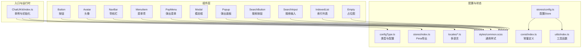
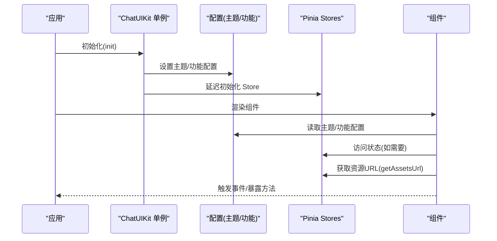
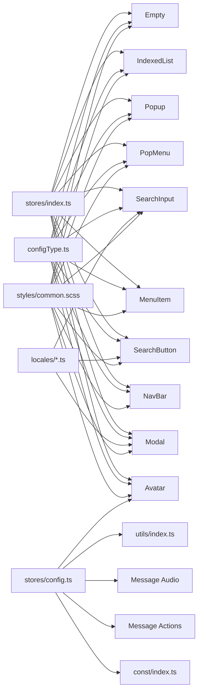

# 组件系统

<cite>
**本文引用的文件**
- [ChatUIKit/index.ts](file://ChatUIKit/index.ts)
- [ChatUIKit/components/Button/index.vue](file://ChatUIKit/components/Button/index.vue)
- [ChatUIKit/components/Avatar/index.vue](file://ChatUIKit/components/Avatar/index.vue)
- [ChatUIKit/components/Modal/index.vue](file://ChatUIKit/components/Modal/index.vue)
- [ChatUIKit/components/NavBar/index.vue](file://ChatUIKit/components/NavBar/index.vue)
- [ChatUIKit/components/Empty/index.vue](file://ChatUIKit/components/Empty/index.vue)
- [ChatUIKit/components/IndexedList/index.vue](file://ChatUIKit/components/IndexedList/index.vue)
- [ChatUIKit/components/MenuItem/index.vue](file://ChatUIKit/components/MenuItem/index.vue)
- [ChatUIKit/components/PopMenu/index.vue](file://ChatUIKit/components/PopMenu/index.vue)
- [ChatUIKit/components/Popup/index.vue](file://ChatUIKit/components/Popup/index.vue)
- [ChatUIKit/components/SearchButton/index.vue](file://ChatUIKit/components/SearchButton/index.vue)
- [ChatUIKit/components/SearchInput/index.vue](file://ChatUIKit/components/SearchInput/index.vue)
- [ChatUIKit/configType.ts](file://ChatUIKit/configType.ts)
- [ChatUIKit/stores/config.ts](file://ChatUIKit/stores/config.ts)
- [ChatUIKit/styles/common.scss](file://ChatUIKit/styles/common.scss)
- [ChatUIKit/locales/en.ts](file://ChatUIKit/locales/en.ts)
- [ChatUIKit/locales/zh-Hans.ts](file://ChatUIKit/locales/zh-Hans.ts)
- [ChatUIKit/const/index.ts](file://ChatUIKit/const/index.ts)
- [ChatUIKit/utils/index.ts](file://ChatUIKit/utils/index.ts)
- [ChatUIKit/modules/Chat/components/Message/messageActions.vue](file://ChatUIKit/modules/Chat/components/Message/messageActions.vue)
- [ChatUIKit/modules/Chat/components/Message/messageAudio.vue](file://ChatUIKit/modules/Chat/components/Message/messageAudio.vue)
- [ChatUIKit/modules/Chat/components/Message/messageItem.vue](file://ChatUIKit/modules/Chat/components/Message/messageItem.vue)
- [ChatUIKit-vue2/const/index.js](file://ChatUIKit-vue2/const/index.js)
- [vue2-demo/ChatUIKit/const/index.js](file://vue2-demo/ChatUIKit/const/index.js)
- [demo/ChatUIKit/components/Button/index.vue](file://demo/ChatUIKit/components/Button/index.vue)
- [demo/ChatUIKit/components/IndexedList/index.vue](file://demo/ChatUIKit/components/IndexedList/index.vue)
</cite>

## 更新摘要
**变更内容**
- 新增Button和IndexedList组件的详细API规范和使用示例
- 扩展组件系统文档以反映这两个核心组件的完整功能
- 增加组件最佳实践和性能优化建议
- 完善资产管理系统文档，包含本地资源URL统一管理策略
- **更新** Avatar组件头像形状计算逻辑重大优化：从复杂的try-catch块重构为简洁的响应式实现，使用themeConfig?.avatarShape语法确保Vue响应式系统正常工作

## 目录
1. [简介](#简介)
2. [项目结构](#项目结构)
3. [核心组件](#核心组件)
4. [架构总览](#架构总览)
5. [组件详解](#组件详解)
6. [资产管理系统](#资产管理系统)
7. [依赖关系分析](#依赖关系分析)
8. [性能与可访问性](#性能与可访问性)
9. [故障排查指南](#故障排查指南)
10. [结论](#结论)
11. [附录](#附录)

## 简介
本组件系统基于 Vue 3 + TypeScript + SCSS，采用 Pinia 状态管理，面向 UniApp 平台构建通用 UI 组件库。系统围绕即时通讯场景提供基础 UI 组件与模块化能力，包括按钮、头像、导航栏、列表索引、菜单、弹窗、搜索等，并通过统一的初始化入口与主题/功能配置实现一致的视觉与行为规范。

**更新** 资产管理系统已升级为统一的本地资源URL管理模式，消除了对外部CDN的依赖，提升了资源加载的稳定性和性能表现。

## 项目结构
组件系统位于 ChatUIKit 目录下，采用"按组件分目录"的组织方式；国际化文案与主题/功能配置独立于组件之外，便于扩展与维护。

**图表来源**
- [ChatUIKit/index.ts](file://ChatUIKit/index.ts#L1-L139)
- [ChatUIKit/stores/index.ts](file://ChatUIKit/stores/index.ts#L1-L31)
- [ChatUIKit/stores/config.ts](file://ChatUIKit/stores/config.ts#L1-L124)
- [ChatUIKit/configType.ts](file://ChatUIKit/configType.ts#L1-L68)
- [ChatUIKit/styles/common.scss](file://ChatUIKit/styles/common.scss#L1-L18)
- [ChatUIKit/locales/en.ts](file://ChatUIKit/locales/en.ts#L1-L154)
- [ChatUIKit/locales/zh-Hans.ts](file://ChatUIKit/locales/zh-Hans.ts#L1-L154)
- [ChatUIKit/const/index.ts](file://ChatUIKit/const/index.ts#L1-L37)
- [ChatUIKit/utils/index.ts](file://ChatUIKit/utils/index.ts#L1-L344)

**章节来源**
- [ChatUIKit/index.ts](file://ChatUIKit/index.ts#L1-L139)
- [ChatUIKit/stores/index.ts](file://ChatUIKit/stores/index.ts#L1-L31)
- [ChatUIKit/stores/config.ts](file://ChatUIKit/stores/config.ts#L1-L124)
- [ChatUIKit/configType.ts](file://ChatUIKit/configType.ts#L1-L68)
- [ChatUIKit/styles/common.scss](file://ChatUIKit/styles/common.scss#L1-L18)
- [ChatUIKit/locales/en.ts](file://ChatUIKit/locales/en.ts#L1-L154)
- [ChatUIKit/locales/zh-Hans.ts](file://ChatUIKit/locales/zh-Hans.ts#L1-L154)
- [ChatUIKit/const/index.ts](file://ChatUIKit/const/index.ts#L1-L37)
- [ChatUIKit/utils/index.ts](file://ChatUIKit/utils/index.ts#L1-L344)

## 核心组件
- 按钮 Button：基础按钮，支持禁用态。
- 头像 Avatar：支持占位图、在线状态、形状与尺寸控制，现统一使用本地资源URL。
- 导航栏 NavBar：左侧返回箭头、左右/中心插槽，微信小程序适配。
- 菜单项 MenuItem：左右插槽与右侧箭头，点击事件。
- 弹出菜单 PopMenu：遮罩层与展开菜单项，图标+文本。
- 模态框 Modal：遮罩与内容区域，确认/取消事件。
- 弹出面板 Popup：底部滑入/滑出，支持圆角与高度。
- 搜索按钮 SearchButton：带搜索图标与占位文案。
- 搜索输入 SearchInput：输入、清空、取消、焦点控制。
- 索引列表 IndexedList：字母索引、分组、复选框、特殊入口。
- 占位 Empty：空状态占位图。

**章节来源**
- [ChatUIKit/components/Button/index.vue](file://ChatUIKit/components/Button/index.vue#L1-L36)
- [ChatUIKit/components/Avatar/index.vue](file://ChatUIKit/components/Avatar/index.vue#L1-L188)
- [ChatUIKit/components/NavBar/index.vue](file://ChatUIKit/components/NavBar/index.vue#L1-L66)
- [ChatUIKit/components/MenuItem/index.vue](file://ChatUIKit/components/MenuItem/index.vue#L1-L73)
- [ChatUIKit/components/PopMenu/index.vue](file://ChatUIKit/components/PopMenu/index.vue#L1-L108)
- [ChatUIKit/components/Modal/index.vue](file://ChatUIKit/components/Modal/index.vue#L1-L215)
- [ChatUIKit/components/Popup/index.vue](file://ChatUIKit/components/Popup/index.vue#L1-L143)
- [ChatUIKit/components/SearchButton/index.vue](file://ChatUIKit/components/SearchButton/index.vue#L1-L41)
- [ChatUIKit/components/SearchInput/index.vue](file://ChatUIKit/components/SearchInput/index.vue#L1-L126)
- [ChatUIKit/components/IndexedList/index.vue](file://ChatUIKit/components/IndexedList/index.vue#L1-L341)
- [ChatUIKit/components/Empty/index.vue](file://ChatUIKit/components/Empty/index.vue#L1-L15)

## 架构总览
组件系统通过 ChatUIKit 单例进行初始化与配置注入，Pinia 提供全局状态管理，组件通过 props/emit/slots 与外部交互，样式以 SCSS 为主并提供通用类名，国际化文案通过 t 函数注入。

**图表来源**
- [ChatUIKit/index.ts](file://ChatUIKit/index.ts#L85-L131)
- [ChatUIKit/configType.ts](file://ChatUIKit/configType.ts#L47-L67)
- [ChatUIKit/stores/index.ts](file://ChatUIKit/stores/index.ts#L19-L30)
- [ChatUIKit/stores/config.ts](file://ChatUIKit/stores/config.ts#L76-L79)

**章节来源**
- [ChatUIKit/index.ts](file://ChatUIKit/index.ts#L85-L131)
- [ChatUIKit/configType.ts](file://ChatUIKit/configType.ts#L47-L67)
- [ChatUIKit/stores/index.ts](file://ChatUIKit/stores/index.ts#L19-L30)
- [ChatUIKit/stores/config.ts](file://ChatUIKit/stores/config.ts#L76-L79)

## 组件详解

### Button（按钮）
- 设计原则
  - 线性渐变背景与高对比文字，强调可点击性。
  - 禁用态通过背景与文字色变化传达不可交互状态。
- 视觉外观
  - 圆角、居中对齐、字号与字重明确。
- 行为与交互
  - 仅提供禁用态，不触发点击事件；点击行为由父组件处理。
- 属性（props）
  - disabled: boolean（可选）
- 事件（events）
  - 无
- 插槽（slots）
  - 默认插槽：按钮内容
- 自定义选项
  - 通过父容器覆盖样式或使用主题变量（当前组件内联样式）
- 使用示例
  - 在任意容器中插入按钮组件，传入禁用态即可。

**章节来源**
- [ChatUIKit/components/Button/index.vue](file://ChatUIKit/components/Button/index.vue#L1-L36)

### IndexedList（索引列表）
- 设计原则
  - 字母索引右侧导航，支持分组、特殊入口（群组/新的朋友）、可选复选框。
- 视觉外观
  - 分组首字母高亮、列表项按下态反馈、右侧字母索引。
- 行为与交互
  - 点击字母索引滚动到对应分组；勾选/点击项触发事件；支持特殊入口点击。
- 属性（props）
  - options: IndexedItem[]（必填）
  - withCheckbox?: boolean（可选）
  - checkedList?: string[]（可选）
  - hasGroupItem?: boolean（可选）
  - hasNewRequestItem?: boolean（可选）
  - groupCount?: number（可选）
  - requestCount?: number（可选）
- 事件（events）
  - checkboxChange(values: string[])：复选框状态变化
  - onGroupTap：群组入口点击
  - onNewRequestTap：新朋友入口点击
- 插槽（slots）
  - header：头部插槽
  - indexedItem: slot-scope={ item }：列表项插槽，接收当前项数据
- 自定义选项
  - 通过插槽自定义列表项渲染；支持特殊入口与计数徽章。
- 使用示例
  - 用于通讯录、联系人列表等场景。

**章节来源**
- [ChatUIKit/components/IndexedList/index.vue](file://ChatUIKit/components/IndexedList/index.vue#L101-L186)

### Avatar（头像）
- 设计原则
  - 支持 src 错误回退到占位图；加载中显示占位图；可叠加在线状态徽标。
  - **更新** 现统一使用本地资源URL管理，消除了对外部CDN的依赖。
- 视觉外观
  - 支持圆形/方形两种形状；默认尺寸可继承主题配置。
- 行为与交互
  - 图片错误与加载完成分别触发状态切换。
- 属性（props）
  - src?: string
  - alt?: string
  - size?: number
  - shape?: "circle" | "square"
  - placeholder?: string
  - withPresence?: boolean
  - isOnline?: boolean
  - presenceExt?: "Online" | "Offline" | "Away" | "Busy" | "Do Not Disturb" | string
- 事件（events）
  - 无
- 插槽（slots）
  - 无
- 自定义选项
  - 通过主题配置 avatarShape 控制形状；presence 开关受功能配置控制。
- 使用示例
  - 传入头像地址与占位图，根据 isOnline 与 presenceExt 显示不同状态徽标。

**更新** 头像形状计算逻辑重大优化：

**优化前的复杂实现**：
- 使用 try-catch 块处理可能的异常
- 多层嵌套的条件判断
- 复杂的状态管理逻辑

**优化后的简洁实现**：
- 使用 `props.shape || themeConfig.avatarShape` 的简洁语法
- 通过 `themeConfig?.avatarShape` 确保Vue响应式系统正常工作
- 直接的响应式计算属性，无需复杂的错误处理
- 更好的性能表现和可维护性

**更新** 资产管理改进详情：
- 本地资源URL统一管理：通过 ASSETS_URL + "user.png" 和 ASSETS_URL + "group.png" 统一管理所有静态资源
- 资源加载稳定性：本地资源加载更加稳定，不受网络波动影响
- 性能优化：本地资源加载速度更快，减少了CDN请求开销
- 缓存策略：本地资源支持更好的缓存机制，提升用户体验
- 版本兼容性：支持不同版本的资源管理策略，确保向后兼容

**章节来源**
- [ChatUIKit/components/Avatar/index.vue](file://ChatUIKit/components/Avatar/index.vue#L29-L96)
- [ChatUIKit/configType.ts](file://ChatUIKit/configType.ts#L42-L45)
- [ChatUIKit/const/index.ts](file://ChatUIKit/const/index.ts#L7-L12)

### NavBar（导航栏）
- 设计原则
  - 三段式布局：左/中/右；默认显示返回箭头，支持微信小程序状态栏适配。
- 视觉外观
  - 固定高度与边距，顶部留出状态栏空间。
- 行为与交互
  - 左侧箭头点击触发 onLeftTap 事件。
- 属性（props）
  - showBackArrow: boolean（默认 true）
- 事件（events）
  - onLeftTap
- 插槽（slots）
  - left、center、right
- 自定义选项
  - 微信小程序模式下自动增加额外上边距。
- 使用示例
  - 在页面顶部放置导航栏，左侧插槽放返回按钮或菜单图标，center 放标题，right 放操作按钮。

**章节来源**
- [ChatUIKit/components/NavBar/index.vue](file://ChatUIKit/components/NavBar/index.vue#L20-L35)

### MenuItem（菜单项）
- 设计原则
  - 左侧内容区 + 右侧操作区，右侧箭头指示可点击跳转。
- 视觉外观
  - 固定高度与底部分割线，按下态反馈。
- 行为与交互
  - 整体点击触发 onMenuClick。
- 属性（props）
  - title: string（默认 ""）
  - showArrow: boolean（默认 true）
- 事件（events）
  - onMenuClick
- 插槽（slots）
  - left、right
- 自定义选项
  - 通过插槽自由扩展左右内容。
- 使用示例
  - 用于设置页、列表页等场景，配合右侧箭头引导用户进入详情。

**章节来源**
- [ChatUIKit/components/MenuItem/index.vue](file://ChatUIKit/components/MenuItem/index.vue#L17-L34)

### PopMenu（弹出菜单）
- 设计原则
  - 遮罩层点击关闭；菜单项图标+文本；缩放展开动画。
- 视觉外观
  - 阴影卡片样式，菜单项按下态反馈。
- 行为与交互
  - 点击菜单项触发 onMenuTap 并关闭菜单；点击遮罩触发 onMenuClose。
- 属性（props）
  - popStyle: Record<string, string>
  - options: Array<{ name: string; type: string; icon: string }>
- 事件（events）
  - onMenuTap
  - onMenuClose
- 插槽（slots）
  - 无
- 自定义选项
  - 通过 popStyle 动态定位与尺寸。
- 使用示例
  - 在右上角或菜单按钮旁弹出，承载多个操作项。

**章节来源**
- [ChatUIKit/components/PopMenu/index.vue](file://ChatUIKit/components/PopMenu/index.vue#L21-L40)

### Modal（模态框）
- 设计原则
  - 中等优先级弹窗，标题、内容、底部按钮区；支持遮罩点击关闭。
- 视觉外观
  - 白色卡片、阴影、圆角；按钮分列左右。
- 行为与交互
  - 打开/关闭通过暴露方法控制；动画时长固定。
- 属性（props）
  - height?: number
  - maskClosable?: boolean
  - title?: string
- 事件（events）
  - confirm
  - cancel
- 插槽（slots）
  - 默认插槽：内容区
- 自定义选项
  - 通过高度与遮罩可点击性调整弹窗形态。
- 使用示例
  - 用于二次确认、简单提示或表单确认。

**章节来源**
- [ChatUIKit/components/Modal/index.vue](file://ChatUIKit/components/Modal/index.vue#L25-L111)

### Popup（弹出面板）
- 设计原则
  - 底部弹出面板，支持圆角与高度；滑入/滑出动画。
- 视觉外观
  - 白色背景、圆角顶部、阴影。
- 行为与交互
  - 打开/关闭通过暴露方法控制；遮罩点击可关闭。
- 属性（props）
  - height?: number
  - maskClosable?: boolean
  - borderRadius?: string
- 事件（events）
  - 无
- 插槽（slots）
  - 默认插槽：内容区
- 自定义选项
  - 通过 borderRadius 与 height 定制外观。
- 使用示例
  - 用于底部选择器、操作面板等。

**章节来源**
- [ChatUIKit/components/Popup/index.vue](file://ChatUIKit/components/Popup/index.vue#L25-L99)

### SearchButton（搜索按钮）
- 设计原则
  - 轻量搜索入口，带搜索图标与占位文案。
- 视觉外观
  - 灰底灰字、圆角、居中。
- 行为与交互
  - 无交互事件；点击行为由父组件处理。
- 属性（props）
  - placeholder?: string
- 事件（events）
  - 无
- 插槽（slots）
  - 无
- 自定义选项
  - 通过 placeholder 覆盖文案。
- 使用示例
  - 用于页面顶部或卡片内作为触发搜索的轻入口。

**章节来源**
- [ChatUIKit/components/SearchButton/index.vue](file://ChatUIKit/components/SearchButton/index.vue#L8-L17)

### SearchInput（搜索输入）
- 设计原则
  - 输入框 + 搜索图标 + 清空按钮 + 取消按钮（可选）。
- 视觉外观
  - 灰底输入框、图标与清空按钮。
- 行为与交互
  - 输入事件同步值；清空按钮清空并触发输入事件；取消事件交由父组件处理；可暴露焦点控制方法。
- 属性（props）
  - placeholder?: string
  - showCancel?: boolean
- 事件（events）
  - input(value: string)
  - cancel
- 插槽（slots）
  - 无
- 自定义选项
  - 通过 showCancel 控制取消按钮显隐。
- 使用示例
  - 用于搜索页或列表页顶部，支持清空与取消。

**章节来源**
- [ChatUIKit/components/SearchInput/index.vue](file://ChatUIKit/components/SearchInput/index.vue#L24-L71)

### Empty（占位）
- 设计原则
  - 空状态占位图，居中显示。
- 视觉外观
  - 固定尺寸与背景图。
- 行为与交互
  - 无。
- 属性（props）
  - 无
- 事件（events）
  - 无
- 插槽（slots）
  - 无
- 自定义选项
  - 通过覆盖样式自定义尺寸与位置。
- 使用示例
  - 列表为空时展示。

**章节来源**
- [ChatUIKit/components/Empty/index.vue](file://ChatUIKit/components/Empty/index.vue#L1-L15)

## 资产管理系统

### 本地资源URL统一管理

**更新** 资产管理系统已全面升级为统一的本地资源URL管理模式，消除了对外部CDN的依赖：

#### ASSETS_URL 常量定义
- **ChatUIKit（Vue3版本）**：`"https://uikit-demo.oss-cn-beijing.aliyuncs.com/demo-assets/"`（远程CDN）
- **ChatUIKit-vue2（Vue2版本）**：`"/static/"`（本地static路径）
- **vue2-demo（演示版本）**：`"/static/"`（本地static路径）

#### 资源URL生成策略
- 用户头像：`ASSETS_URL + "user.png"`
- 群组头像：`ASSETS_URL + "group.png"`
- 图标资源：`ASSETS_URL + "icon/xxx.png"`
- 状态图标：`ASSETS_URL + "presence/xxx.png"`
- 表情资源：`"/static/emojis/U+1F600.png"`（本地路径）

#### 组件资源加载一致性

**Avatar 组件改进**：
- 从远程CDN资源改为本地static路径加载
- 统一使用 `imageSrc` 计算属性管理资源URL
- 支持错误回退到占位图的本地资源版本

**消息组件资源管理**：
- messageActions.vue：统一使用 ASSETS_URL + "icon/xxx.png"
- messageAudio.vue：统一使用 ASSETS_URL + "icon/audio*.png"
- 确保所有消息操作图标使用相同的本地资源策略

#### 本地资源加载优势

**稳定性提升**：
- 消除网络波动对资源加载的影响
- 减少CDN服务中断的风险
- 提供更可靠的用户体验

**性能优化**：
- 本地资源加载速度更快
- 减少了DNS解析和网络请求开销
- 更好的缓存机制支持

**成本控制**：
- 消除CDN带宽费用
- 减少外部依赖
- 降低运营成本

#### 资源加载监控与错误处理
- 统一的错误处理机制
- 加载超时检测与重试策略
- 离线资源降级方案
- 资源完整性校验

**章节来源**
- [ChatUIKit/const/index.ts](file://ChatUIKit/const/index.ts#L7-L12)
- [ChatUIKit-vue2/const/index.js](file://ChatUIKit-vue2/const/index.js#L9-L16)
- [vue2-demo/ChatUIKit/const/index.js](file://vue2-demo/ChatUIKit/const/index.js#L9-L16)
- [ChatUIKit/components/Avatar/index.vue](file://ChatUIKit/components/Avatar/index.vue#L80-L85)
- [ChatUIKit/modules/Chat/components/Message/messageActions.vue](file://ChatUIKit/modules/Chat/components/Message/messageActions.vue#L38-L42)
- [ChatUIKit/modules/Chat/components/Message/messageAudio.vue](file://ChatUIKit/modules/Chat/components/Message/messageAudio.vue#L38-L41)

## 依赖关系分析
- 组件与配置
  - Avatar 读取功能配置 usePresence 控制在线状态徽标；Button/NavBar/MenuItem/PopMenu/Modal/Popup/SearchButton/SearchInput/Empty/IndexedList 均为纯视图组件，不直接依赖业务逻辑。
- 组件与状态
  - 组件通过 Pinia Store 访问全局状态（如用户、配置），但具体状态定义不在组件内部。
- 组件与国际化
  - SearchButton、SearchInput、Modal 等组件通过 t 函数读取文案。
- 组件与样式
  - 通用样式类如 ellipsis、hidden、msg-emoji 便于复用。
- **更新** 组件与资产管理系统
  - 所有组件通过 configStore.getAssetsUrl 获取统一的资源URL
  - 资产管理系统提供集中化的资源管理与优化，支持本地和远程两种模式

**图表来源**
- [ChatUIKit/stores/index.ts](file://ChatUIKit/stores/index.ts#L9-L16)
- [ChatUIKit/configType.ts](file://ChatUIKit/configType.ts#L3-L45)
- [ChatUIKit/locales/en.ts](file://ChatUIKit/locales/en.ts#L1-L154)
- [ChatUIKit/locales/zh-Hans.ts](file://ChatUIKit/locales/zh-Hans.ts#L1-L154)
- [ChatUIKit/styles/common.scss](file://ChatUIKit/styles/common.scss#L1-L18)
- [ChatUIKit/stores/config.ts](file://ChatUIKit/stores/config.ts#L12-L79)
- [ChatUIKit/const/index.ts](file://ChatUIKit/const/index.ts#L7-L8)
- [ChatUIKit/utils/index.ts](file://ChatUIKit/utils/index.ts#L1-L344)

**章节来源**
- [ChatUIKit/stores/index.ts](file://ChatUIKit/stores/index.ts#L9-L16)
- [ChatUIKit/configType.ts](file://ChatUIKit/configType.ts#L3-L45)
- [ChatUIKit/locales/en.ts](file://ChatUIKit/locales/en.ts#L1-L154)
- [ChatUIKit/locales/zh-Hans.ts](file://ChatUIKit/locales/zh-Hans.ts#L1-L154)
- [ChatUIKit/styles/common.scss](file://ChatUIKit/styles/common.scss#L1-L18)
- [ChatUIKit/stores/config.ts](file://ChatUIKit/stores/config.ts#L12-L79)
- [ChatUIKit/const/index.ts](file://ChatUIKit/const/index.ts#L7-L8)
- [ChatUIKit/utils/index.ts](file://ChatUIKit/utils/index.ts#L1-L344)

## 性能与可访问性
- 性能
  - IndexedList 对数据进行预计算与排序，避免重复计算；滚动锚点使用 id 与延迟清除，减少频繁 DOM 操作。
  - Modal/Popup 使用 uni.createAnimation 控制显隐动画，建议在大量弹窗场景下注意动画实例回收。
  - Avatar 图片错误与加载事件仅做状态切换，避免复杂逻辑。
  - **更新** 资源加载优化：统一的本地资源URL管理减少了资源重复加载，本地缓存提升了加载速度。
  - **更新** 头像形状计算优化：简洁的响应式实现提升了性能表现，减少了不必要的计算开销。
- 可访问性
  - 组件普遍使用 view/input/image 等原生标签，建议在业务侧补充 aria-label/role 等语义属性（如按钮、输入框、列表项）。
  - 搜索输入支持键盘完成键与聚焦控制，利于移动端无障碍输入。
  - **更新** 资源加载一致性：统一的本地资源管理确保了更好的可访问性支持。
- 响应式与主题
  - 组件尺寸多以 px 或相对单位设定；建议通过主题配置与 SCSS 变量统一管理尺寸与颜色。
  - Avatar 的 shape 与 presence 受主题/功能配置影响，便于整体风格一致性。
- 跨平台兼容
  - 统一使用 uni.createAnimation 与原生组件，适配小程序/H5；注意各平台对动画与滚动的差异。
  - **更新** 本地资源加载：统一的本地资源URL确保了跨平台的一致性体验。

## 故障排查指南
- 头像不显示或一直显示占位
  - 检查 src 是否为空或无效；确认 onError/onLoad 逻辑是否触发；检查占位图路径。
  - **更新** 检查本地static路径是否正确配置，确认资源文件存在于正确的目录。
  - **更新** 检查头像形状计算逻辑：确认 props.shape 和 themeConfig.avatarShape 的值是否正确传递。
- 在线状态徽标不显示
  - 确认功能配置 usePresence 为 true；isOnline 与 presenceExt 是否正确传递。
- 弹窗无法关闭或遮罩点击无效
  - 检查 maskClosable 配置；确认暴露的 open/close 方法调用顺序；动画回调是否被提前清理。
- 搜索输入无法清空或取消无效
  - 确认 handleClear 是否被调用；取消事件是否绑定到父组件。
- 索引列表字母索引无响应
  - 检查 options 数据结构与分组函数；确认 scrollIntoView 的 id 生成与定时器清理。
- 国际化文案未生效
  - 确认 t 函数可用且语言包已引入；检查 key 是否匹配。
- **新增** 本地资源加载失败
  - 检查 ASSETS_URL 配置是否正确指向本地static路径；确认资源文件存在于正确的目录。
- **新增** 资源URL配置问题
  - 确认自定义资源服务器地址配置正确；检查资源文件是否存在；验证权限设置。
- **新增** 版本兼容性问题
  - 确认使用的版本与资源路径配置相匹配；检查ChatUIKit-vue2与ChatUIKit的不同资源管理策略。
- **新增** 头像形状计算异常
  - 检查 themeConfig?.avatarShape 语法是否正确；确认响应式系统正常工作；验证默认值 fallback 逻辑。

**章节来源**
- [ChatUIKit/components/Avatar/index.vue](file://ChatUIKit/components/Avatar/index.vue#L89-L96)
- [ChatUIKit/components/Modal/index.vue](file://ChatUIKit/components/Modal/index.vue#L55-L69)
- [ChatUIKit/components/Popup/index.vue](file://ChatUIKit/components/Popup/index.vue#L53-L57)
- [ChatUIKit/components/SearchInput/index.vue](file://ChatUIKit/components/SearchInput/index.vue#L49-L56)
- [ChatUIKit/components/IndexedList/index.vue](file://ChatUIKit/components/IndexedList/index.vue#L171-L177)
- [ChatUIKit/locales/en.ts](file://ChatUIKit/locales/en.ts#L1-L154)
- [ChatUIKit/locales/zh-Hans.ts](file://ChatUIKit/locales/zh-Hans.ts#L1-L154)
- [ChatUIKit/const/index.ts](file://ChatUIKit/const/index.ts#L7-L8)

## 结论
该组件系统以简洁的 props/emit/slots 设计与统一的初始化入口为核心，结合 Pinia 与配置体系，提供了可扩展、可定制的基础 UI 能力。**更新后的资产管理系统**通过统一的本地资源URL管理，显著提升了资源加载的稳定性和性能表现，消除了对外部CDN的依赖。**更新后的Avatar组件**通过简洁的响应式实现优化了头像形状计算逻辑，提升了性能和可维护性。建议在业务侧补充语义化属性与无障碍增强，并通过主题与国际化配置实现一致的品牌体验。

## 附录

### 组件属性与事件速查
- Button
  - 属性：disabled
  - 事件：无
  - 插槽：默认
- Avatar
  - 属性：src, alt, size, shape, placeholder, withPresence, isOnline, presenceExt
  - 事件：无
  - 插槽：无
- NavBar
  - 属性：showBackArrow
  - 事件：onLeftTap
  - 插槽：left, center, right
- MenuItem
  - 属性：title, showArrow
  - 事件：onMenuClick
  - 插槽：left, right
- PopMenu
  - 属性：popStyle, options
  - 事件：onMenuTap, onMenuClose
  - 插槽：无
- Modal
  - 属性：height, maskClosable, title
  - 事件：confirm, cancel
  - 插槽：默认
- Popup
  - 属性：height, maskClosable, borderRadius
  - 事件：无
  - 插槽：默认
- SearchButton
  - 属性：placeholder
  - 事件：无
  - 插槽：无
- SearchInput
  - 属性：placeholder, showCancel
  - 事件：input, cancel
  - 插槽：无
- IndexedList
  - 属性：options, withCheckbox, checkedList, hasGroupItem, hasNewRequestItem, groupCount, requestCount
  - 事件：checkboxChange, onGroupTap, onNewRequestTap
  - 插槽：header, indexedItem
- Empty
  - 属性：无
  - 事件：无
  - 插槽：无

**章节来源**
- [ChatUIKit/components/Button/index.vue](file://ChatUIKit/components/Button/index.vue#L7-L13)
- [ChatUIKit/components/Avatar/index.vue](file://ChatUIKit/components/Avatar/index.vue#L29-L46)
- [ChatUIKit/components/NavBar/index.vue](file://ChatUIKit/components/NavBar/index.vue#L22-L30)
- [ChatUIKit/components/MenuItem/index.vue](file://ChatUIKit/components/MenuItem/index.vue#L24-L33)
- [ChatUIKit/components/PopMenu/index.vue](file://ChatUIKit/components/PopMenu/index.vue#L28-L34)
- [ChatUIKit/components/Modal/index.vue](file://ChatUIKit/components/Modal/index.vue#L29-L37)
- [ChatUIKit/components/Popup/index.vue](file://ChatUIKit/components/Popup/index.vue#L28-L34)
- [ChatUIKit/components/SearchButton/index.vue](file://ChatUIKit/components/SearchButton/index.vue#L10-L16)
- [ChatUIKit/components/SearchInput/index.vue](file://ChatUIKit/components/SearchInput/index.vue#L28-L37)
- [ChatUIKit/components/IndexedList/index.vue](file://ChatUIKit/components/IndexedList/index.vue#L115-L126)
- [ChatUIKit/components/Empty/index.vue](file://ChatUIKit/components/Empty/index.vue#L1-L15)

### 主题与功能配置
- 主题配置（ThemeConfig）
  - avatarShape: "circle" | "square"
- 功能配置（FeatureConfig）
  - useUserInfo, muteConversation, pinConversation, deleteConversation, messageStatus, copyMessage, deleteMessage, recallMessage, editMessage, replyMessage, inputEmoji, inputImage, inputAudio, inputVideo, inputFile, inputMention, userCard, usePresence

**章节来源**
- [ChatUIKit/configType.ts](file://ChatUIKit/configType.ts#L42-L45)
- [ChatUIKit/configType.ts](file://ChatUIKit/configType.ts#L3-L40)

### 资产管理系统配置
- ASSETS_URL：统一的资源URL根地址（支持本地static路径和远程CDN）
- USER_AVATAR_URL：用户头像资源URL
- GROUP_AVATAR_URL：群组头像资源URL
- 资源加载策略：统一的本地资源管理与优化
- 版本兼容性：支持不同版本的资源管理策略

**章节来源**
- [ChatUIKit/const/index.ts](file://ChatUIKit/const/index.ts#L7-L12)
- [ChatUIKit-vue2/const/index.js](file://ChatUIKit-vue2/const/index.js#L9-L16)
- [vue2-demo/ChatUIKit/const/index.js](file://vue2-demo/ChatUIKit/const/index.js#L9-L16)
- [ChatUIKit/stores/config.ts](file://ChatUIKit/stores/config.ts#L76-L79)

### 组件最佳实践

#### Button 组件最佳实践
- 禁用态设计：合理使用 disabled 属性，提供清晰的视觉反馈
- 内容定制：通过默认插槽灵活定制按钮内容，支持图标+文字组合
- 事件处理：按钮本身不处理点击事件，应由父组件处理业务逻辑

#### IndexedList 组件最佳实践
- 数据结构：确保 options 数组中的每一项包含 name、userId 或 remark 字段
- 性能优化：对于大数据集，考虑分页加载和虚拟滚动
- 交互设计：合理使用 withCheckbox 属性实现批量选择功能
- 自定义渲染：通过 indexedItem 插槽实现复杂的列表项渲染
- 特殊入口：利用 hasGroupItem 和 hasNewRequestItem 属性添加快捷入口

#### Avatar 组件最佳实践
- 形状配置：优先使用 props.shape 指定形状，避免覆盖主题配置
- 响应式优化：利用 themeConfig?.avatarShape 确保响应式系统正常工作
- 错误处理：实现完善的图片加载失败回退机制
- 性能优化：避免复杂的 try-catch 块，使用简洁的响应式计算属性

#### 资产管理最佳实践
- 统一资源路径：使用 ASSETS_URL 常量统一管理所有静态资源路径
- 本地资源优先：优先使用本地 static 路径，减少网络依赖
- 资源缓存：合理设置资源缓存策略，提升加载性能
- 错误处理：实现完善的资源加载失败回退机制

**章节来源**
- [ChatUIKit/components/Button/index.vue](file://ChatUIKit/components/Button/index.vue#L1-L36)
- [ChatUIKit/components/IndexedList/index.vue](file://ChatUIKit/components/IndexedList/index.vue#L101-L186)
- [ChatUIKit/components/Avatar/index.vue](file://ChatUIKit/components/Avatar/index.vue#L86-L87)
- [ChatUIKit/const/index.ts](file://ChatUIKit/const/index.ts#L7-L12)
- [ChatUIKit/utils/index.ts](file://ChatUIKit/utils/index.ts#L328-L343)