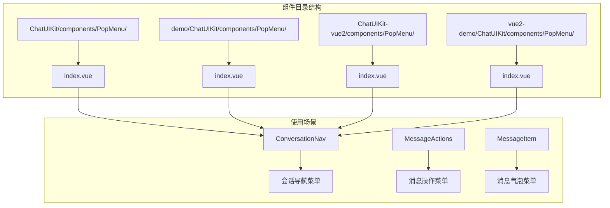
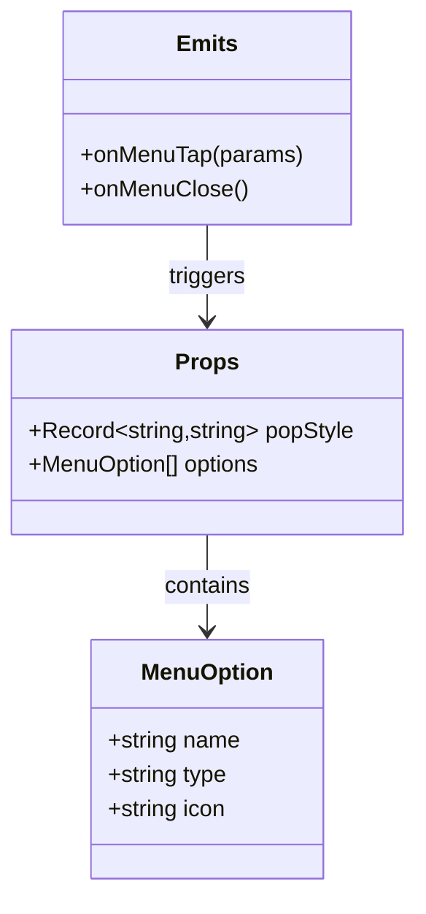
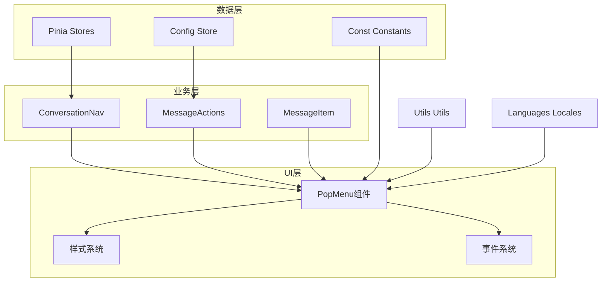
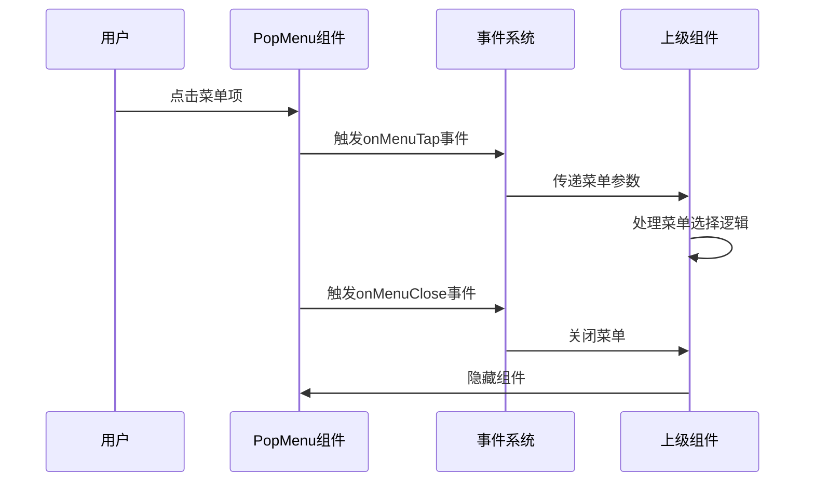
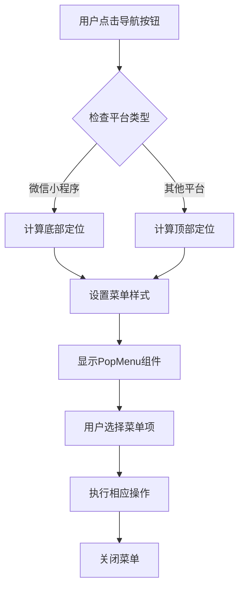
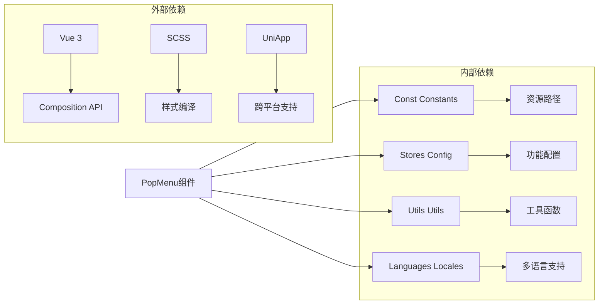

# 弹出菜单

<cite>
**本文档引用的文件**
- [ChatUIKit/components/PopMenu/index.vue](file://ChatUIKit/components/PopMenu/index.vue)
- [demo/ChatUIKit/components/PopMenu/index.vue](file://demo/ChatUIKit/components/PopMenu/index.vue)
- [ChatUIKit-vue2/components/PopMenu/index.vue](file://ChatUIKit-vue2/components/PopMenu/index.vue)
- [vue2-demo/ChatUIKit/components/PopMenu/index.vue](file://vue2-demo/ChatUIKit/components/PopMenu/index.vue)
- [ChatUIKit/modules/Conversation/components/ConversationNav/index.vue](file://ChatUIKit/modules/Conversation/components/ConversationNav/index.vue)
- [ChatUIKit/modules/Chat/components/Message/messageActions.vue](file://ChatUIKit/modules/Chat/components/Message/messageActions.vue)
- [ChatUIKit/modules/Chat/components/Message/messageItem.vue](file://ChatUIKit/modules/Chat/components/Message/messageItem.vue)
- [ChatUIKit/const/index.ts](file://ChatUIKit/const/index.ts)
- [ChatUIKit/stores/config.ts](file://ChatUIKit/stores/config.ts)
- [ChatUIKit/utils/index.ts](file://ChatUIKit/utils/index.ts)
- [ChatUIKit/locales/zh-Hans.ts](file://ChatUIKit/locales/zh-Hans.ts)
</cite>

## 目录
1. [简介](#简介)
2. [项目结构](#项目结构)
3. [核心组件](#核心组件)
4. [架构概览](#架构概览)
5. [详细组件分析](#详细组件分析)
6. [依赖关系分析](#依赖关系分析)
7. [性能考虑](#性能考虑)
8. [故障排除指南](#故障排除指南)
9. [结论](#结论)

## 简介

弹出菜单（PopMenu）是EaseMob UIKit中一个重要的UI组件，用于提供上下文相关的操作选项。该组件采用Vue 3 Composition API实现，支持多种使用场景，包括会话导航菜单、消息操作菜单等。

弹出菜单组件具有以下特点：
- 响应式设计，适配不同屏幕尺寸
- 支持图标和文字组合显示
- 提供平滑的动画过渡效果
- 支持多种事件处理机制
- 兼容Vue 2和Vue 3版本

## 项目结构

弹出菜单组件在项目中的组织结构如下：

**图表来源**
- [ChatUIKit/components/PopMenu/index.vue](file://ChatUIKit/components/PopMenu/index.vue#L1-L108)
- [ChatUIKit/modules/Conversation/components/ConversationNav/index.vue](file://ChatUIKit/modules/Conversation/components/ConversationNav/index.vue#L31-L37)

**章节来源**
- [ChatUIKit/components/PopMenu/index.vue](file://ChatUIKit/components/PopMenu/index.vue#L1-L108)
- [ChatUIKit-vue2/components/PopMenu/index.vue](file://ChatUIKit-vue2/components/PopMenu/index.vue#L1-L115)

## 核心组件

弹出菜单组件的核心实现包含以下关键要素：

### 组件接口定义

组件通过TypeScript接口定义了完整的API规范：

**图表来源**
- [ChatUIKit/components/PopMenu/index.vue](file://ChatUIKit/components/PopMenu/index.vue#L22-L32)

### 核心功能特性

1. **响应式数据绑定**：使用Vue 3的Composition API实现响应式状态管理
2. **事件处理机制**：支持点击和关闭事件的双向通信
3. **样式定制能力**：通过CSS变量实现灵活的样式定制
4. **动画效果支持**：内置scale变换动画，提供流畅的用户体验

**章节来源**
- [ChatUIKit/components/PopMenu/index.vue](file://ChatUIKit/components/PopMenu/index.vue#L21-L40)

## 架构概览

弹出菜单在整体架构中的位置和交互关系：

**图表来源**
- [ChatUIKit/modules/Conversation/components/ConversationNav/index.vue](file://ChatUIKit/modules/Conversation/components/ConversationNav/index.vue#L41-L91)
- [ChatUIKit/modules/Chat/components/Message/messageActions.vue](file://ChatUIKit/modules/Chat/components/Message/messageActions.vue#L30-L76)

## 详细组件分析

### Vue 3版本实现

Vue 3版本的PopMenu组件采用了现代化的Composition API：

#### 组件结构分析

**图表来源**
- [ChatUIKit/components/PopMenu/index.vue](file://ChatUIKit/components/PopMenu/index.vue#L36-L39)

#### 样式系统设计

组件使用SCSS实现了完整的样式体系：

| 样式类别 | 功能描述 | 关键属性 |
|---------|----------|----------|
| 遮罩层 | 背景遮罩效果 | fixed定位, 透明度控制 |
| 菜单容器 | 主要容器样式 | absolute定位, box-shadow |
| 菜单项 | 单个菜单项样式 | flex布局, hover效果 |
| 图标样式 | 图标显示样式 | width/height, margin |

**章节来源**
- [ChatUIKit/components/PopMenu/index.vue](file://ChatUIKit/components/PopMenu/index.vue#L42-L106)

### Vue 2版本实现对比

Vue 2版本与Vue 3版本的主要差异：

| 特性 | Vue 3版本 | Vue 2版本 |
|------|-----------|-----------|
| API风格 | Composition API | Options API |
| 事件命名 | onMenuTap/onMenuClose | menu-tap/menu-close |
| 事件处理 | defineEmits | $emit |
| 样式处理 | SCSS作用域 | SCSS作用域 |

**章节来源**
- [ChatUIKit-vue2/components/PopMenu/index.vue](file://ChatUIKit-vue2/components/PopMenu/index.vue#L20-L45)

### 实际应用场景

#### 会话导航菜单

会话导航菜单是最常见的使用场景之一：

**图表来源**
- [ChatUIKit/modules/Conversation/components/ConversationNav/index.vue](file://ChatUIKit/modules/Conversation/components/ConversationNav/index.vue#L57-L65)

#### 消息操作菜单

消息操作菜单提供了丰富的消息处理功能：

| 菜单项 | 功能描述 | 条件要求 | 国际化支持 |
|--------|----------|----------|------------|
| 复制 | 复制消息内容到剪贴板 | 文本消息且启用复制功能 | ✅ |
| 编辑 | 编辑自己的文本消息 | 自己的消息且状态允许 | ✅ |
| 回复 | 引用回复该消息 | 消息状态正常 | ✅ |
| 删除 | 删除消息 | 具备删除权限 | ✅ |
| 撤回 | 撤回自己的消息 | 自己的消息且在时限内 | ✅ |

**章节来源**
- [ChatUIKit/modules/Chat/components/Message/messageActions.vue](file://ChatUIKit/modules/Chat/components/Message/messageActions.vue#L78-L144)

**章节来源**
- [ChatUIKit/modules/Chat/components/Message/messageActions.vue](file://ChatUIKit/modules/Chat/components/Message/messageActions.vue#L178-L207)

## 依赖关系分析

弹出菜单组件的依赖关系图：

**图表来源**
- [ChatUIKit/const/index.ts](file://ChatUIKit/const/index.ts#L7-L8)
- [ChatUIKit/stores/config.ts](file://ChatUIKit/stores/config.ts#L59-L80)

**章节来源**
- [ChatUIKit/utils/index.ts](file://ChatUIKit/utils/index.ts#L94-L95)
- [ChatUIKit/locales/zh-Hans.ts](file://ChatUIKit/locales/zh-Hans.ts#L141-L142)

## 性能考虑

### 渲染优化

1. **条件渲染**：使用v-if确保菜单只在需要时渲染
2. **事件防抖**：避免频繁的事件触发
3. **样式缓存**：静态样式预编译，减少运行时计算

### 内存管理

1. **组件销毁**：正确处理组件生命周期
2. **事件清理**：及时移除事件监听器
3. **资源释放**：避免内存泄漏

## 故障排除指南

### 常见问题及解决方案

| 问题类型 | 症状描述 | 可能原因 | 解决方案 |
|----------|----------|----------|----------|
| 菜单不显示 | PopMenu组件不出现 | 样式冲突或定位错误 | 检查popStyle属性和z-index设置 |
| 事件不触发 | 点击菜单无反应 | 事件绑定错误 | 验证事件监听器设置 |
| 图标不显示 | 菜单项缺少图标 | 图片路径错误 | 检查ASSETS_URL配置 |
| 动画异常 | 菜单切换卡顿 | CSS动画性能问题 | 优化transform属性 |

### 调试技巧

1. **控制台日志**：利用console.log跟踪事件流程
2. **样式检查**：使用开发者工具检查CSS类名
3. **事件监控**：验证事件是否正确传递到父组件

**章节来源**
- [ChatUIKit/modules/Conversation/components/ConversationNav/index.vue](file://ChatUIKit/modules/Conversation/components/ConversationNav/index.vue#L116-L111)

## 结论

弹出菜单组件作为EaseMob UIKit的重要组成部分，展现了现代前端开发的最佳实践：

1. **架构清晰**：组件职责明确，接口设计合理
2. **兼容性强**：同时支持Vue 2和Vue 3版本
3. **扩展性好**：易于添加新的菜单项和功能
4. **用户体验佳**：提供流畅的动画效果和响应式设计

通过合理的依赖管理和性能优化，弹出菜单组件为整个聊天应用提供了稳定可靠的UI基础。建议在实际使用中重点关注事件处理的一致性和样式定制的灵活性。