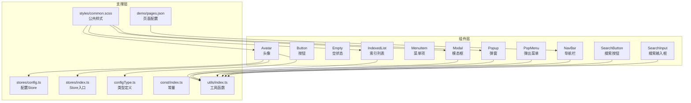
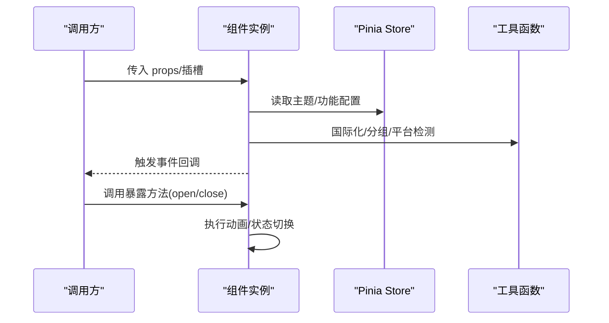
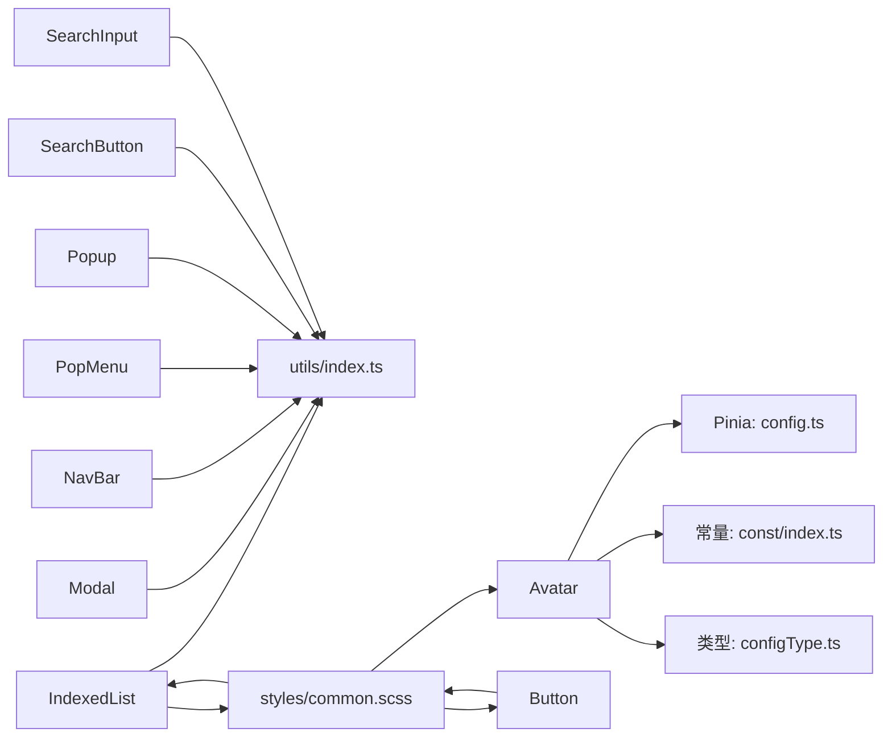

# 通用组件

<cite>
**本文引用的文件**
- [ChatUIKit/components/Avatar/index.vue](file://ChatUIKit/components/Avatar/index.vue)
- [ChatUIKit/components/Button/index.vue](file://ChatUIKit/components/Button/index.vue)
- [ChatUIKit/components/Empty/index.vue](file://ChatUIKit/components/Empty/index.vue)
- [ChatUIKit/components/IndexedList/index.vue](file://ChatUIKit/components/IndexedList/index.vue)
- [ChatUIKit/components/MenuItem/index.vue](file://ChatUIKit/components/MenuItem/index.vue)
- [ChatUIKit/components/Modal/index.vue](file://ChatUIKit/components/Modal/index.vue)
- [ChatUIKit/components/NavBar/index.vue](file://ChatUIKit/components/NavBar/index.vue)
- [ChatUIKit/components/PopMenu/index.vue](file://ChatUIKit/components/PopMenu/index.vue)
- [ChatUIKit/components/Popup/index.vue](file://ChatUIKit/components/Popup/index.vue)
- [ChatUIKit/components/SearchButton/index.vue](file://ChatUIKit/components/SearchButton/index.vue)
- [ChatUIKit/components/SearchInput/index.vue](file://ChatUIKit/components/SearchInput/index.vue)
- [ChatUIKit/utils/index.ts](file://ChatUIKit/utils/index.ts)
- [ChatUIKit/stores/config.ts](file://ChatUIKit/stores/config.ts)
- [ChatUIKit/stores/index.ts](file://ChatUIKit/stores/index.ts)
- [ChatUIKit/const/index.ts](file://ChatUIKit/const/index.ts)
- [ChatUIKit/styles/common.scss](file://ChatUIKit/styles/common.scss)
- [demo/pages.json](file://demo/pages.json)
- [ChatUIKit/configType.ts](file://ChatUIKit/configType.ts)
- [demo/pages/Me/index.vue](file://demo/pages/Me/index.vue)
- [demo/pages/ProfileSetting/index.vue](file://demo/pages/ProfileSetting/index.vue)
</cite>

## 更新摘要
**所做更改**
- 增强了 Avatar 组件，新增从配置存储读取头像形状的功能
- 支持动态主题切换，头像形状可通过主题配置实时更新
- 更新了组件API说明，增加了主题配置相关的使用方法
- 添加了实际使用示例，展示如何在项目中配置和使用动态头像形状

## 目录
1. [简介](#简介)
2. [项目结构](#项目结构)
3. [核心组件](#核心组件)
4. [架构总览](#架构总览)
5. [详细组件分析](#详细组件分析)
6. [依赖关系分析](#依赖关系分析)
7. [性能考量](#性能考量)
8. [故障排查指南](#故障排查指南)
9. [结论](#结论)
10. [附录](#附录)

## 简介
本文件系统性梳理通用UI组件库中的关键组件，覆盖 Avatar 头像、Button 按钮、Empty 空状态、Modal 模态框、NavBar 导航栏、MenuItem 菜单项、PopMenu 弹出菜单、Popup 弹窗、SearchButton 搜索按钮、SearchInput 搜索输入框以及 IndexedList 索引列表。文档从设计原则、实现细节、props/events/slots/自定义选项、使用示例与场景、状态管理与动画、样式与主题适配、跨平台与性能优化、到组件组合与集成最佳实践进行全面阐述。

## 项目结构
通用组件位于 ChatUIKit/components 下，采用按组件拆分的目录结构；配套的工具函数、Pinia 状态管理与常量配置分别位于 utils、stores、const 目录；demo 工程 pages.json 展示了页面级导航与样式配置，便于理解组件在真实工程中的集成方式。

**图表来源**
- [ChatUIKit/components/Avatar/index.vue](file://ChatUIKit/components/Avatar/index.vue#L1-L188)
- [ChatUIKit/components/IndexedList/index.vue](file://ChatUIKit/components/IndexedList/index.vue#L1-L341)
- [ChatUIKit/components/Button/index.vue](file://ChatUIKit/components/Button/index.vue#L1-L36)
- [ChatUIKit/components/PopMenu/index.vue](file://ChatUIKit/components/PopMenu/index.vue#L1-L108)
- [ChatUIKit/components/Popup/index.vue](file://ChatUIKit/components/Popup/index.vue#L1-L143)
- [ChatUIKit/components/SearchButton/index.vue](file://ChatUIKit/components/SearchButton/index.vue#L1-L41)
- [ChatUIKit/components/SearchInput/index.vue](file://ChatUIKit/components/SearchInput/index.vue#L1-L126)
- [ChatUIKit/components/Modal/index.vue](file://ChatUIKit/components/Modal/index.vue#L1-L215)
- [ChatUIKit/components/NavBar/index.vue](file://ChatUIKit/components/NavBar/index.vue#L1-L66)
- [ChatUIKit/utils/index.ts](file://ChatUIKit/utils/index.ts#L1-L344)
- [ChatUIKit/stores/config.ts](file://ChatUIKit/stores/config.ts#L1-L124)
- [ChatUIKit/stores/index.ts](file://ChatUIKit/stores/index.ts#L1-L31)
- [ChatUIKit/const/index.ts](file://ChatUIKit/const/index.ts#L1-L37)
- [ChatUIKit/styles/common.scss](file://ChatUIKit/styles/common.scss#L1-L18)
- [demo/pages.json](file://demo/pages.json#L1-L200)
- [ChatUIKit/configType.ts](file://ChatUIKit/configType.ts#L1-L68)

**章节来源**
- [ChatUIKit/components/Avatar/index.vue](file://ChatUIKit/components/Avatar/index.vue#L1-L188)
- [ChatUIKit/components/IndexedList/index.vue](file://ChatUIKit/components/IndexedList/index.vue#L1-L341)
- [ChatUIKit/components/Button/index.vue](file://ChatUIKit/components/Button/index.vue#L1-L36)
- [ChatUIKit/components/PopMenu/index.vue](file://ChatUIKit/components/PopMenu/index.vue#L1-L108)
- [ChatUIKit/components/Popup/index.vue](file://ChatUIKit/components/Popup/index.vue#L1-L143)
- [ChatUIKit/components/SearchButton/index.vue](file://ChatUIKit/components/SearchButton/index.vue#L1-L41)
- [ChatUIKit/components/SearchInput/index.vue](file://ChatUIKit/components/SearchInput/index.vue#L1-L126)
- [ChatUIKit/components/Modal/index.vue](file://ChatUIKit/components/Modal/index.vue#L1-L215)
- [ChatUIKit/components/NavBar/index.vue](file://ChatUIKit/components/NavBar/index.vue#L1-L66)
- [ChatUIKit/utils/index.ts](file://ChatUIKit/utils/index.ts#L1-L344)
- [ChatUIKit/stores/config.ts](file://ChatUIKit/stores/config.ts#L1-L124)
- [ChatUIKit/stores/index.ts](file://ChatUIKit/stores/index.ts#L1-L31)
- [ChatUIKit/const/index.ts](file://ChatUIKit/const/index.ts#L1-L37)
- [ChatUIKit/styles/common.scss](file://ChatUIKit/styles/common.scss#L1-L18)
- [demo/pages.json](file://demo/pages.json#L1-L200)

## 核心组件
- 设计原则
  - 一致性：统一的尺寸、间距、颜色与动效风格，通过主题配置与SCSS变量收敛。
  - 可访问性：提供键盘可达与高对比度状态，确保在弱视或色觉异常场景下可用。
  - 可组合性：以插槽与事件解耦交互与展示，降低耦合度，提升复用性。
  - 性能优先：对高频渲染组件采用懒加载、节流/防抖与最小化DOM更新策略。
- 实现要点
  - 统一使用 Vue 3 Composition API 与 TypeScript，明确 props 类型与事件签名。
  - 使用 Pinia 管理主题与功能开关，避免全局污染。
  - 通过 uni.createAnimation 实现跨端动画，兼顾小程序与H5表现。
  - 利用工具函数处理国际化文案、拼音首字母分组、平台检测等横切关注点。

**章节来源**
- [ChatUIKit/stores/config.ts](file://ChatUIKit/stores/config.ts#L1-L124)
- [ChatUIKit/stores/index.ts](file://ChatUIKit/stores/index.ts#L1-L31)
- [ChatUIKit/utils/index.ts](file://ChatUIKit/utils/index.ts#L1-L344)

## 架构总览
通用组件围绕"配置驱动 + 工具函数 + 状态管理"构建，组件通过 props 接收配置，通过 emits 触发事件，通过插槽扩展内容，并借助工具函数与 Pinia Store 完成国际化、分组、平台能力与主题适配。

**图表来源**
- [ChatUIKit/components/Avatar/index.vue](file://ChatUIKit/components/Avatar/index.vue#L25-L96)
- [ChatUIKit/components/Modal/index.vue](file://ChatUIKit/components/Modal/index.vue#L25-L111)
- [ChatUIKit/components/Popup/index.vue](file://ChatUIKit/components/Popup/index.vue#L25-L99)
- [ChatUIKit/stores/config.ts](file://ChatUIKit/stores/config.ts#L59-L124)
- [ChatUIKit/utils/index.ts](file://ChatUIKit/utils/index.ts#L1-L344)

## 详细组件分析

### Avatar 头像组件
- 设计目标
  - 支持圆形/方形头像、占位图、加载失败回退、在线状态角标。
  - 通过主题配置控制形状，通过功能开关控制是否显示状态。
  - **新增**：支持从配置存储读取头像形状，实现动态主题切换。
- 关键特性
  - 图片错误与加载状态管理，自动切换占位图。
  - presenceExt 支持多种内置状态与自定义扩展。
  - **新增**：通过 Pinia Store 的主题配置动态获取头像形状。
- API 摘要
  - Props
    - src?: string —— 头像地址
    - alt?: string —— 图片替代文本
    - size?: number —— 尺寸(px)，默认50
    - shape?: "circle" | "square" —— 形状，默认来自主题配置
    - placeholder?: string —— 占位图
    - withPresence?: boolean —— 是否显示在线状态
    - isOnline?: boolean —— 在线状态
    - presenceExt?: "Online"|"Offline"|"Away"|"Busy"|"Do Not Disturb"|string
  - Events
    - 无
  - Slots
    - 无
  - 自定义选项
    - 通过主题配置设置默认头像形状
    - 通过功能配置启用/禁用在线状态显示
    - **新增**：通过 `setThemeConfig` 动态修改头像形状
- 使用示例与场景
  - 聊天列表、联系人列表、消息气泡中的用户头像。
  - 结合 Presence 状态渲染不同角标。
  - **新增**：在设置页面中动态切换头像形状。
- 状态管理与动画
  - 无显式动画；通过图片加载/错误事件切换占位图。
  - **新增**：通过 Pinia Store 的响应式更新实现动态主题切换。
- 样式与主题适配
  - 圆形/方形样式类切换；角标定位与背景图适配。
  - **新增**：支持通过主题配置实时更新头像形状。
- 跨平台与性能
  - 使用 uni.createAnimation 的场景较少；注意图片尺寸与缓存策略。
  - **新增**：Pinia Store 的响应式更新机制确保跨平台一致性。
- 组合与最佳实践
  - 与 NavBar/MenuItem 组合用于信息卡片；与 PopMenu 组合用于用户操作菜单。
  - **新增**：与设置页面组合，实现动态主题配置。

**更新** 增强了 Avatar 组件，新增从配置存储读取头像形状的功能，支持动态主题切换

**章节来源**
- [ChatUIKit/components/Avatar/index.vue](file://ChatUIKit/components/Avatar/index.vue#L29-L96)
- [ChatUIKit/stores/config.ts](file://ChatUIKit/stores/config.ts#L19-L80)
- [ChatUIKit/const/index.ts](file://ChatUIKit/const/index.ts#L17-L25)
- [ChatUIKit/configType.ts](file://ChatUIKit/configType.ts#L42-L45)

### Button 按钮组件
- 设计目标
  - 提供统一的按钮样式与禁用态，支持插槽承载内容。
  - 采用渐变背景设计，提供视觉层次感。
- 关键特性
  - 禁用态样式分离，清晰的状态反馈。
  - 响应式设计，支持不同屏幕尺寸。
- API 摘要
  - Props
    - disabled?: boolean —— 禁用态
  - Events
    - 无
  - Slots
    - 默认插槽 —— 按钮内容
  - 自定义选项
    - 通过SCSS覆盖颜色、字号、圆角等。
    - 支持渐变背景的自定义修改。
- 使用示例与场景
  - 表单提交、确认/取消、功能入口按钮。
  - 作为 Modal/Popup 的操作按钮。
- 状态管理与动画
  - 无动画；禁用态通过类名切换。
- 样式与主题适配
  - 渐变背景与文字颜色可随主题调整。
  - 支持通过CSS变量进行主题定制。
- 跨平台与性能
  - 低复杂度，性能稳定。
  - 在小程序和H5平台表现一致。
- 组合与最佳实践
  - 与 Modal/Popup 组合作为底部操作区按钮。
  - 与 SearchButton 组合形成搜索操作面板。

**更新** 新增了完整的样式系统实现，包括渐变背景和禁用态样式。

**章节来源**
- [ChatUIKit/components/Button/index.vue](file://ChatUIKit/components/Button/index.vue#L1-L36)

### Empty 空状态组件
- 设计目标
  - 提供统一的空状态占位图，居中展示。
- API 摘要
  - Props
    - 无
  - Events
    - 无
  - Slots
    - 无
  - 自定义选项
    - 可通过外部容器或覆盖样式调整尺寸与位置。
- 使用示例与场景
  - 列表为空、搜索无结果、功能未启用时的提示。
- 状态管理与动画
  - 无。
- 样式与主题适配
  - 背景图与尺寸固定，建议通过父容器控制布局。
- 跨平台与性能
  - 仅静态背景图，性能优异。
- 组合与最佳实践
  - 与 IndexedList/SearchInput 组合使用。

**章节来源**
- [ChatUIKit/components/Empty/index.vue](file://ChatUIKit/components/Empty/index.vue#L1-L15)

### Modal 模态框组件
- 设计目标
  - 提供带遮罩的弹窗，支持标题、内容与底部操作按钮，具备淡入淡出动画。
- 关键特性
  - 开放/关闭方法通过 defineExpose 暴露。
  - 支持点击遮罩关闭。
  - 使用 uni.createAnimation 实现平滑动画效果。
- API 摘要
  - Props
    - height?: number —— 内容高度
    - maskClosable?: boolean —— 点击遮罩是否关闭
    - title?: string —— 标题文案
  - Events
    - confirm —— 确认
    - cancel —— 取消
  - Slots
    - 默认插槽 —— 内容区
  - Exposed
    - openModal(): void
    - closeModal(): void
  - 自定义选项
    - 通过 props 调整高度与遮罩行为。
- 使用示例与场景
  - 删除确认、设置提示、二次确认。
- 状态管理与动画
  - 使用 uni.createAnimation 实现弹出/收回动画与遮罩透明度变化。
  - 动画时长300ms，缓动函数为ease。
- 样式与主题适配
  - 内容区圆角、阴影、按钮颜色可按主题调整。
  - 支持最大宽度限制，适配不同屏幕尺寸。
- 跨平台与性能
  - 动画时长与缓动函数统一，兼顾小程序与H5流畅度。
- 组合与最佳实践
  - 与 Button/MenuItem 组合触发；与 SearchInput 组合用于筛选条件确认。

**章节来源**
- [ChatUIKit/components/Modal/index.vue](file://ChatUIKit/components/Modal/index.vue#L25-L111)

### NavBar 导航栏组件
- 设计目标
  - 提供左右中三段插槽，支持返回箭头与微信小程序适配。
- API 摘要
  - Props
    - showBackArrow?: boolean —— 是否显示返回箭头
  - Events
    - onLeftTap —— 左侧区域点击
  - Slots
    - left —— 左侧区域
    - center —— 中部区域
    - right —— 右侧区域
  - 自定义选项
    - 通过 isWXProgram 判断平台，动态调整顶部间距。
- 使用示例与场景
  - 页面标题栏、设置页、资料页导航。
- 状态管理与动画
  - 无。
- 样式与主题适配
  - 微信小程序模式下增加顶部偏移量。
- 跨平台与性能
  - 依赖平台检测，避免多余渲染。
- 组合与最佳实践
  - 与 demo/pages.json 的 navigationStyle/custom 配合使用。

**章节来源**
- [ChatUIKit/components/NavBar/index.vue](file://ChatUIKit/components/NavBar/index.vue#L20-L35)
- [ChatUIKit/utils/index.ts](file://ChatUIKit/utils/index.ts#L93-L98)
- [demo/pages.json](file://demo/pages.json#L1-L200)

### MenuItem 菜单项组件
- 设计目标
  - 提供左右布局的菜单项，支持右侧箭头与插槽扩展。
- API 摘要
  - Props
    - title?: string —— 标题
    - showArrow?: boolean —— 是否显示箭头
  - Events
    - onMenuClick —— 点击
  - Slots
    - left —— 左侧图标/内容
    - right —— 右侧扩展内容
  - 自定义选项
    - 通过插槽自定义图标与右侧文案/开关等。
- 使用示例与场景
  - 设置页、功能入口、列表项跳转。
- 状态管理与动画
  - 无。
- 样式与主题适配
  - 通过SCSS覆盖字体、颜色与边框。
- 跨平台与性能
  - 低复杂度，性能稳定。
- 组合与最佳实践
  - 与 PopMenu/NavBar 组合形成完整设置面板。

**章节来源**
- [ChatUIKit/components/MenuItem/index.vue](file://ChatUIKit/components/MenuItem/index.vue#L17-L34)

### PopMenu 弹出菜单组件
- 设计目标
  - 提供从指定位置弹出的菜单，支持图标与名称，点击项后自动关闭。
- API 摘要
  - Props
    - popStyle: Record<string, string> —— 弹出定位样式
    - options: Array<{ name: string; type: string; icon: string }> —— 菜单项
  - Events
    - onMenuTap —— 点击某项（携带 type）
    - onMenuClose —— 关闭
  - Slots
    - 无
  - 自定义选项
    - 通过 popStyle 控制定位（top/left/right/bottom）。
- 使用示例与场景
  - 消息气泡菜单、列表项操作菜单。
- 状态管理与动画
  - 通过 scale 缩放实现展开/收起动画。
- 样式与主题适配
  - 阴影、圆角、文字颜色可按主题调整。
- 跨平台与性能
  - 动画简单，性能良好。
- 组合与最佳实践
  - 与 Avatar/MenuItem 组合用于用户操作菜单。

**章节来源**
- [ChatUIKit/components/PopMenu/index.vue](file://ChatUIKit/components/PopMenu/index.vue#L21-L40)

### Popup 弹窗组件
- 设计目标
  - 底部上拉弹窗，支持遮罩点击关闭、圆角与高度自定义。
- API 摘要
  - Props
    - height?: number —— 高度，默认300
    - maskClosable?: boolean —— 点击遮罩关闭
    - borderRadius?: string —— 顶部圆角
  - Events
    - 无
  - Slots
    - 默认插槽 —— 内容
  - Exposed
    - openPopup(): void
    - closePopup(): void
  - 自定义选项
    - 通过 props 调整高度与圆角。
- 使用示例与场景
  - 选择器、操作面板、底部筛选。
- 状态管理与动画
  - 使用 translateY 实现上滑/下滑动画。
- 样式与主题适配
  - 背景色、圆角、阴影可按主题调整。
- 跨平台与性能
  - 动画时长与缓动统一，兼顾多端体验。
- 组合与最佳实践
  - 与 Button/MenuItem 组合触发；与 SearchInput 组合用于底部搜索面板。

**章节来源**
- [ChatUIKit/components/Popup/index.vue](file://ChatUIKit/components/Popup/index.vue#L25-L99)

### SearchButton 搜索按钮组件
- 设计目标
  - 提供搜索入口按钮，左侧图标+文案，支持国际化占位。
- API 摘要
  - Props
    - placeholder?: string —— 文案
  - Events
    - 无
  - Slots
    - 无
  - 自定义选项
    - 通过国际化模块 t() 提供多语言文案。
- 使用示例与场景
  - 列表页搜索入口、顶部搜索触发。
- 状态管理与动画
  - 无。
- 样式与主题适配
  - 通过SCSS覆盖尺寸与颜色。
- 跨平台与性能
  - 低复杂度，性能优异。
- 组合与最佳实践
  - 与 SearchInput 组合形成搜索面板。

**章节来源**
- [ChatUIKit/components/SearchButton/index.vue](file://ChatUIKit/components/SearchButton/index.vue#L8-L17)

### SearchInput 搜索输入框组件
- 设计目标
  - 提供带清空与取消的输入框，支持国际化文案与焦点控制。
- API 摘要
  - Props
    - placeholder?: string —— 占位文案
    - showCancel?: boolean —— 是否显示取消按钮
  - Events
    - input —— 输入值变化（value）
    - cancel —— 点击取消
  - Slots
    - 无
  - Exposed
    - setIsFocus(focus: boolean): void —— 设置焦点
  - 自定义选项
    - 通过国际化模块 t() 提供多语言文案。
- 使用示例与场景
  - 顶部搜索、列表过滤、对话框内搜索。
- 状态管理与动画
  - 无。
- 样式与主题适配
  - 通过SCSS覆盖尺寸、颜色与圆角。
- 跨平台与性能
  - 低复杂度，性能稳定。
- 组合与最佳实践
  - 与 SearchButton/Modal/Popup 组合使用。

**章节来源**
- [ChatUIKit/components/SearchInput/index.vue](file://ChatUIKit/components/SearchInput/index.vue#L24-L71)

### IndexedList 索引列表组件
- 设计目标
  - **升级后的完整字母索引系统**：支持按拼音首字母分组的列表，右侧索引快速定位，支持特殊入口（群组、新请求）与多选。
- 关键特性
  - **完整的字母索引系统**：支持A-Z的字母索引，右侧有索引栏，点击索引快速定位。
  - **特殊入口项**：支持群组入口（带图标和计数）和新的朋友入口（带徽章）。
  - **checkbox多选功能**：支持多选操作，受控checkedList，支持自定义样式。
  - **现代化UI元素**：包括徽章、计数器、图标等现代化设计元素。
  - **响应式设计**：支持不同屏幕尺寸，右侧索引栏宽度自适应。
  - **智能分组**：自动分组与排序，# 放末尾，支持中英文混合。
  - **交互优化**：索引激活状态定时器控制，避免频繁DOM操作。
- API 摘要
  - Props
    - options: Array —— 数据项（name/remark/userId/id 等）
    - withCheckbox?: boolean —— 是否启用多选
    - checkedList?: string[] —— 受控选中值列表
    - hasGroupItem?: boolean —— 是否显示群组入口
    - hasNewRequestItem?: boolean —— 是否显示新请求入口
    - groupCount?: number —— 群组计数
    - requestCount?: number —— 请求计数
  - Events
    - checkboxChange —— 多选值变化（values）
    - onGroupTap —— 点击群组入口
    - onNewRequestTap —— 点击新请求入口
  - Slots
    - header —— 顶部插槽
    - indexedItem —— 列表项插槽（透传 item）
  - 自定义选项
    - 通过工具函数 groupByName 支持中英文首字母分组。
    - 支持自定义特殊入口项的图标和样式。
- 使用示例与场景
  - 联系人列表、群成员列表、通讯录。
  - 多选操作场景，如批量删除、批量添加。
  - 需要快速定位的大型列表。
- 状态管理与动画
  - **索引激活状态管理**：使用定时器控制索引激活状态的显示时长（600ms）。
  - **滚动定位**：使用 scroll-into-view 实现快速定位。
  - **checkbox状态**：受控组件，通过checkedList管理选中状态。
- 样式与主题适配
  - **完整的样式系统**：包括索引列表的响应式设计、特殊入口项样式和交互状态管理。
  - **现代化设计**：支持徽章、计数器、图标等元素的样式定制。
  - **主题适配**：支持通过CSS变量和SCSS变量进行主题定制。
  - **特殊入口项样式**：群组入口和新请求入口具有独特的样式设计。
- 跨平台与性能
  - **性能优化**：对 options 进行一次分组与排序，避免重复计算；滚动定位使用 scroll-into-view。
  - **交互优化**：使用定时器控制索引激活状态，避免频繁DOM操作。
  - **响应式设计**：支持不同屏幕尺寸的自适应。
- 组合与最佳实践
  - 与 Avatar/MenuItem 组合；与 Empty 组合用于空状态。
  - 与 SearchInput 组合形成搜索+索引的完整解决方案。
  - 与 Button 组合用于批量操作场景。

**更新** IndexedList组件已从简单滚动列表升级为完整的字母索引系统，支持特殊入口项、checkbox选择和现代化UI元素。

**章节来源**
- [ChatUIKit/components/IndexedList/index.vue](file://ChatUIKit/components/IndexedList/index.vue#L1-L341)
- [ChatUIKit/utils/index.ts](file://ChatUIKit/utils/index.ts#L328-L343)

## 依赖关系分析
- 组件间依赖
  - Avatar 依赖 Pinia 配置与 Presence 常量。
  - IndexedList 依赖工具函数 groupByName 与国际化文案。
  - PopMenu/Popup/Modal 依赖 uni.createAnimation 与工具函数。
  - NavBar 依赖平台检测工具。
  - Button 和 IndexedList 依赖公共样式系统。
- 外部依赖
  - Pinia 管理主题与功能配置。
  - uni.createAnimation 提供跨端动画能力。
  - pinyin-pro 用于中文拼音首字母分组。

**图表来源**
- [ChatUIKit/components/Avatar/index.vue](file://ChatUIKit/components/Avatar/index.vue#L25-L58)
- [ChatUIKit/components/IndexedList/index.vue](file://ChatUIKit/components/IndexedList/index.vue#L101-L161)
- [ChatUIKit/components/Button/index.vue](file://ChatUIKit/components/Button/index.vue#L15-L35)
- [ChatUIKit/components/PopMenu/index.vue](file://ChatUIKit/components/PopMenu/index.vue#L21-L40)
- [ChatUIKit/components/Popup/index.vue](file://ChatUIKit/components/Popup/index.vue#L25-L99)
- [ChatUIKit/components/Modal/index.vue](file://ChatUIKit/components/Modal/index.vue#L25-L111)
- [ChatUIKit/components/NavBar/index.vue](file://ChatUIKit/components/NavBar/index.vue#L20-L35)
- [ChatUIKit/components/SearchButton/index.vue](file://ChatUIKit/components/SearchButton/index.vue#L8-L17)
- [ChatUIKit/components/SearchInput/index.vue](file://ChatUIKit/components/SearchInput/index.vue#L24-L71)
- [ChatUIKit/stores/config.ts](file://ChatUIKit/stores/config.ts#L59-L124)
- [ChatUIKit/const/index.ts](file://ChatUIKit/const/index.ts#L17-L25)
- [ChatUIKit/utils/index.ts](file://ChatUIKit/utils/index.ts#L328-L343)
- [ChatUIKit/styles/common.scss](file://ChatUIKit/styles/common.scss#L1-L18)
- [ChatUIKit/configType.ts](file://ChatUIKit/configType.ts#L42-L45)

**章节来源**
- [ChatUIKit/stores/config.ts](file://ChatUIKit/stores/config.ts#L1-L124)
- [ChatUIKit/utils/index.ts](file://ChatUIKit/utils/index.ts#L1-L344)
- [ChatUIKit/const/index.ts](file://ChatUIKit/const/index.ts#L1-L37)
- [ChatUIKit/styles/common.scss](file://ChatUIKit/styles/common.scss#L1-L18)

## 性能考量
- 渲染优化
  - IndexedList 对分组与排序结果进行缓存，避免重复计算。
  - Avatar 图片错误与加载状态切换减少无效渲染。
  - Button 组件结构简单，无额外状态管理开销。
  - **新增**：Avatar 通过 Pinia Store 的响应式更新机制，避免不必要的重新渲染。
- 动画与交互
  - Modal/Popup 使用 uni.createAnimation，时长与缓动统一，避免频繁重排。
  - IndexedList 使用定时器控制索引激活状态，避免频繁DOM操作。
  - **新增**：动态主题切换通过 Pinia Store 的响应式更新，确保动画流畅。
- 资源与网络
  - Avatar 占位图与 Presence 图标建议预加载或缓存。
  - Button 和 IndexedList 的背景图资源已内联到组件中。
- 平台差异
  - 通过 isWXProgram/isWeb/isIOS/isAndroid 等工具函数做差异化处理，避免不必要的计算。

**更新** 新增了 Avatar 组件的性能考量，包括 Pinia Store 响应式更新机制和动态主题切换的性能优化。

**章节来源**
- [ChatUIKit/components/IndexedList/index.vue](file://ChatUIKit/components/IndexedList/index.vue#L129-L186)
- [ChatUIKit/components/Avatar/index.vue](file://ChatUIKit/components/Avatar/index.vue#L89-L96)
- [ChatUIKit/utils/index.ts](file://ChatUIKit/utils/index.ts#L93-L104)

## 故障排查指南
- 头像不显示或一直显示占位
  - 检查 src 是否有效，观察 onError/onLoad 逻辑是否触发。
  - 确认 withPresence 与 usePresence 功能开关。
  - **新增**：检查 Pinia Store 中的 themeConfig.avatarShape 是否正确设置。
- 索引列表定位异常
  - 确认 options 数据包含 name/remark/userId 等字段，检查分组逻辑与排序。
  - 检查 scroll-into-view 的 id 生成是否正确（formatInitial）。
  - 注意特殊字符的分组处理。
  - **新增**：检查索引激活状态定时器是否正常工作。
- 弹窗无法关闭或遮罩穿透
  - 检查 maskClosable 与事件绑定；确认动画回调后 show 状态重置。
- 导航栏样式异常
  - 检查 isWXProgram 判断与顶部间距变量；确认 pages.json 的 navigationStyle 配置。
- 搜索输入无响应
  - 检查 v-model 与 input 事件绑定；确认 setIsFocus 方法调用时机。
- 按钮样式异常
  - 检查 disabled 属性是否正确传递。
  - 确认渐变背景样式是否被外部样式覆盖。
- 索引列表样式问题
  - 检查特殊入口项的图标资源路径。
  - 确认响应式样式的媒体查询是否生效。
  - **新增**：检查checkbox样式是否正确应用，徽章和计数器是否正常显示。
- **新增**：动态主题切换问题
  - 检查 setThemeConfig 方法是否正确调用。
  - 确认 Pinia Store 的响应式更新是否生效。
  - 验证头像形状在不同组件中的显示是否一致。

**更新** 新增了 Avatar 组件的故障排查指南，包括动态主题切换相关的问题。

**章节来源**
- [ChatUIKit/components/Avatar/index.vue](file://ChatUIKit/components/Avatar/index.vue#L89-L96)
- [ChatUIKit/components/IndexedList/index.vue](file://ChatUIKit/components/IndexedList/index.vue#L168-L186)
- [ChatUIKit/components/Modal/index.vue](file://ChatUIKit/components/Modal/index.vue#L48-L69)
- [ChatUIKit/components/Popup/index.vue](file://ChatUIKit/components/Popup/index.vue#L46-L57)
- [ChatUIKit/components/NavBar/index.vue](file://ChatUIKit/components/NavBar/index.vue#L20-L35)
- [ChatUIKit/components/SearchInput/index.vue](file://ChatUIKit/components/SearchInput/index.vue#L45-L71)

## 结论
该通用组件库以"配置驱动 + 工具函数 + 状态管理"为核心，实现了跨端一致的UI体验与良好的可组合性。通过明确的 props/events/slots 与主题/功能开关，组件可在不同业务场景中灵活复用。新增的 Button 和升级后的 IndexedList 组件进一步完善了组件体系，提供了完整的样式系统、响应式设计和现代化UI元素。**新增的 Avatar 组件动态主题切换功能**使得头像形状可以根据用户偏好或应用主题实时调整，提升了用户体验的一致性和个性化程度。建议在实际项目中结合 Pinia 主题配置与国际化模块，统一风格与文案；对高频组件采用缓存与动画优化策略，持续提升性能与用户体验。

## 附录
- 组件组合示例思路
  - 设置页：NavBar + MenuItem（多个）+ PopMenu（用户操作）
  - 通讯录：NavBar + SearchInput + IndexedList + Empty
  - 操作面板：Button + Popup + MenuItem
  - 确认弹窗：Modal + Button
  - 搜索界面：SearchButton + SearchInput + IndexedList
  - **新增**：动态主题设置：NavBar + MenuItem + Avatar + Button
  - **新增**：多选联系人：NavBar + SearchInput + IndexedList(withCheckbox) + Button
- 最佳实践
  - 使用 defineExpose 暴露可控方法，避免直接操作 DOM。
  - 通过插槽扩展内容，减少硬编码样式。
  - 对动画与事件进行节流/去抖处理，避免频繁触发。
  - 在 demo 工程 pages.json 中统一导航样式，保证一致性。
  - 合理使用公共样式类，如 ellipsis、hidden 等。
  - 注意组件间的样式隔离，避免样式冲突。
  - **新增**：合理使用 Pinia Store 管理全局主题配置，确保组件间的一致性。
  - **新增**：在动态主题切换场景中，确保所有相关组件都能响应配置变化。
  - **新增**：在多选场景中，合理管理 checkedList 状态，避免性能问题。
  - **新增**：在实际项目中，可以通过设置 `setThemeConfig({ avatarShape: 'square' })` 来动态改变头像形状。

**更新** 新增了 Avatar 组件的最佳实践建议和动态主题切换的使用示例。