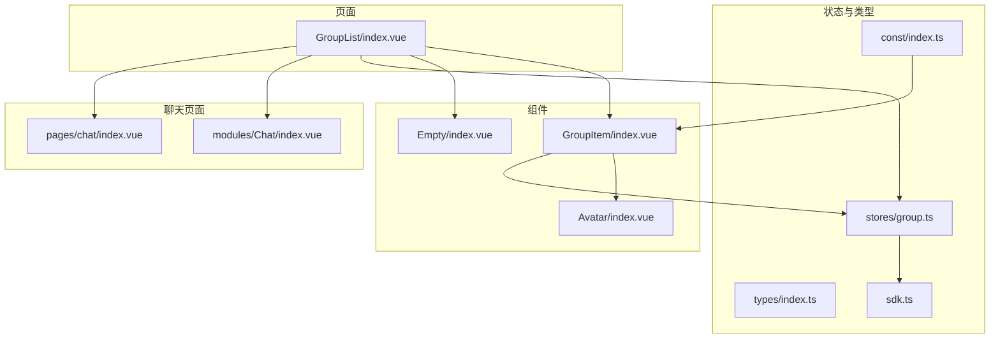
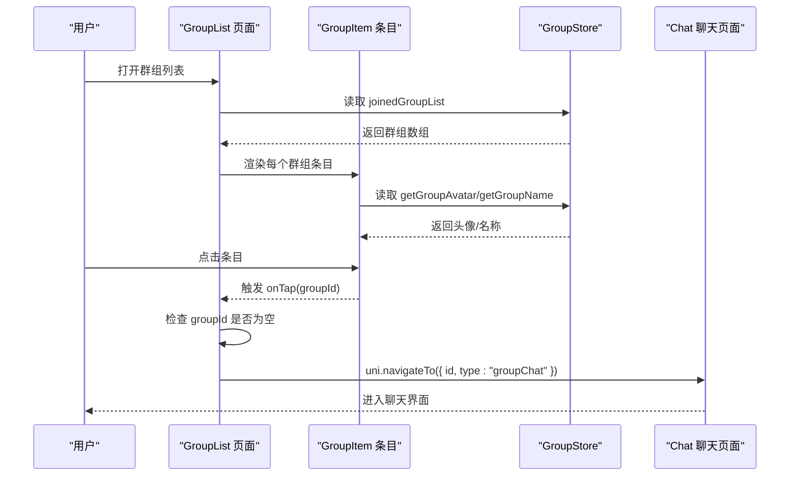
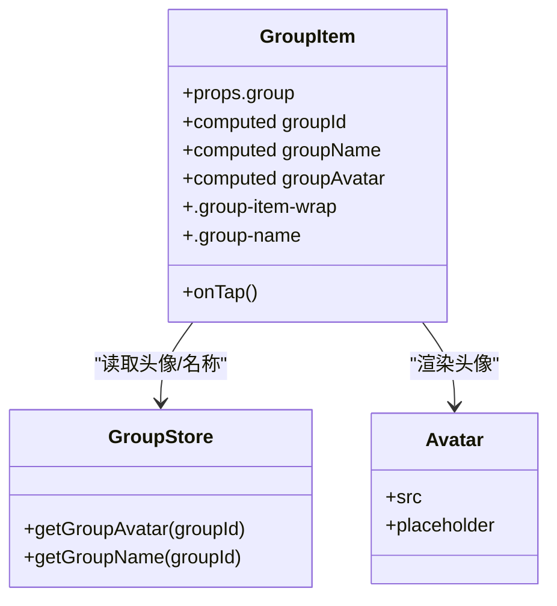
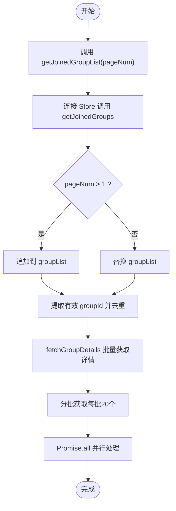
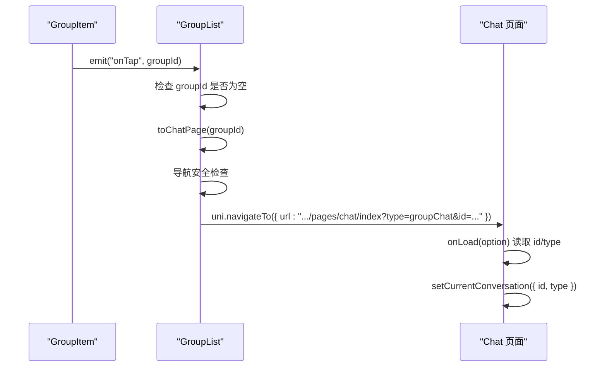
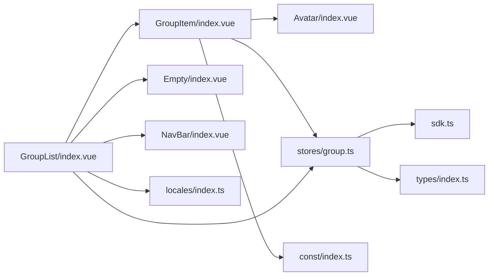

# 群组列表

<cite>
**本文引用的文件**
- [ChatUIKit/modules/GroupList/index.vue](file://ChatUIKit/modules/GroupList/index.vue)
- [ChatUIKit/modules/GroupList/components/GroupItem/index.vue](file://ChatUIKit/modules/GroupList/components/GroupItem/index.vue)
- [ChatUIKit/stores/group.ts](file://ChatUIKit/stores/group.ts)
- [ChatUIKit/components/Avatar/index.vue](file://ChatUIKit/components/Avatar/index.vue)
- [ChatUIKit/components/Empty/index.vue](file://ChatUIKit/components/Empty/index.vue)
- [ChatUIKit/const/index.ts](file://ChatUIKit/const/index.ts)
- [ChatUIKit/modules/Chat/index.vue](file://ChatUIKit/modules/Chat/index.vue)
- [ChatUIKit/modules/Conversation/components/ConversationList/index.vue](file://ChatUIKit/modules/Conversation/components/ConversationList/index.vue)
- [ChatUIKit/types/index.ts](file://ChatUIKit/types/index.ts)
- [ChatUIKit/sdk.ts](file://ChatUIKit/sdk.ts)
- [demo/pages.json](file://demo/pages.json)
- [vue2-demo/pages.json](file://vue2-demo/pages.json)
- [vue2-demo/pages/chat/index.vue](file://vue2-demo/pages/chat/index.vue)
</cite>

## 更新摘要
**变更内容**
- 修正导航路径配置：将群组页面URL从模块路径（`/ChatUIKit/modules/Chat/index`）改为常规页面路径（`/pages/chat/index`）
- 优化路由架构：Vue2版本已采用包装页面模式，Vue3版本正在迁移中
- 增强导航安全性：改进了错误处理机制，确保在 groupId 为空时不会触发导航
- 完善国际化支持：使用 t('groupList') 动态获取标题文本
- 优化样式设计：GroupItem 组件增加了卡片样式和边框，提升视觉层次

## 目录
1. [简介](#简介)
2. [项目结构](#项目结构)
3. [核心组件](#核心组件)
4. [架构总览](#架构总览)
5. [组件详解](#组件详解)
6. [依赖关系分析](#依赖关系分析)
7. [性能与可扩展性](#性能与可扩展性)
8. [故障排查指南](#故障排查指南)
9. [结论](#结论)
10. [附录](#附录)

## 简介
本文件系统性阐述"群组列表"功能的实现，重点覆盖以下方面：
- 群组列表组件的实现细节、数据绑定与用户交互模式
- GroupItem 组件的设计架构：群组头像显示、群组名称展示、最新消息预览与未读消息计数的扩展能力
- 数据来源（joinedGroupList）与状态管理、响应式更新机制
- 点击群组项跳转至聊天页面的导航逻辑与参数传递
- 样式定制选项与空状态处理
- 群组排序规则、分页加载与性能优化策略

## 项目结构
群组列表位于模块化目录结构中，采用"页面 + 组件 + Store"的分层组织方式：
- 页面层：GroupList/index.vue 负责渲染列表与空状态，并触发导航
- 组件层：GroupItem/index.vue 封装单个群组条目，负责头像与名称展示
- Store 层：stores/group.ts 提供群组列表、详情与分页等状态管理
- 基础组件：Avatar、Empty 提供通用展示能力
- 常量与类型：const/index.ts、types/index.ts、sdk.ts 提供默认头像、类型约束与 SDK 接口

**图表来源**
- [ChatUIKit/modules/GroupList/index.vue](file://ChatUIKit/modules/GroupList/index.vue#L1-L66)
- [ChatUIKit/modules/GroupList/components/GroupItem/index.vue](file://ChatUIKit/modules/GroupList/components/GroupItem/index.vue#L1-L67)
- [ChatUIKit/stores/group.ts](file://ChatUIKit/stores/group.ts#L1-L317)
- [ChatUIKit/components/Avatar/index.vue](file://ChatUIKit/components/Avatar/index.vue#L1-L188)
- [ChatUIKit/components/Empty/index.vue](file://ChatUIKit/components/Empty/index.vue#L1-L15)
- [ChatUIKit/const/index.ts](file://ChatUIKit/const/index.ts#L1-L37)
- [ChatUIKit/modules/Chat/index.vue](file://ChatUIKit/modules/Chat/index.vue#L1-L255)
- [ChatUIKit/types/index.ts](file://ChatUIKit/types/index.ts#L1-L100)
- [ChatUIKit/sdk.ts](file://ChatUIKit/sdk.ts#L1-L13)
- [vue2-demo/pages/chat/index.vue](file://vue2-demo/pages/chat/index.vue#L1-L62)

**章节来源**
- [ChatUIKit/modules/GroupList/index.vue](file://ChatUIKit/modules/GroupList/index.vue#L1-L66)
- [ChatUIKit/modules/GroupList/components/GroupItem/index.vue](file://ChatUIKit/modules/GroupList/components/GroupItem/index.vue#L1-L67)
- [ChatUIKit/stores/group.ts](file://ChatUIKit/stores/group.ts#L1-L317)
- [ChatUIKit/components/Avatar/index.vue](file://ChatUIKit/components/Avatar/index.vue#L1-L188)
- [ChatUIKit/components/Empty/index.vue](file://ChatUIKit/components/Empty/index.vue#L1-L15)
- [ChatUIKit/const/index.ts](file://ChatUIKit/const/index.ts#L1-L37)
- [ChatUIKit/modules/Chat/index.vue](file://ChatUIKit/modules/Chat/index.vue#L1-L255)
- [ChatUIKit/types/index.ts](file://ChatUIKit/types/index.ts#L1-L100)
- [ChatUIKit/sdk.ts](file://ChatUIKit/sdk.ts#L1-L13)

## 核心组件
- 群组列表页面：负责渲染列表、空状态、返回导航与点击跳转
- GroupItem 条目：封装头像与名称展示，暴露点击事件
- GroupStore：提供 joinedGroupList、getGroupAvatar、getGroupName 等 getter 与分页加载、详情缓存等 action
- Avatar：统一头像展示与占位图处理
- Empty：空状态占位图
- 常量与类型：提供默认头像 URL、类型约束与 SDK 接口

**章节来源**
- [ChatUIKit/modules/GroupList/index.vue](file://ChatUIKit/modules/GroupList/index.vue#L1-L66)
- [ChatUIKit/modules/GroupList/components/GroupItem/index.vue](file://ChatUIKit/modules/GroupList/components/GroupItem/index.vue#L1-L67)
- [ChatUIKit/stores/group.ts](file://ChatUIKit/stores/group.ts#L1-L317)
- [ChatUIKit/components/Avatar/index.vue](file://ChatUIKit/components/Avatar/index.vue#L1-L188)
- [ChatUIKit/components/Empty/index.vue](file://ChatUIKit/components/Empty/index.vue#L1-L15)
- [ChatUIKit/const/index.ts](file://ChatUIKit/const/index.ts#L1-L37)

## 架构总览
群组列表采用"页面 + 组件 + Store"的分层架构，数据流自上而下：
- 页面通过 computed 订阅 Store 的 joinedGroupList，实现响应式渲染
- GroupItem 通过 Store 的 getter 获取头像与名称，必要时回退到 Store 缓存
- 点击条目触发导航，携带 groupId 参数进入聊天页面

**更新** 导航路径已从模块路径迁移到常规页面路径，提升性能和路由管理效率

**图表来源**
- [ChatUIKit/modules/GroupList/index.vue](file://ChatUIKit/modules/GroupList/index.vue#L39-L47)
- [ChatUIKit/modules/GroupList/components/GroupItem/index.vue](file://ChatUIKit/modules/GroupList/components/GroupItem/index.vue#L48-L50)
- [ChatUIKit/stores/group.ts](file://ChatUIKit/stores/group.ts#L68-L95)
- [ChatUIKit/modules/Chat/index.vue](file://ChatUIKit/modules/Chat/index.vue#L229-L245)

## 组件详解

### GroupList 页面
- 列表渲染：遍历 groupList（computed 从 joinedGroupList 派生），每个条目绑定点击事件
- 导航逻辑：toChatPage 接收 groupId，调用 uni.navigateTo，路由路径携带 id 与 type=groupChat
- 错误处理：增加 groupId 为空时的错误检查，防止无效导航
- 空状态：当 groupList 为空时渲染 Empty 组件
- 国际化支持：使用 t('groupList') 动态获取标题文本
- 返回导航：onBack 调用 uni.navigateBack

**更新** 导航路径已从模块路径迁移到常规页面路径，提升性能和路由管理效率

**章节来源**
- [ChatUIKit/modules/GroupList/index.vue](file://ChatUIKit/modules/GroupList/index.vue#L8-L17)
- [ChatUIKit/modules/GroupList/index.vue](file://ChatUIKit/modules/GroupList/index.vue#L39-L47)
- [ChatUIKit/modules/GroupList/index.vue](file://ChatUIKit/modules/GroupList/index.vue#L35-L37)

### GroupItem 组件
- 头像展示：使用 Avatar 组件，优先使用 props.group 的 avatar/avatarurl，否则回退到 Store 的 getGroupAvatar
- 名称展示：优先使用 props.group 的 groupName/groupname，否则回退到 Store 的 getGroupName
- 点击事件：发出 onTap 事件，携带 groupId
- 样式设计：采用卡片布局，包含边框和内边距，提升视觉层次
- 默认头像：从 const/index.ts 导入 GROUP_AVATAR_URL 作为占位图

**图表来源**
- [ChatUIKit/modules/GroupList/components/GroupItem/index.vue](file://ChatUIKit/modules/GroupList/components/GroupItem/index.vue#L14-L50)
- [ChatUIKit/stores/group.ts](file://ChatUIKit/stores/group.ts#L68-L95)
- [ChatUIKit/components/Avatar/index.vue](file://ChatUIKit/components/Avatar/index.vue#L1-L188)
- [ChatUIKit/const/index.ts](file://ChatUIKit/const/index.ts#L12)

**章节来源**
- [ChatUIKit/modules/GroupList/components/GroupItem/index.vue](file://ChatUIKit/modules/GroupList/components/GroupItem/index.vue#L1-L67)
- [ChatUIKit/stores/group.ts](file://ChatUIKit/stores/group.ts#L68-L95)
- [ChatUIKit/const/index.ts](file://ChatUIKit/const/index.ts#L12)

### GroupStore 状态与数据流
- 状态结构：groupList（加入的群组列表）、groupInfoMap（群组详情映射）、pageParams（分页参数）
- 数据来源：getJoinedGroupList 通过连接 Store 获取已加入群组列表；fetchGroupDetails 批量拉取群组详情并缓存
- 响应式访问：joinedGroupList 与 getGroupAvatar/getGroupName 作为 getter，自动响应状态变化
- 分页加载：支持 pageNum、pageSize 与 cursor；多页合并追加到 groupList
- 性能优化：按需批量获取详情，避免重复请求；缓存已获取的详情
- 错误处理：在获取群组详情时添加异常捕获和日志记录

**图表来源**
- [ChatUIKit/stores/group.ts](file://ChatUIKit/stores/group.ts#L102-L131)
- [ChatUIKit/stores/group.ts](file://ChatUIKit/stores/group.ts#L136-L167)

**章节来源**
- [ChatUIKit/stores/group.ts](file://ChatUIKit/stores/group.ts#L16-L36)
- [ChatUIKit/stores/group.ts](file://ChatUIKit/stores/group.ts#L102-L131)
- [ChatUIKit/stores/group.ts](file://ChatUIKit/stores/group.ts#L136-L167)

### 导航与路由配置
- 点击 GroupItem 发出 onTap(groupId)
- GroupList 页面接收后调用 uni.navigateTo，传入 id 与 type=groupChat
- Chat 页面在 onLoad 时读取 option.id 与 option.type，设置当前会话
- 错误处理：在导航前检查 groupId 是否为空，防止无效导航

**更新** 导航路径已从模块路径（`/ChatUIKit/modules/Chat/index`）迁移到常规页面路径（`/pages/chat/index`），提升性能和路由管理效率

**图表来源**
- [ChatUIKit/modules/GroupList/components/GroupItem/index.vue](file://ChatUIKit/modules/GroupList/components/GroupItem/index.vue#L48-L50)
- [ChatUIKit/modules/GroupList/index.vue](file://ChatUIKit/modules/GroupList/index.vue#L39-L47)
- [ChatUIKit/modules/Chat/index.vue](file://ChatUIKit/modules/Chat/index.vue#L229-L245)

**章节来源**
- [ChatUIKit/modules/GroupList/components/GroupItem/index.vue](file://ChatUIKit/modules/GroupList/components/GroupItem/index.vue#L48-L50)
- [ChatUIKit/modules/GroupList/index.vue](file://ChatUIKit/modules/GroupList/index.vue#L39-L47)
- [ChatUIKit/modules/Chat/index.vue](file://ChatUIKit/modules/Chat/index.vue#L229-L245)

### 样式定制与空状态
- 空状态：Empty 组件提供占位图样式，居中显示，包含背景图片和尺寸设置
- 列表样式：GroupList 页面容器采用纵向布局，列表区域可滚动，支持响应式高度
- GroupItem 样式：卡片布局，包含边框、内边距和视觉层次，提升用户体验
- Avatar 样式：支持圆形/方形、尺寸、占位图与在线状态徽标
- 导航栏样式：使用 NavBar 组件，支持国际化标题显示

**更新** 改进了样式设计和响应式布局

**章节来源**
- [ChatUIKit/components/Empty/index.vue](file://ChatUIKit/components/Empty/index.vue#L1-L15)
- [ChatUIKit/modules/GroupList/index.vue](file://ChatUIKit/modules/GroupList/index.vue#L52-L65)
- [ChatUIKit/modules/GroupList/components/GroupItem/index.vue](file://ChatUIKit/modules/GroupList/components/GroupItem/index.vue#L52-L66)
- [ChatUIKit/components/Avatar/index.vue](file://ChatUIKit/components/Avatar/index.vue#L98-L187)

### 最新消息预览与未读计数（扩展建议）
- 当前实现仅展示头像与名称，未包含最新消息预览与未读计数
- 若需扩展，可在 GroupItem 上监听 Store 的会话状态或消息状态，计算最新消息摘要与未读数
- 该扩展属于 UI 展示增强，不影响现有数据绑定与导航流程

（本节为概念性说明，不直接分析具体文件）

## 依赖关系分析
- GroupList 依赖：
  - Store：joinedGroupList、toChatPage
  - 组件：GroupItem、Empty、NavBar
  - 国际化：locales/index.ts
- GroupItem 依赖：
  - Store：getGroupAvatar、getGroupName
  - 组件：Avatar
  - 常量：GROUP_AVATAR_URL
- Store 依赖：
  - 连接 Store：getJoinedGroups、getGroupInfo
  - 类型：Chat.GroupItem、Chat.GroupDetailInfo
  - SDK：chatSDK

**图表来源**
- [ChatUIKit/modules/GroupList/index.vue](file://ChatUIKit/modules/GroupList/index.vue#L21-L27)
- [ChatUIKit/modules/GroupList/components/GroupItem/index.vue](file://ChatUIKit/modules/GroupList/components/GroupItem/index.vue#L9-L12)
- [ChatUIKit/stores/group.ts](file://ChatUIKit/stores/group.ts#L10-L14)
- [ChatUIKit/const/index.ts](file://ChatUIKit/const/index.ts#L12)
- [ChatUIKit/sdk.ts](file://ChatUIKit/sdk.ts#L1-L13)
- [ChatUIKit/types/index.ts](file://ChatUIKit/types/index.ts#L1-L100)

**章节来源**
- [ChatUIKit/modules/GroupList/index.vue](file://ChatUIKit/modules/GroupList/index.vue#L21-L27)
- [ChatUIKit/modules/GroupList/components/GroupItem/index.vue](file://ChatUIKit/modules/GroupList/components/GroupItem/index.vue#L9-L12)
- [ChatUIKit/stores/group.ts](file://ChatUIKit/stores/group.ts#L10-L14)
- [ChatUIKit/const/index.ts](file://ChatUIKit/const/index.ts#L12)
- [ChatUIKit/sdk.ts](file://ChatUIKit/sdk.ts#L1-L13)
- [ChatUIKit/types/index.ts](file://ChatUIKit/types/index.ts#L1-L100)

## 性能与可扩展性
- 响应式渲染：使用 computed 订阅 joinedGroupList，避免手动订阅与内存泄漏
- 分页加载：getJoinedGroupList 支持 pageNum、pageSize 与 cursor，多页合并，减少一次性渲染压力
- 详情缓存：fetchGroupDetails 批量获取并缓存 groupInfoMap，避免重复请求
- 按需加载：GroupItem 优先使用 props 传入的头像/名称，缺失时再回退到 Store，降低耦合
- 错误处理：在导航和数据获取过程中添加异常捕获和日志记录
- 性能优化：分批获取群组详情（每批20个），使用 Promise.all 并行处理
- 可扩展点：
  - 排序规则：可在 Store 或页面层对 joinedGroupList 进行排序（如按最近消息时间）
  - 未读计数：结合会话 Store 的未读统计进行聚合展示
  - 下拉刷新/上拉加载：在页面层接入 uni 的下拉刷新与滚动触底事件，调用 getJoinedGroupList 实现分页

**更新** 导航路径优化提升了性能和路由管理效率

**章节来源**
- [ChatUIKit/stores/group.ts](file://ChatUIKit/stores/group.ts#L102-L131)
- [ChatUIKit/stores/group.ts](file://ChatUIKit/stores/group.ts#L136-L167)
- [ChatUIKit/modules/GroupList/index.vue](file://ChatUIKit/modules/GroupList/index.vue#L32-L33)

## 故障排查指南
- 点击无响应
  - 检查 GroupItem 是否正确发出 onTap 事件
  - 检查 GroupList 的 toChatPage 是否被调用且 groupId 非空
  - 验证导航安全检查逻辑
- 导航失败
  - 检查 uni.navigateTo 的 url 参数是否正确拼接 id 与 type
  - 检查 Chat 页面 onLoad 是否正确读取 option.id 与 option.type
  - 验证路由路径是否正确
- 头像/名称为空
  - 检查 props.group 是否传入 avatar/groupName
  - 检查 Store 的 getGroupAvatar/getGroupName 是否有缓存
  - 验证字段兼容性（驼峰和下划线格式）
- 列表空白
  - 检查 joinedGroupList 是否为空，Empty 是否被渲染
  - 检查 getJoinedGroupList 是否成功拉取数据
  - 验证国际化文本是否正确显示
- 样式问题
  - 检查 SCSS 样式是否正确编译
  - 验证响应式布局是否正常工作
  - 确认卡片样式和边框是否正确显示

**更新** 增加了新的故障排查场景

**章节来源**
- [ChatUIKit/modules/GroupList/components/GroupItem/index.vue](file://ChatUIKit/modules/GroupList/components/GroupItem/index.vue#L48-L50)
- [ChatUIKit/modules/GroupList/index.vue](file://ChatUIKit/modules/GroupList/index.vue#L39-L47)
- [ChatUIKit/modules/Chat/index.vue](file://ChatUIKit/modules/Chat/index.vue#L229-L245)
- [ChatUIKit/stores/group.ts](file://ChatUIKit/stores/group.ts#L68-L95)
- [ChatUIKit/modules/GroupList/index.vue](file://ChatUIKit/modules/GroupList/index.vue#L17)

## 结论
群组列表以简洁清晰的分层设计实现了稳定的列表渲染与导航跳转。通过 Pinia Store 的响应式状态与按需缓存，兼顾了性能与可维护性。最新的更新增强了导航安全性、错误处理机制和样式设计，提升了整体用户体验。导航路径已从模块路径迁移到常规页面路径，进一步优化了性能和路由管理效率。若需进一步增强用户体验，可在现有基础上扩展最新消息预览与未读计数，并完善排序与分页策略。

## 附录
- 类型与常量参考
  - Chat.GroupItem、Chat.GroupDetailInfo：来自 SDK 类型定义
  - GROUP_AVATAR_URL：默认群组头像地址
- 其他相关页面
  - ConversationList：会话列表页面，展示了类似的响应式渲染与空状态处理模式
- 版本差异
  - 新版本增加了错误处理、国际化支持和样式优化
  - 导航逻辑更加健壮，防止无效操作
  - Vue2版本已采用包装页面模式，Vue3版本正在迁移中

**章节来源**
- [ChatUIKit/types/index.ts](file://ChatUIKit/types/index.ts#L1-L100)
- [ChatUIKit/const/index.ts](file://ChatUIKit/const/index.ts#L12)
- [ChatUIKit/modules/Conversation/components/ConversationList/index.vue](file://ChatUIKit/modules/Conversation/components/ConversationList/index.vue#L1-L158)
- [demo/pages.json](file://demo/pages.json#L72-L84)
- [vue2-demo/pages.json](file://vue2-demo/pages.json#L21-L26)
- [vue2-demo/pages/chat/index.vue](file://vue2-demo/pages/chat/index.vue#L1-L62)