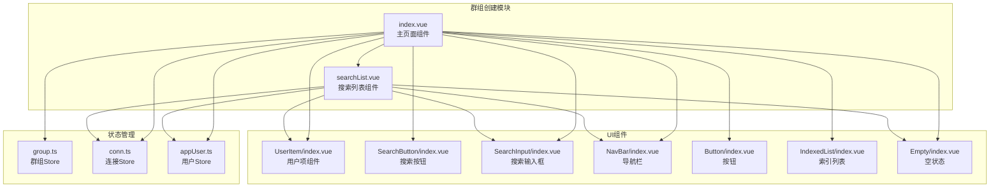
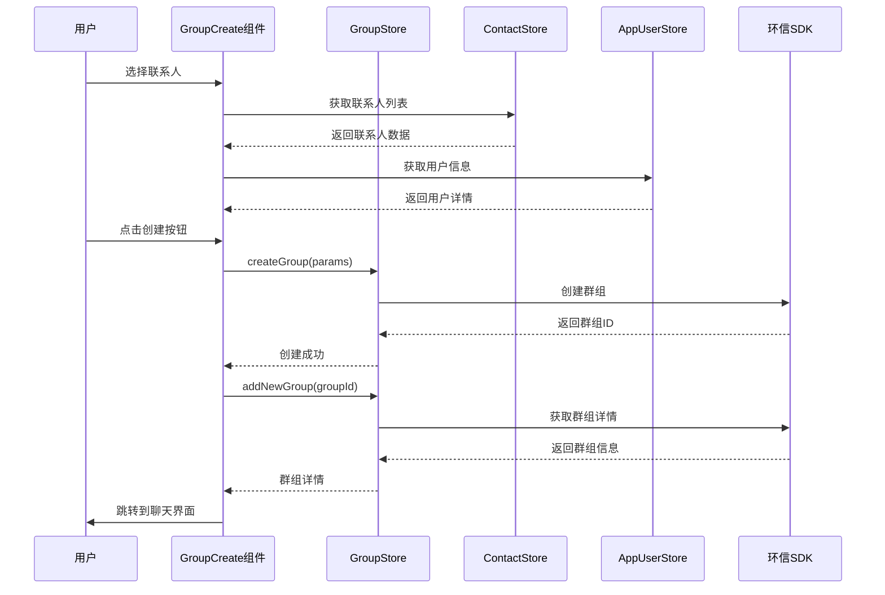
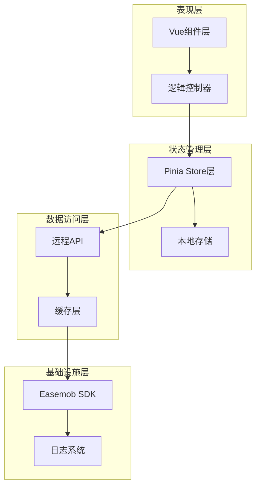
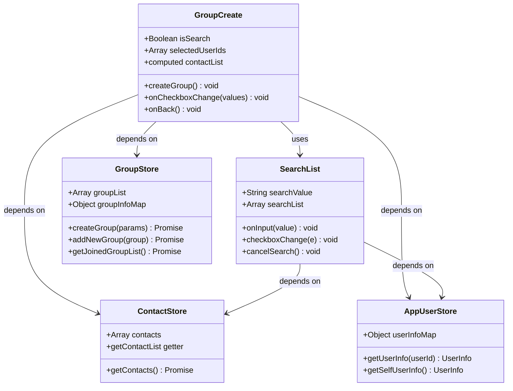
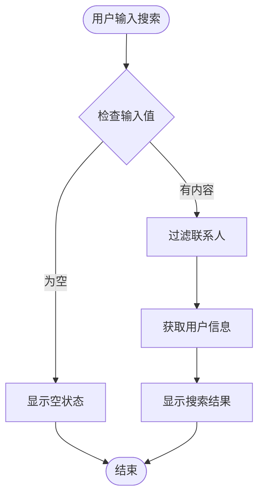
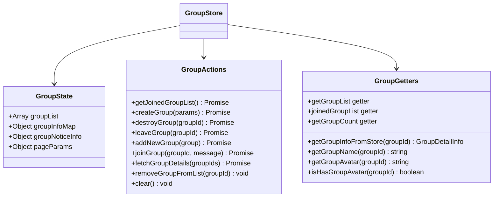
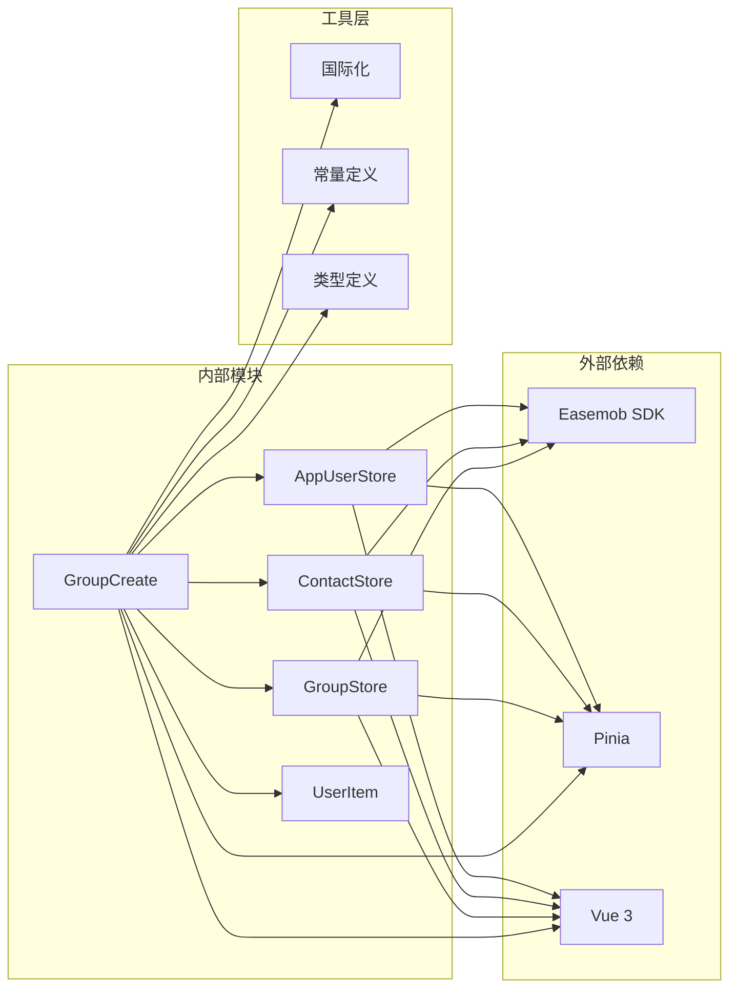
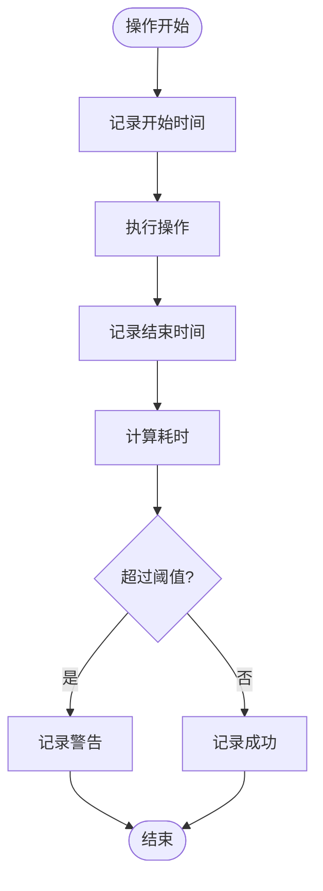
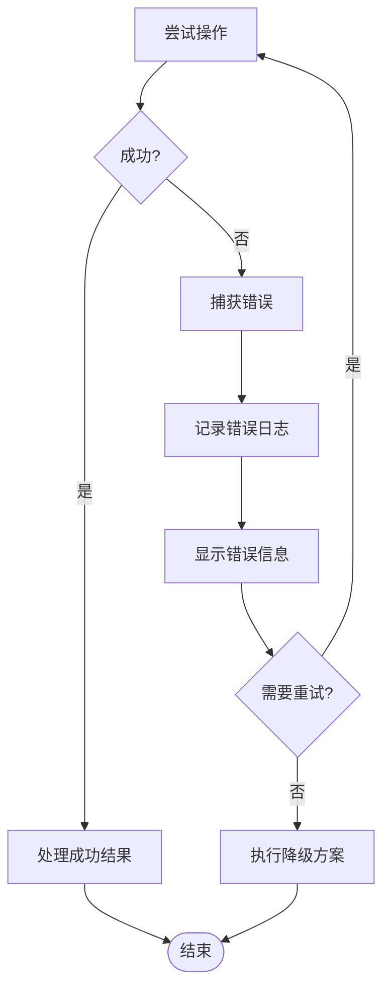

# 群组创建

<cite>
**本文档引用的文件**
- [ChatUIKit/modules/GroupCreate/index.vue](file://ChatUIKit/modules/GroupCreate/index.vue)
- [ChatUIKit/modules/GroupCreate/searchList.vue](file://ChatUIKit/modules/GroupCreate/searchList.vue)
- [ChatUIKit/stores/group.ts](file://ChatUIKit/stores/group.ts)
- [ChatUIKit/stores/contact.ts](file://ChatUIKit/stores/contact.ts)
- [ChatUIKit/stores/appUser.ts](file://ChatUIKit/stores/appUser.ts)
- [ChatUIKit/stores/conn.ts](file://ChatUIKit/stores/conn.ts)
- [ChatUIKit/sdk.ts](file://ChatUIKit/sdk.ts)
- [ChatUIKit/modules/ContactList/components/UserItem/index.vue](file://ChatUIKit/modules/ContactList/components/UserItem/index.vue)
- [ChatUIKit/locales/zh-Hans.ts](file://ChatUIKit/locales/zh-Hans.ts)
- [ChatUIKit/locales/en.ts](file://ChatUIKit/locales/en.ts)
- [ChatUIKit/const/index.ts](file://ChatUIKit/const/index.ts)
- [ChatUIKit/README.md](file://ChatUIKit/README.md)
</cite>

## 目录
1. [简介](#简介)
2. [项目结构](#项目结构)
3. [核心组件](#核心组件)
4. [架构概览](#架构概览)
5. [详细组件分析](#详细组件分析)
6. [依赖关系分析](#依赖关系分析)
7. [性能考虑](#性能考虑)
8. [故障排除指南](#故障排除指南)
9. [结论](#结论)

## 简介

群组创建功能是 Easemob UIKit 项目中的一个核心模块，允许用户通过选择联系人来创建新的群组。该功能集成了完整的用户界面、状态管理和数据持久化机制，提供了流畅的用户体验。

该模块基于 Vue 3 Composition API 和 Pinia 状态管理，结合环信即时通讯 SDK 实现了完整的群组创建流程。用户可以通过索引列表浏览联系人，使用搜索功能快速定位特定联系人，然后选择多个联系人创建群组。

## 项目结构

群组创建功能位于 ChatUIKit/modules/GroupCreate 目录下，包含以下关键文件：

**图表来源**
- [ChatUIKit/modules/GroupCreate/index.vue](file://ChatUIKit/modules/GroupCreate/index.vue#L1-L221)
- [ChatUIKit/modules/GroupCreate/searchList.vue](file://ChatUIKit/modules/GroupCreate/searchList.vue#L1-L126)

**章节来源**
- [ChatUIKit/modules/GroupCreate/index.vue](file://ChatUIKit/modules/GroupCreate/index.vue#L1-L221)
- [ChatUIKit/modules/GroupCreate/searchList.vue](file://ChatUIKit/modules/GroupCreate/searchList.vue#L1-L126)

## 核心组件

### 主要组件职责

1. **GroupCreate 组件 (index.vue)**：群组创建的主界面，负责展示联系人列表、处理用户选择和创建群组操作
2. **SearchList 组件 (searchList.vue)**：提供联系人搜索功能，支持实时搜索和多选操作
3. **GroupStore (group.ts)**：管理群组相关的状态和操作，包括创建、查询和管理群组
4. **ContactStore (contact.ts)**：维护联系人列表和相关操作
5. **AppUserStore (appUser.ts)**：管理用户信息和状态

### 数据流架构

**图表来源**
- [ChatUIKit/modules/GroupCreate/index.vue](file://ChatUIKit/modules/GroupCreate/index.vue#L79-L124)
- [ChatUIKit/stores/group.ts](file://ChatUIKit/stores/group.ts#L172-L184)

**章节来源**
- [ChatUIKit/modules/GroupCreate/index.vue](file://ChatUIKit/modules/GroupCreate/index.vue#L47-L133)
- [ChatUIKit/stores/group.ts](file://ChatUIKit/stores/group.ts#L27-L316)

## 架构概览

群组创建功能采用分层架构设计，各层职责明确：

**图表来源**
- [ChatUIKit/stores/group.ts](file://ChatUIKit/stores/group.ts#L1-L317)
- [ChatUIKit/stores/contact.ts](file://ChatUIKit/stores/contact.ts#L1-L282)
- [ChatUIKit/stores/appUser.ts](file://ChatUIKit/stores/appUser.ts#L1-L242)

### 技术栈特性

- **Vue 3 Composition API**：提供更好的逻辑复用和类型推断
- **Pinia**：现代化的状态管理，支持 TypeScript 和 DevTools
- **TypeScript**：提供编译时类型检查和更好的开发体验
- **环信 Web SDK**：基于环信即时通讯云的稳定通信能力

## 详细组件分析

### GroupCreate 主组件分析

GroupCreate 组件是群组创建功能的核心，实现了完整的用户交互流程：

#### 组件结构

**图表来源**
- [ChatUIKit/modules/GroupCreate/index.vue](file://ChatUIKit/modules/GroupCreate/index.vue#L47-L133)
- [ChatUIKit/modules/GroupCreate/searchList.vue](file://ChatUIKit/modules/GroupCreate/searchList.vue#L42-L88)
- [ChatUIKit/stores/group.ts](file://ChatUIKit/stores/group.ts#L27-L316)

#### 核心功能实现

**联系人选择逻辑**：
- 使用索引列表展示联系人，支持字母排序
- 复选框选择多个联系人
- 动态计算选中人数显示

**群组创建流程**：
1. 验证至少选择一个联系人
2. 生成群组名称（包含当前用户和选中用户）
3. 构建创建参数（包含群组配置）
4. 调用 Store 层创建群组
5. 成功后添加到群组列表并跳转

**章节来源**
- [ChatUIKit/modules/GroupCreate/index.vue](file://ChatUIKit/modules/GroupCreate/index.vue#L59-L124)

### SearchList 搜索组件分析

SearchList 组件提供了高效的联系人搜索功能：

#### 搜索算法实现

**图表来源**
- [ChatUIKit/modules/GroupCreate/searchList.vue](file://ChatUIKit/modules/GroupCreate/searchList.vue#L74-L83)

#### 搜索优化策略

- **实时搜索**：输入即搜索，提供即时反馈
- **用户信息缓存**：利用 AppUserStore 缓存用户信息
- **响应式更新**：使用 computed 属性自动更新搜索结果

**章节来源**
- [ChatUIKit/modules/GroupCreate/searchList.vue](file://ChatUIKit/modules/GroupCreate/searchList.vue#L42-L88)

### Store 层架构分析

Store 层采用 Pinia 实现，提供了类型安全的状态管理：

#### GroupStore 设计模式

**图表来源**
- [ChatUIKit/stores/group.ts](file://ChatUIKit/stores/group.ts#L16-L96)

#### 状态管理模式

**响应式数据流**：
- 群组列表和详情分离管理
- 支持驼峰和下划线字段名兼容
- 自动缓存和去重机制

**异步操作处理**：
- 分批获取群组详情（每批20个）
- 错误处理和日志记录
- 并发操作优化

**章节来源**
- [ChatUIKit/stores/group.ts](file://ChatUIKit/stores/group.ts#L27-L316)

### 用户界面组件分析

#### UserItem 组件设计

UserItem 组件提供了统一的用户信息展示：

**组件特性**：
- 支持头像显示和占位符
- 在线状态展示（可配置）
- 响应式布局适配不同屏幕尺寸

**交互功能**：
- 点击事件处理
- 滑动菜单支持（用于删除等操作）
- 动态样式切换

**章节来源**
- [ChatUIKit/modules/ContactList/components/UserItem/index.vue](file://ChatUIKit/modules/ContactList/components/UserItem/index.vue#L1-L165)

## 依赖关系分析

群组创建功能的依赖关系体现了清晰的分层架构：

**图表来源**
- [ChatUIKit/modules/GroupCreate/index.vue](file://ChatUIKit/modules/GroupCreate/index.vue#L47-L57)
- [ChatUIKit/stores/group.ts](file://ChatUIKit/stores/group.ts#L10-L14)

### 关键依赖特性

**类型安全**：
- 完整的 TypeScript 类型定义
- 编译时错误检测
- IDE 智能提示支持

**模块化设计**：
- 清晰的职责分离
- 可测试性良好
- 易于维护和扩展

**性能优化**：
- 懒加载和按需导入
- 缓存策略优化
- 内存管理优化

**章节来源**
- [ChatUIKit/stores/group.ts](file://ChatUIKit/stores/group.ts#L1-L317)
- [ChatUIKit/stores/contact.ts](file://ChatUIKit/stores/contact.ts#L1-L282)

## 性能考虑

### 性能优化策略

1. **状态缓存**：GroupStore 和 AppUserStore 实现了智能缓存机制，避免重复请求
2. **批量操作**：群组详情获取采用分批处理（每批20个），减少网络请求次数
3. **响应式优化**：使用 computed 属性自动追踪依赖，避免不必要的重新渲染
4. **内存管理**：及时清理不再使用的数据，防止内存泄漏

### 性能监控

**图表来源**
- [ChatUIKit/stores/group.ts](file://ChatUIKit/stores/group.ts#L102-L131)
- [ChatUIKit/stores/appUser.ts](file://ChatUIKit/stores/appUser.ts#L86-L125)

## 故障排除指南

### 常见问题及解决方案

**群组创建失败**：
1. 检查网络连接状态
2. 验证用户权限和配额限制
3. 查看日志中的错误信息
4. 重试创建操作

**联系人列表为空**：
1. 确认已正确初始化连接
2. 检查联系人同步状态
3. 验证用户认证信息

**搜索功能异常**：
1. 检查输入字符编码
2. 验证用户信息缓存状态
3. 确认 AppUserStore 正常工作

### 错误处理机制

**图表来源**
- [ChatUIKit/stores/group.ts](file://ChatUIKit/stores/group.ts#L172-L184)
- [ChatUIKit/stores/contact.ts](file://ChatUIKit/stores/contact.ts#L112-L130)

**章节来源**
- [ChatUIKit/stores/group.ts](file://ChatUIKit/stores/group.ts#L172-L203)
- [ChatUIKit/stores/contact.ts](file://ChatUIKit/stores/contact.ts#L112-L130)

## 结论

群组创建功能展现了现代前端开发的最佳实践，通过合理的架构设计和完善的错误处理机制，为用户提供了流畅的群组创建体验。

### 核心优势

1. **架构清晰**：分层设计使得代码易于理解和维护
2. **性能优秀**：多种优化策略确保了良好的用户体验
3. **类型安全**：完整的 TypeScript 支持提供了编译时保护
4. **扩展性强**：模块化设计便于功能扩展和定制

### 技术亮点

- 基于 Vue 3 Composition API 的现代化开发
- Pinia 状态管理的类型安全和易用性
- 环信 SDK 的稳定通信能力
- 完善的国际化和本地化支持

该功能模块为开发者提供了一个可靠的群组创建解决方案，可以作为其他即时通讯应用的基础组件进行集成和扩展。