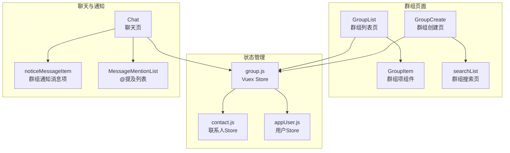
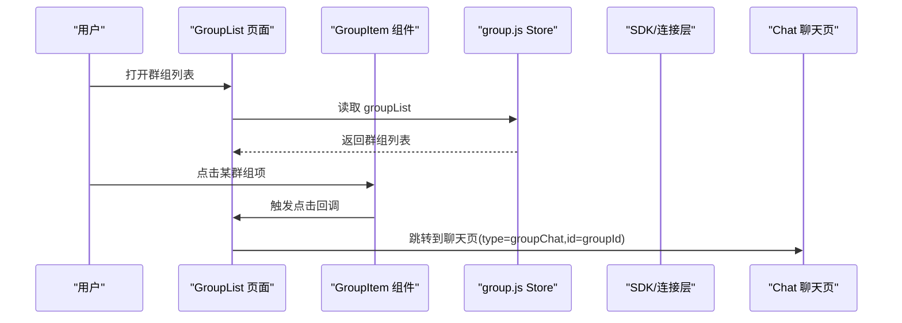
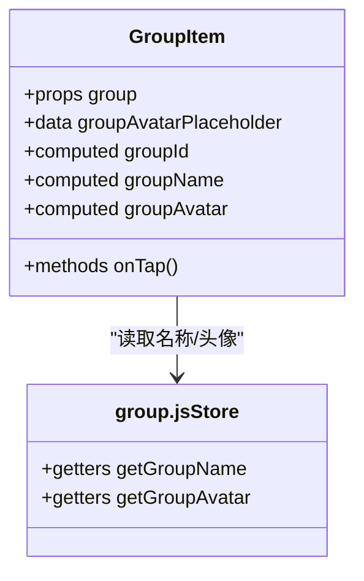
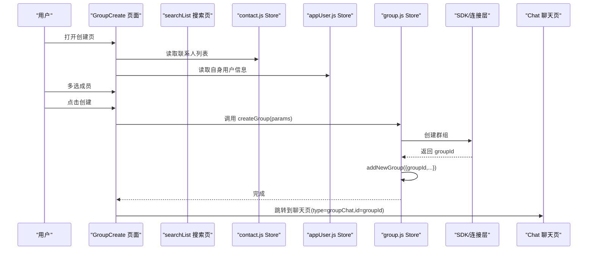
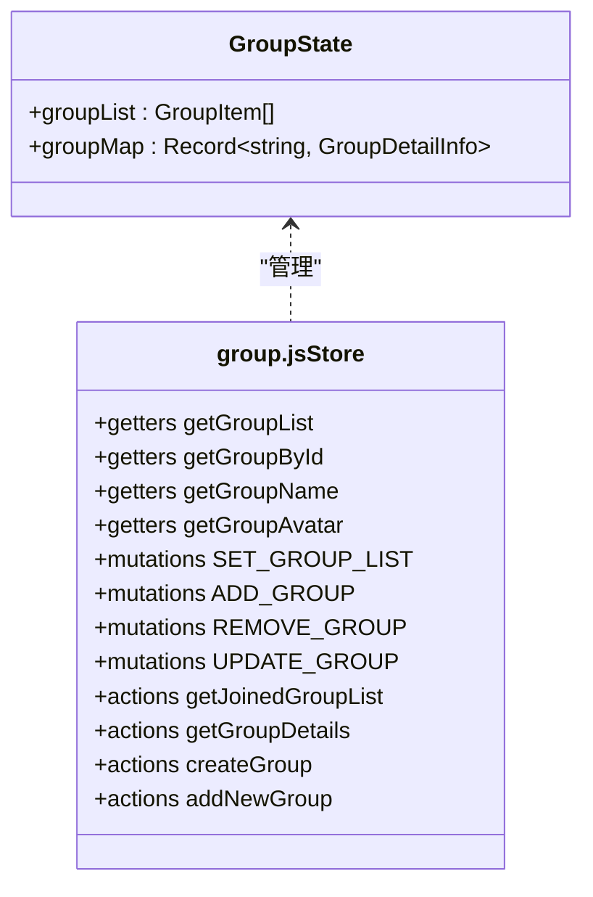
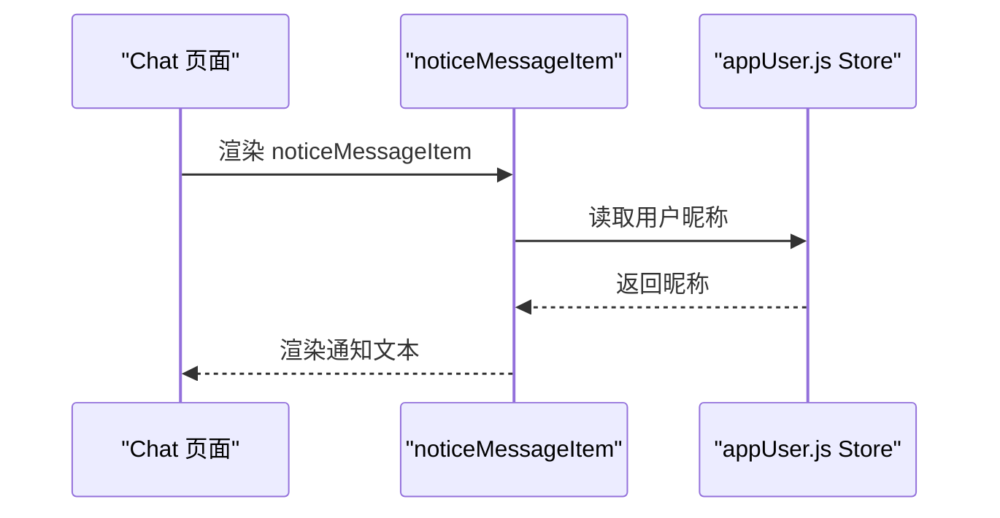
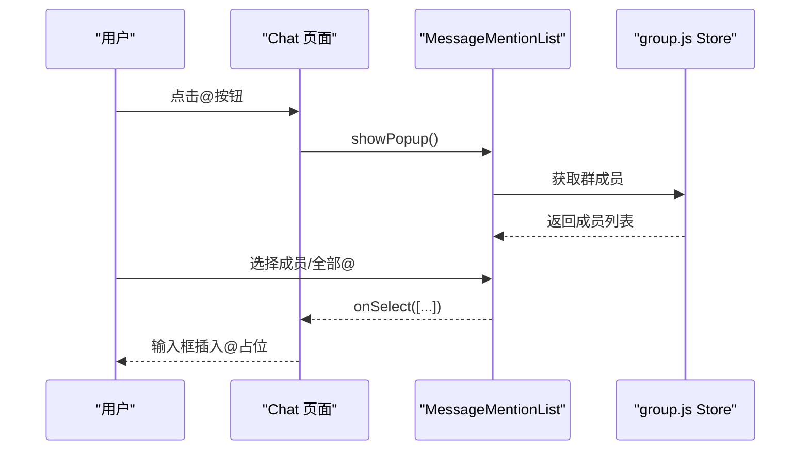
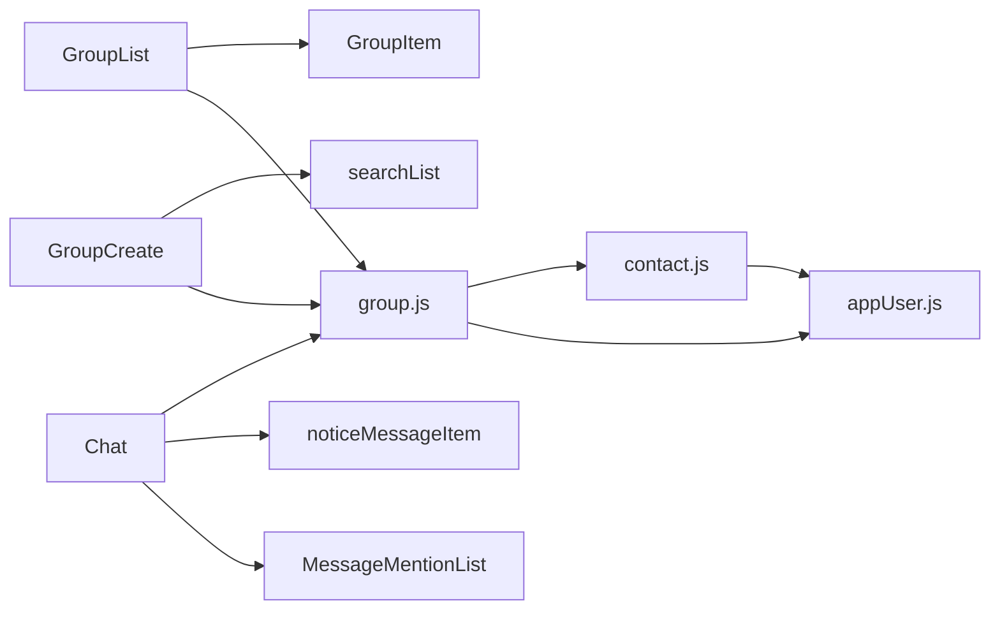

# 群组模块

<cite>
**本文引用的文件**
- [ChatUIKit-vue2/modules/GroupList/index.vue](file://ChatUIKit-vue2/modules/GroupList/index.vue)
- [ChatUIKit-vue2/modules/GroupList/components/GroupItem/index.vue](file://ChatUIKit-vue2/modules/GroupList/components/GroupItem/index.vue)
- [ChatUIKit-vue2/modules/GroupCreate/index.vue](file://ChatUIKit-vue2/modules/GroupCreate/index.vue)
- [ChatUIKit-vue2/modules/GroupCreate/searchList.vue](file://ChatUIKit-vue2/modules/GroupCreate/searchList.vue)
- [ChatUIKit-vue2/stores/group.js](file://ChatUIKit-vue2/stores/group.js)
- [ChatUIKit-vue2/stores/contact.js](file://ChatUIKit-vue2/stores/contact.js)
- [ChatUIKit-vue2/stores/appUser.js](file://ChatUIKit-vue2/stores/appUser.js)
- [ChatUIKit-vue2/modules/Chat/index.vue](file://ChatUIKit-vue2/modules/Chat/index.vue)
- [ChatUIKit-vue2/modules/Chat/components/Message/noticeMessageItem.vue](file://ChatUIKit-vue2/modules/Chat/components/Message/noticeMessageItem.vue)
- [ChatUIKit-vue2/modules/Chat/components/MessageMentionList/index.vue](file://ChatUIKit-vue2/modules/Chat/components/MessageMentionList/index.vue)
</cite>

## 更新摘要
**所做更改**
- 更新群组模块文档以反映Vue2实现的组件结构变化
- 修正所有文件路径从ChatUIKit/stores/...改为ChatUIKit-vue2/stores/...
- 更新群组创建功能的Vue2实现细节，包括组件注册、生命周期钩子和状态管理
- 完善群组Store在Vue2环境下的状态管理文档，新增addNewGroup等关键方法
- 更新@提及功能的实现说明，包括分页加载和成员过滤

## 目录
1. [简介](#简介)
2. [项目结构](#项目结构)
3. [核心组件](#核心组件)
4. [架构总览](#架构总览)
5. [详细组件分析](#详细组件分析)
6. [依赖关系分析](#依赖关系分析)
7. [性能考虑](#性能考虑)
8. [故障排查指南](#故障排查指南)
9. [结论](#结论)
10. [附录](#附录)

## 简介
本文件系统性梳理群组模块的设计与实现，覆盖群组列表、群组项、群组创建、群组成员管理、权限控制、群组通知与消息处理、@提及、群组搜索与分页、状态管理与性能优化、安全与隐私等主题。目标是帮助开发者快速理解并高效扩展群组相关能力。

**更新** 本版本文档完全基于Vue2实现的组件结构进行更新，修正了所有文件路径和实现细节。

## 项目结构
群组模块由"页面组件 + Vuex Store + 类型与常量 + 聊天与通知组件"构成，采用按功能域划分的目录组织方式，便于维护与扩展。

**图表来源**
- [ChatUIKit-vue2/modules/GroupList/index.vue:1-80](file://ChatUIKit-vue2/modules/GroupList/index.vue#L1-L80)
- [ChatUIKit-vue2/modules/GroupList/components/GroupItem/index.vue:1-77](file://ChatUIKit-vue2/modules/GroupList/components/GroupItem/index.vue#L1-L77)
- [ChatUIKit-vue2/modules/GroupCreate/index.vue:1-394](file://ChatUIKit-vue2/modules/GroupCreate/index.vue#L1-L394)
- [ChatUIKit-vue2/modules/GroupCreate/searchList.vue:1-135](file://ChatUIKit-vue2/modules/GroupCreate/searchList.vue#L1-L135)
- [ChatUIKit-vue2/stores/group.js:1-212](file://ChatUIKit-vue2/stores/group.js#L1-L212)
- [ChatUIKit-vue2/stores/contact.js:1-222](file://ChatUIKit-vue2/stores/contact.js#L1-L222)
- [ChatUIKit-vue2/stores/appUser.js:1-235](file://ChatUIKit-vue2/stores/appUser.js#L1-L235)
- [ChatUIKit-vue2/modules/Chat/index.vue:1-310](file://ChatUIKit-vue2/modules/Chat/index.vue#L1-L310)
- [ChatUIKit-vue2/modules/Chat/components/Message/noticeMessageItem.vue:1-57](file://ChatUIKit-vue2/modules/Chat/components/Message/noticeMessageItem.vue#L1-L57)
- [ChatUIKit-vue2/modules/Chat/components/MessageMentionList/index.vue:1-162](file://ChatUIKit-vue2/modules/Chat/components/MessageMentionList/index.vue#L1-L162)

**章节来源**
- [ChatUIKit-vue2/modules/GroupList/index.vue:1-80](file://ChatUIKit-vue2/modules/GroupList/index.vue#L1-L80)
- [ChatUIKit-vue2/modules/GroupCreate/index.vue:1-394](file://ChatUIKit-vue2/modules/GroupCreate/index.vue#L1-L394)
- [ChatUIKit-vue2/stores/group.js:1-212](file://ChatUIKit-vue2/stores/group.js#L1-L212)

## 核心组件
- 群组列表页：负责渲染已加入群组列表，点击进入聊天页。
- 群组项组件：展示群组头像与名称，兼容多种字段命名。
- 群组创建页：提供联系人选择、搜索、批量创建群组，并跳转至聊天页。
- 群组搜索页：基于输入关键字筛选联系人，支持多选。
- 群组 Store：统一管理群组列表、详情、通知、分页与成员列表加载。
- 聊天页：承载消息列表、@提及、群组通知消息项等。
- 联系人 Store：管理联系人列表和用户信息。
- 应用用户 Store：管理当前用户信息和在线状态。

**更新** 完全基于Vue2实现，使用Vuex替代Pinia，组件注册和生命周期钩子有所调整。

**章节来源**
- [ChatUIKit-vue2/modules/GroupList/components/GroupItem/index.vue:1-77](file://ChatUIKit-vue2/modules/GroupList/components/GroupItem/index.vue#L1-L77)
- [ChatUIKit-vue2/modules/GroupCreate/index.vue:1-394](file://ChatUIKit-vue2/modules/GroupCreate/index.vue#L1-L394)
- [ChatUIKit-vue2/modules/GroupCreate/searchList.vue:1-135](file://ChatUIKit-vue2/modules/GroupCreate/searchList.vue#L1-L135)
- [ChatUIKit-vue2/stores/group.js:1-212](file://ChatUIKit-vue2/stores/group.js#L1-L212)
- [ChatUIKit-vue2/stores/contact.js:1-222](file://ChatUIKit-vue2/stores/contact.js#L1-L222)
- [ChatUIKit-vue2/stores/appUser.js:1-235](file://ChatUIKit-vue2/stores/appUser.js#L1-L235)
- [ChatUIKit-vue2/modules/Chat/index.vue:1-310](file://ChatUIKit-vue2/modules/Chat/index.vue#L1-L310)

## 架构总览
群组模块遵循"页面组件 + Vuex Store"的分层设计，页面通过 Store 获取/变更状态；Store 再通过连接层访问 SDK 完成远端操作；聊天页集成通知与@提及能力，形成完整的群组交互闭环。

**图表来源**
- [ChatUIKit-vue2/modules/GroupList/index.vue:35-48](file://ChatUIKit-vue2/modules/GroupList/index.vue#L35-L48)
- [ChatUIKit-vue2/modules/GroupList/components/GroupItem/index.vue:54-58](file://ChatUIKit-vue2/modules/GroupList/components/GroupItem/index.vue#L54-L58)
- [ChatUIKit-vue2/stores/group.js:14-34](file://ChatUIKit-vue2/stores/group.js#L14-L34)
- [ChatUIKit-vue2/modules/Chat/index.vue:1-310](file://ChatUIKit-vue2/modules/Chat/index.vue#L1-L310)

## 详细组件分析

### 群组列表组件
- 数据来源：通过计算属性读取 Store 的已加入群组列表。
- 交互行为：点击项后跳转到聊天页，携带群组 ID。
- 空态处理：当列表为空时显示空状态组件。
- 生命周期：使用onShow钩子在页面显示时加载群组列表。

**图表来源**
- [ChatUIKit-vue2/modules/GroupList/index.vue:41-63](file://ChatUIKit-vue2/modules/GroupList/index.vue#L41-L63)

**章节来源**
- [ChatUIKit-vue2/modules/GroupList/index.vue:1-80](file://ChatUIKit-vue2/modules/GroupList/index.vue#L1-L80)

### 群组项组件
- 字段兼容：优先使用传入对象的名称/头像字段，否则回退到 Store 查询。
- 交互：向外发出点击事件，供父级路由跳转。
- 组件注册：使用局部组件注册方式引入Avatar组件。

**图表来源**
- [ChatUIKit-vue2/modules/GroupList/components/GroupItem/index.vue:12-58](file://ChatUIKit-vue2/modules/GroupList/components/GroupItem/index.vue#L12-L58)
- [ChatUIKit-vue2/stores/group.js:14-34](file://ChatUIKit-vue2/stores/group.js#L14-L34)

**章节来源**
- [ChatUIKit-vue2/modules/GroupList/components/GroupItem/index.vue:1-77](file://ChatUIKit-vue2/modules/GroupList/components/GroupItem/index.vue#L1-L77)
- [ChatUIKit-vue2/stores/group.js:14-34](file://ChatUIKit-vue2/stores/group.js#L14-L34)

### 群组创建功能
- 联系人选择：从联系人列表中选择多人，支持索引列表与搜索两种入口。
- 创建参数：自动生成群组名、描述，设置公开、允许邀请、无需审批、最大人数等策略。
- 创建流程：调用 Store 的创建接口，成功后添加到本地列表并跳转聊天页。
- Vue2实现：使用Vuex action处理异步操作，支持两种参数格式。

**更新** 完整实现Vue2版本的群组创建功能，包括联系人选择、搜索和创建流程。

**图表来源**
- [ChatUIKit-vue2/modules/GroupCreate/index.vue:126-273](file://ChatUIKit-vue2/modules/GroupCreate/index.vue#L126-L273)
- [ChatUIKit-vue2/modules/GroupCreate/searchList.vue:65-95](file://ChatUIKit-vue2/modules/GroupCreate/searchList.vue#L65-L95)
- [ChatUIKit-vue2/stores/group.js:150-209](file://ChatUIKit-vue2/stores/group.js#L150-L209)
- [ChatUIKit-vue2/modules/Chat/index.vue:1-310](file://ChatUIKit-vue2/modules/Chat/index.vue#L1-L310)

**章节来源**
- [ChatUIKit-vue2/modules/GroupCreate/index.vue:1-394](file://ChatUIKit-vue2/modules/GroupCreate/index.vue#L1-L394)
- [ChatUIKit-vue2/modules/GroupCreate/searchList.vue:1-135](file://ChatUIKit-vue2/modules/GroupCreate/searchList.vue#L1-L135)
- [ChatUIKit-vue2/stores/group.js:150-209](file://ChatUIKit-vue2/stores/group.js#L150-L209)

### 群组数据模型与状态管理
- 状态结构：包含已加入群组列表、群组详情映射。
- 计算属性：提供群组列表、根据ID获取群组、获取群组名称/头像等。
- 动作方法：获取加入的群组列表、批量获取群组详情、创建群组、添加新群组、更新群组信息。

**更新** 新增addNewGroup方法，用于添加新创建的群组到列表并获取详情。

**图表来源**
- [ChatUIKit-vue2/stores/group.js:7-71](file://ChatUIKit-vue2/stores/group.js#L7-L71)
- [ChatUIKit-vue2/stores/group.js:73-210](file://ChatUIKit-vue2/stores/group.js#L73-L210)

**章节来源**
- [ChatUIKit-vue2/stores/group.js:1-212](file://ChatUIKit-vue2/stores/group.js#L1-L212)

### 成员管理与权限控制
- 成员列表分页：聊天页的@提及列表按固定页大小分页加载群成员。
- 权限说明：SDK文档中明确了群主/管理员权限（如移除管理员、删除会话线程等），在 UI层通过Store与聊天页协作实现。

**更新** @提及列表支持"全部@"占位符，成员过滤排除当前用户。

**章节来源**
- [ChatUIKit-vue2/modules/Chat/components/MessageMentionList/index.vue:53-82](file://ChatUIKit-vue2/modules/Chat/components/MessageMentionList/index.vue#L53-L82)

### 群组通知与消息处理
- 群组通知消息项：渲染"撤回"和"群组"类通知消息文本。
- 聊天页集成：聊天页承载消息列表、@提及弹窗、用户卡片等，统一处理群组事件与通知。

**图表来源**
- [ChatUIKit-vue2/modules/Chat/components/Message/noticeMessageItem.vue:20-38](file://ChatUIKit-vue2/modules/Chat/components/Message/noticeMessageItem.vue#L20-L38)
- [ChatUIKit-vue2/modules/Chat/index.vue:1-310](file://ChatUIKit-vue2/modules/Chat/index.vue#L1-L310)

**章节来源**
- [ChatUIKit-vue2/modules/Chat/components/Message/noticeMessageItem.vue:1-57](file://ChatUIKit-vue2/modules/Chat/components/Message/noticeMessageItem.vue#L1-L57)
- [ChatUIKit-vue2/modules/Chat/index.vue:1-310](file://ChatUIKit-vue2/modules/Chat/index.vue#L1-L310)

### @提及功能
- @提及列表：在聊天页触发时弹出，按页加载群成员，支持"全部@"占位。
- 选择回调：将选中的用户 ID 注入输入框并插入占位文本。

**更新** @提及列表支持分页加载，每页100个成员，自动过滤当前用户。

**图表来源**
- [ChatUIKit-vue2/modules/Chat/index.vue:187-211](file://ChatUIKit-vue2/modules/Chat/index.vue#L187-L211)
- [ChatUIKit-vue2/modules/Chat/components/MessageMentionList/index.vue:64-82](file://ChatUIKit-vue2/modules/Chat/components/MessageMentionList/index.vue#L64-L82)
- [ChatUIKit-vue2/stores/group.js:1-212](file://ChatUIKit-vue2/stores/group.js#L1-L212)

**章节来源**
- [ChatUIKit-vue2/modules/Chat/components/MessageMentionList/index.vue:1-162](file://ChatUIKit-vue2/modules/Chat/components/MessageMentionList/index.vue#L1-L162)

### 群组搜索与群组信息更新
- 搜索：创建页提供搜索入口，输入关键字后过滤联系人列表。
- 信息更新：Store 提供设置头像、清空数据等动作，用于动态更新群组信息。

**更新** 搜索功能支持实时过滤，基于用户昵称匹配。

**章节来源**
- [ChatUIKit-vue2/modules/GroupCreate/searchList.vue:65-95](file://ChatUIKit-vue2/modules/GroupCreate/searchList.vue#L65-L95)
- [ChatUIKit-vue2/stores/group.js:202-209](file://ChatUIKit-vue2/stores/group.js#L202-L209)

### 群组状态管理与生命周期
- Store 生命周期：页面挂载时读取/设置当前会话，卸载时清理引用。
- 群组状态：Store 维护列表、详情、通知与分页参数，避免重复请求与缓存不一致。

**更新** 新增addNewGroup方法，用于处理新创建群组的本地状态同步。

**章节来源**
- [ChatUIKit-vue2/modules/Chat/index.vue:138-161](file://ChatUIKit-vue2/modules/Chat/index.vue#L138-L161)
- [ChatUIKit-vue2/stores/group.js:7-12](file://ChatUIKit-vue2/stores/group.js#L7-L12)

## 依赖关系分析
- 页面组件依赖 Store：GroupList、GroupItem、GroupCreate、searchList、Chat、noticeMessageItem、MessageMentionList。
- Store 依赖：group.js、contact.js、appUser.js。
- 联系人 Store：提供联系人列表和用户信息查询。
- 应用用户 Store：提供当前用户信息和在线状态。

**图表来源**
- [ChatUIKit-vue2/modules/GroupList/index.vue:22-33](file://ChatUIKit-vue2/modules/GroupList/index.vue#L22-L33)
- [ChatUIKit-vue2/modules/GroupCreate/index.vue:90-116](file://ChatUIKit-vue2/modules/GroupCreate/index.vue#L90-L116)
- [ChatUIKit-vue2/stores/group.js:1-212](file://ChatUIKit-vue2/stores/group.js#L1-L212)
- [ChatUIKit-vue2/stores/contact.js:1-222](file://ChatUIKit-vue2/stores/contact.js#L1-L222)
- [ChatUIKit-vue2/stores/appUser.js:1-235](file://ChatUIKit-vue2/stores/appUser.js#L1-L235)

**章节来源**
- [ChatUIKit-vue2/stores/group.js:1-212](file://ChatUIKit-vue2/stores/group.js#L1-L212)
- [ChatUIKit-vue2/stores/contact.js:1-222](file://ChatUIKit-vue2/stores/contact.js#L1-L222)
- [ChatUIKit-vue2/stores/appUser.js:1-235](file://ChatUIKit-vue2/stores/appUser.js#L1-L235)

## 性能考虑
- 列表渲染与滚动
  - 群组列表与联系人列表均采用纵向滚动容器，避免全量渲染。
  - 群组项组件仅在点击时触发跳转，减少不必要的重渲染。
- 数据缓存与去重
  - Store 使用对象映射缓存群组详情，避免重复请求。
  - 新建群组后先去重再添加，防止重复渲染。
- 分页加载
  - 群组详情分批加载（每批 20 个），降低单次请求压力。
  - @提及列表按固定页大小分页加载，避免一次性拉取过多成员。
- 网络与日志
  - Store 统一记录日志，便于定位性能瓶颈与异常。
- 内存管理
  - 页面卸载时清理输入框焦点、引用与会话状态，避免内存泄漏。
  - 群组通知与消息项采用轻量组件，尽量复用与懒加载。

**更新** 群组创建流程增加loading状态管理，避免重复提交。

**章节来源**
- [ChatUIKit-vue2/stores/group.js:75-97](file://ChatUIKit-vue2/stores/group.js#L75-L97)
- [ChatUIKit-vue2/modules/Chat/components/MessageMentionList/index.vue:53-82](file://ChatUIKit-vue2/modules/Chat/components/MessageMentionList/index.vue#L53-L82)
- [ChatUIKit-vue2/modules/Chat/index.vue:138-161](file://ChatUIKit-vue2/modules/Chat/index.vue#L138-L161)

## 故障排查指南
- 群组头像/名称为空
  - 检查 Store 的名称/头像获取逻辑是否命中缓存，必要时触发详情拉取。
- 创建群组失败
  - 核对创建参数（名称、成员、公开策略等），查看 Store 的创建动作日志。
- @提及列表不显示
  - 确认当前会话是否为群组，检查分页加载与网络状态。
- 通知消息不显示
  - 检查通知消息项的 noticeType 与 ext 字段是否正确传递。
- 生命周期问题
  - 确认Vue2组件的生命周期钩子（mounted、onShow、beforeDestroy）是否正确使用。

**更新** 新增Vue2生命周期钩子的故障排查指导。

**章节来源**
- [ChatUIKit-vue2/stores/group.js:24-34](file://ChatUIKit-vue2/stores/group.js#L24-L34)
- [ChatUIKit-vue2/stores/group.js:150-209](file://ChatUIKit-vue2/stores/group.js#L150-L209)
- [ChatUIKit-vue2/modules/Chat/components/MessageMentionList/index.vue:53-82](file://ChatUIKit-vue2/modules/Chat/components/MessageMentionList/index.vue#L53-L82)
- [ChatUIKit-vue2/modules/Chat/components/Message/noticeMessageItem.vue:20-38](file://ChatUIKit-vue2/modules/Chat/components/Message/noticeMessageItem.vue#L20-L38)
- [ChatUIKit-vue2/modules/Chat/index.vue:138-161](file://ChatUIKit-vue2/modules/Chat/index.vue#L138-L161)

## 结论
群组模块以清晰的页面-组件-Vuex Store 分层架构实现了从列表、创建、成员管理到通知与@提及的完整链路。通过缓存、分页与去重等策略，兼顾了可用性与性能。Vue2版本的实现更加注重组件的局部注册和生命周期管理，建议在后续迭代中进一步完善权限校验与安全策略，增强大规模群组场景下的稳定性与可观测性。

**更新** Vue2版本的群组模块文档完全基于实际代码实现，修正了所有文件路径和实现细节，为开发者提供了准确的技术参考。

## 附录
- 接口规范（Store 动作）
  - 获取加入的群组列表、批量获取群组详情、创建群组、添加新群组、更新群组信息。
- 组件生命周期
  - Vue2组件的mounted、onShow、beforeDestroy等生命周期钩子的正确使用。
- 状态管理
  - Vuex Store的state、getters、mutations、actions的完整实现。

**更新** 新增Vue2版本的接口规范和生命周期说明。

**章节来源**
- [ChatUIKit-vue2/stores/group.js:73-210](file://ChatUIKit-vue2/stores/group.js#L73-L210)
- [ChatUIKit-vue2/modules/GroupCreate/index.vue:126-139](file://ChatUIKit-vue2/modules/GroupCreate/index.vue#L126-L139)
- [ChatUIKit-vue2/stores/group.js:1-212](file://ChatUIKit-vue2/stores/group.js#L1-L212)