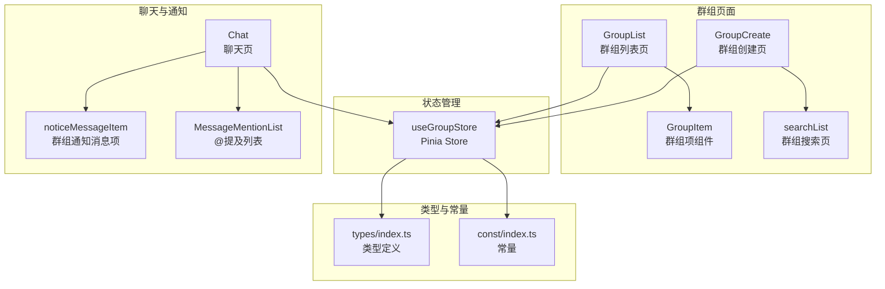
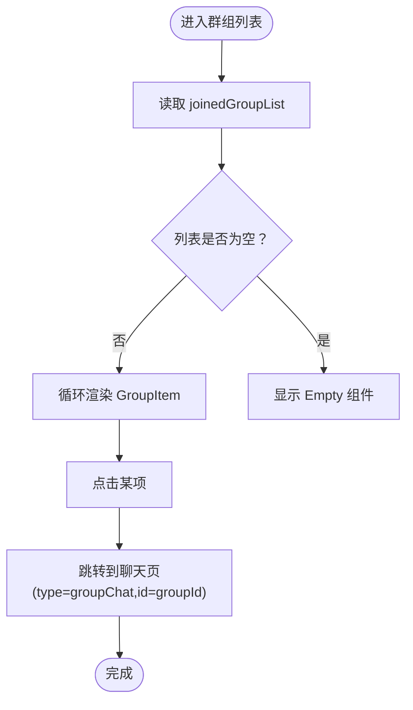
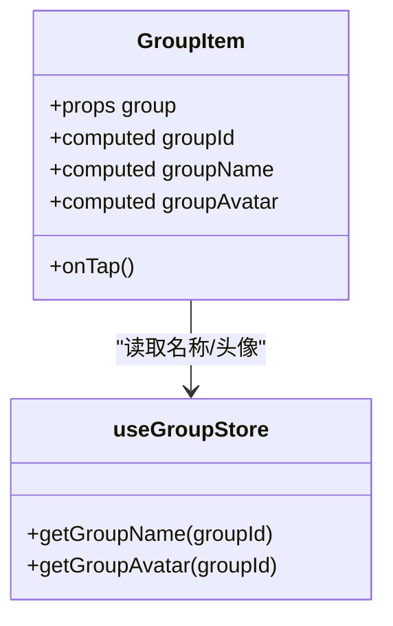
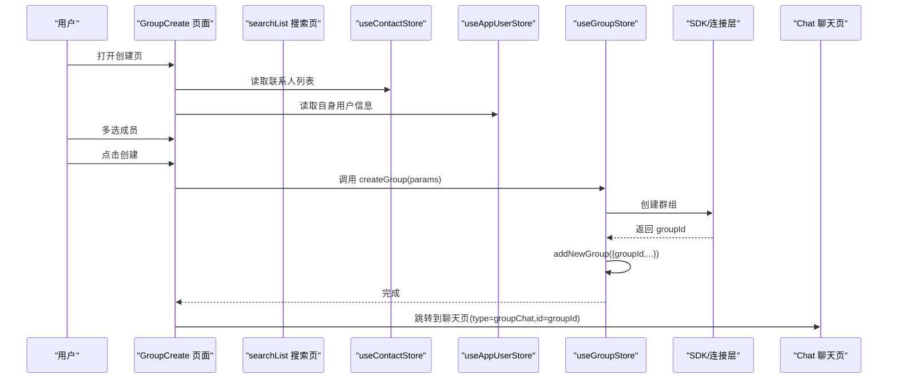
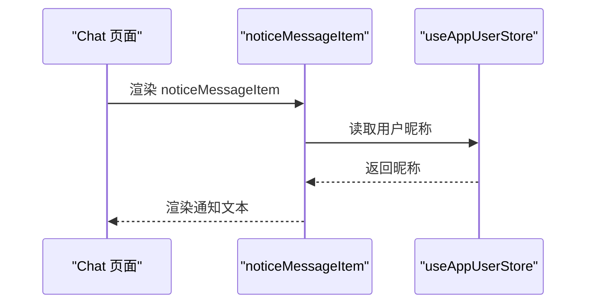
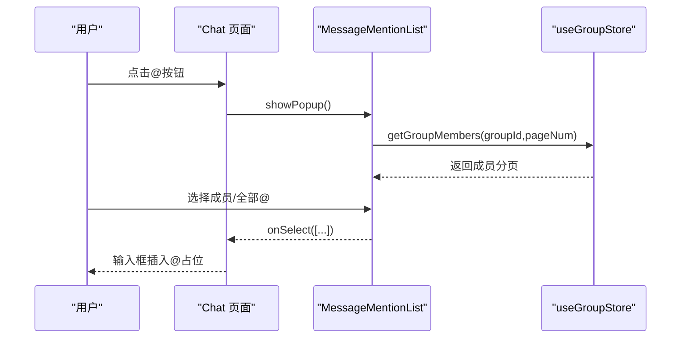
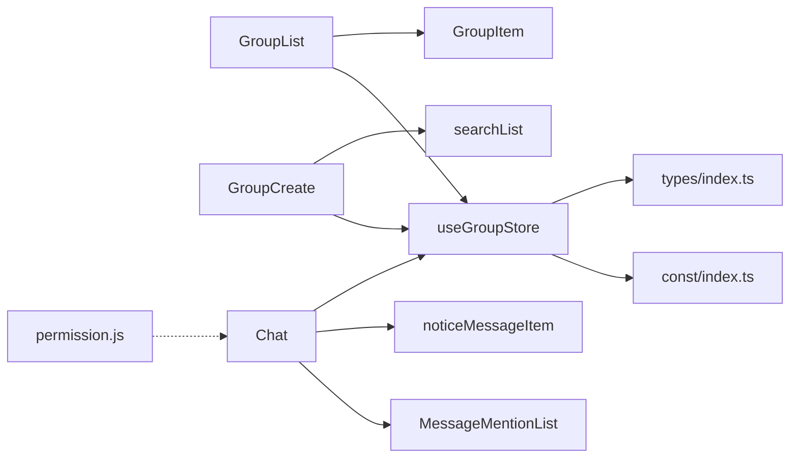

# 群组模块

<cite>
**本文引用的文件**
- [ChatUIKit/modules/GroupList/index.vue](file://ChatUIKit/modules/GroupList/index.vue)
- [ChatUIKit/modules/GroupList/components/GroupItem/index.vue](file://ChatUIKit/modules/GroupList/components/GroupItem/index.vue)
- [ChatUIKit/modules/GroupCreate/index.vue](file://ChatUIKit/modules/GroupCreate/index.vue)
- [ChatUIKit/modules/GroupCreate/searchList.vue](file://ChatUIKit/modules/GroupCreate/searchList.vue)
- [ChatUIKit/stores/group.ts](file://ChatUIKit/stores/group.ts)
- [ChatUIKit/modules/Chat/index.vue](file://ChatUIKit/modules/Chat/index.vue)
- [ChatUIKit/modules/Chat/components/Message/noticeMessageItem.vue](file://ChatUIKit/modules/Chat/components/Message/noticeMessageItem.vue)
- [ChatUIKit/modules/Chat/components/MessageMentionList/index.vue](file://ChatUIKit/modules/Chat/components/MessageMentionList/index.vue)
- [ChatUIKit/types/index.ts](file://ChatUIKit/types/index.ts)
- [ChatUIKit/const/index.ts](file://ChatUIKit/const/index.ts)
- [ChatUIKit/utils/permission.js](file://ChatUIKit/utils/permission.js)
</cite>

## 更新摘要
**所做更改**
- 新增GroupCreate模块的完整实现文档，包括联系人选择、群组创建流程和状态管理
- 更新群组创建功能的详细实现分析，涵盖双向绑定、参数构建和异步处理
- 补充群组搜索页的实现细节，包括实时搜索和多选处理
- 完善群组Store的状态管理文档，新增addNewGroup等关键方法
- 增强@提及功能的实现说明，包括分页加载和成员过滤

## 目录
1. [简介](#简介)
2. [项目结构](#项目结构)
3. [核心组件](#核心组件)
4. [架构总览](#架构总览)
5. [详细组件分析](#详细组件分析)
6. [依赖关系分析](#依赖关系分析)
7. [性能考虑](#性能考虑)
8. [故障排查指南](#故障排查指南)
9. [结论](#结论)
10. [附录](#附录)

## 简介
本文件系统性梳理群组模块的设计与实现，覆盖群组列表、群组项、群组创建、群组成员管理、权限控制、群组通知与消息处理、@提及、群组搜索与分页、状态管理与性能优化、安全与隐私等主题。目标是帮助开发者快速理解并高效扩展群组相关能力。

**更新** 新增GroupCreate模块的完整实现，包括联系人选择界面、搜索功能和群组创建流程。

## 项目结构
群组模块由"页面组件 + 组合式 Store + 类型与常量 + 聊天与通知组件"构成，采用按功能域划分的目录组织方式，便于维护与扩展。



**图表来源**
- [ChatUIKit/modules/GroupList/index.vue](file://ChatUIKit/modules/GroupList/index.vue#L1-L66)
- [ChatUIKit/modules/GroupList/components/GroupItem/index.vue](file://ChatUIKit/modules/GroupList/components/GroupItem/index.vue#L1-L67)
- [ChatUIKit/modules/GroupCreate/index.vue](file://ChatUIKit/modules/GroupCreate/index.vue#L1-L221)
- [ChatUIKit/modules/GroupCreate/searchList.vue](file://ChatUIKit/modules/GroupCreate/searchList.vue#L1-L126)
- [ChatUIKit/stores/group.ts](file://ChatUIKit/stores/group.ts#L1-L317)
- [ChatUIKit/modules/Chat/index.vue](file://ChatUIKit/modules/Chat/index.vue#L1-L255)
- [ChatUIKit/modules/Chat/components/Message/noticeMessageItem.vue](file://ChatUIKit/modules/Chat/components/Message/noticeMessageItem.vue#L1-L56)
- [ChatUIKit/modules/Chat/components/MessageMentionList/index.vue](file://ChatUIKit/modules/Chat/components/MessageMentionList/index.vue#L42-L157)
- [ChatUIKit/types/index.ts](file://ChatUIKit/types/index.ts#L1-L100)
- [ChatUIKit/const/index.ts](file://ChatUIKit/const/index.ts#L1-L37)

**章节来源**
- [ChatUIKit/modules/GroupList/index.vue](file://ChatUIKit/modules/GroupList/index.vue#L1-L66)
- [ChatUIKit/modules/GroupCreate/index.vue](file://ChatUIKit/modules/GroupCreate/index.vue#L1-L221)
- [ChatUIKit/stores/group.ts](file://ChatUIKit/stores/group.ts#L1-L317)

## 核心组件
- 群组列表页：负责渲染已加入群组列表，点击进入聊天页。
- 群组项组件：展示群组头像与名称，兼容多种字段命名。
- 群组创建页：提供联系人选择、搜索、批量创建群组，并跳转至聊天页。
- 群组搜索页：基于输入关键字筛选联系人，支持多选。
- 群组 Store：统一管理群组列表、详情、通知、分页与成员列表加载。
- 聊天页：承载消息列表、@提及、群组通知消息项等。
- 类型与常量：定义群组事件、通知、@提及类型、分页大小等。

**更新** 新增GroupCreate模块的完整实现，包括联系人选择界面、搜索功能和群组创建流程。

**章节来源**
- [ChatUIKit/modules/GroupList/components/GroupItem/index.vue](file://ChatUIKit/modules/GroupList/components/GroupItem/index.vue#L1-L67)
- [ChatUIKit/modules/GroupCreate/index.vue](file://ChatUIKit/modules/GroupCreate/index.vue#L1-L221)
- [ChatUIKit/modules/GroupCreate/searchList.vue](file://ChatUIKit/modules/GroupCreate/searchList.vue#L1-L126)
- [ChatUIKit/stores/group.ts](file://ChatUIKit/stores/group.ts#L1-L317)
- [ChatUIKit/modules/Chat/index.vue](file://ChatUIKit/modules/Chat/index.vue#L1-L255)
- [ChatUIKit/types/index.ts](file://ChatUIKit/types/index.ts#L1-L100)
- [ChatUIKit/const/index.ts](file://ChatUIKit/const/index.ts#L1-L37)

## 架构总览
群组模块遵循"页面组件 + 组合式 Store"的分层设计，页面通过 Store 获取/变更状态；Store 再通过连接层访问 SDK 完成远端操作；聊天页集成通知与@提及能力，形成完整的群组交互闭环。


**图表来源**
- [ChatUIKit/modules/GroupList/index.vue](file://ChatUIKit/modules/GroupList/index.vue#L21-L47)
- [ChatUIKit/modules/GroupList/components/GroupItem/index.vue](file://ChatUIKit/modules/GroupList/components/GroupItem/index.vue#L48-L50)
- [ChatUIKit/stores/group.ts](file://ChatUIKit/stores/group.ts#L38-L47)
- [ChatUIKit/modules/Chat/index.vue](file://ChatUIKit/modules/Chat/index.vue#L229-L238)

## 详细组件分析

### 群组列表组件
- 数据来源：通过计算属性读取 Store 的已加入群组列表。
- 交互行为：点击项后跳转到聊天页，携带群组 ID。
- 空态处理：当列表为空时显示空状态组件。



**图表来源**
- [ChatUIKit/modules/GroupList/index.vue](file://ChatUIKit/modules/GroupList/index.vue#L21-L47)

**章节来源**
- [ChatUIKit/modules/GroupList/index.vue](file://ChatUIKit/modules/GroupList/index.vue#L1-L66)

### 群组项组件
- 字段兼容：优先使用传入对象的名称/头像字段，否则回退到 Store 查询。
- 交互：向外发出点击事件，供父级路由跳转。



**图表来源**
- [ChatUIKit/modules/GroupList/components/GroupItem/index.vue](file://ChatUIKit/modules/GroupList/components/GroupItem/index.vue#L8-L50)
- [ChatUIKit/stores/group.ts](file://ChatUIKit/stores/group.ts#L64-L95)

**章节来源**
- [ChatUIKit/modules/GroupList/components/GroupItem/index.vue](file://ChatUIKit/modules/GroupList/components/GroupItem/index.vue#L1-L67)
- [ChatUIKit/stores/group.ts](file://ChatUIKit/stores/group.ts#L64-L95)

### 群组创建功能
- 联系人选择：从联系人列表中选择多人，支持索引列表与搜索两种入口。
- 创建参数：自动生成群组名、描述，设置公开、允许邀请、无需审批、最大人数等策略。
- 创建流程：调用 Store 的创建接口，成功后添加到本地列表并跳转聊天页。

**更新** 完整实现GroupCreate模块，包括联系人选择、搜索和创建流程。



**图表来源**
- [ChatUIKit/modules/GroupCreate/index.vue](file://ChatUIKit/modules/GroupCreate/index.vue#L59-L133)
- [ChatUIKit/modules/GroupCreate/searchList.vue](file://ChatUIKit/modules/GroupCreate/searchList.vue#L74-L87)
- [ChatUIKit/stores/group.ts](file://ChatUIKit/stores/group.ts#L172-L184)
- [ChatUIKit/modules/Chat/index.vue](file://ChatUIKit/modules/Chat/index.vue#L229-L238)

**章节来源**
- [ChatUIKit/modules/GroupCreate/index.vue](file://ChatUIKit/modules/GroupCreate/index.vue#L1-L221)
- [ChatUIKit/modules/GroupCreate/searchList.vue](file://ChatUIKit/modules/GroupCreate/searchList.vue#L1-L126)
- [ChatUIKit/stores/group.ts](file://ChatUIKit/stores/group.ts#L172-L184)

### 群组数据模型与状态管理
- 状态结构：包含已加入群组列表、群组详情映射、群组通知、分页参数。
- 计算属性：提供群组列表、数量、名称/头像获取、是否存在头像等。
- 动作方法：获取群组列表、批量拉取详情、创建/解散/退出群组、添加新群组、申请加入、添加群组通知、设置头像、清空数据。

**更新** 新增addNewGroup方法，用于添加新创建的群组到列表并获取详情。

```mermaid
classDiagram
class GroupState {
+groupList : GroupItem[]
+groupInfoMap : Record~string, GroupDetailInfo~
+groupNoticeInfo : GroupNoticeInfo
+pageParams : {pageNum,pageSize,cursor}
}
class useGroupStore {
+getters : getGroupList,joinedGroupList,isHasGroupAvatar,getGroupCount,getGroupInfoFromStore,getGroupAvatar,getGroupName
+actions : getJoinedGroupList,fetchGroupDetails,createGroup,destroyGroup,leaveGroup,removeGroupFromList,addNewGroup,joinGroup,addGroupNotice,setGroupAvatar,clear
}
GroupState <.. useGroupStore : "管理"
```

**图表来源**
- [ChatUIKit/stores/group.ts](file://ChatUIKit/stores/group.ts#L16-L96)
- [ChatUIKit/stores/group.ts](file://ChatUIKit/stores/group.ts#L98-L314)

**章节来源**
- [ChatUIKit/stores/group.ts](file://ChatUIKit/stores/group.ts#L1-L317)

### 成员管理与权限控制
- 成员列表分页：聊天页的@提及列表按固定页大小分页加载群成员。
- 权限说明：SDK 文档中明确了群主/管理员权限（如移除管理员、删除会话线程等），在 UI 层通过 Store 与聊天页协作实现。

**更新** @提及列表支持"全部@"占位符，成员过滤排除当前用户。

**章节来源**
- [ChatUIKit/modules/Chat/components/MessageMentionList/index.vue](file://ChatUIKit/modules/Chat/components/MessageMentionList/index.vue#L67-L92)
- [ChatUIKit/const/index.ts](file://ChatUIKit/const/index.ts#L1-L37)

### 群组通知与消息处理
- 群组通知消息项：渲染"撤回"和"群组"类通知消息文本。
- 聊天页集成：聊天页承载消息列表、@提及弹窗、用户卡片等，统一处理群组事件与通知。



**图表来源**
- [ChatUIKit/modules/Chat/components/Message/noticeMessageItem.vue](file://ChatUIKit/modules/Chat/components/Message/noticeMessageItem.vue#L26-L42)
- [ChatUIKit/modules/Chat/index.vue](file://ChatUIKit/modules/Chat/index.vue#L74-L95)

**章节来源**
- [ChatUIKit/modules/Chat/components/Message/noticeMessageItem.vue](file://ChatUIKit/modules/Chat/components/Message/noticeMessageItem.vue#L1-L56)
- [ChatUIKit/modules/Chat/index.vue](file://ChatUIKit/modules/Chat/index.vue#L1-L255)

### @提及功能
- @提及列表：在聊天页触发时弹出，按页加载群成员，支持"全部@"占位。
- 选择回调：将选中的用户 ID 注入输入框并插入占位文本。

**更新** @提及列表支持分页加载，每页100个成员，自动过滤当前用户。



**图表来源**
- [ChatUIKit/modules/Chat/index.vue](file://ChatUIKit/modules/Chat/index.vue#L160-L183)
- [ChatUIKit/modules/Chat/components/MessageMentionList/index.vue](file://ChatUIKit/modules/Chat/components/MessageMentionList/index.vue#L94-L111)
- [ChatUIKit/stores/group.ts](file://ChatUIKit/stores/group.ts#L1-L317)

**章节来源**
- [ChatUIKit/modules/Chat/components/MessageMentionList/index.vue](file://ChatUIKit/modules/Chat/components/MessageMentionList/index.vue#L42-L157)
- [ChatUIKit/const/index.ts](file://ChatUIKit/const/index.ts#L1-L37)

### 群组搜索与群组信息更新
- 搜索：创建页提供搜索入口，输入关键字后过滤联系人列表。
- 信息更新：Store 提供设置头像、清空数据等动作，用于动态更新群组信息。

**更新** 搜索功能支持实时过滤，基于用户昵称匹配。

**章节来源**
- [ChatUIKit/modules/GroupCreate/searchList.vue](file://ChatUIKit/modules/GroupCreate/searchList.vue#L74-L87)
- [ChatUIKit/stores/group.ts](file://ChatUIKit/stores/group.ts#L299-L314)

### 群组状态管理与生命周期
- Store 生命周期：页面挂载时读取/设置当前会话，卸载时清理引用。
- 群组状态：Store 维护列表、详情、通知与分页参数，避免重复请求与缓存不一致。

**更新** 新增addNewGroup方法，用于处理新创建群组的本地状态同步。

**章节来源**
- [ChatUIKit/modules/Chat/index.vue](file://ChatUIKit/modules/Chat/index.vue#L211-L245)
- [ChatUIKit/stores/group.ts](file://ChatUIKit/stores/group.ts#L28-L36)

## 依赖关系分析
- 页面组件依赖 Store：GroupList、GroupItem、GroupCreate、searchList、Chat、noticeMessageItem、MessageMentionList。
- Store 依赖类型与常量：types/index.ts、const/index.ts。
- 权限工具：permission.js 提供平台权限判断与设置入口（与群组无直接耦合，但可配合通知/媒体权限）。



**图表来源**
- [ChatUIKit/modules/GroupList/index.vue](file://ChatUIKit/modules/GroupList/index.vue#L21-L33)
- [ChatUIKit/modules/GroupCreate/index.vue](file://ChatUIKit/modules/GroupCreate/index.vue#L56-L73)
- [ChatUIKit/stores/group.ts](file://ChatUIKit/stores/group.ts#L10-L14)
- [ChatUIKit/modules/Chat/index.vue](file://ChatUIKit/modules/Chat/index.vue#L74-L95)
- [ChatUIKit/utils/permission.js](file://ChatUIKit/utils/permission.js#L1-L272)

**章节来源**
- [ChatUIKit/stores/group.ts](file://ChatUIKit/stores/group.ts#L1-L317)
- [ChatUIKit/types/index.ts](file://ChatUIKit/types/index.ts#L1-L100)
- [ChatUIKit/const/index.ts](file://ChatUIKit/const/index.ts#L1-L37)
- [ChatUIKit/utils/permission.js](file://ChatUIKit/utils/permission.js#L1-L272)

## 性能考虑
- 列表渲染与滚动
  - 群组列表与联系人列表均采用纵向滚动容器，避免全量渲染。
  - 群组项组件仅在点击时触发跳转，减少不必要的重渲染。
- 数据缓存与去重
  - Store 使用对象映射缓存群组详情，避免重复请求。
  - 新建群组后先去重再添加，防止重复渲染。
- 分页加载
  - 群组详情分批加载（每批 20 个），降低单次请求压力。
  - @提及列表按固定页大小分页加载，避免一次性拉取过多成员。
- 网络与日志
  - Store 统一记录日志，便于定位性能瓶颈与异常。
- 内存管理
  - 页面卸载时清理输入框焦点、引用与会话状态，避免内存泄漏。
  - 群组通知与消息项采用轻量组件，尽量复用与懒加载。

**更新** 群组创建流程增加loading状态管理，避免重复提交。

**章节来源**
- [ChatUIKit/stores/group.ts](file://ChatUIKit/stores/group.ts#L146-L166)
- [ChatUIKit/modules/Chat/components/MessageMentionList/index.vue](file://ChatUIKit/modules/Chat/components/MessageMentionList/index.vue#L67-L92)
- [ChatUIKit/modules/Chat/index.vue](file://ChatUIKit/modules/Chat/index.vue#L211-L245)

## 故障排查指南
- 群组头像/名称为空
  - 检查 Store 的名称/头像获取逻辑是否命中缓存，必要时触发详情拉取。
- 创建群组失败
  - 核对创建参数（名称、成员、公开策略等），查看 Store 的创建动作日志。
- @提及列表不显示
  - 确认当前会话是否为群组，检查分页加载与网络状态。
- 通知消息不显示
  - 检查通知消息项的 noticeType 与 ext 字段是否正确传递。
- 权限相关问题
  - 平台权限可通过 permission.js 模块进行判断与引导，确保推送/录音等权限开启。

**更新** 新增群组创建失败的排查指导，包括参数验证和日志分析。

**章节来源**
- [ChatUIKit/stores/group.ts](file://ChatUIKit/stores/group.ts#L64-L95)
- [ChatUIKit/stores/group.ts](file://ChatUIKit/stores/group.ts#L172-L184)
- [ChatUIKit/modules/Chat/components/MessageMentionList/index.vue](file://ChatUIKit/modules/Chat/components/MessageMentionList/index.vue#L67-L92)
- [ChatUIKit/modules/Chat/components/Message/noticeMessageItem.vue](file://ChatUIKit/modules/Chat/components/Message/noticeMessageItem.vue#L26-L42)
- [ChatUIKit/utils/permission.js](file://ChatUIKit/utils/permission.js#L1-L272)

## 结论
群组模块以清晰的页面-组件-Store 分层架构实现了从列表、创建、成员管理到通知与@提及的完整链路。通过缓存、分页与去重等策略，兼顾了可用性与性能。建议在后续迭代中进一步完善权限校验与安全策略，增强大规模群组场景下的稳定性与可观测性。

**更新** GroupCreate模块的完整实现为用户提供了直观的群组创建体验，结合搜索功能提升了用户体验。Store的增强功能确保了状态管理和性能优化的持续改进。

## 附录
- 类型与常量
  - 群组通知类型、@提及类型、分页大小、默认头像 URL 等。
- 接口规范（Store 动作）
  - 获取群组列表、获取详情、创建/解散/退出群组、添加新群组、申请加入、添加群组通知、设置头像、清空数据。

**更新** 新增addNewGroup方法的接口规范，用于处理新创建群组的状态同步。

**章节来源**
- [ChatUIKit/types/index.ts](file://ChatUIKit/types/index.ts#L19-L31)
- [ChatUIKit/types/index.ts](file://ChatUIKit/types/index.ts#L54-L61)
- [ChatUIKit/const/index.ts](file://ChatUIKit/const/index.ts#L1-L37)
- [ChatUIKit/stores/group.ts](file://ChatUIKit/stores/group.ts#L98-L314)