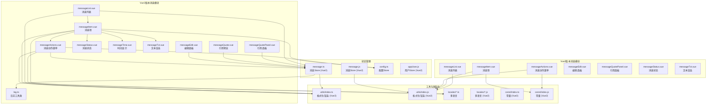
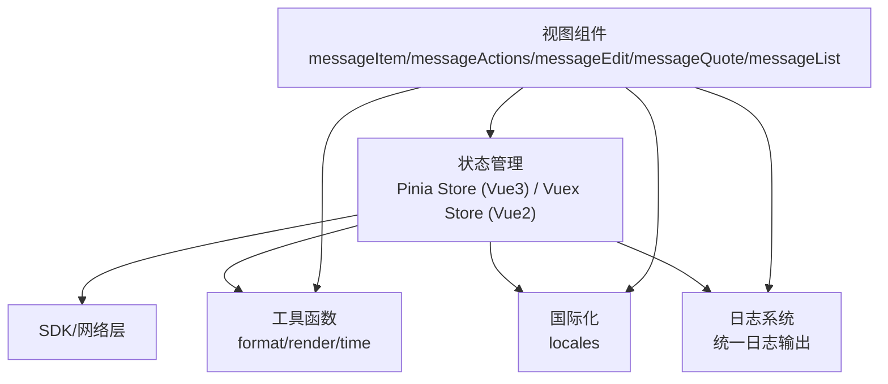
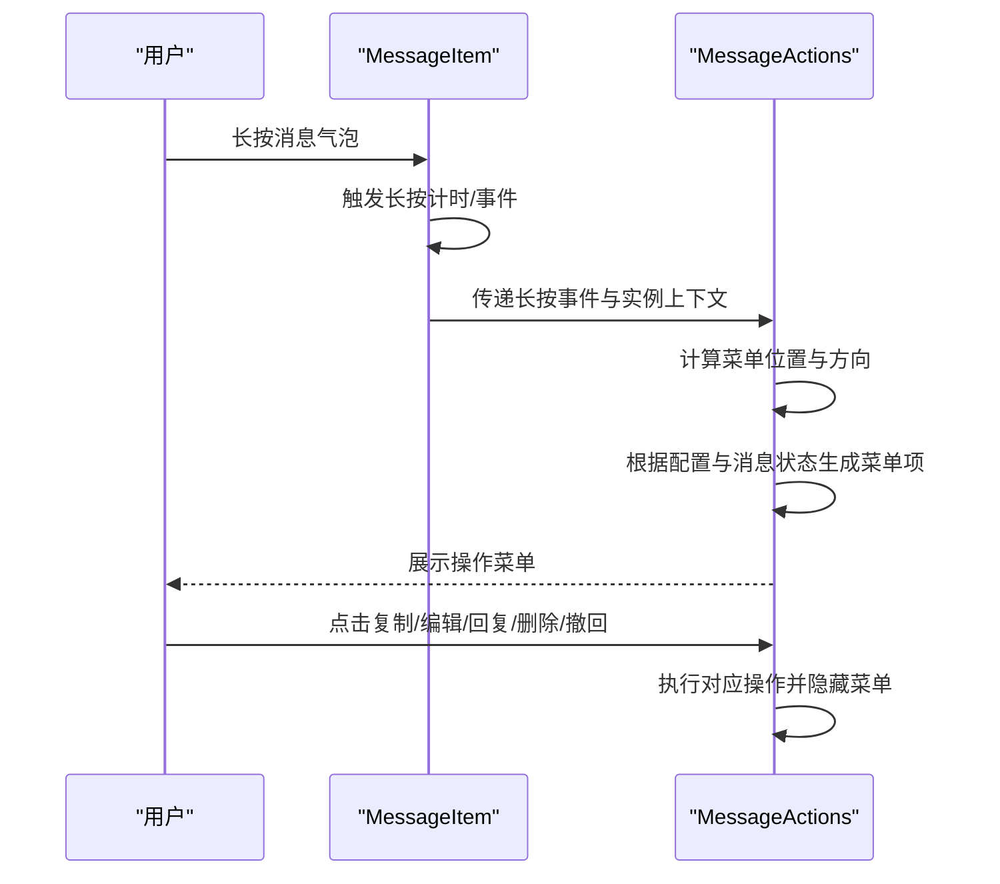
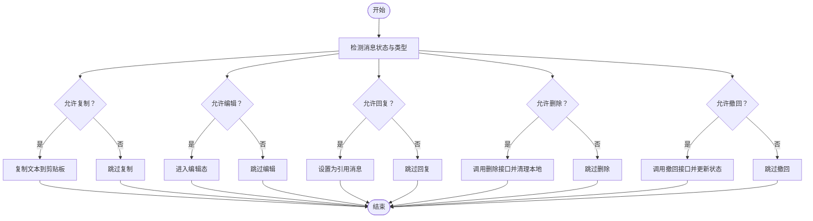
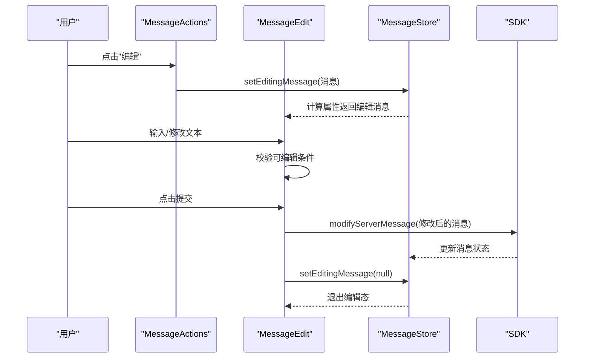
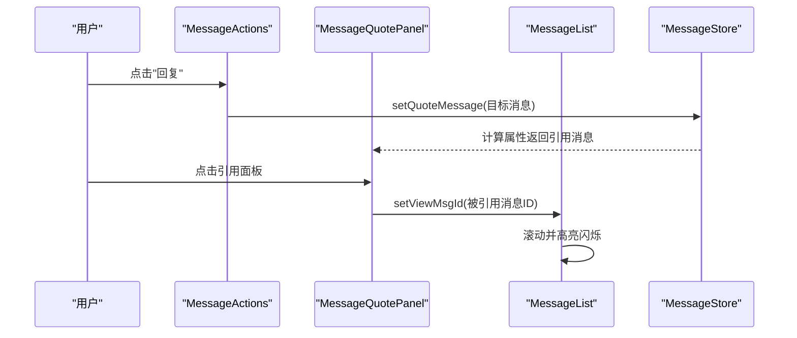
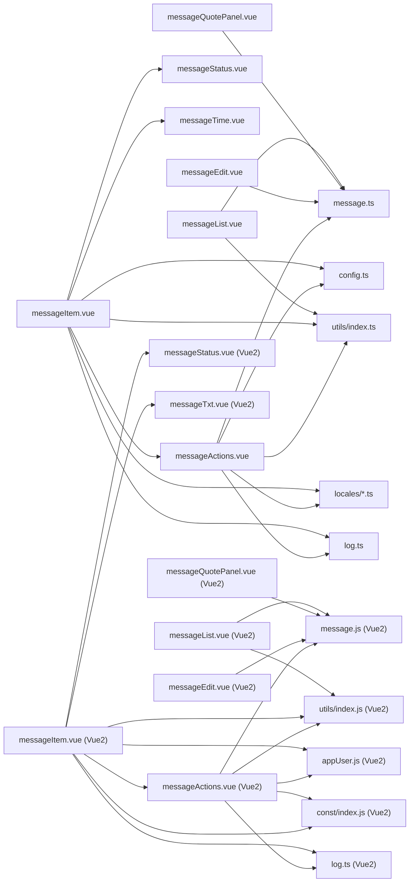

# 消息交互组件

<cite>
**本文档引用的文件**
- [messageItem.vue](file://ChatUIKit/modules/Chat/components/Message/messageItem.vue)
- [messageActions.vue](file://ChatUIKit/modules/Chat/components/Message/messageActions.vue)
- [messageEdit.vue](file://ChatUIKit/modules/Chat/components/Message/messageEdit.vue)
- [messageQuote.vue](file://ChatUIKit/modules/Chat/components/Message/messageQuote.vue)
- [messageQuotePanel.vue](file://ChatUIKit/modules/Chat/components/Message/messageQuotePanel.vue)
- [messageStatus.vue](file://ChatUIKit/modules/Chat/components/Message/messageStatus.vue)
- [messageTime.vue](file://ChatUIKit/modules/Chat/components/Message/messageTime.vue)
- [messageTxt.vue](file://ChatUIKit/modules/Chat/components/Message/messageTxt.vue)
- [messageList.vue](file://ChatUIKit/modules/Chat/components/Message/messageList.vue)
- [message.ts](file://ChatUIKit/stores/message.ts)
- [log.ts](file://ChatUIKit/log.ts)
- [config.ts](file://ChatUIKit/stores/config.ts)
- [index.ts](file://ChatUIKit/utils/index.ts)
- [permission.js](file://ChatUIKit/utils/permission.js)
- [en.ts](file://ChatUIKit/locales/en.ts)
- [zh-Hans.ts](file://ChatUIKit/locales/zh-Hans.ts)
- [messageItem.vue](file://ChatUIKit-vue2/modules/Chat/components/Message/messageItem.vue)
- [messageActions.vue](file://ChatUIKit-vue2/modules/Chat/components/Message/messageActions.vue)
- [messageEdit.vue](file://ChatUIKit-vue2/modules/Chat/components/Message/messageEdit.vue)
- [messageQuote.vue](file://ChatUIKit-vue2/modules/Chat/components/Message/messageQuote.vue)
- [messageQuotePanel.vue](file://ChatUIKit-vue2/modules/Chat/components/Message/messageQuotePanel.vue)
- [messageStatus.vue](file://ChatUIKit-vue2/modules/Chat/components/Message/messageStatus.vue)
- [messageTxt.vue](file://ChatUIKit-vue2/modules/Chat/components/Message/messageTxt.vue)
- [messageList.vue](file://ChatUIKit-vue2/modules/Chat/components/Message/messageList.vue)
- [message.js](file://ChatUIKit-vue2/stores/message.js)
- [appUser.js](file://ChatUIKit-vue2/stores/appUser.js)
- [index.js](file://ChatUIKit-vue2/utils/index.js)
- [index.js](file://ChatUIKit-vue2/const/index.js)
</cite>

## 更新摘要
**变更内容**
- 新增详细的控制台日志输出系统，增强调试能力
- 改进消息撤回权限检查逻辑，增加时间差计算和状态验证的日志记录
- 新增统一的日志工具类，支持调试模式控制
- 增强消息操作过程中的日志记录，便于问题排查

## 目录
1. [简介](#简介)
2. [项目结构](#项目结构)
3. [核心组件](#核心组件)
4. [架构总览](#架构总览)
5. [详细组件分析](#详细组件分析)
6. [调试增强功能](#调试增强功能)
7. [Vue2版本特性](#vue2版本特性)
8. [依赖关系分析](#依赖关系分析)
9. [性能考量](#性能考量)
10. [故障排查指南](#故障排查指南)
11. [结论](#结论)
12. [附录](#附录)

## 简介
本文件面向消息交互组件，系统性阐述消息的复制、转发、收藏、删除、撤回、编辑、引用回复等功能实现与交互流程；解释消息编辑状态管理与事件回调机制；说明消息状态显示组件的使用与自定义；解析消息时间显示格式化与本地化支持；并给出权限控制、安全验证与用户体验优化建议。

**更新** 新增调试增强功能，包括详细的控制台日志输出、改进的消息撤回权限检查逻辑、统一的日志工具类以及增强的状态验证日志记录。

## 项目结构
消息交互组件位于 ChatUIKit 的 Chat 模块下，采用按功能域划分的目录组织方式，消息相关能力由消息列表、消息项、动作菜单、编辑面板、引用面板、状态与时间显示等子组件协同完成，并通过 Pinia Store 或 Vuex 进行状态管理。

**图表来源**
- [messageList.vue](file://ChatUIKit/modules/Chat/components/Message/messageList.vue#L1-L284)
- [messageItem.vue](file://ChatUIKit/modules/Chat/components/Message/messageItem.vue#L1-L264)
- [messageActions.vue](file://ChatUIKit/modules/Chat/components/Message/messageActions.vue#L1-L335)
- [messageEdit.vue](file://ChatUIKit/modules/Chat/components/Message/messageEdit.vue#L1-L147)
- [messageQuote.vue](file://ChatUIKit/modules/Chat/components/Message/messageQuote.vue#L1-L169)
- [messageQuotePanel.vue](file://ChatUIKit/modules/Chat/components/Message/messageQuotePanel.vue#L1-L55)
- [messageStatus.vue](file://ChatUIKit/modules/Chat/components/Message/messageStatus.vue#L1-L95)
- [messageTime.vue](file://ChatUIKit/modules/Chat/components/Message/messageTime.vue#L1-L64)
- [messageTxt.vue](file://ChatUIKit/modules/Chat/components/Message/messageTxt.vue#L1-L74)
- [message.ts](file://ChatUIKit/stores/message.ts#L1-L581)
- [log.ts](file://ChatUIKit/log.ts#L1-L77)
- [config.ts](file://ChatUIKit/stores/config.ts#L1-L124)
- [index.ts](file://ChatUIKit/utils/index.ts#L1-L344)
- [messageList.vue](file://ChatUIKit-vue2/modules/Chat/components/Message/messageList.vue#L1-L290)
- [messageItem.vue](file://ChatUIKit-vue2/modules/Chat/components/Message/messageItem.vue#L1-L301)
- [messageActions.vue](file://ChatUIKit-vue2/modules/Chat/components/Message/messageActions.vue#L1-L339)
- [messageEdit.vue](file://ChatUIKit-vue2/modules/Chat/components/Message/messageEdit.vue#L1-L160)
- [messageQuote.vue](file://ChatUIKit-vue2/modules/Chat/components/Message/messageQuote.vue#L1-L74)
- [messageQuotePanel.vue](file://ChatUIKit-vue2/modules/Chat/components/Message/messageQuotePanel.vue#L1-L101)
- [messageStatus.vue](file://ChatUIKit-vue2/modules/Chat/components/Message/messageStatus.vue#L1-L73)
- [messageTxt.vue](file://ChatUIKit-vue2/modules/Chat/components/Message/messageTxt.vue#L1-L81)
- [message.js](file://ChatUIKit-vue2/stores/message.js#L1-L604)
- [appUser.js](file://ChatUIKit-vue2/stores/appUser.js#L1-L54)
- [index.js](file://ChatUIKit-vue2/utils/index.js#L1-L412)
- [index.js](file://ChatUIKit-vue2/const/index.js#L1-L33)

**章节来源**
- [messageList.vue](file://ChatUIKit/modules/Chat/components/Message/messageList.vue#L1-L284)
- [messageItem.vue](file://ChatUIKit/modules/Chat/components/Message/messageItem.vue#L1-L264)
- [messageActions.vue](file://ChatUIKit/modules/Chat/components/Message/messageActions.vue#L1-L335)
- [messageEdit.vue](file://ChatUIKit/modules/Chat/components/Message/messageEdit.vue#L1-L147)
- [messageQuote.vue](file://ChatUIKit/modules/Chat/components/Message/messageQuote.vue#L1-L169)
- [messageQuotePanel.vue](file://ChatUIKit/modules/Chat/components/Message/messageQuotePanel.vue#L1-L55)
- [messageStatus.vue](file://ChatUIKit/modules/Chat/components/Message/messageStatus.vue#L1-L95)
- [messageTime.vue](file://ChatUIKit/modules/Chat/components/Message/messageTime.vue#L1-L64)
- [messageTxt.vue](file://ChatUIKit/modules/Chat/components/Message/messageTxt.vue#L1-L74)
- [message.ts](file://ChatUIKit/stores/message.ts#L1-L581)
- [log.ts](file://ChatUIKit/log.ts#L1-L77)
- [config.ts](file://ChatUIKit/stores/config.ts#L1-L124)
- [index.ts](file://ChatUIKit/utils/index.ts#L1-L344)
- [messageList.vue](file://ChatUIKit-vue2/modules/Chat/components/Message/messageList.vue#L1-L290)
- [messageItem.vue](file://ChatUIKit-vue2/modules/Chat/components/Message/messageItem.vue#L1-L301)
- [messageActions.vue](file://ChatUIKit-vue2/modules/Chat/components/Message/messageActions.vue#L1-L339)
- [messageEdit.vue](file://ChatUIKit-vue2/modules/Chat/components/Message/messageEdit.vue#L1-L160)
- [messageQuote.vue](file://ChatUIKit-vue2/modules/Chat/components/Message/messageQuote.vue#L1-L74)
- [messageQuotePanel.vue](file://ChatUIKit-vue2/modules/Chat/components/Message/messageQuotePanel.vue#L1-L101)
- [messageStatus.vue](file://ChatUIKit-vue2/modules/Chat/components/Message/messageStatus.vue#L1-L73)
- [messageTxt.vue](file://ChatUIKit-vue2/modules/Chat/components/Message/messageTxt.vue#L1-L81)
- [message.js](file://ChatUIKit-vue2/stores/message.js#L1-L604)
- [appUser.js](file://ChatUIKit-vue2/stores/appUser.js#L1-L54)
- [index.js](file://ChatUIKit-vue2/utils/index.js#L1-L412)
- [index.js](file://ChatUIKit-vue2/const/index.js#L1-L33)

## 核心组件
- 消息列表：负责分页加载、滚动锚定、闪烁高亮与消息渲染。
- 消息项：承载消息气泡、头像、昵称、状态、时间、引用、长按菜单触发等。
- 动作菜单：根据消息类型与状态动态生成复制、编辑、回复、删除、撤回等操作项。
- 编辑面板：提供文本编辑、校验、提交与取消编辑。
- 引用面板：展示引用消息摘要与缩略图，支持跳转至被引用消息。
- 状态显示：根据消息状态显示发送中、已送达、已读、失败等图标。
- 时间显示：智能格式化时间字符串，支持本地化与时间间隔提示。
- 文本渲染：将富文本与表情符号渲染为可读内容。
- 日志工具：统一的日志输出系统，支持调试模式控制。

**更新** 新增统一的日志工具类，提供标准化的日志输出格式，支持调试模式控制，增强组件的调试能力。

**章节来源**
- [messageList.vue](file://ChatUIKit/modules/Chat/components/Message/messageList.vue#L1-L284)
- [messageItem.vue](file://ChatUIKit/modules/Chat/components/Message/messageItem.vue#L1-L264)
- [messageActions.vue](file://ChatUIKit/modules/Chat/components/Message/messageActions.vue#L1-L335)
- [messageEdit.vue](file://ChatUIKit/modules/Chat/components/Message/messageEdit.vue#L1-L147)
- [messageQuote.vue](file://ChatUIKit/modules/Chat/components/Message/messageQuote.vue#L1-L169)
- [messageQuotePanel.vue](file://ChatUIKit/modules/Chat/components/Message/messageQuotePanel.vue#L1-L55)
- [messageStatus.vue](file://ChatUIKit/modules/Chat/components/Message/messageStatus.vue#L1-L95)
- [messageTime.vue](file://ChatUIKit/modules/Chat/components/Message/messageTime.vue#L1-L64)
- [messageTxt.vue](file://ChatUIKit/modules/Chat/components/Message/messageTxt.vue#L1-L74)
- [log.ts](file://ChatUIKit/log.ts#L1-L77)
- [messageList.vue](file://ChatUIKit-vue2/modules/Chat/components/Message/messageList.vue#L1-L290)
- [messageItem.vue](file://ChatUIKit-vue2/modules/Chat/components/Message/messageItem.vue#L1-L301)
- [messageActions.vue](file://ChatUIKit-vue2/modules/Chat/components/Message/messageActions.vue#L1-L339)
- [messageEdit.vue](file://ChatUIKit-vue2/modules/Chat/components/Message/messageEdit.vue#L1-L160)
- [messageQuote.vue](file://ChatUIKit-vue2/modules/Chat/components/Message/messageQuote.vue#L1-L74)
- [messageQuotePanel.vue](file://ChatUIKit-vue2/modules/Chat/components/Message/messageQuotePanel.vue#L1-L101)
- [messageStatus.vue](file://ChatUIKit-vue2/modules/Chat/components/Message/messageStatus.vue#L1-L73)
- [messageTxt.vue](file://ChatUIKit-vue2/modules/Chat/components/Message/messageTxt.vue#L1-L81)

## 架构总览
消息交互采用"视图组件 + Store 状态 + 工具函数 + 国际化 + 日志系统"的分层设计。视图组件负责交互与展示，Store 统一管理消息与会话状态，工具函数提供格式化与渲染，国际化提供文案与本地化支持，日志系统提供统一的调试输出。

**更新** 新增日志系统，提供统一的日志输出格式，支持调试模式控制，增强组件的调试能力和问题排查效率。

**图表来源**
- [messageItem.vue](file://ChatUIKit/modules/Chat/components/Message/messageItem.vue#L74-L181)
- [messageActions.vue](file://ChatUIKit/modules/Chat/components/Message/messageActions.vue#L30-L251)
- [messageEdit.vue](file://ChatUIKit/modules/Chat/components/Message/messageEdit.vue#L26-L76)
- [messageList.vue](file://ChatUIKit/modules/Chat/components/Message/messageList.vue#L52-L202)
- [message.ts](file://ChatUIKit/stores/message.ts#L48-L581)
- [log.ts](file://ChatUIKit/log.ts#L1-L77)
- [index.ts](file://ChatUIKit/utils/index.ts#L31-L78)
- [en.ts](file://ChatUIKit/locales/en.ts#L1-L154)
- [zh-Hans.ts](file://ChatUIKit/locales/zh-Hans.ts#L1-L154)
- [messageItem.vue](file://ChatUIKit-vue2/modules/Chat/components/Message/messageItem.vue#L73-L181)
- [messageActions.vue](file://ChatUIKit-vue2/modules/Chat/components/Message/messageActions.vue#L31-L251)
- [messageEdit.vue](file://ChatUIKit-vue2/modules/Chat/components/Message/messageEdit.vue#L25-L76)
- [messageList.vue](file://ChatUIKit-vue2/modules/Chat/components/Message/messageList.vue#L48-L202)
- [message.js](file://ChatUIKit-vue2/stores/message.js#L7-L581)
- [index.js](file://ChatUIKit-vue2/utils/index.js#L1-L344)

## 详细组件分析

### 消息项与长按菜单
- 长按检测：支持原生长按与触摸计时两种策略，避免误触与滑动手势冲突。
- 菜单定位：根据消息气泡位置与屏幕边界计算弹出方向与箭头偏移，确保不越界。
- 功能开关：受配置项控制，仅在满足条件时显示对应操作项（如编辑、回复、删除、撤回）。

**图表来源**
- [messageItem.vue](file://ChatUIKit/modules/Chat/components/Message/messageItem.vue#L136-L181)
- [messageActions.vue](file://ChatUIKit/modules/Chat/components/Message/messageActions.vue#L178-L250)
- [messageItem.vue](file://ChatUIKit-vue2/modules/Chat/components/Message/messageItem.vue#L176-L215)
- [messageActions.vue](file://ChatUIKit-vue2/modules/Chat/components/Message/messageActions.vue#L180-L208)

**章节来源**
- [messageItem.vue](file://ChatUIKit/modules/Chat/components/Message/messageItem.vue#L136-L181)
- [messageActions.vue](file://ChatUIKit/modules/Chat/components/Message/messageActions.vue#L78-L144)
- [messageItem.vue](file://ChatUIKit-vue2/modules/Chat/components/Message/messageItem.vue#L176-L215)
- [messageActions.vue](file://ChatUIKit-vue2/modules/Chat/components/Message/messageActions.vue#L180-L208)

### 消息操作功能实现
- 复制：提取消息文本片段，写入剪贴板。
- 回复：将目标消息设为引用消息，供输入区使用。
- 编辑：进入编辑态，提交后通过 SDK 修改消息。
- 删除：调用删除接口，同步清理本地映射与会话列表。
- 撤回：校验时间窗与消息状态，调用 SDK 撤回并更新本地状态。

**图表来源**
- [messageActions.vue](file://ChatUIKit/modules/Chat/components/Message/messageActions.vue#L209-L246)
- [message.ts](file://ChatUIKit/stores/message.ts#L393-L494)
- [messageActions.vue](file://ChatUIKit-vue2/modules/Chat/components/Message/messageActions.vue#L210-L252)
- [message.js](file://ChatUIKit-vue2/stores/message.js#L511-L541)

**章节来源**
- [messageActions.vue](file://ChatUIKit/modules/Chat/components/Message/messageActions.vue#L209-L246)
- [message.ts](file://ChatUIKit/stores/message.ts#L393-L494)
- [messageActions.vue](file://ChatUIKit-vue2/modules/Chat/components/Message/messageActions.vue#L210-L252)
- [message.js](file://ChatUIKit-vue2/stores/message.js#L511-L541)

### 消息编辑功能与状态管理
- 编辑态入口：通过动作菜单触发，Store 写入待编辑消息。
- 文本校验：对比原始文本与当前输入，去除空白后判定是否可提交。
- 提交流程：构造修改消息体，调用修改接口，完成后退出编辑态。
- 取消编辑：直接清空编辑态。

**图表来源**
- [messageActions.vue](file://ChatUIKit/modules/Chat/components/Message/messageActions.vue#L228-L231)
- [messageEdit.vue](file://ChatUIKit/modules/Chat/components/Message/messageEdit.vue#L58-L73)
- [message.ts](file://ChatUIKit/stores/message.ts#L514-L518)
- [messageActions.vue](file://ChatUIKit-vue2/modules/Chat/components/Message/messageActions.vue#L230-L233)
- [messageEdit.vue](file://ChatUIKit-vue2/modules/Chat/components/Message/messageEdit.vue#L52-L93)
- [message.js](file://ChatUIKit-vue2/stores/message.js#L556-L559)

**章节来源**
- [messageEdit.vue](file://ChatUIKit/modules/Chat/components/Message/messageEdit.vue#L26-L76)
- [messageActions.vue](file://ChatUIKit/modules/Chat/components/Message/messageActions.vue#L228-L231)
- [message.ts](file://ChatUIKit/stores/message.ts#L514-L518)
- [messageEdit.vue](file://ChatUIKit-vue2/modules/Chat/components/Message/messageEdit.vue#L52-L93)
- [messageActions.vue](file://ChatUIKit-vue2/modules/Chat/components/Message/messageActions.vue#L230-L233)
- [message.js](file://ChatUIKit-vue2/stores/message.js#L556-L559)

### 引用回复功能设计与实现
- 引用面板：展示被引用消息的摘要与缩略图，支持点击跳转。
- 引用设置：动作菜单将目标消息写入 Store 的引用消息字段。
- 跳转逻辑：点击引用面板或引用气泡，触发列表滚动到对应消息并高亮闪烁。

**图表来源**
- [messageActions.vue](file://ChatUIKit/modules/Chat/components/Message/messageActions.vue#L223-L226)
- [messageQuotePanel.vue](file://ChatUIKit/modules/Chat/components/Message/messageQuotePanel.vue#L19-L25)
- [messageList.vue](file://ChatUIKit/modules/Chat/components/Message/messageList.vue#L181-L191)
- [message.ts](file://ChatUIKit/stores/message.ts#L508-L511)
- [messageActions.vue](file://ChatUIKit-vue2/modules/Chat/components/Message/messageActions.vue#L225-L228)
- [messageQuotePanel.vue](file://ChatUIKit-vue2/modules/Chat/components/Message/messageQuotePanel.vue#L16-L43)
- [messageList.vue](file://ChatUIKit-vue2/modules/Chat/components/Message/messageList.vue#L195-L205)
- [message.js](file://ChatUIKit-vue2/stores/message.js#L551-L554)

**章节来源**
- [messageQuote.vue](file://ChatUIKit/modules/Chat/components/Message/messageQuote.vue#L69-L98)
- [messageQuotePanel.vue](file://ChatUIKit/modules/Chat/components/Message/messageQuotePanel.vue#L19-L25)
- [messageList.vue](file://ChatUIKit/modules/Chat/components/Message/messageList.vue#L181-L191)
- [message.ts](file://ChatUIKit/stores/message.ts#L508-L511)
- [messageQuote.vue](file://ChatUIKit-vue2/modules/Chat/components/Message/messageQuote.vue#L35-L41)
- [messageQuotePanel.vue](file://ChatUIKit-vue2/modules/Chat/components/Message/messageQuotePanel.vue#L16-L43)
- [messageList.vue](file://ChatUIKit-vue2/modules/Chat/components/Message/messageList.vue#L195-L205)
- [message.js](file://ChatUIKit-vue2/stores/message.js#L551-L554)

### 消息状态显示组件
- 状态枚举：发送中、已发送、失败、已接收、已读。
- 图标渲染：根据状态切换不同图标，发送中使用旋转动画。
- 条件显示：仅在消息为本人发送且配置开启时显示。

**章节来源**
- [messageStatus.vue](file://ChatUIKit/modules/Chat/components/Message/messageStatus.vue#L1-L95)
- [messageItem.vue](file://ChatUIKit/modules/Chat/components/Message/messageItem.vue#L37-L40)
- [config.ts](file://ChatUIKit/stores/config.ts#L40-L40)
- [messageStatus.vue](file://ChatUIKit-vue2/modules/Chat/components/Message/messageStatus.vue#L1-L73)
- [messageItem.vue](file://ChatUIKit-vue2/modules/Chat/components/Message/messageItem.vue#L37-L40)

### 消息时间显示与本地化
- 自动短格式：同年内按"今天/昨天/月日"显示；跨年按"年/月/日"显示；秒级差异显示"刚刚"。
- 间隔提示：相邻消息超过阈值才显示时间。
- 本地化：通过国际化键值提供文案，支持中英文切换。

**章节来源**
- [messageTime.vue](file://ChatUIKit/modules/Chat/components/Message/messageTime.vue#L19-L49)
- [index.ts](file://ChatUIKit/utils/index.ts#L31-L78)
- [en.ts](file://ChatUIKit/locales/en.ts#L18-L28)
- [zh-Hans.ts](file://ChatUIKit/locales/zh-Hans.ts#L18-L28)
- [messageItem.vue](file://ChatUIKit-vue2/modules/Chat/components/Message/messageItem.vue#L164-L170)
- [index.js](file://ChatUIKit-vue2/utils/index.js#L28-L60)

### 权限控制、安全验证与用户体验
- 权限辅助：提供权限检查与跳转设置的工具方法（适用于音视频等场景），便于在需要时扩展。
- 安全验证：编辑/撤回/删除等敏感操作均需满足状态与时间窗限制；Store 内部对消息状态进行保护。
- 用户体验：长按菜单自动适配屏幕边界；引用跳转带高亮闪烁；发送状态图标即时反馈。

**章节来源**
- [permission.js](file://ChatUIKit/utils/permission.js#L267-L272)
- [messageActions.vue](file://ChatUIKit/modules/Chat/components/Message/messageActions.vue#L84-L93)
- [message.ts](file://ChatUIKit/stores/message.ts#L393-L413)
- [messageList.vue](file://ChatUIKit/modules/Chat/components/Message/messageList.vue#L224-L238)
- [messageActions.vue](file://ChatUIKit-vue2/modules/Chat/components/Message/messageActions.vue#L118-L127)
- [message.js](file://ChatUIKit-vue2/stores/message.js#L55-L59)

## 调试增强功能

### 统一日志工具类
新增统一的日志工具类，提供标准化的日志输出格式，支持调试模式控制，增强组件的调试能力和问题排查效率。

- **日志级别**：支持 info、warn、error、log 四种级别
- **调试模式**：可通过 `enableDebug()` 和 `disableDebug()` 控制日志输出
- **统一格式**：所有日志输出都带有 `[ChatUIKit]` 前缀标识
- **条件输出**：仅在调试模式开启时输出日志

**章节来源**
- [log.ts](file://ChatUIKit/log.ts#L1-L77)

### 增强的消息撤回权限检查
改进了消息撤回权限检查逻辑，增加了详细的时间差计算和状态验证日志记录。

- **时间差计算**：精确计算消息发送时间与当前时间的差值
- **状态验证**：验证消息状态是否为 sent 或 read
- **详细日志**：输出 timeDiff、statusValid、status 等关键信息
- **权限判断**：综合时间差和状态验证结果判断是否允许撤回

**章节来源**
- [messageActions.vue](file://ChatUIKit/modules/Chat/components/Message/messageActions.vue#L84-L86)
- [messageActions.vue](file://ChatUIKit-vue2/modules/Chat/components/Message/messageActions.vue#L118-L123)

### 详细的控制台日志输出
各组件新增了详细的控制台日志输出，便于开发调试和问题排查。

- **消息项组件**：记录长按触发、触摸事件、定时器检测等关键操作
- **动作菜单组件**：记录菜单项生成、权限检查、操作执行等过程
- **消息存储**：记录消息操作的完整生命周期，包括撤回、删除、状态更新等

**章节来源**
- [messageItem.vue](file://ChatUIKit/modules/Chat/components/Message/messageItem.vue#L140-L170)
- [messageActions.vue](file://ChatUIKit/modules/Chat/components/Message/messageActions.vue#L73-L143)
- [message.ts](file://ChatUIKit/stores/message.ts#L394-L412)

### 增强的错误处理与状态记录
改进了错误处理机制，增加了更详细的状态记录和错误日志输出。

- **异常捕获**：在消息操作过程中增加 try-catch 包装
- **状态回滚**：发生错误时保持状态一致性
- **详细日志**：记录操作失败的原因和相关信息
- **用户反馈**：通过日志系统提供更好的错误诊断信息

**章节来源**
- [message.ts](file://ChatUIKit/stores/message.ts#L409-L412)
- [message.js](file://ChatUIKit-vue2/stores/message.js#L454-L457)

## Vue2版本特性

### 状态管理差异
Vue2版本使用Vuex而非Pinia，主要体现在以下方面：
- **Store结构**：Vue2使用传统的mutations/actions模式，而Vue3使用组合式API
- **响应式系统**：Vue2基于Object.defineProperty，Vue3基于Proxy
- **API调用**：Vue2使用$store.dispatch/$store.commit，Vue3使用store.dispatch/store.commit

### 组件实现差异
- **生命周期**：Vue2使用options API，Vue3使用Composition API
- **模板语法**：Vue2支持$event对象，Vue3需要显式传递事件参数
- **样式作用域**：Vue2使用scoped，Vue3同样支持但有细微差异

### 性能优化策略
- **消息分页**：Store以游标分页加载历史消息，避免一次性渲染大量节点
- **滚动锚定**：首次进入会话时自动滚动到底部，提升阅读连续性
- **高亮闪烁**：仅对目标消息短暂高亮，减少不必要的重绘
- **状态缓存**：消息与会话列表以Map + ID序列维护，降低查找与更新成本

**章节来源**
- [message.js](file://ChatUIKit-vue2/stores/message.js#L1-L604)
- [messageList.vue](file://ChatUIKit-vue2/modules/Chat/components/Message/messageList.vue#L100-L134)
- [messageList.vue](file://ChatUIKit-vue2/modules/Chat/components/Message/messageList.vue#L224-L238)
- [appUser.js](file://ChatUIKit-vue2/stores/appUser.js#L1-L54)

## 依赖关系分析
- 组件耦合：消息项依赖动作菜单与状态/时间组件；动作菜单依赖 Store 与配置；编辑面板依赖 Store 与 SDK；引用面板依赖 Store 与引用组件。
- 数据流：消息列表从 Store 读取消息序列；动作菜单通过 Store 修改消息状态；编辑面板通过 SDK 修改消息；引用面板通过 Store 读取引用消息。
- 外部依赖：国际化键值、工具函数格式化、SDK 接口调用、日志系统。
- 调试依赖：日志工具类为所有组件提供统一的调试输出能力。

**图表来源**
- [messageItem.vue](file://ChatUIKit/modules/Chat/components/Message/messageItem.vue#L74-L181)
- [messageActions.vue](file://ChatUIKit/modules/Chat/components/Message/messageActions.vue#L30-L251)
- [messageEdit.vue](file://ChatUIKit/modules/Chat/components/Message/messageEdit.vue#L26-L76)
- [messageQuotePanel.vue](file://ChatUIKit/modules/Chat/components/Message/messageQuotePanel.vue#L10-L26)
- [messageList.vue](file://ChatUIKit/modules/Chat/components/Message/messageList.vue#L52-L202)
- [message.ts](file://ChatUIKit/stores/message.ts#L48-L581)
- [log.ts](file://ChatUIKit/log.ts#L1-L77)
- [config.ts](file://ChatUIKit/stores/config.ts#L59-L124)
- [index.ts](file://ChatUIKit/utils/index.ts#L31-L78)
- [en.ts](file://ChatUIKit/locales/en.ts#L1-L154)
- [zh-Hans.ts](file://ChatUIKit/locales/zh-Hans.ts#L1-L154)
- [messageItem.vue](file://ChatUIKit-vue2/modules/Chat/components/Message/messageItem.vue#L73-L181)
- [messageActions.vue](file://ChatUIKit-vue2/modules/Chat/components/Message/messageActions.vue#L31-L251)
- [messageEdit.vue](file://ChatUIKit-vue2/modules/Chat/components/Message/messageEdit.vue#L25-L76)
- [messageQuotePanel.vue](file://ChatUIKit-vue2/modules/Chat/components/Message/messageQuotePanel.vue#L16-L43)
- [messageList.vue](file://ChatUIKit-vue2/modules/Chat/components/Message/messageList.vue#L48-L202)
- [message.js](file://ChatUIKit-vue2/stores/message.js#L7-L581)
- [appUser.js](file://ChatUIKit-vue2/stores/appUser.js#L1-L54)
- [index.js](file://ChatUIKit-vue2/utils/index.js#L1-L344)
- [index.js](file://ChatUIKit-vue2/const/index.js#L1-L33)

## 性能考量
- 消息分页：Store 以游标分页加载历史消息，避免一次性渲染大量节点。
- 滚动锚定：首次进入会话时自动滚动到底部，提升阅读连续性。
- 高亮闪烁：仅对目标消息短暂高亮，减少不必要的重绘。
- 状态缓存：消息与会话列表以 Map + ID 序列维护，降低查找与更新成本。

**更新** 新增调试日志输出可能会影响性能，建议在生产环境中禁用调试模式以避免额外的日志开销。

**章节来源**
- [message.ts](file://ChatUIKit/stores/message.ts#L130-L197)
- [messageList.vue](file://ChatUIKit/modules/Chat/components/Message/messageList.vue#L100-L134)
- [messageList.vue](file://ChatUIKit/modules/Chat/components/Message/messageList.vue#L224-L238)
- [message.js](file://ChatUIKit-vue2/stores/message.js#L13-L21)
- [messageList.vue](file://ChatUIKit-vue2/modules/Chat/components/Message/messageList.vue#L100-L134)
- [messageList.vue](file://ChatUIKit-vue2/modules/Chat/components/Message/messageList.vue#L224-L238)

## 故障排查指南
- 撤回失败：检查消息状态与时间窗限制，确认 SDK 返回错误并查看日志。
- 删除异常：确认消息 ID 与服务器 ID 的一致性，检查本地映射是否清理。
- 编辑无效：确认消息类型为文本且状态非失败/发送中，检查输入是否为空白。
- 引用跳转无效果：确认 Store 中引用消息存在，检查列表滚动逻辑与消息 ID。
- 权限检查异常：查看控制台日志中的 timeDiff、statusValid、status 等关键信息。
- 调试模式：通过日志工具类的调试模式控制来启用或禁用详细日志输出。

**更新** 新增调试增强功能后，故障排查更加便捷，可以通过控制台日志快速定位问题所在。

**章节来源**
- [message.ts](file://ChatUIKit/stores/message.ts#L393-L494)
- [messageActions.vue](file://ChatUIKit/modules/Chat/components/Message/messageActions.vue#L243-L246)
- [messageEdit.vue](file://ChatUIKit/modules/Chat/components/Message/messageEdit.vue#L62-L73)
- [messageList.vue](file://ChatUIKit/modules/Chat/components/Message/messageList.vue#L181-L191)
- [message.js](file://ChatUIKit-vue2/stores/message.js#L440-L461)
- [messageActions.vue](file://ChatUIKit-vue2/modules/Chat/components/Message/messageActions.vue#L249-L252)
- [messageEdit.vue](file://ChatUIKit-vue2/modules/Chat/components/Message/messageEdit.vue#L57-L93)
- [messageList.vue](file://ChatUIKit-vue2/modules/Chat/components/Message/messageList.vue#L195-L205)
- [log.ts](file://ChatUIKit/log.ts#L21-L30)

## 结论
消息交互组件通过清晰的职责划分与完善的 Store 管理，实现了复制、回复、编辑、删除、撤回等核心能力，并结合本地化与状态反馈优化用户体验。新增的调试增强功能包括统一的日志工具类、详细的控制台日志输出、改进的消息撤回权限检查逻辑，大大提升了组件的可调试性和问题排查效率。Vue2版本与Vue3版本在功能上保持高度一致，但在状态管理、组件实现和API调用等方面存在显著差异。建议在后续迭代中进一步增强权限与安全校验、扩展更多消息类型的引用与预览能力，并持续优化长列表渲染性能。

## 附录
- 使用方法与自定义选项
  - 功能开关：通过配置 Store 的功能配置项控制各操作按钮显示。
  - 状态显示：通过配置 Store 控制是否显示消息状态图标。
  - 本地化：切换语言包以适配不同地区用户。
  - 调试模式：通过日志工具类控制调试日志的输出。
- 事件处理与回调
  - 长按菜单：通过暴露的方法在父组件中统一处理菜单展示与收起。
  - 引用跳转：通过事件冒泡与 Store 协同实现滚动与高亮。
  - 编辑提交：通过 Store 的修改接口完成服务端同步与本地更新。
  - 撤回操作：通过 Store 的撤回接口完成服务端同步与本地状态更新。
- 调试指南
  - 启用调试模式：调用日志工具类的 `enableDebug()` 方法。
  - 查看日志输出：在浏览器控制台查看详细的组件交互日志。
  - 分析权限检查：关注消息撤回权限检查的日志输出，包括 timeDiff、statusValid、status 等关键信息。

**更新** 新增调试增强功能提供了更完善的调试和问题排查能力，建议开发者在开发阶段启用调试模式，在生产环境禁用调试模式以避免性能影响。

**章节来源**
- [config.ts](file://ChatUIKit/stores/config.ts#L59-L124)
- [messageActions.vue](file://ChatUIKit/modules/Chat/components/Message/messageActions.vue#L178-L207)
- [messageList.vue](file://ChatUIKit/modules/Chat/components/Message/messageList.vue#L181-L191)
- [messageEdit.vue](file://ChatUIKit/modules/Chat/components/Message/messageEdit.vue#L62-L73)
- [log.ts](file://ChatUIKit/log.ts#L21-L30)
- [config.ts](file://ChatUIKit-vue2/stores/config.ts#L59-L124)
- [messageActions.vue](file://ChatUIKit-vue2/modules/Chat/components/Message/messageActions.vue#L178-L207)
- [messageList.vue](file://ChatUIKit-vue2/modules/Chat/components/Message/messageList.vue#L181-L191)
- [messageEdit.vue](file://ChatUIKit-vue2/modules/Chat/components/Message/messageEdit.vue#L62-L73)