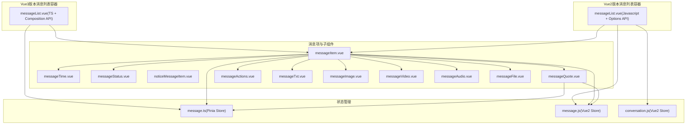
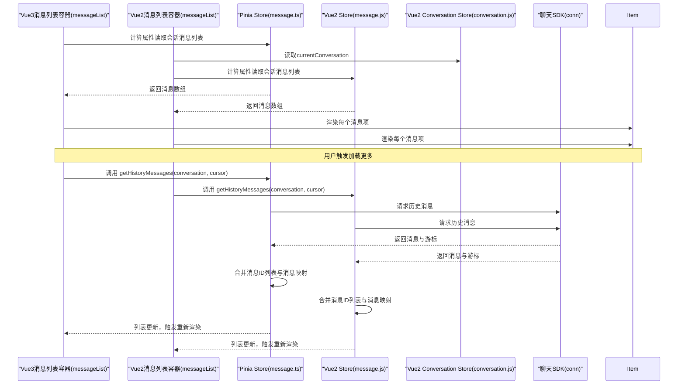
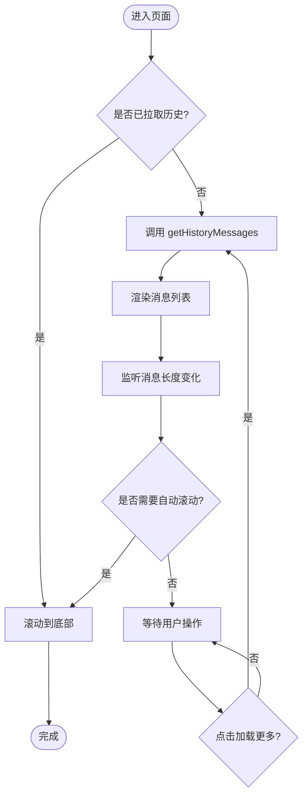
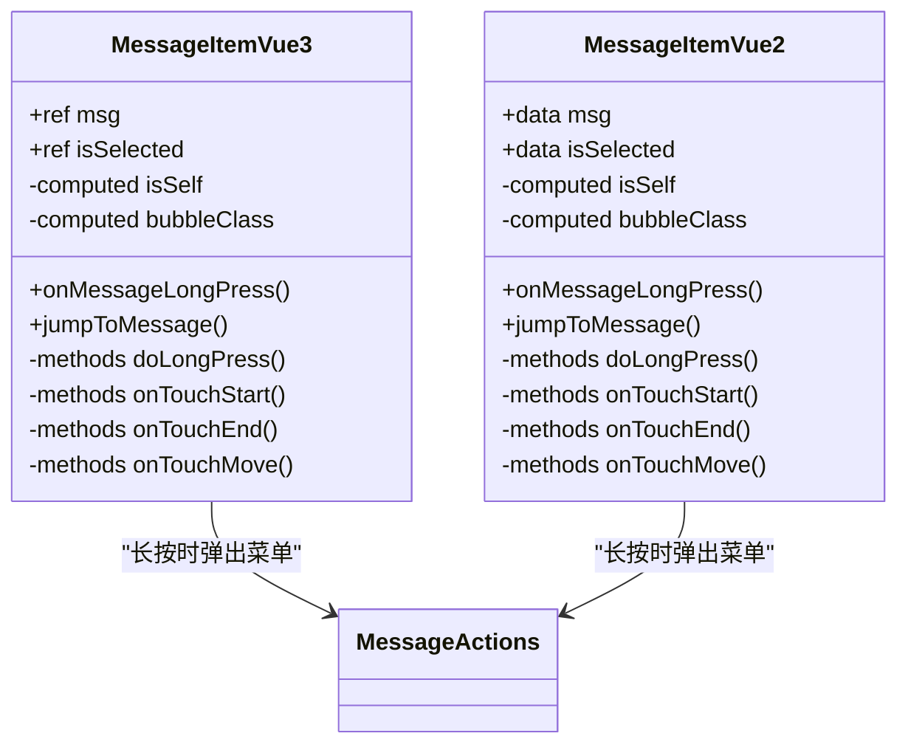
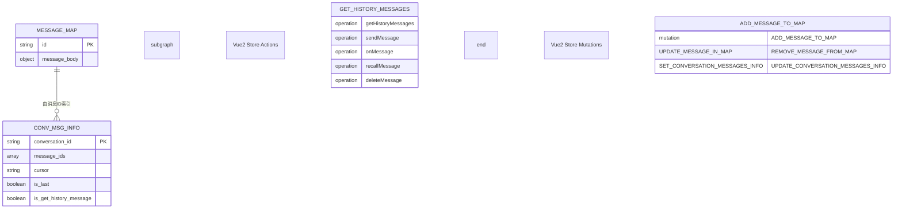
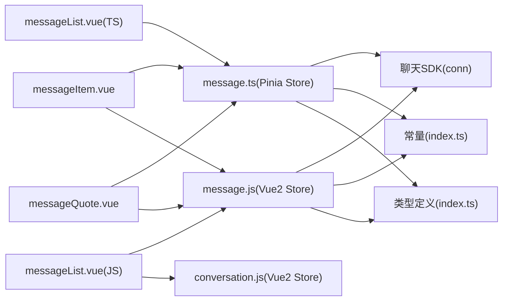

# 消息列表组件

<cite>
**本文档引用的文件**
- [messageList.vue](file://ChatUIKit/modules/Chat/components/Message/messageList.vue)
- [messageItem.vue](file://ChatUIKit/modules/Chat/components/Message/messageItem.vue)
- [messageTime.vue](file://ChatUIKit/modules/Chat/components/Message/messageTime.vue)
- [messageStatus.vue](file://ChatUIKit/modules/Chat/components/Message/messageStatus.vue)
- [noticeMessageItem.vue](file://ChatUIKit/modules/Chat/components/Message/noticeMessageItem.vue)
- [messageActions.vue](file://ChatUIKit/modules/Chat/components/Message/messageActions.vue)
- [messageQuote.vue](file://ChatUIKit/modules/Chat/components/Message/messageQuote.vue)
- [messageTxt.vue](file://ChatUIKit/modules/Chat/components/Message/messageTxt.vue)
- [messageImage.vue](file://ChatUIKit/modules/Chat/components/Message/messageImage.vue)
- [messageVideo.vue](file://ChatUIKit/modules/Chat/components/Message/messageVideo.vue)
- [messageAudio.vue](file://ChatUIKit/modules/Chat/components/Message/messageAudio.vue)
- [messageFile.vue](file://ChatUIKit/modules/Chat/components/Message/messageFile.vue)
- [message.ts](file://ChatUIKit/stores/message.ts)
- [conversation.ts](file://ChatUIKit/stores/conversation.ts)
- [index.ts（常量）](file://ChatUIKit/const/index.ts)
- [index.ts（类型）](file://ChatUIKit/types/index.ts)
- [messageList.vue（Vue2版本）](file://vue2-demo/ChatUIKit/modules/Chat/components/Message/messageList.vue)
- [messageItem.vue（Vue2版本）](file://vue2-demo/ChatUIKit/modules/Chat/components/Message/messageItem.vue)
- [messageActions.vue（Vue2版本）](file://vue2-demo/ChatUIKit/modules/Chat/components/Message/messageActions.vue)
- [messageAudio.vue（Vue2版本）](file://vue2-demo/ChatUIKit/modules/Chat/components/Message/messageAudio.vue)
- [messageTxt.vue（Vue2版本）](file://vue2-demo/ChatUIKit/modules/Chat/components/Message/messageTxt.vue)
- [messageImage.vue（Vue2版本）](file://vue2-demo/ChatUIKit/modules/Chat/components/Message/messageImage.vue)
- [messageVideo.vue（Vue2版本）](file://vue2-demo/ChatUIKit/modules/Chat/components/Message/messageVideo.vue)
- [messageFile.vue（Vue2版本）](file://vue2-demo/ChatUIKit/modules/Chat/components/Message/messageFile.vue)
- [messageQuote.vue（Vue2版本）](file://vue2-demo/ChatUIKit/modules/Chat/components/Message/messageQuote.vue)
- [messageStatus.vue（Vue2版本）](file://vue2-demo/ChatUIKit/modules/Chat/components/Message/messageStatus.vue)
- [noticeMessageItem.vue（Vue2版本）](file://vue2-demo/ChatUIKit/modules/Chat/components/Message/noticeMessageItem.vue)
- [message.js（Vue2版本）](file://vue2-demo/ChatUIKit/stores/message.js)
- [conversation.js（Vue2版本）](file://vue2-demo/ChatUIKit/stores/conversation.js)
</cite>

## 更新摘要
**所做更改**
- 新增Vue2版本消息列表组件的完整实现分析
- 对比Vue2与Vue3版本在架构、API和实现细节上的差异
- 补充Vue2版本特有的条件编译、生命周期处理和状态管理模式
- 增加Vue2版本消息闪烁效果、滚动定位和历史消息加载的具体实现
- 更新基于应用变更：消息列表组件进行了重大重构，移除了直接接收conversationId和conversationType props，改为从Vuex store获取当前会话信息；新增loadHistoryMessages方法智能检查历史消息加载状态；改进watcher逻辑以支持currentConversation变化自动触发历史消息加载

## 目录
1. [简介](#简介)
2. [项目结构](#项目结构)
3. [核心组件](#核心组件)
4. [架构总览](#架构总览)
5. [详细组件分析](#详细组件分析)
6. [Vue2版本对比分析](#vue2版本对比分析)
7. [依赖关系分析](#依赖关系分析)
8. [性能考量](#性能考量)
9. [故障排查指南](#故障排查指南)
10. [结论](#结论)
11. [附录](#附录)

## 简介
本文件面向"消息列表组件"的全面技术文档，覆盖渲染机制、虚拟滚动策略、性能优化、数据获取与缓存、滚动控制与加载更多、状态管理、自定义渲染与样式定制、消息分组与时间戳显示、消息状态处理等主题。文档同时提供可视化图示与最佳实践建议，帮助开发者快速理解与高效扩展。

**更新** 新增Vue2版本的消息列表组件分析，涵盖历史消息加载、消息闪烁效果、滚动定位等功能的实现细节。基于最新应用变更，消息列表组件已重构为从Vuex store获取当前会话信息，移除了直接接收conversationId和conversationType props的需要。

## 项目结构
消息列表位于聊天模块的 Message 组件目录下，采用"容器组件 + 多种消息体子组件"的组合模式：
- 容器组件负责滚动、加载更多、自动滚动到底部、闪烁高亮等交互
- 子组件负责不同类型消息的渲染（文本、图片、视频、音频、文件、引用、状态等）
- Pinia Store 负责消息数据的增删改查、历史消息分页、状态变更与清理

**图表来源**
- [messageList.vue](file://ChatUIKit/modules/Chat/components/Message/messageList.vue#L52-L202)
- [messageList.vue（Vue2版本）](file://vue2-demo/ChatUIKit/modules/Chat/components/Message/messageList.vue#L51-L311)
- [messageItem.vue](file://ChatUIKit/modules/Chat/components/Message/messageItem.vue#L74-L181)
- [message.js（Vue2版本）](file://vue2-demo/ChatUIKit/stores/message.js#L1-L604)
- [conversation.js（Vue2版本）](file://vue2-demo/ChatUIKit/stores/conversation.js#L1-L258)

**章节来源**
- [messageList.vue](file://ChatUIKit/modules/Chat/components/Message/messageList.vue#L1-L284)
- [messageList.vue（Vue2版本）](file://vue2-demo/ChatUIKit/modules/Chat/components/Message/messageList.vue#L1-L311)
- [message.ts](file://ChatUIKit/stores/message.ts#L1-L581)
- [message.js（Vue2版本）](file://vue2-demo/ChatUIKit/stores/message.js#L1-L604)
- [conversation.js（Vue2版本）](file://vue2-demo/ChatUIKit/stores/conversation.js#L1-L258)

## 核心组件
- 消息列表容器：负责滚动视图、加载更多、自动滚动到底部、闪烁高亮、长按选择与跳转定位
- 消息项容器：负责消息气泡布局、昵称、时间戳、状态图标、引用消息、动作菜单、长按交互
- 子消息组件：文本、图片、视频、音频、文件、通知消息、消息状态、消息引用
- Pinia Store：消息内容与会话列表的映射、历史消息分页、状态更新、清理策略

**更新** Vue2版本采用Options API实现，使用data()定义响应式数据，computed定义计算属性，methods定义方法，watch监听器处理状态变化。消息列表容器现在从Vuex store获取当前会话信息，不再直接接收props。

**章节来源**
- [messageList.vue](file://ChatUIKit/modules/Chat/components/Message/messageList.vue#L52-L202)
- [messageList.vue（Vue2版本）](file://vue2-demo/ChatUIKit/modules/Chat/components/Message/messageList.vue#L51-L311)
- [messageItem.vue](file://ChatUIKit/modules/Chat/components/Message/messageItem.vue#L74-L181)
- [messageItem.vue（Vue2版本）](file://vue2-demo/ChatUIKit/modules/Chat/components/Message/messageItem.vue#L85-L301)
- [message.ts](file://ChatUIKit/stores/message.ts#L48-L106)
- [message.js（Vue2版本）](file://vue2-demo/ChatUIKit/stores/message.js#L10-L21)
- [conversation.ts](file://ChatUIKit/stores/conversation.ts#L27-L47)

## 架构总览
消息列表采用"容器组件 + 子组件 + Store"的分层架构：
- 容器组件通过计算属性订阅 Store 的会话消息列表，驱动视图渲染
- 子组件按消息类型进行条件渲染，并通过事件与 Store 协作完成状态管理
- Store 以"消息映射 + 会话消息ID列表"的方式组织数据，支持分页与清理

**图表来源**
- [messageList.vue](file://ChatUIKit/modules/Chat/components/Message/messageList.vue#L136-L172)
- [messageList.vue（Vue2版本）](file://vue2-demo/ChatUIKit/modules/Chat/components/Message/messageList.vue#L168-L207)
- [message.ts](file://ChatUIKit/stores/message.ts#L130-L197)
- [message.js（Vue2版本）](file://vue2-demo/ChatUIKit/stores/message.js#L167-L247)
- [conversation.js（Vue2版本）](file://vue2-demo/ChatUIKit/stores/conversation.js#L70-L83)

## 详细组件分析

### 消息列表容器（messageList）
- 渲染机制
  - 使用滚动视图承载消息项，支持锚点滚动与自动滚动到底部
  - 通过计算属性订阅 Store 的会话消息列表，实现响应式渲染
  - 条件渲染"加载更多"、"无更多消息"、"加载中"状态
- 加载更多与分页
  - 通过 cursor 控制分页请求，首次进入时若未拉取历史则自动拉取
  - 不同平台对滚动锚点处理存在差异，通过条件编译适配
- 滚动控制
  - 提供滚动到底部的暴露方法，用于外部调用
  - 通过 scrollTop 与 scroll-into-view 实现定位与闪烁高亮
- 状态管理
  - 监听消息长度变化，自动滚动到底部并淡出遮罩
  - 通过 selectedMsgId 与 blinkMsgId 实现选中态与闪烁动画

**更新** Vue2版本使用data()定义响应式数据，包括scrollTop、isLoading、currentViewMsgId、selectedMsgId、blinkMsgId和isOpacity等状态变量。消息列表容器现在从Vuex store获取当前会话信息，通过computed属性访问currentConversation，不再直接接收props。

**图表来源**
- [messageList.vue](file://ChatUIKit/modules/Chat/components/Message/messageList.vue#L117-L134)
- [messageList.vue](file://ChatUIKit/modules/Chat/components/Message/messageList.vue#L136-L172)
- [messageList.vue（Vue2版本）](file://vue2-demo/ChatUIKit/modules/Chat/components/Message/messageList.vue#L117-L135)
- [messageList.vue（Vue2版本）](file://vue2-demo/ChatUIKit/modules/Chat/components/Message/messageList.vue#L146-L166)

**章节来源**
- [messageList.vue](file://ChatUIKit/modules/Chat/components/Message/messageList.vue#L52-L202)
- [messageList.vue（Vue2版本）](file://vue2-demo/ChatUIKit/modules/Chat/components/Message/messageList.vue#L51-L311)

### 消息项容器（messageItem）
- 布局与样式
  - 根据是否本人发送决定气泡方向与背景色，支持左右对齐与箭头样式
  - 昵称仅在对方消息显示；时间戳始终显示
- 子组件组合
  - 引用消息面板、消息状态图标、各类消息体组件（文本/图片/视频/音频/文件/自定义卡片）
- 交互能力
  - 长按触发选择与动作菜单，支持触摸开始/结束/移动的长按判定
  - 通过事件向上抛出长按与跳转消息事件

**更新** Vue2版本使用Options API，data()定义组件内部状态，computed定义计算属性，methods定义方法。长按检测使用setTimeout实现，支持触摸事件处理。

**图表来源**
- [messageItem.vue](file://ChatUIKit/modules/Chat/components/Message/messageItem.vue#L74-L181)
- [messageItem.vue（Vue2版本）](file://vue2-demo/ChatUIKit/modules/Chat/components/Message/messageItem.vue#L112-L216)
- [messageActions.vue](file://ChatUIKit/modules/Chat/components/Message/messageActions.vue#L178-L250)
- [messageActions.vue（Vue2版本）](file://vue2-demo/ChatUIKit/modules/Chat/components/Message/messageActions.vue#L180-L253)

**章节来源**
- [messageItem.vue](file://ChatUIKit/modules/Chat/components/Message/messageItem.vue#L74-L181)
- [messageItem.vue（Vue2版本）](file://vue2-demo/ChatUIKit/modules/Chat/components/Message/messageItem.vue#L85-L301)
- [messageActions.vue](file://ChatUIKit/modules/Chat/components/Message/messageActions.vue#L78-L250)
- [messageActions.vue（Vue2版本）](file://vue2-demo/ChatUIKit/modules/Chat/components/Message/messageActions.vue#L40-L339)

### 子消息组件族
- 文本消息（messageTxt）
  - 将富文本解析为文本片段，支持表情渲染与"已编辑"标签
- 图片消息（messageImage）
  - 支持预览、错误占位、尺寸自适应与禁用预览
- 视频消息（messageVideo）
  - 封面图与播放按钮，支持预览跳转
- 音频消息（messageAudio）
  - 内置 InnerAudioContext，支持播放/暂停/停止与多实例管理
- 文件消息（messageFile）
  - 支持下载与打开文档，不同平台差异化处理
- 引用消息（messageQuote）
  - 展示被引用消息的简要信息，支持跳转到原消息
- 时间戳（messageTime）
  - 仅在与上一条消息间隔超过阈值时显示
- 消息状态（messageStatus）
  - 根据消息状态显示发送中/已发送/失败/已接收/已读等图标

**更新** Vue2版本组件使用Options API实现，props定义组件属性，data定义内部状态，computed定义计算属性，methods定义方法。各组件均支持条件编译和平台特定功能。

**章节来源**
- [messageTxt.vue](file://ChatUIKit/modules/Chat/components/Message/messageTxt.vue#L22-L74)
- [messageTxt.vue（Vue2版本）](file://vue2-demo/ChatUIKit/modules/Chat/components/Message/messageTxt.vue#L25-L46)
- [messageImage.vue](file://ChatUIKit/modules/Chat/components/Message/messageImage.vue#L15-L84)
- [messageImage.vue（Vue2版本）](file://vue2-demo/ChatUIKit/modules/Chat/components/Message/messageImage.vue#L21-L95)
- [messageVideo.vue](file://ChatUIKit/modules/Chat/components/Message/messageVideo.vue#L23-L109)
- [messageVideo.vue（Vue2版本）](file://vue2-demo/ChatUIKit/modules/Chat/components/Message/messageVideo.vue#L20-L74)
- [messageAudio.vue](file://ChatUIKit/modules/Chat/components/Message/messageAudio.vue#L32-L194)
- [messageAudio.vue（Vue2版本）](file://vue2-demo/ChatUIKit/modules/Chat/components/Message/messageAudio.vue#L15-L95)
- [messageFile.vue](file://ChatUIKit/modules/Chat/components/Message/messageFile.vue#L11-L130)
- [messageFile.vue（Vue2版本）](file://vue2-demo/ChatUIKit/modules/Chat/components/Message/messageFile.vue#L13-L89)
- [messageQuote.vue](file://ChatUIKit/modules/Chat/components/Message/messageQuote.vue#L45-L169)
- [messageQuote.vue（Vue2版本）](file://vue2-demo/ChatUIKit/modules/Chat/components/Message/messageQuote.vue#L10-L42)
- [messageTime.vue](file://ChatUIKit/modules/Chat/components/Message/messageTime.vue#L6-L64)
- [messageStatus.vue](file://ChatUIKit/modules/Chat/components/Message/messageStatus.vue#L26-L95)
- [messageStatus.vue（Vue2版本）](file://vue2-demo/ChatUIKit/modules/Chat/components/Message/messageStatus.vue#L10-L27)
- [noticeMessageItem.vue](file://ChatUIKit/modules/Chat/components/Message/noticeMessageItem.vue#L1-L56)
- [noticeMessageItem.vue（Vue2版本）](file://vue2-demo/ChatUIKit/modules/Chat/components/Message/noticeMessageItem.vue#L9-L39)

### 状态管理（Pinia Store：message.ts）
- 数据结构
  - messageMap：消息ID到消息体的映射，O(1) 查询
  - conversationMessagesMap：会话ID到消息ID列表、游标、是否最后一页等信息
- 关键能力
  - 获取历史消息：分页拉取、去重合并、游标更新
  - 新消息插入：按会话维护消息ID顺序
  - 发送/接收消息：本地占位、状态更新、服务器消息落盘
  - 撤回/删除/清理：统一更新映射与列表，避免内存泄漏
  - 最大消息数限制：超过阈值时清理最早一批消息

**更新** Vue2版本使用Vuex风格的Store实现，采用mutations、actions和getters模式。数据结构与Vue3版本相同，但实现方式不同。Vue2版本的conversation store提供currentConversation状态，消息列表容器通过computed属性访问当前会话信息。

**图表来源**
- [message.ts](file://ChatUIKit/stores/message.ts#L25-L44)
- [message.js（Vue2版本）](file://vue2-demo/ChatUIKit/stores/message.js#L10-L21)
- [message.js（Vue2版本）](file://vue2-demo/ChatUIKit/stores/message.js#L160-L247)
- [message.js（Vue2版本）](file://vue2-demo/ChatUIKit/stores/message.js#L62-L158)
- [conversation.js（Vue2版本）](file://vue2-demo/ChatUIKit/stores/conversation.js#L70-L83)

**章节来源**
- [message.ts](file://ChatUIKit/stores/message.ts#L48-L581)
- [message.js（Vue2版本）](file://vue2-demo/ChatUIKit/stores/message.js#L1-L604)
- [conversation.js（Vue2版本）](file://vue2-demo/ChatUIKit/stores/conversation.js#L1-L258)
- [index.ts（常量）](file://ChatUIKit/const/index.ts#L14-L15)

## Vue2版本对比分析

### 架构差异
- **API风格**：Vue2使用Options API，Vue3使用Composition API
- **响应式系统**：Vue2使用data()和computed，Vue3使用ref()和computed
- **生命周期**：Vue2使用mounted、beforeDestroy，Vue3使用onMounted、onUnmounted
- **状态管理**：Vue2使用Vuex，Vue3使用Pinia

### 实现细节差异
- **消息闪烁效果**：Vue2版本通过CSS动画实现，使用blink类名控制闪烁
- **滚动定位**：Vue2版本使用scrollIntoViewId计算属性，支持不同平台的锚点定位
- **历史消息加载**：Vue2版本在不同平台使用条件编译处理锚点滚动差异
- **长按交互**：Vue2版本使用setTimeout实现长按检测，支持触摸事件处理
- **会话信息获取**：Vue2版本从Vuex store获取currentConversation，不再直接接收props

### 性能优化策略
- **Vue2版本优化**：使用Vue.set和Vue.delete确保响应式更新，避免直接修改对象属性
- **内存管理**：Vue2版本在beforeDestroy钩子中销毁音频上下文，防止内存泄漏
- **渲染优化**：Vue2版本使用data()定义响应式数据，减少不必要的计算属性依赖

**章节来源**
- [messageList.vue（Vue2版本）](file://vue2-demo/ChatUIKit/modules/Chat/components/Message/messageList.vue#L251-L265)
- [messageList.vue（Vue2版本）](file://vue2-demo/ChatUIKit/modules/Chat/components/Message/messageList.vue#L176-L203)
- [messageAudio.vue（Vue2版本）](file://vue2-demo/ChatUIKit/modules/Chat/components/Message/messageAudio.vue#L56-L60)
- [message.js（Vue2版本）](file://vue2-demo/ChatUIKit/stores/message.js#L62-L71)

## 依赖关系分析
- 容器组件依赖 Store 的计算属性与动作，实现"读取-写入-渲染"的闭环
- 子组件依赖 Store 的工具函数与配置，实现跨组件的状态共享与行为一致
- Store 依赖 SDK 进行网络请求，依赖常量与类型定义保证一致性

**图表来源**
- [messageList.vue](file://ChatUIKit/modules/Chat/components/Message/messageList.vue#L56-L68)
- [messageList.vue（Vue2版本）](file://vue2-demo/ChatUIKit/modules/Chat/components/Message/messageList.vue#L47-L49)
- [messageItem.vue](file://ChatUIKit/modules/Chat/components/Message/messageItem.vue#L87-L103)
- [messageQuote.vue](file://ChatUIKit/modules/Chat/components/Message/messageQuote.vue#L64-L66)
- [message.ts](file://ChatUIKit/stores/message.ts#L18-L23)
- [message.js（Vue2版本）](file://vue2-demo/ChatUIKit/stores/message.js#L1-L7)
- [conversation.js（Vue2版本）](file://vue2-demo/ChatUIKit/stores/conversation.js#L7-L18)
- [index.ts（常量）](file://ChatUIKit/const/index.ts#L1-L37)
- [index.ts（类型）](file://ChatUIKit/types/index.ts#L1-L100)

**章节来源**
- [messageList.vue](file://ChatUIKit/modules/Chat/components/Message/messageList.vue#L56-L68)
- [messageList.vue（Vue2版本）](file://vue2-demo/ChatUIKit/modules/Chat/components/Message/messageList.vue#L47-L49)
- [messageItem.vue](file://ChatUIKit/modules/Chat/components/Message/messageItem.vue#L87-L103)
- [messageQuote.vue](file://ChatUIKit/modules/Chat/components/Message/messageQuote.vue#L64-L66)
- [message.ts](file://ChatUIKit/stores/message.ts#L18-L23)
- [message.js（Vue2版本）](file://vue2-demo/ChatUIKit/stores/message.js#L1-L7)
- [conversation.js（Vue2版本）](file://vue2-demo/ChatUIKit/stores/conversation.js#L1-L258)

## 性能考量
- 渲染性能
  - 使用计算属性订阅 Store，减少不必要的重渲染
  - 子组件按类型条件渲染，避免无关 DOM 节点生成
- 滚动性能
  - 使用锚点滚动与固定高度容器，降低滚动重排成本
  - 首屏自动滚动到底部时延迟关闭遮罩，避免闪烁
- 内存管理
  - Store 对会话消息数量设置上限，超过阈值清理最早消息，防止内存膨胀
  - 音频组件在卸载时销毁 InnerAudioContext，释放资源
- 网络与缓存
  - 历史消息分页拉取，游标驱动，避免重复请求
  - 消息映射表提供 O(1) 查询，降低查找成本

**更新** Vue2版本在beforeDestroy钩子中销毁音频上下文，防止内存泄漏。使用Vue.set确保响应式更新，避免直接修改对象属性导致的性能问题。消息列表容器现在从Vuex store获取当前会话信息，减少了props传递的开销。

**章节来源**
- [messageList.vue](file://ChatUIKit/modules/Chat/components/Message/messageList.vue#L100-L115)
- [messageList.vue（Vue2版本）](file://vue2-demo/ChatUIKit/modules/Chat/components/Message/messageList.vue#L209-L214)
- [message.ts](file://ChatUIKit/stores/message.ts#L529-L554)
- [message.js（Vue2版本）](file://vue2-demo/ChatUIKit/stores/message.js#L567-L591)
- [messageAudio.vue](file://ChatUIKit/modules/Chat/components/Message/messageAudio.vue#L168-L175)
- [messageAudio.vue（Vue2版本）](file://vue2-demo/ChatUIKit/modules/Chat/components/Message/messageAudio.vue#L56-L60)

## 故障排查指南
- 无法自动滚动到底部
  - 检查消息长度变化监听与 nextTick 的使用时机
  - 确认容器组件 mounted 时的历史消息拉取逻辑
- 加载更多无效
  - 核验 isLast 与 isLoading 状态，确保游标正确传递
  - 平台差异导致的锚点滚动需检查条件编译分支
- 音频无法播放或无法停止
  - 确认 InnerAudioContext 初始化与事件绑定顺序
  - 检查 Store 中 playingAudioMsgId 的切换逻辑
- 引用消息为空或跳转异常
  - 校验引用消息 ID 与 quoteMessage 的一致性
  - 确认 messageQuote 组件的 computed 依赖是否正确
- 会话信息获取失败
  - 检查Vuex store中的currentConversation状态是否正确设置
  - 确认消息列表容器的computed属性是否能正确访问currentConversation

**更新** Vue2版本故障排查需要考虑Options API的特殊性，如data()中的响应式数据初始化、computed依赖关系、methods方法调用等。新增会话信息获取相关的故障排查指导。

**章节来源**
- [messageList.vue](file://ChatUIKit/modules/Chat/components/Message/messageList.vue#L136-L172)
- [messageList.vue（Vue2版本）](file://vue2-demo/ChatUIKit/modules/Chat/components/Message/messageList.vue#L168-L207)
- [messageAudio.vue](file://ChatUIKit/modules/Chat/components/Message/messageAudio.vue#L158-L166)
- [messageAudio.vue（Vue2版本）](file://vue2-demo/ChatUIKit/modules/Chat/components/Message/messageAudio.vue#L62-L94)
- [messageQuote.vue](file://ChatUIKit/modules/Chat/components/Message/messageQuote.vue#L68-L98)
- [messageQuote.vue（Vue2版本）](file://vue2-demo/ChatUIKit/modules/Chat/components/Message/messageQuote.vue#L35-L41)
- [conversation.js（Vue2版本）](file://vue2-demo/ChatUIKit/stores/conversation.js#L70-L83)

## 结论
消息列表组件通过清晰的分层设计与 Pinia 状态管理，实现了高性能、可扩展的消息渲染与交互体验。其分页加载、自动滚动、闪烁高亮、长按菜单、状态图标与引用消息等功能完备，适合在多端（APP/Web/小程序）环境下稳定运行。

**更新** Vue2版本通过Options API提供了稳定的实现方案，支持历史消息加载、消息闪烁效果、滚动定位等核心功能。相比Vue3版本，在响应式系统、生命周期管理和状态管理模式上有显著差异，但功能实现保持一致。基于最新的重构，消息列表组件现在更加灵活地从Vuex store获取会话信息，提升了组件的复用性和可维护性。

建议在实际业务中结合平台特性进一步优化滚动与媒体资源加载策略，持续关注内存占用与首屏渲染时延。对于需要兼容Vue2的项目，Vue2版本提供了完整的实现参考。

## 附录
- 自定义渲染与样式定制
  - 通过消息项的类名与 SCSS 变量，可定制气泡背景、边框、箭头与文字样式
  - 动作菜单项可根据功能开关动态生成，便于按需裁剪
- 消息分组与时间戳
  - 时间戳组件按时间差阈值显示，避免密集消息下的冗余显示
- 消息状态处理
  - 通过消息状态图标直观反馈发送进度与结果，结合 Store 的状态更新实现一致体验
- Vue2版本特有能力
  - 条件编译支持不同平台的锚点滚动处理
  - CSS动画实现消息闪烁效果
  - Options API的响应式数据管理
  - Vuex store集成的currentConversation状态管理

**章节来源**
- [messageItem.vue](file://ChatUIKit/modules/Chat/components/Message/messageItem.vue#L183-L264)
- [messageItem.vue（Vue2版本）](file://vue2-demo/ChatUIKit/modules/Chat/components/Message/messageItem.vue#L220-L301)
- [messageActions.vue](file://ChatUIKit/modules/Chat/components/Message/messageActions.vue#L78-L144)
- [messageActions.vue（Vue2版本）](file://vue2-demo/ChatUIKit/modules/Chat/components/Message/messageActions.vue#L111-L178)
- [messageTime.vue](file://ChatUIKit/modules/Chat/components/Message/messageTime.vue#L19-L49)
- [messageStatus.vue](file://ChatUIKit/modules/Chat/components/Message/messageStatus.vue#L35-L95)
- [messageList.vue（Vue2版本）](file://vue2-demo/ChatUIKit/modules/Chat/components/Message/messageList.vue#L251-L265)
- [messageList.vue（Vue2版本）](file://vue2-demo/ChatUIKit/modules/Chat/components/Message/messageList.vue#L176-L203)
- [conversation.js（Vue2版本）](file://vue2-demo/ChatUIKit/stores/conversation.js#L70-L83)