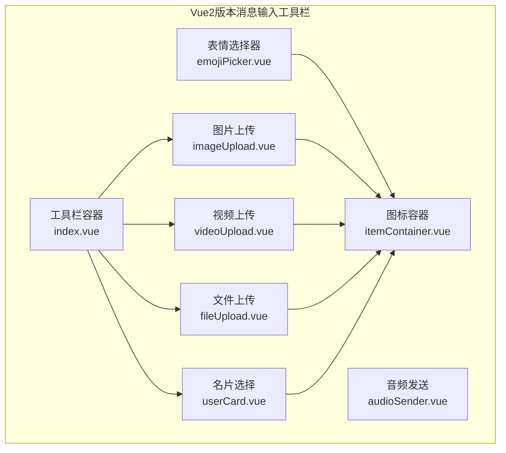
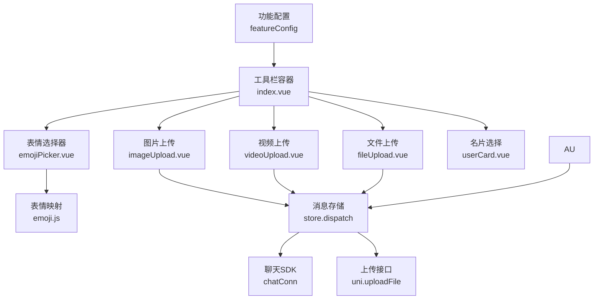
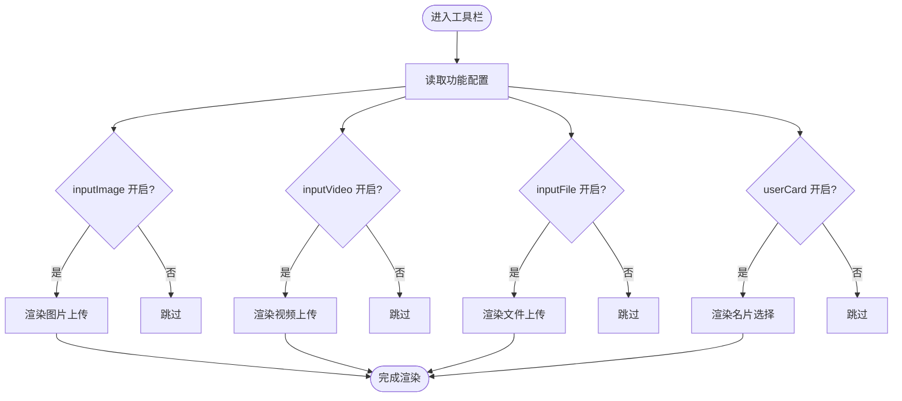
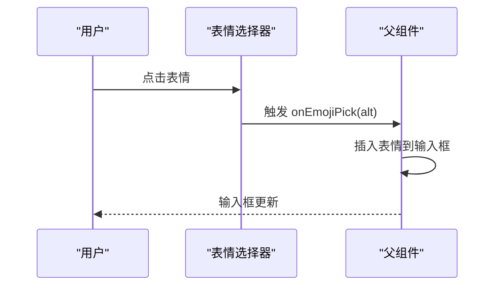
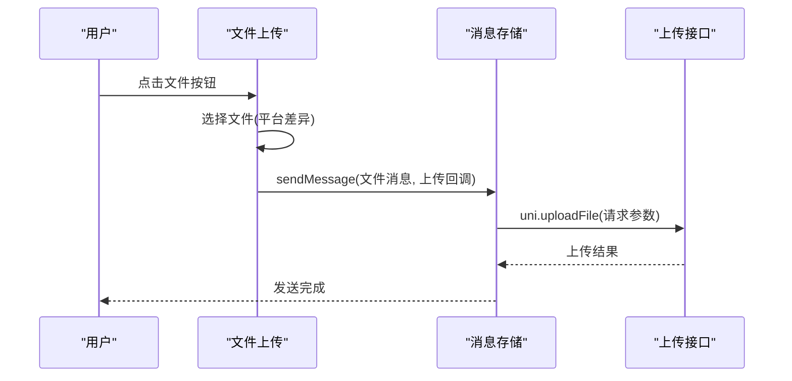
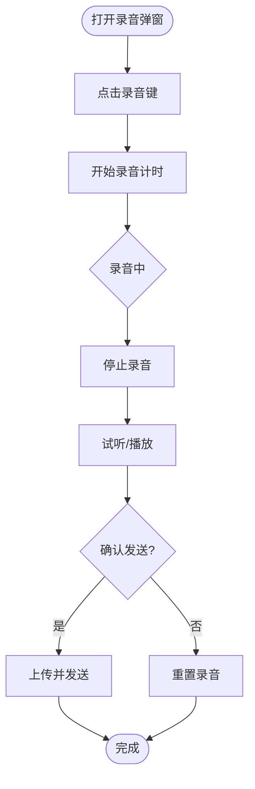
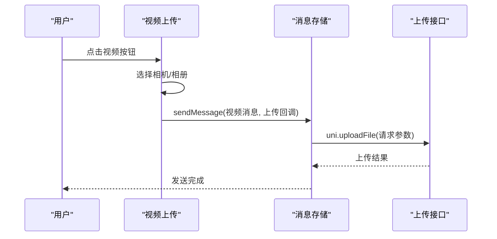
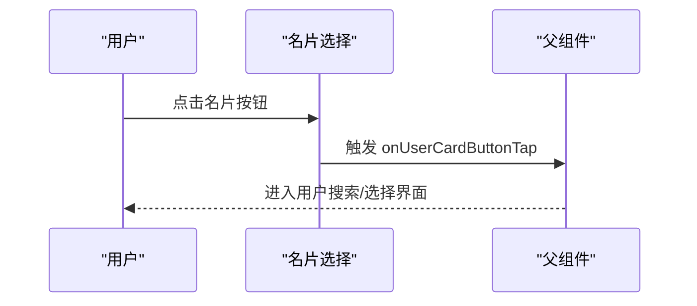
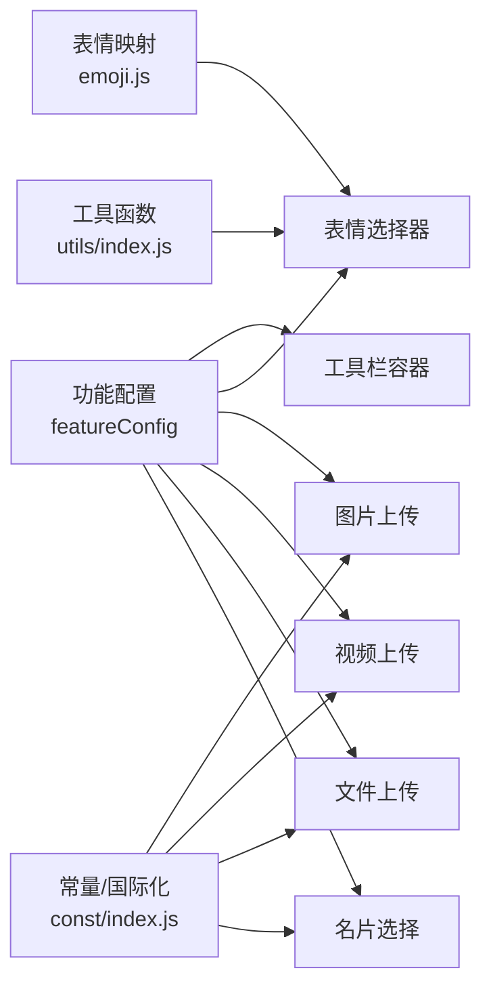

# 消息输入工具栏

<cite>
**本文档引用的文件**
- [index.vue](file://ChatUIKit-vue2/modules/Chat/components/MessageInputToolBar/index.vue)
- [emojiPicker.vue](file://ChatUIKit-vue2/modules/Chat/components/MessageInputToolBar/emojiPicker.vue)
- [imageUpload.vue](file://ChatUIKit-vue2/modules/Chat/components/MessageInputToolBar/imageUpload.vue)
- [fileUpload.vue](file://ChatUIKit-vue2/modules/Chat/components/MessageInputToolBar/fileUpload.vue)
- [audioSender.vue](file://ChatUIKit-vue2/modules/Chat/components/MessageInputToolBar/audioSender.vue)
- [videoUpload.vue](file://ChatUIKit-vue2/modules/Chat/components/MessageInputToolBar/videoUpload.vue)
- [userCard.vue](file://ChatUIKit-vue2/modules/Chat/components/MessageInputToolBar/userCard.vue)
- [itemContainer.vue](file://ChatUIKit-vue2/modules/Chat/components/MessageInputToolBar/itemContainer.vue)
- [emoji.js](file://ChatUIKit-vue2/const/emoji.js)
- [index.js](file://ChatUIKit-vue2/const/index.js)
- [index.vue](file://ChatUIKit-vue2/modules/Chat/components/MessageInput/index.vue)
- [index.vue](file://ChatUIKit-vue2/modules/Chat/components/MessageInputToolBar/index.vue)
- [style.scss](file://ChatUIKit-vue2/modules/Chat/components/MessageInput/style.scss)
- [index.js](file://ChatUIKit-vue2/index.js)
</cite>

## 更新摘要
**所做更改**
- 更新图标文件名标准化变更：fileButton.png改为file.png，userCard.png改为usercard.png，mic.png改为mic_on.png
- 修正工具栏组件文档中关于图标文件命名的描述
- 保持其他功能描述不变，专注于图标命名一致性的更新

## 目录
1. [简介](#简介)
2. [项目结构](#项目结构)
3. [核心组件](#核心组件)
4. [架构总览](#架构总览)
5. [详细组件分析](#详细组件分析)
6. [Vue2版本特色功能](#vue2版本特色功能)
7. [依赖关系分析](#依赖关系分析)
8. [性能与可用性](#性能与可用性)
9. [故障排查指南](#故障排查指南)
10. [结论](#结论)
11. [附录](#附录)

## 简介
本文档面向"消息输入工具栏"模块，系统化阐述其布局设计、功能按钮与交互机制；深入解析表情选择器的实现原理、表情包管理与搜索能力；详述图片上传的文件选择、预览与上传处理；提供文件上传的格式限制、大小控制与进度显示建议；解释音频发送的录制、播放与发送流程；覆盖视频上传的拍摄、选择与上传流程；说明名片选择的用户搜索与选择机制；给出工具栏的自定义扩展与功能开关配置方法；最后总结响应式设计与移动端适配要点。

**更新** 新增Vue2版本完整实现，包含表情选择器、图片上传、文件上传、音频发送、视频上传等功能组件。已完成图标文件名标准化变更，消除命名不一致问题。

## 项目结构
消息输入工具栏位于聊天模块的工具栏目录下，采用按功能拆分的组件化组织方式：
- 工具栏容器：负责功能区轮播与功能开关控制
- 功能子组件：表情选择器、图片上传、文件上传、音频发送、视频上传、名片选择
- 辅助组件：图标容器，用于统一展示风格
- 配置与常量：功能开关、表情映射、国际化文案等



**图表来源**
- [index.vue](file://ChatUIKit-vue2/modules/Chat/components/MessageInputToolBar/index.vue#L1-L84)
- [emojiPicker.vue](file://ChatUIKit-vue2/modules/Chat/components/MessageInputToolBar/emojiPicker.vue#L1-L95)
- [imageUpload.vue](file://ChatUIKit-vue2/modules/Chat/components/MessageInputToolBar/imageUpload.vue#L1-L107)
- [fileUpload.vue](file://ChatUIKit-vue2/modules/Chat/components/MessageInputToolBar/fileUpload.vue#L1-L121)
- [audioSender.vue](file://ChatUIKit-vue2/modules/Chat/components/MessageInputToolBar/audioSender.vue#L1-L198)
- [videoUpload.vue](file://ChatUIKit-vue2/modules/Chat/components/MessageInputToolBar/videoUpload.vue#L1-L109)
- [userCard.vue](file://ChatUIKit-vue2/modules/Chat/components/MessageInputToolBar/userCard.vue#L1-L41)
- [itemContainer.vue](file://ChatUIKit-vue2/modules/Chat/components/MessageInputToolBar/itemContainer.vue)

**章节来源**
- [index.vue](file://ChatUIKit-vue2/modules/Chat/components/MessageInputToolBar/index.vue#L1-L84)

## 核心组件
- 工具栏容器：根据功能开关动态渲染图片、视频、文件、名片等功能项，使用轮播容器承载多页功能区
- 表情选择器：基于表情映射表分页展示，点击回调触发父组件插入表情
- 图片上传：调用平台选择器选取相册图片，构造消息体并通过上传通道发送
- 文件上传：针对不同平台提供文件选择接口，构造文件消息并上传
- 音频发送：内嵌弹窗，提供录音、试听、重置、发送全流程
- 视频上传：支持相机与相册选择，构造视频消息并上传
- 名片选择：触发用户搜索与选择流程
- 图标容器：统一的图标与标题展示组件

**章节来源**
- [index.vue](file://ChatUIKit-vue2/modules/Chat/components/MessageInputToolBar/index.vue#L1-L84)
- [emojiPicker.vue](file://ChatUIKit-vue2/modules/Chat/components/MessageInputToolBar/emojiPicker.vue#L1-L95)
- [imageUpload.vue](file://ChatUIKit-vue2/modules/Chat/components/MessageInputToolBar/imageUpload.vue#L1-L107)
- [fileUpload.vue](file://ChatUIKit-vue2/modules/Chat/components/MessageInputToolBar/fileUpload.vue#L1-L121)
- [audioSender.vue](file://ChatUIKit-vue2/modules/Chat/components/MessageInputToolBar/audioSender.vue#L1-L198)
- [videoUpload.vue](file://ChatUIKit-vue2/modules/Chat/components/MessageInputToolBar/videoUpload.vue#L1-L109)
- [userCard.vue](file://ChatUIKit-vue2/modules/Chat/components/MessageInputToolBar/userCard.vue#L1-L41)
- [itemContainer.vue](file://ChatUIKit-vue2/modules/Chat/components/MessageInputToolBar/itemContainer.vue)

## 架构总览
工具栏通过Vue2的数据绑定和组件通信机制驱动各子组件的显示与行为；子组件通过事件总线与外部通信；消息发送通过统一的消息存储层完成。



**图表来源**
- [index.vue](file://ChatUIKit-vue2/modules/Chat/components/MessageInputToolBar/index.vue#L42-L51)
- [emojiPicker.vue](file://ChatUIKit-vue2/modules/Chat/components/MessageInputToolBar/emojiPicker.vue#L35-L39)
- [emoji.js](file://ChatUIKit-vue2/const/emoji.js#L1-L112)
- [imageUpload.vue](file://ChatUIKit-vue2/modules/Chat/components/MessageInputToolBar/imageUpload.vue#L52-L96)
- [videoUpload.vue](file://ChatUIKit-vue2/modules/Chat/components/MessageInputToolBar/videoUpload.vue#L52-L98)
- [fileUpload.vue](file://ChatUIKit-vue2/modules/Chat/components/MessageInputToolBar/fileUpload.vue#L67-L110)
- [audioSender.vue](file://ChatUIKit-vue2/modules/Chat/components/MessageInputToolBar/audioSender.vue#L105-L149)

## 详细组件分析

### 工具栏容器与布局
- 布局采用轮播容器承载功能区，内部使用弹性布局与等宽列实现图标网格
- 功能开关来自组件data中的featureConfig，分别控制图片、视频、文件、名片等区域的显示
- 通过事件机制与父组件通信，保证交互一致性



**图表来源**
- [index.vue](file://ChatUIKit-vue2/modules/Chat/components/MessageInputToolBar/index.vue#L1-L84)

**章节来源**
- [index.vue](file://ChatUIKit-vue2/modules/Chat/components/MessageInputToolBar/index.vue#L1-L84)

### 表情选择器
- 表情数据来源于表情映射表，按固定列数切分为若干页
- 点击表情触发回调，父组件将表情插入到输入框
- 支持滚动浏览与点击反馈



**图表来源**
- [emojiPicker.vue](file://ChatUIKit-vue2/modules/Chat/components/MessageInputToolBar/emojiPicker.vue#L42-L44)
- [emoji.js](file://ChatUIKit-vue2/const/emoji.js#L99-L111)

**章节来源**
- [emojiPicker.vue](file://ChatUIKit-vue2/modules/Chat/components/MessageInputToolBar/emojiPicker.vue#L1-L95)
- [emoji.js](file://ChatUIKit-vue2/const/emoji.js#L1-L112)

### 图片上传
- 选择相册图片后，构造图片消息体并关闭工具栏
- 通过消息存储层发送消息，并以上传通道执行文件上传
- 上传请求包含认证头与文件参数


**图表来源**
- [imageUpload.vue](file://ChatUIKit-vue2/modules/Chat/components/MessageInputToolBar/imageUpload.vue#L42-L96)

**章节来源**
- [imageUpload.vue](file://ChatUIKit-vue2/modules/Chat/components/MessageInputToolBar/imageUpload.vue#L1-L107)

### 文件上传
- H5平台使用通用文件选择接口，小程序平台使用专用接口
- 构造文件消息体并上传，支持文件名与大小字段
- 上传通道与图片一致，均通过消息存储层统一调度



**图表来源**
- [fileUpload.vue](file://ChatUIKit-vue2/modules/Chat/components/MessageInputToolBar/fileUpload.vue#L42-L110)

**章节来源**
- [fileUpload.vue](file://ChatUIKit-vue2/modules/Chat/components/MessageInputToolBar/fileUpload.vue#L1-L121)

### 音频发送
- 内嵌弹窗提供录音、试听、重置、发送四步流程
- 录音时长上限与震动反馈增强体验
- 权限检测与错误处理确保稳定性
- 上传完成后重置状态



**图表来源**
- [audioSender.vue](file://ChatUIKit-vue2/modules/Chat/components/MessageInputToolBar/audioSender.vue#L75-L103)

**章节来源**
- [audioSender.vue](file://ChatUIKit-vue2/modules/Chat/components/MessageInputToolBar/audioSender.vue#L1-L198)

### 视频上传
- 支持相机与相册选择，自动提取文件名
- 构造视频消息体并上传，上传通道与图片一致



**图表来源**
- [videoUpload.vue](file://ChatUIKit-vue2/modules/Chat/components/MessageInputToolBar/videoUpload.vue#L42-L98)

**章节来源**
- [videoUpload.vue](file://ChatUIKit-vue2/modules/Chat/components/MessageInputToolBar/videoUpload.vue#L1-L109)

### 名片选择
- 点击名片按钮后触发父组件的用户选择流程
- 用于发送联系人名片类自定义消息



**图表来源**
- [userCard.vue](file://ChatUIKit-vue2/modules/Chat/components/MessageInputToolBar/userCard.vue#L28-L30)

**章节来源**
- [userCard.vue](file://ChatUIKit-vue2/modules/Chat/components/MessageInputToolBar/userCard.vue#L1-L41)

### 图标容器
- 统一展示图标与标题，便于各功能按钮风格一致
- 容器尺寸与样式可复用，减少重复样式代码

**章节来源**
- [itemContainer.vue](file://ChatUIKit-vue2/modules/Chat/components/MessageInputToolBar/itemContainer.vue)

## Vue2版本特色功能

### 功能开关配置
Vue2版本采用组件级的featureConfig配置，支持灵活的功能开关控制：

```javascript
featureConfig: {
  inputImage: true,    // 图片上传
  inputVideo: true,    // 视频上传  
  inputFile: true,     // 文件上传
  userCard: true       // 名片选择
}
```

**章节来源**
- [index.vue](file://ChatUIKit-vue2/modules/Chat/components/MessageInputToolBar/index.vue#L42-L51)
- [index.vue](file://ChatUIKit-vue2/modules/Chat/components/MessageInput/index.vue#L67-L73)

### 平台差异化处理
Vue2版本针对不同平台提供了专门的处理逻辑：

- **H5平台**：使用原生文件选择器和通用上传接口
- **小程序平台**：使用微信专用的文件选择接口
- **APP平台**：支持录音权限检测和处理

**章节来源**
- [fileUpload.vue](file://ChatUIKit-vue2/modules/Chat/components/MessageInputToolBar/fileUpload.vue#L42-L65)
- [audioSender.vue](file://ChatUIKit-vue2/modules/Chat/components/MessageInputToolBar/audioSender.vue#L87-L93)

### 数据流管理
Vue2版本采用Vuex进行状态管理，组件间通信更加规范：

- 通过$store访问全局状态
- 使用dispatch分发动作
- 通过state共享数据

**章节来源**
- [imageUpload.vue](file://ChatUIKit-vue2/modules/Chat/components/MessageInputToolBar/imageUpload.vue#L28-L39)
- [videoUpload.vue](file://ChatUIKit-vue2/modules/Chat/components/MessageInputToolBar/videoUpload.vue#L27-L39)

### 图标文件名标准化
**更新** 已完成图标文件名标准化变更，消除命名不一致问题：

- **文件上传图标**：fileButton.png → file.png
- **名片选择图标**：userCard.png → usercard.png  
- **麦克风图标**：mic.png → mic_on.png

所有组件现已使用标准化的图标文件名，确保命名一致性：

- 图片上传组件：ASSETS_URL + 'icon/imgButton.png'
- 文件上传组件：ASSETS_URL + 'icon/file.png' (已标准化)
- 名片选择组件：ASSETS_URL + 'icon/usercard.png' (已标准化)
- 音频发送组件：ASSETS_URL + 'icon/mic_on.png' (已标准化)

**章节来源**
- [imageUpload.vue](file://ChatUIKit-vue2/modules/Chat/components/MessageInputToolBar/imageUpload.vue#L11)
- [fileUpload.vue](file://ChatUIKit-vue2/modules/Chat/components/MessageInputToolBar/fileUpload.vue#L11)
- [userCard.vue](file://ChatUIKit-vue2/modules/Chat/components/MessageInputToolBar/userCard.vue#L11)
- [audioSender.vue](file://ChatUIKit-vue2/modules/Chat/components/MessageInputToolBar/audioSender.vue#L20)

## 依赖关系分析
- 功能开关：由组件data中的featureConfig提供，决定各子组件的渲染与交互
- 表情映射：表情选择器依赖表情映射表与分块工具函数
- 上传通道：图片、文件、视频、音频均通过消息存储层与上传接口协作
- 国际化与常量：工具栏标题与资源路径来自常量与本地化模块



**图表来源**
- [index.vue](file://ChatUIKit-vue2/modules/Chat/components/MessageInputToolBar/index.vue#L42-L51)
- [emojiPicker.vue](file://ChatUIKit-vue2/modules/Chat/components/MessageInputToolBar/emojiPicker.vue#L35-L39)
- [emoji.js](file://ChatUIKit-vue2/const/emoji.js#L1-L112)
- [index.js](file://ChatUIKit-vue2/const/index.js#L1-L33)

**章节来源**
- [emoji.js](file://ChatUIKit-vue2/const/emoji.js#L1-L112)
- [index.js](file://ChatUIKit-vue2/const/index.js#L1-L33)

## 性能与可用性
- 性能特性
  - 表情分页加载，避免一次性渲染大量节点
  - 上传采用异步通道，避免阻塞主线程
  - 录音弹窗仅在需要时打开，降低内存占用
- 可用性建议
  - 上传进度：当前实现未内置进度条，可在上传通道回调中增加进度计算与展示
  - 错误提示：上传失败时应统一提示并允许重试
  - 文件限制：建议在选择阶段加入格式与大小校验，减少无效上传
  - 移动端适配：工具栏容器已使用弹性布局，建议在窄屏设备上进一步优化行间距与图标密度

## 故障排查指南
- 录音权限问题
  - iOS 平台需检测麦克风权限，未授权时提示并关闭弹窗
  - Android 平台需申请录音权限，未授权时提示并阻止录音
- 上传失败
  - 检查网络与 Token 有效性
  - 确认上传接口地址与认证头设置正确
- 表情显示异常
  - 确认表情映射表与分块逻辑正常
  - 检查图片资源路径与跨域策略
- 文件/视频选择失败
  - H5平台与小程序平台接口差异需分别处理
  - 选择器返回值结构可能不同，注意兼容性
- 图标显示问题
  - **更新** 确认图标文件名与实际文件一致：file.png、usercard.png、mic_on.png

**章节来源**
- [audioSender.vue](file://ChatUIKit-vue2/modules/Chat/components/MessageInputToolBar/audioSender.vue#L57-L62)
- [imageUpload.vue](file://ChatUIKit-vue2/modules/Chat/components/MessageInputToolBar/imageUpload.vue#L57-L59)
- [videoUpload.vue](file://ChatUIKit-vue2/modules/Chat/components/MessageInputToolBar/videoUpload.vue#L57-L59)
- [fileUpload.vue](file://ChatUIKit-vue2/modules/Chat/components/MessageInputToolBar/fileUpload.vue#L42-L65)

## 结论
消息输入工具栏通过清晰的功能划分与统一的配置驱动，实现了图片、视频、文件、音频、表情与名片等多种媒体与信息的便捷发送。Vue2版本采用组件化的实现方式，提供了更好的可维护性和扩展性。其组件化设计便于扩展与维护，结合权限检测与上传通道，保障了在多端平台的一致体验。图标文件名标准化变更已完成，消除了命名不一致问题，提升了代码质量。建议后续补充上传进度与更严格的文件校验，以进一步提升稳定性与用户体验。

## 附录

### 功能开关与配置
- 功能开关定义于组件data中，涵盖输入区域与消息操作等维度
- 配置支持运行时修改，可通过props传递给子组件

**章节来源**
- [index.vue](file://ChatUIKit-vue2/modules/Chat/components/MessageInputToolBar/index.vue#L42-L51)
- [index.vue](file://ChatUIKit-vue2/modules/Chat/components/MessageInput/index.vue#L67-L73)

### 输入工具栏与表情集成
- 输入工具栏根据功能开关控制表情按钮显示
- 表情插入通过暴露的方法将表情字符追加到输入框

**章节来源**
- [index.vue](file://ChatUIKit-vue2/modules/Chat/components/MessageInput/index.vue#L99-L101)
- [index.vue](file://ChatUIKit-vue2/modules/Chat/components/MessageInput/index.vue#L219-L221)

### 样式与响应式
- 输入工具栏采用弹性布局与等宽列，适配多端显示
- 图标容器统一尺寸与圆角，保证视觉一致性

**章节来源**
- [style.scss](file://ChatUIKit-vue2/modules/Chat/components/MessageInput/style.scss#L234-L289)
- [itemContainer.vue](file://ChatUIKit-vue2/modules/Chat/components/MessageInputToolBar/itemContainer.vue)

### Vue2版本初始化
Vue2版本通过ChatUIKit主类进行初始化，建立SDK连接和事件监听：

```javascript
const chatUIKit = new ChatUIKit()
chatUIKit.init({
  chat: EMClient,
  config: {}
})
```

**章节来源**
- [index.js](file://ChatUIKit-vue2/index.js#L18-L38)