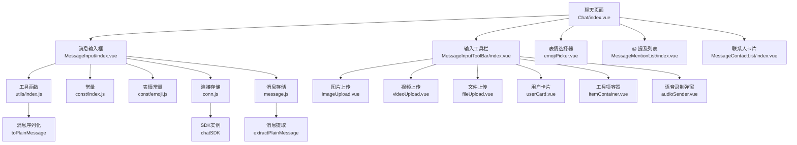
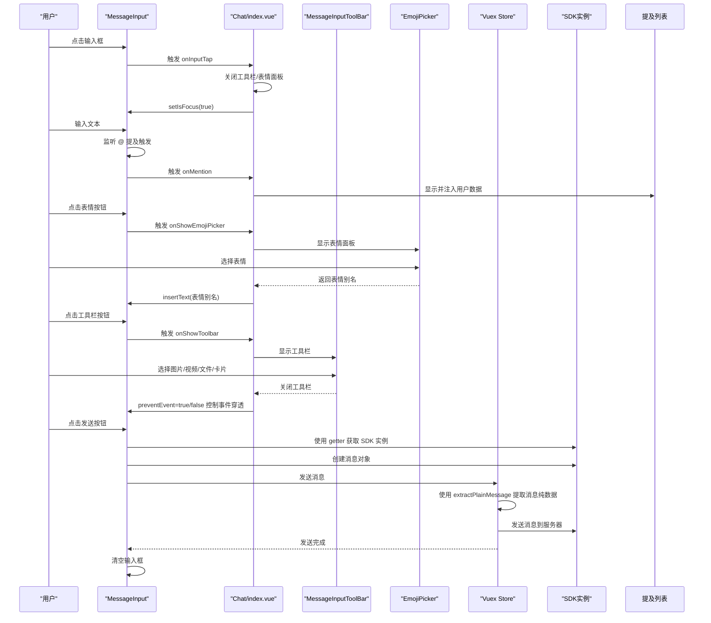
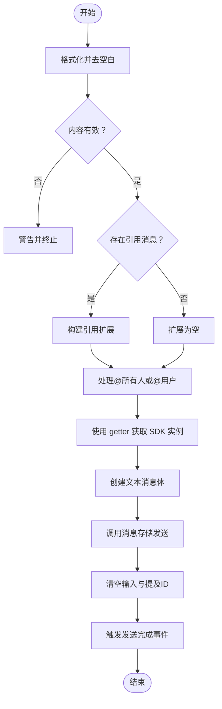
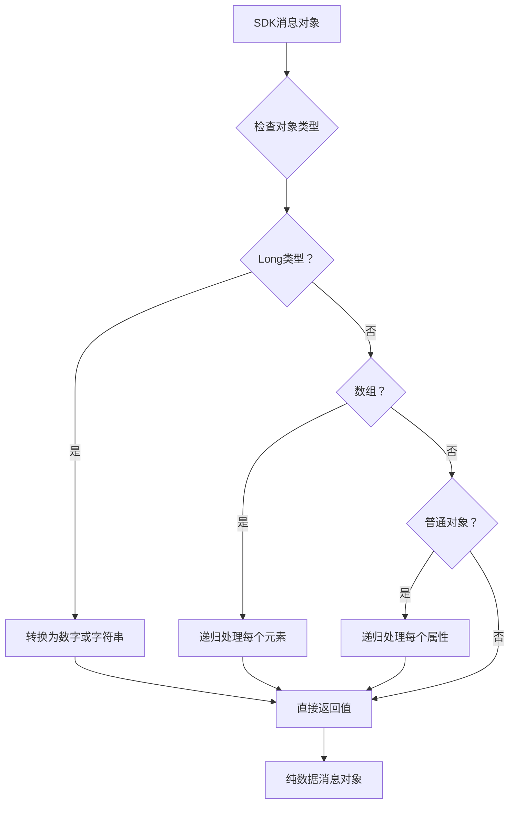
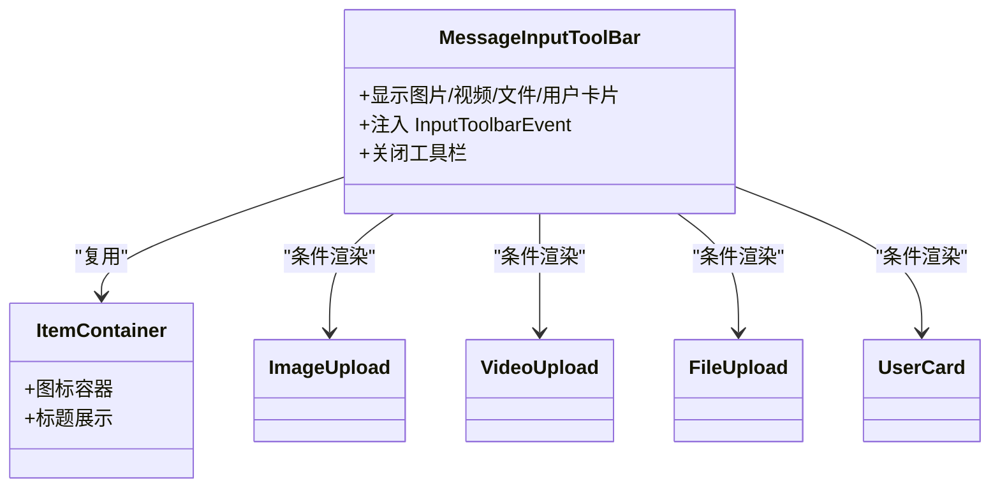
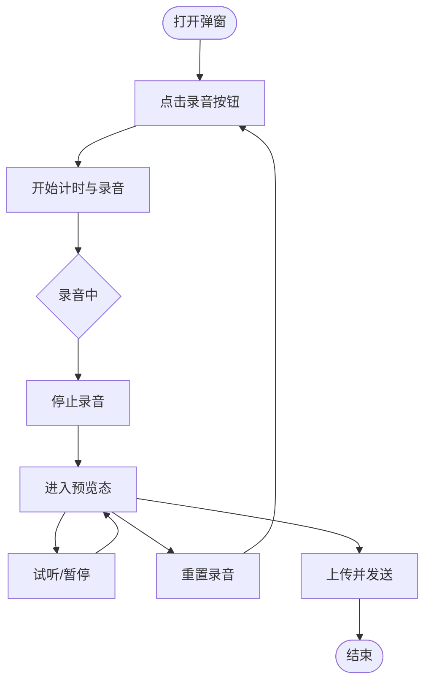
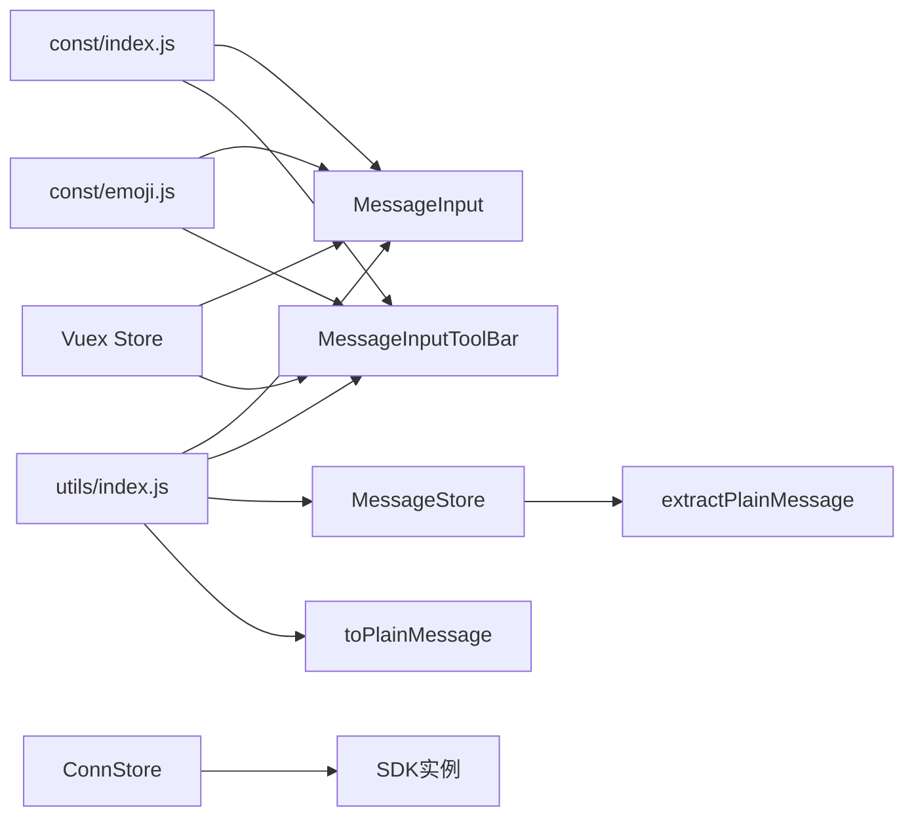

# 消息输入组件

<cite>
**本文档引用的文件**
- [ChatUIKit-vue2/modules/Chat/components/MessageInput/index.vue](file://ChatUIKit-vue2/modules/Chat/components/MessageInput/index.vue)
- [ChatUIKit-vue2/modules/Chat/components/MessageInput/style.scss](file://ChatUIKit-vue2/modules/Chat/components/MessageInput/style.scss)
- [ChatUIKit-vue2/modules/Chat/components/MessageInputToolBar/index.vue](file://ChatUIKit-vue2/modules/Chat/components/MessageInputToolBar/index.vue)
- [ChatUIKit-vue2/modules/Chat/components/MessageInputToolBar/itemContainer.vue](file://ChatUIKit-vue2/modules/Chat/components/MessageInputToolBar/itemContainer.vue)
- [ChatUIKit-vue2/modules/Chat/components/MessageInputToolBar/audioSender.vue](file://ChatUIKit-vue2/modules/Chat/components/MessageInputToolBar/audioSender.vue)
- [ChatUIKit-vue2/modules/Chat/components/MessageInputToolBar/emojiPicker.vue](file://ChatUIKit-vue2/modules/Chat/components/MessageInputToolBar/emojiPicker.vue)
- [ChatUIKit-vue2/modules/Chat/components/MessageInputToolBar/imageUpload.vue](file://ChatUIKit-vue2/modules/Chat/components/MessageInputToolBar/imageUpload.vue)
- [ChatUIKit-vue2/modules/Chat/components/MessageInputToolBar/fileUpload.vue](file://ChatUIKit-vue2/modules/Chat/components/MessageInputToolBar/fileUpload.vue)
- [ChatUIKit-vue2/modules/Chat/components/MessageInputToolBar/videoUpload.vue](file://ChatUIKit-vue2/modules/Chat/components/MessageInputToolBar/videoUpload.vue)
- [ChatUIKit-vue2/modules/Chat/components/MessageInputToolBar/userCard.vue](file://ChatUIKit-vue2/modules/Chat/components/MessageInputToolBar/userCard.vue)
- [ChatUIKit-vue2/modules/Chat/index.vue](file://ChatUIKit-vue2/modules/Chat/index.vue)
- [ChatUIKit-vue2/utils/index.js](file://ChatUIKit-vue2/utils/index.js)
- [ChatUIKit-vue2/const/index.js](file://ChatUIKit-vue2/const/index.js)
- [ChatUIKit-vue2/const/emoji.js](file://ChatUIKit-vue2/const/emoji.js)
- [ChatUIKit-vue2/stores/conn.js](file://ChatUIKit-vue2/stores/conn.js)
- [ChatUIKit-vue2/stores/message.js](file://ChatUIKit-vue2/stores/message.js)
- [ChatUIKit-vue2/sdk.ts](file://ChatUIKit-vue2/sdk.ts)
</cite>

## 更新摘要
**所做更改**
- 新增SDK getter访问模式的实现细节
- 集成toPlainMessage工具函数处理SDK消息对象序列化
- 增强SDK消息对象处理能力，解决Long类型问题
- 更新架构图以反映新的SDK访问和消息处理机制
- 完善消息对象序列化与反序列化的处理流程

## 目录
1. [简介](#简介)
2. [项目结构](#项目结构)
3. [核心组件](#核心组件)
4. [架构总览](#架构总览)
5. [详细组件分析](#详细组件分析)
6. [依赖关系分析](#依赖关系分析)
7. [性能考虑](#性能考虑)
8. [故障排查指南](#故障排查指南)
9. [结论](#结论)
10. [附录](#附录)

## 简介
本文件系统性地解析Vue2版本消息输入组件的实现机制，覆盖以下关键能力：
- 文本输入与多行输入适配
- 富文本编辑能力（提及、引用、表情）
- 尺寸自适应、键盘适配与移动端优化
- 状态管理、内容校验与提交处理
- 样式定制、主题适配与响应式设计
- 输入框与工具栏联动机制与功能扩展
- 性能优化、内存管理与用户体验提升
- 自定义配置与集成方法

**更新** 新增Vue2版本的消息输入组件，支持文本输入、表情选择、引用回复面板等功能。**新增** SDK getter访问模式和toPlainMessage工具函数，增强SDK消息对象处理能力

## 项目结构
Vue2版本消息输入组件由"输入框 + 工具栏 + 弹层"三部分构成，并通过Vuex状态与工具函数协同工作。



**图表来源**
- [ChatUIKit-vue2/modules/Chat/index.vue:1-307](file://ChatUIKit-vue2/modules/Chat/index.vue#L1-L307)
- [ChatUIKit-vue2/modules/Chat/components/MessageInput/index.vue:1-298](file://ChatUIKit-vue2/modules/Chat/components/MessageInput/index.vue#L1-L298)
- [ChatUIKit-vue2/modules/Chat/components/MessageInputToolBar/index.vue:1-84](file://ChatUIKit-vue2/modules/Chat/components/MessageInputToolBar/index.vue#L1-L84)
- [ChatUIKit-vue2/stores/conn.js:22-28](file://ChatUIKit-vue2/stores/conn.js#L22-L28)
- [ChatUIKit-vue2/stores/message.js:321-357](file://ChatUIKit-vue2/stores/message.js#L321-L357)
- [ChatUIKit-vue2/utils/index.js:1-45](file://ChatUIKit-vue2/utils/index.js#L1-L45)

**章节来源**
- [ChatUIKit-vue2/modules/Chat/index.vue:1-307](file://ChatUIKit-vue2/modules/Chat/index.vue#L1-L307)
- [ChatUIKit-vue2/modules/Chat/components/MessageInput/index.vue:1-298](file://ChatUIKit-vue2/modules/Chat/components/MessageInput/index.vue#L1-L298)
- [ChatUIKit-vue2/modules/Chat/components/MessageInputToolBar/index.vue:1-84](file://ChatUIKit-vue2/modules/Chat/components/MessageInputToolBar/index.vue#L1-L84)

## 核心组件
- 消息输入框：负责文本输入、表情插入、@ 提及触发、语音入口、发送与焦点控制
- 输入工具栏：提供图片/视频/文件/用户卡片等扩展入口
- 表情选择器：提供表情面板，支持滚动浏览与点击插入
- 语音录制弹窗：提供录音、试听、重置与发送流程
- 聊天页面容器：协调键盘高度、遮罩层、工具栏与表情面板的显隐与交互
- SDK连接存储：通过getter方式提供SDK实例访问，避免Vue响应式观察
- 消息存储：提供消息提取和序列化功能，处理SDK特殊对象类型

**更新** Vue2版本采用Vuex状态管理替代Pinia，组件间通信通过$store.state和$store.dispatch实现。**新增** SDK getter访问模式和toPlainMessage工具函数

**章节来源**
- [ChatUIKit-vue2/modules/Chat/components/MessageInput/index.vue:1-298](file://ChatUIKit-vue2/modules/Chat/components/MessageInput/index.vue#L1-L298)
- [ChatUIKit-vue2/modules/Chat/components/MessageInputToolBar/index.vue:1-84](file://ChatUIKit-vue2/modules/Chat/components/MessageInputToolBar/index.vue#L1-L84)
- [ChatUIKit-vue2/modules/Chat/components/MessageInputToolBar/emojiPicker.vue:1-95](file://ChatUIKit-vue2/modules/Chat/components/MessageInputToolBar/emojiPicker.vue#L1-L95)
- [ChatUIKit-vue2/modules/Chat/components/MessageInputToolBar/audioSender.vue:1-192](file://ChatUIKit-vue2/modules/Chat/components/MessageInputToolBar/audioSender.vue#L1-L192)
- [ChatUIKit-vue2/modules/Chat/index.vue:1-307](file://ChatUIKit-vue2/modules/Chat/index.vue#L1-L307)
- [ChatUIKit-vue2/stores/conn.js:22-28](file://ChatUIKit-vue2/stores/conn.js#L22-L28)
- [ChatUIKit-vue2/stores/message.js:321-357](file://ChatUIKit-vue2/stores/message.js#L321-L357)

## 架构总览
Vue2版本消息输入组件采用"容器-子组件"模式，通过事件驱动与Vuex状态解耦，确保可扩展与可维护。**更新** 新增SDK getter访问模式和toPlainMessage工具函数，增强SDK消息对象处理能力。



**图表来源**
- [ChatUIKit-vue2/modules/Chat/index.vue:177-269](file://ChatUIKit-vue2/modules/Chat/index.vue#L177-L269)
- [ChatUIKit-vue2/modules/Chat/components/MessageInput/index.vue:134-141](file://ChatUIKit-vue2/modules/Chat/components/MessageInput/index.vue#L134-L141)
- [ChatUIKit-vue2/stores/conn.js:25-27](file://ChatUIKit-vue2/stores/conn.js#L25-L27)
- [ChatUIKit-vue2/stores/message.js:321-357](file://ChatUIKit-vue2/stores/message.js#L321-L357)

## 详细组件分析

### 消息输入框（MessageInput）
- 功能要点
  - 文本输入与发送：双向绑定文本，监听输入与确认事件，发送文本消息并清空输入
  - @ 提及：在群聊场景下识别"@"结尾触发，向容器传递事件以打开提及列表
  - 语音入口：根据配置显示麦克风图标，请求权限后打开录音弹窗
  - 焦点与遮罩：根据输入框焦点控制工具栏与表情面板显隐；当工具栏/表情面板显示时阻止输入框事件穿透
  - 引用消息：支持引用消息扩展字段，发送时携带被引用消息摘要
  - **新增** SDK访问：通过getter方式获取SDK实例，避免Vue响应式观察
  - **新增** 消息序列化：使用toPlainMessage处理SDK消息对象

- 关键流程（发送文本消息）


**图表来源**
- [ChatUIKit-vue2/modules/Chat/components/MessageInput/index.vue:119-182](file://ChatUIKit-vue2/modules/Chat/components/MessageInput/index.vue#L119-L182)
- [ChatUIKit-vue2/stores/conn.js:25-27](file://ChatUIKit-vue2/stores/conn.js#L25-L27)

**章节来源**
- [ChatUIKit-vue2/modules/Chat/components/MessageInput/index.vue:1-298](file://ChatUIKit-vue2/modules/Chat/components/MessageInput/index.vue#L1-L298)
- [ChatUIKit-vue2/modules/Chat/components/MessageInput/style.scss:1-57](file://ChatUIKit-vue2/modules/Chat/components/MessageInput/style.scss#L1-L57)
- [ChatUIKit-vue2/utils/index.js:1-45](file://ChatUIKit-vue2/utils/index.js#L1-L45)
- [ChatUIKit-vue2/const/index.js:6-8](file://ChatUIKit-vue2/const/index.js#L6-L8)
- [ChatUIKit-vue2/const/emoji.js:98-111](file://ChatUIKit-vue2/const/emoji.js#L98-L111)

### SDK连接存储（conn.js）
- 功能要点
  - **新增** getter访问模式：通过getChatConn和getChatSDK getter提供SDK实例访问
  - **新增** 外部变量存储：将SDK实例存储在外部变量中，避免Vue响应式观察
  - **新增** SDK初始化：通过initConn action初始化SDK连接和实例

- getter实现
```mermaid
classDiagram
class ConnStore {
+getters : {
+isLoggedIn
+currentUser
+getChatConn() : _chatConn
+getChatSDK() : _chatSDK
+}
+mutations : {
+SET_CHAT_CONN(conn)
+SET_CHAT_SDK(sdk)
+}
+actions : {
+initConn({conn, sdk})
+login()
+logout()
+}
}
```

**图表来源**
- [ChatUIKit-vue2/stores/conn.js:22-28](file://ChatUIKit-vue2/stores/conn.js#L22-L28)
- [ChatUIKit-vue2/stores/conn.js:30-50](file://ChatUIKit-vue2/stores/conn.js#L30-L50)

**章节来源**
- [ChatUIKit-vue2/stores/conn.js:1-121](file://ChatUIKit-vue2/stores/conn.js#L1-L121)

### 消息存储（message.js）
- 功能要点
  - **新增** extractPlainMessage函数：提取SDK消息对象的纯数据字段
  - **新增** toPlainMessage工具函数：处理Long类型等特殊对象的序列化
  - **新增** 消息对象处理：避免存储SDK特殊对象，解决序列化问题

- 消息提取流程


**图表来源**
- [ChatUIKit-vue2/stores/message.js:321-357](file://ChatUIKit-vue2/stores/message.js#L321-L357)
- [ChatUIKit-vue2/utils/index.js:9-45](file://ChatUIKit-vue2/utils/index.js#L9-L45)

**章节来源**
- [ChatUIKit-vue2/stores/message.js:321-357](file://ChatUIKit-vue2/stores/message.js#L321-L357)
- [ChatUIKit-vue2/utils/index.js:1-45](file://ChatUIKit-vue2/utils/index.js#L1-L45)

### 工具函数（utils/index.js）
- 功能要点
  - **新增** toPlainMessage函数：专门处理SDK消息对象的序列化
  - **新增** Long类型处理：识别并转换SDK Long类型对象
  - **新增** 递归遍历：支持嵌套对象和数组的深度处理
  - **新增** 类型判断：跳过函数等不可序列化属性

- toPlainMessage实现原理
  - **特征检测**：通过low、high属性识别Long类型
  - **安全转换**：优先转换为安全整数，否则转为字符串
  - **递归处理**：对数组和对象进行深度遍历
  - **属性过滤**：跳过函数等不可序列化属性

**章节来源**
- [ChatUIKit-vue2/utils/index.js:1-45](file://ChatUIKit-vue2/utils/index.js#L1-L45)

### 输入工具栏（MessageInputToolBar）
- 功能要点
  - 条件渲染：根据功能开关显示图片、视频、文件、用户卡片等入口
  - 统一容器：使用 swiper 容器承载多个功能模块，支持横向滑动
  - 注入事件：通过依赖注入关闭工具栏，避免跨层级通信复杂度
  - 图标与标题：使用 ItemContainer 组件统一展示图标与文案

- 组件关系


**图表来源**
- [ChatUIKit-vue2/modules/Chat/components/MessageInputToolBar/index.vue:1-84](file://ChatUIKit-vue2/modules/Chat/components/MessageInputToolBar/index.vue#L1-L84)
- [ChatUIKit-vue2/modules/Chat/components/MessageInputToolBar/itemContainer.vue:1-46](file://ChatUIKit-vue2/modules/Chat/components/MessageInputToolBar/itemContainer.vue#L1-L46)
- [ChatUIKit-vue2/modules/Chat/components/MessageInputToolBar/imageUpload.vue:1-101](file://ChatUIKit-vue2/modules/Chat/components/MessageInputToolBar/imageUpload.vue#L1-L101)
- [ChatUIKit-vue2/modules/Chat/components/MessageInputToolBar/videoUpload.vue:1-103](file://ChatUIKit-vue2/modules/Chat/components/MessageInputToolBar/videoUpload.vue#L1-L103)
- [ChatUIKit-vue2/modules/Chat/components/MessageInputToolBar/fileUpload.vue:1-115](file://ChatUIKit-vue2/modules/Chat/components/MessageInputToolBar/fileUpload.vue#L1-L115)
- [ChatUIKit-vue2/modules/Chat/components/MessageInputToolBar/userCard.vue:1-41](file://ChatUIKit-vue2/modules/Chat/components/MessageInputToolBar/userCard.vue#L1-L41)

**章节来源**
- [ChatUIKit-vue2/modules/Chat/components/MessageInputToolBar/index.vue:1-84](file://ChatUIKit-vue2/modules/Chat/components/MessageInputToolBar/index.vue#L1-L84)
- [ChatUIKit-vue2/modules/Chat/components/MessageInputToolBar/itemContainer.vue:1-46](file://ChatUIKit-vue2/modules/Chat/components/MessageInputToolBar/itemContainer.vue#L1-L46)
- [ChatUIKit-vue2/modules/Chat/components/MessageInputToolBar/imageUpload.vue:1-101](file://ChatUIKit-vue2/modules/Chat/components/MessageInputToolBar/imageUpload.vue#L1-L101)
- [ChatUIKit-vue2/modules/Chat/components/MessageInputToolBar/videoUpload.vue:1-103](file://ChatUIKit-vue2/modules/Chat/components/MessageInputToolBar/videoUpload.vue#L1-L103)
- [ChatUIKit-vue2/modules/Chat/components/MessageInputToolBar/fileUpload.vue:1-115](file://ChatUIKit-vue2/modules/Chat/components/MessageInputToolBar/fileUpload.vue#L1-L115)
- [ChatUIKit-vue2/modules/Chat/components/MessageInputToolBar/userCard.vue:1-41](file://ChatUIKit-vue2/modules/Chat/components/MessageInputToolBar/userCard.vue#L1-L41)

### 表情选择器（EmojiPicker）
- 功能要点
  - 表情分页：将表情列表按固定列数切分为若干行，便于滚动浏览
  - 插入逻辑：点击表情后向容器传递表情别名，由容器写入输入框

**章节来源**
- [ChatUIKit-vue2/modules/Chat/components/MessageInputToolBar/emojiPicker.vue:1-95](file://ChatUIKit-vue2/modules/Chat/components/MessageInputToolBar/emojiPicker.vue#L1-L95)
- [ChatUIKit-vue2/utils/index.js:337-343](file://ChatUIKit-vue2/utils/index.js#L337-L343)
- [ChatUIKit-vue2/const/emoji.js:5-96](file://ChatUIKit-vue2/const/emoji.js#L5-L96)

### 语音录制弹窗（AudioSender）
- 功能要点
  - 录音状态机：record/recording/recordEnd 三种状态，支持开始、停止、试听与重置
  - 权限处理：针对 Android 与 iOS 分别请求麦克风权限，失败时提示并关闭弹窗
  - 上传与发送：录音结束后上传文件并创建音频消息发送
  - 资源管理：组件卸载时停止并销毁 InnerAudioContext，避免内存泄漏

- 流程图（录音与发送）


**图表来源**
- [ChatUIKit-vue2/modules/Chat/components/MessageInputToolBar/audioSender.vue:75-143](file://ChatUIKit-vue2/modules/Chat/components/MessageInputToolBar/audioSender.vue#L75-L143)

**章节来源**
- [ChatUIKit-vue2/modules/Chat/components/MessageInputToolBar/audioSender.vue:1-192](file://ChatUIKit-vue2/modules/Chat/components/MessageInputToolBar/audioSender.vue#L1-L192)

### 聊天页面容器（Chat/index.vue）
- 功能要点
  - 键盘适配：监听键盘高度变化，动态调整布局与滚动位置
  - 遮罩层：工具栏或表情面板显示时，点击遮罩关闭面板
  - 事件桥接：将输入框事件映射为提及列表、联系人卡片等联动行为
  - 引用消息：监听引用消息变化，自动聚焦输入框

**章节来源**
- [ChatUIKit-vue2/modules/Chat/index.vue:1-307](file://ChatUIKit-vue2/modules/Chat/index.vue#L1-L307)

## 依赖关系分析
- 状态管理
  - 配置存储：集中管理主题与功能开关，输入框与工具栏根据配置渲染
  - 消息存储：负责消息发送、修改、引用消息等业务状态，**新增** 消息对象提取功能
  - 会话存储：提供当前会话信息，决定 @ 提及与引用行为
  - 用户存储：提供自身与目标用户信息，用于消息扩展字段
  - **新增** 连接存储：通过getter提供SDK实例访问，避免Vue响应式观察

- 工具与常量
  - 工具函数：文本格式化、表情映射、数组分块、**新增** 消息序列化（toPlainMessage）、消息摘要生成等
  - 常量：@ 全体标识、资源地址等
  - 表情常量：表情列表与映射关系

- 类型定义
  - 输入工具栏事件接口、消息扩展类型、会话类型等，保证组件间契约清晰



**图表来源**
- [ChatUIKit-vue2/const/index.js:1-33](file://ChatUIKit-vue2/const/index.js#L1-L33)
- [ChatUIKit-vue2/const/emoji.js:1-112](file://ChatUIKit-vue2/const/emoji.js#L1-L112)
- [ChatUIKit-vue2/utils/index.js:1-45](file://ChatUIKit-vue2/utils/index.js#L1-L45)
- [ChatUIKit-vue2/stores/conn.js:22-28](file://ChatUIKit-vue2/stores/conn.js#L22-L28)
- [ChatUIKit-vue2/stores/message.js:321-357](file://ChatUIKit-vue2/stores/message.js#L321-L357)

**章节来源**
- [ChatUIKit-vue2/const/index.js:1-33](file://ChatUIKit-vue2/const/index.js#L1-L33)
- [ChatUIKit-vue2/const/emoji.js:1-112](file://ChatUIKit-vue2/const/emoji.js#L1-L112)
- [ChatUIKit-vue2/utils/index.js:1-45](file://ChatUIKit-vue2/utils/index.js#L1-L45)

## 性能考虑
- 事件节流与防抖
  - 工具函数提供节流实现，可用于高频输入场景的性能优化（如搜索、滚动）
- 内存管理
  - 语音弹窗在卸载时销毁 InnerAudioContext，避免后台播放占用资源
  - **新增** SDK实例存储在外部变量中，避免Vue响应式观察带来的性能开销
- 渲染优化
  - 工具栏使用 swiper 分页，减少一次性渲染压力
  - 表情面板使用滚动容器，限制最大高度，避免长列表全量渲染
- 网络与上传
  - 文件上传通过 uni.uploadFile 发起，建议结合进度反馈与断点续传策略（视业务需要）
- **新增** 消息对象处理
  - 使用extractPlainMessage提取纯数据字段，避免存储SDK特殊对象
  - toPlainMessage函数优化Long类型处理，提升序列化性能

**章节来源**
- [ChatUIKit-vue2/utils/index.js:337-343](file://ChatUIKit-vue2/utils/index.js#L337-L343)
- [ChatUIKit-vue2/modules/Chat/components/MessageInputToolBar/audioSender.vue:105-143](file://ChatUIKit-vue2/modules/Chat/components/MessageInputToolBar/audioSender.vue#L105-L143)
- [ChatUIKit-vue2/modules/Chat/components/MessageInputToolBar/emojiPicker.vue:55-61](file://ChatUIKit-vue2/modules/Chat/components/MessageInputToolBar/emojiPicker.vue#L55-L61)
- [ChatUIKit-vue2/stores/conn.js:32-39](file://ChatUIKit-vue2/stores/conn.js#L32-L39)
- [ChatUIKit-vue2/stores/message.js:321-357](file://ChatUIKit-vue2/stores/message.js#L321-L357)
- [ChatUIKit-vue2/utils/index.js:9-45](file://ChatUIKit-vue2/utils/index.js#L9-L45)

## 故障排查指南
- 无法发送文本消息
  - 检查输入内容是否为空或仅含空白字符
  - 确认消息存储发送流程未抛出异常
  - **新增** 检查SDK getter是否正确返回SDK实例
- 无法触发 @ 提及
  - 确认当前会话类型为群聊且功能开关已启用
  - 检查输入末尾是否为"@"或"@\n"
- 语音权限问题
  - Android 需要麦克风权限，iOS 需要系统授权，失败时会提示并关闭弹窗
- 键盘遮挡输入框
  - 确认容器正确监听键盘高度变化并调整布局
- 表情插入无效
  - 确认表情面板事件回调已将表情别名写入输入框
- **新增** SDK相关问题
  - 检查conn store中的SDK实例是否正确初始化
  - 确认getter访问模式是否正常工作
- **新增** 消息序列化问题
  - 检查toPlainMessage函数是否正确处理Long类型
  - 确认extractPlainMessage是否正确提取消息字段

**章节来源**
- [ChatUIKit-vue2/modules/Chat/components/MessageInput/index.vue:119-182](file://ChatUIKit-vue2/modules/Chat/components/MessageInput/index.vue#L119-L182)
- [ChatUIKit-vue2/modules/Chat/components/MessageInput/index.vue:107-120](file://ChatUIKit-vue2/modules/Chat/components/MessageInput/index.vue#L107-L120)
- [ChatUIKit-vue2/modules/Chat/components/MessageInputToolBar/audioSender.vue:57-62](file://ChatUIKit-vue2/modules/Chat/components/MessageInputToolBar/audioSender.vue#L57-L62)
- [ChatUIKit-vue2/modules/Chat/index.vue:177-181](file://ChatUIKit-vue2/modules/Chat/index.vue#L177-L181)
- [ChatUIKit-vue2/modules/Chat/index.vue:197-200](file://ChatUIKit-vue2/modules/Chat/index.vue#L197-L200)
- [ChatUIKit-vue2/stores/conn.js:25-27](file://ChatUIKit-vue2/stores/conn.js#L25-L27)
- [ChatUIKit-vue2/utils/index.js:9-45](file://ChatUIKit-vue2/utils/index.js#L9-L45)
- [ChatUIKit-vue2/stores/message.js:321-357](file://ChatUIKit-vue2/stores/message.js#L321-L357)

## 结论
Vue2版本消息输入组件通过清晰的职责划分与事件驱动机制，实现了文本输入、富文本编辑、多媒体扩展与键盘适配的完整闭环。**更新** 新增SDK getter访问模式和toPlainMessage工具函数，增强了SDK消息对象处理能力，解决了Long类型序列化问题。借助Vuex状态与工具函数，组件具备良好的可扩展性与可维护性。建议在实际集成中关注权限处理、网络上传、内存管理以及SDK消息对象处理，以进一步提升稳定性与用户体验。

## 附录

### SDK访问模式与消息处理
- **SDK getter访问**
  - 通过conn store的getChatConn和getChatSDK getter提供SDK实例
  - SDK实例存储在外部变量中，避免Vue响应式观察
  - 确保SDK对象的稳定性和性能

- **消息序列化处理**
  - toPlainMessage函数专门处理SDK消息对象的序列化
  - 识别并转换Long类型为安全整数或字符串
  - 递归处理嵌套对象和数组，跳过不可序列化属性

- **消息提取功能**
  - extractPlainMessage函数提取SDK消息的纯数据字段
  - 避免存储SDK特殊对象，解决序列化问题
  - 支持消息body字段和附件相关字段的处理

**章节来源**
- [ChatUIKit-vue2/stores/conn.js:22-28](file://ChatUIKit-vue2/stores/conn.js#L22-L28)
- [ChatUIKit-vue2/utils/index.js:1-45](file://ChatUIKit-vue2/utils/index.js#L1-L45)
- [ChatUIKit-vue2/stores/message.js:321-357](file://ChatUIKit-vue2/stores/message.js#L321-L357)

### 样式定制与主题适配
- 输入框样式
  - 支持背景色、圆角、内边距与字体大小等基础样式定制
  - 可通过覆盖类名或引入自定义 SCSS 实现主题化
- 工具栏与表情面板
  - 使用统一的 ItemContainer 组件，便于批量调整图标与标题样式
  - 表情面板采用滚动容器，可通过修改最大高度与行数适配不同屏幕

**章节来源**
- [ChatUIKit-vue2/modules/Chat/components/MessageInput/style.scss:234-288](file://ChatUIKit-vue2/modules/Chat/components/MessageInput/style.scss#L234-L288)
- [ChatUIKit-vue2/modules/Chat/components/MessageInputToolBar/itemContainer.vue:1-46](file://ChatUIKit-vue2/modules/Chat/components/MessageInputToolBar/itemContainer.vue#L1-L46)
- [ChatUIKit-vue2/modules/Chat/components/MessageInputToolBar/emojiPicker.vue:55-95](file://ChatUIKit-vue2/modules/Chat/components/MessageInputToolBar/emojiPicker.vue#L55-L95)

### 响应式设计与移动端优化
- 键盘适配
  - 容器监听键盘高度变化，动态调整消息列表与输入区域高度
- 事件穿透控制
  - 工具栏/表情面板显示时，输入框设置 prevent-event 类，避免误触
- 触控优化
  - 工具项容器统一尺寸与间距，提升移动端点击体验

**章节来源**
- [ChatUIKit-vue2/modules/Chat/index.vue:177-181](file://ChatUIKit-vue2/modules/Chat/index.vue#L177-L181)
- [ChatUIKit-vue2/modules/Chat/components/MessageInput/style.scss:285-288](file://ChatUIKit-vue2/modules/Chat/components/MessageInput/style.scss#L285-L288)

### 自定义配置与集成方法
- 功能开关
  - 通过配置存储的 setFeatureConfig 动态开启/关闭输入区域与消息功能
- 主题配置
  - 通过 setThemeConfig 调整头像形状等主题属性
- 集成步骤
  - 在聊天页面引入 MessageInput 与 MessageInputToolBar
  - 绑定 onShowToolbar/onShowEmojiPicker/onMention 等事件，接入提及列表与联系人卡片
  - 根据平台差异处理权限与上传逻辑
  - **新增** 确保SDK正确初始化并通过getter访问

**章节来源**
- [ChatUIKit-vue2/modules/Chat/index.vue:99-104](file://ChatUIKit-vue2/modules/Chat/index.vue#L99-L104)
- [ChatUIKit-vue2/modules/Chat/index.vue:34-42](file://ChatUIKit-vue2/modules/Chat/index.vue#L34-L42)
- [ChatUIKit-vue2/stores/conn.js:54-57](file://ChatUIKit-vue2/stores/conn.js#L54-L57)