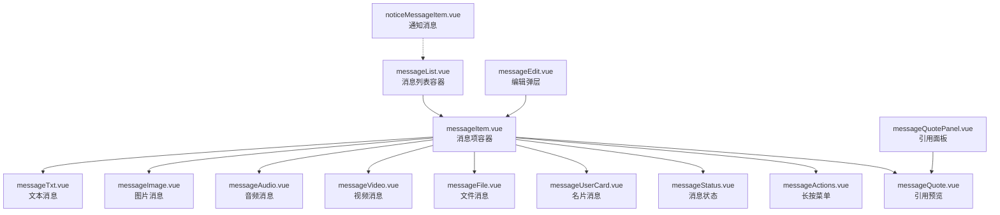
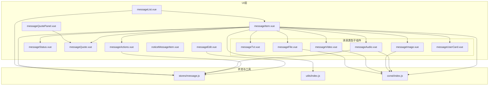
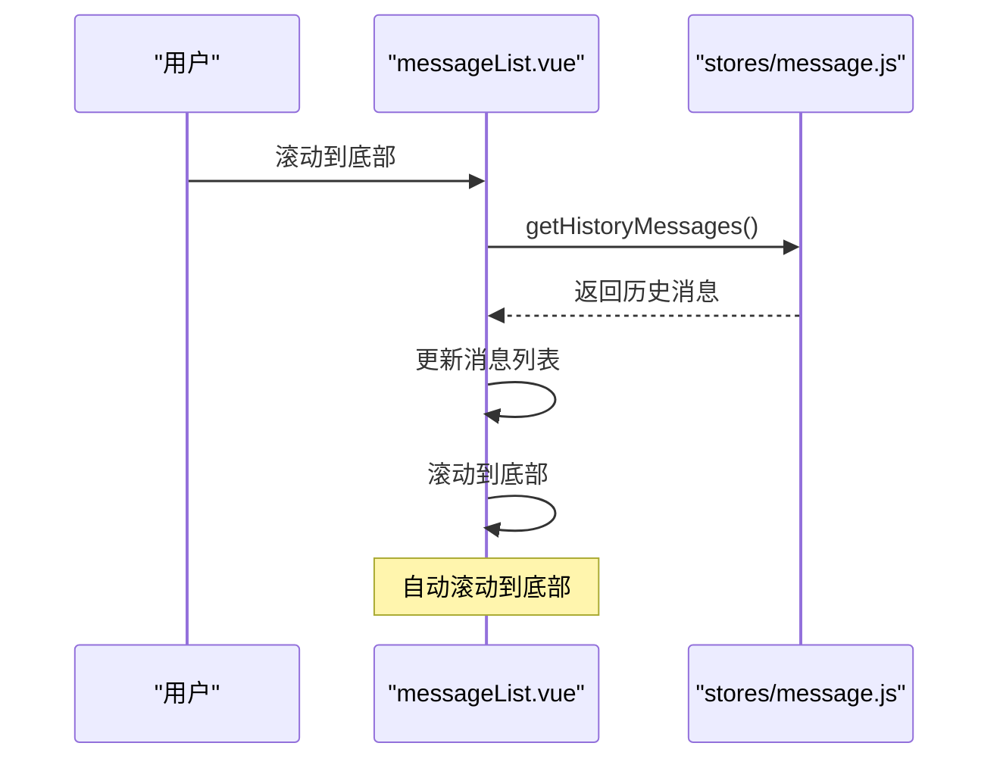
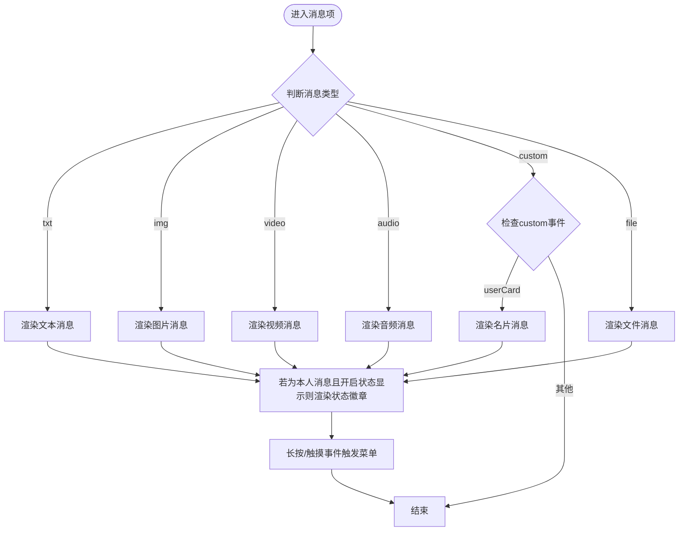
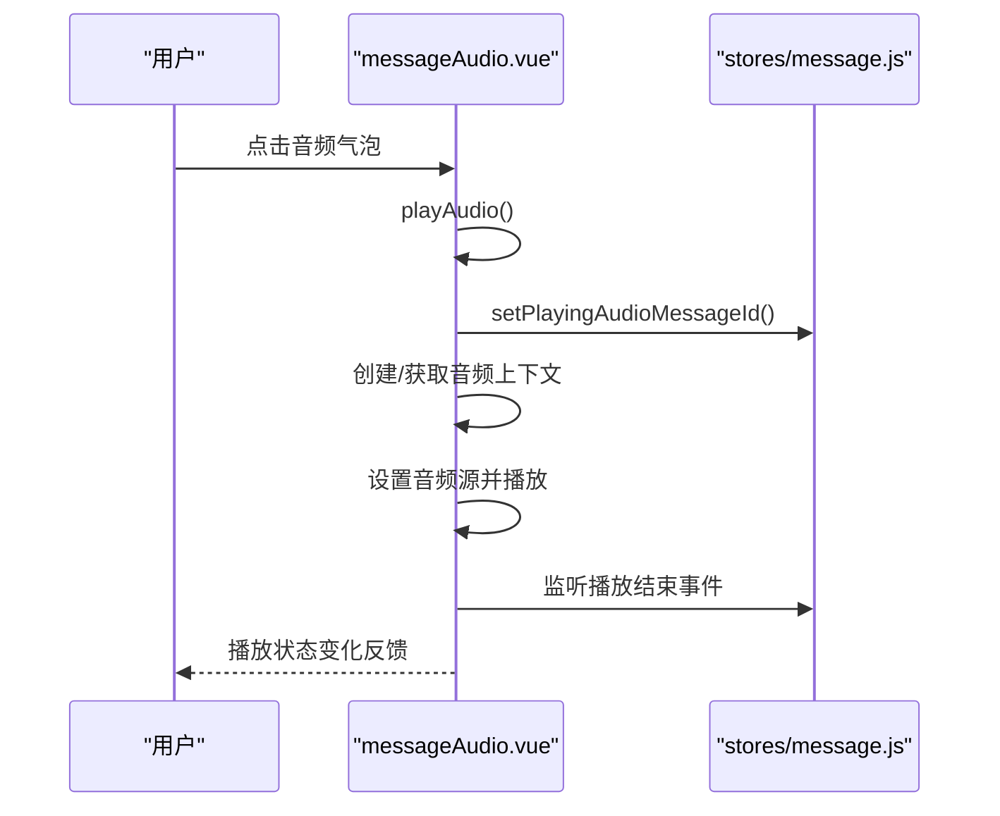
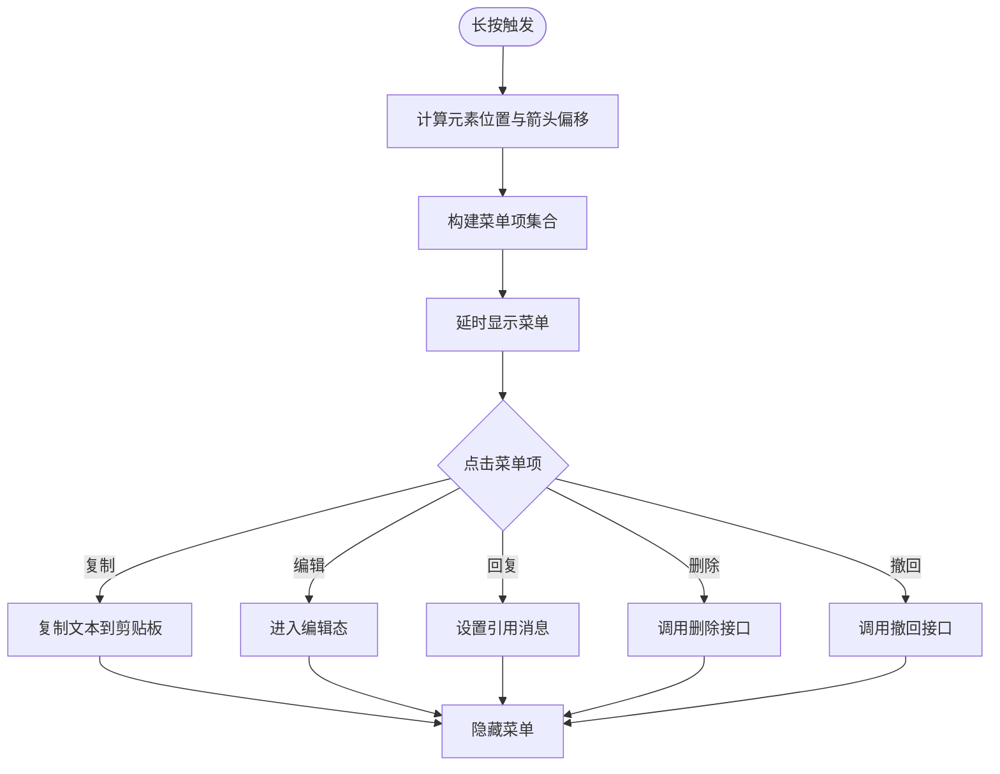
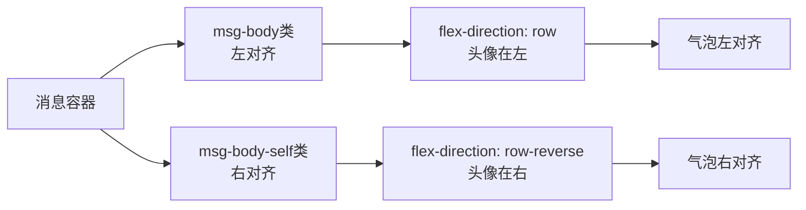
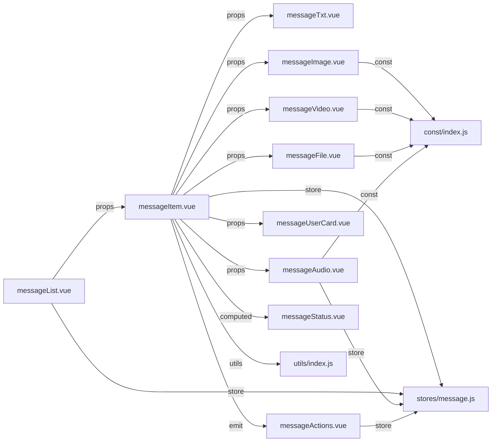

# 消息项组件

<cite>
**本文档引用的文件**
- [messageItem.vue](file://ChatUIKit-vue2/modules/Chat/components/Message/messageItem.vue)
- [messageTxt.vue](file://ChatUIKit-vue2/modules/Chat/components/Message/messageTxt.vue)
- [messageImage.vue](file://ChatUIKit-vue2/modules/Chat/components/Message/messageImage.vue)
- [messageAudio.vue](file://ChatUIKit-vue2/modules/Chat/components/Message/messageAudio.vue)
- [messageVideo.vue](file://ChatUIKit-vue2/modules/Chat/components/Message/messageVideo.vue)
- [messageFile.vue](file://ChatUIKit-vue2/modules/Chat/components/Message/messageFile.vue)
- [messageUserCard.vue](file://ChatUIKit-vue2/modules/Chat/components/Message/messageUserCard.vue)
- [messageActions.vue](file://ChatUIKit-vue2/modules/Chat/components/Message/messageActions.vue)
- [messageStatus.vue](file://ChatUIKit-vue2/modules/Chat/components/Message/messageStatus.vue)
- [messageQuote.vue](file://ChatUIKit-vue2/modules/Chat/components/Message/messageQuote.vue)
- [messageQuotePanel.vue](file://ChatUIKit-vue2/modules/Chat/components/Message/messageQuotePanel.vue)
- [messageEdit.vue](file://ChatUIKit-vue2/modules/Chat/components/Message/messageEdit.vue)
- [noticeMessageItem.vue](file://ChatUIKit-vue2/modules/Chat/components/Message/noticeMessageItem.vue)
- [messageList.vue](file://ChatUIKit-vue2/modules/Chat/components/Message/messageList.vue)
- [message.js](file://ChatUIKit-vue2/stores/message.js)
- [index.js](file://ChatUIKit-vue2/const/index.js)
- [index.js](file://ChatUIKit-vue2/utils/index.js)
- [style.scss](file://ChatUIKit/modules/Chat/style.scss)
- [common.scss](file://ChatUIKit-vue2/styles/common.scss)
</cite>

## 更新摘要
**所做更改**
- 新增消息布局对齐改进的详细说明
- 新增msg-body和msg-body-self CSS类系统的分析
- 补充消息定位和响应式设计的实现细节
- 更新消息项容器的布局机制说明
- 增加自发送消息对齐问题的解决方案

## 目录
1. [简介](#简介)
2. [项目结构](#项目结构)
3. [核心组件](#核心组件)
4. [架构总览](#架构总览)
5. [详细组件分析](#详细组件分析)
6. [布局对齐系统](#布局对齐系统)
7. [依赖关系分析](#依赖关系分析)
8. [性能考量](#性能考量)
9. [故障排查指南](#故障排查指南)
10. [结论](#结论)
11. [附录](#附录)

## 简介
本文档系统性梳理Vue2版本消息项组件系列的设计与实现，覆盖文本、图片、音频、视频、文件、名片等14种消息类型的渲染机制；说明消息项的点击、长按、菜单操作流程；阐述消息状态（发送中/已发/失败/已读）的可视化与交互；提供样式定制、主题适配与响应式布局建议；解释动画与过渡效果及用户体验优化；最后给出扩展自定义消息类型的实践方法。

**更新** 新增消息布局对齐改进，新增msg-body和msg-body-self CSS类系统，解决自发送消息对齐问题

## 项目结构
Vue2版本的消息项组件位于ChatUIKit-vue2项目的Chat模块Message组件目录下，采用按类型拆分的组件化组织方式，主容器负责布局与事件转发，子组件负责具体类型的消息渲染与交互。新增消息列表容器组件，提供消息历史加载、滚动控制等功能。



**图表来源**
- [messageList.vue](file://ChatUIKit-vue2/modules/Chat/components/Message/messageList.vue#L1-L307)
- [messageItem.vue](file://ChatUIKit-vue2/modules/Chat/components/Message/messageItem.vue#L1-L312)
- [messageTxt.vue](file://ChatUIKit-vue2/modules/Chat/components/Message/messageTxt.vue#L1-L81)
- [messageImage.vue](file://ChatUIKit-vue2/modules/Chat/components/Message/messageImage.vue#L1-L104)
- [messageAudio.vue](file://ChatUIKit-vue2/modules/Chat/components/Message/messageAudio.vue#L1-L120)
- [messageVideo.vue](file://ChatUIKit-vue2/modules/Chat/components/Message/messageVideo.vue#L1-L121)
- [messageFile.vue](file://ChatUIKit-vue2/modules/Chat/components/Message/messageFile.vue#L1-L137)
- [messageUserCard.vue](file://ChatUIKit-vue2/modules/Chat/components/Message/messageUserCard.vue#L1-L112)
- [messageActions.vue](file://ChatUIKit-vue2/modules/Chat/components/Message/messageActions.vue#L1-L339)
- [messageStatus.vue](file://ChatUIKit-vue2/modules/Chat/components/Message/messageStatus.vue#L1-L73)
- [messageQuote.vue](file://ChatUIKit-vue2/modules/Chat/components/Message/messageQuote.vue#L1-L74)
- [messageQuotePanel.vue](file://ChatUIKit-vue2/modules/Chat/components/Message/messageQuotePanel.vue#L1-L101)
- [messageEdit.vue](file://ChatUIKit-vue2/modules/Chat/components/Message/messageEdit.vue#L1-L160)
- [noticeMessageItem.vue](file://ChatUIKit-vue2/modules/Chat/components/Message/noticeMessageItem.vue#L1-L57)

**章节来源**
- [messageList.vue](file://ChatUIKit-vue2/modules/Chat/components/Message/messageList.vue#L1-L307)
- [messageItem.vue](file://ChatUIKit-vue2/modules/Chat/components/Message/messageItem.vue#L1-L312)

## 核心组件
- **消息列表容器**：负责消息历史加载、滚动控制、闪烁效果、平台差异化处理
- **消息项容器**：负责消息气泡布局、昵称显示、引用消息、状态徽章、时间戳、长按菜单挂载与事件透传
- **文本消息**：解析富文本片段（文本/表情），支持"已编辑"标记
- **图片消息**：支持缩略图/原图加载、错误占位、点击预览
- **音频消息**：支持内建音频上下文、播放/暂停、跨平台静音策略、长度指示、状态联动
- **视频消息**：封面图、播放按钮、错误占位、跳转视频预览页
- **文件消息**：文件名/大小展示、下载后打开文档（含失败提示）、WEB环境直接打开
- **名片消息**：展示对方头像与昵称，带标签
- **长按菜单**：复制/编辑/回复/删除/撤回，动态计算位置与箭头方向
- **消息状态**：发送中旋转、已发/失败/已读图标
- **引用与时间**：引用预览与跳转、时间分片显示策略
- **编辑弹层**：文本编辑、确认发送、遮罩交互
- **通知消息**：系统类提示（如撤回、群变更）

**更新** 新增消息布局对齐系统，解决自发送消息对齐问题

**章节来源**
- [messageList.vue](file://ChatUIKit-vue2/modules/Chat/components/Message/messageList.vue#L1-L307)
- [messageItem.vue](file://ChatUIKit-vue2/modules/Chat/components/Message/messageItem.vue#L1-L312)
- [messageTxt.vue](file://ChatUIKit-vue2/modules/Chat/components/Message/messageTxt.vue#L1-L81)
- [messageImage.vue](file://ChatUIKit-vue2/modules/Chat/components/Message/messageImage.vue#L1-L104)
- [messageAudio.vue](file://ChatUIKit-vue2/modules/Chat/components/Message/messageAudio.vue#L1-L120)
- [messageVideo.vue](file://ChatUIKit-vue2/modules/Chat/components/Message/messageVideo.vue#L1-L121)
- [messageFile.vue](file://ChatUIKit-vue2/modules/Chat/components/Message/messageFile.vue#L1-L137)
- [messageUserCard.vue](file://ChatUIKit-vue2/modules/Chat/components/Message/messageUserCard.vue#L1-L112)
- [messageActions.vue](file://ChatUIKit-vue2/modules/Chat/components/Message/messageActions.vue#L1-L339)
- [messageStatus.vue](file://ChatUIKit-vue2/modules/Chat/components/Message/messageStatus.vue#L1-L73)
- [messageQuote.vue](file://ChatUIKit-vue2/modules/Chat/components/Message/messageQuote.vue#L1-L74)
- [messageQuotePanel.vue](file://ChatUIKit-vue2/modules/Chat/components/Message/messageQuotePanel.vue#L1-L101)
- [messageEdit.vue](file://ChatUIKit-vue2/modules/Chat/components/Message/messageEdit.vue#L1-L160)
- [noticeMessageItem.vue](file://ChatUIKit-vue2/modules/Chat/components/Message/noticeMessageItem.vue#L1-L57)

## 架构总览
Vue2版本消息项组件通过统一容器聚合各类型子组件，并以Vuex状态驱动交互行为（播放状态、引用消息、编辑态）。工具函数提供时间格式化、文本渲染与平台能力判断；常量提供资源路径与默认尺寸；类型定义约束消息体结构。新增消息列表容器组件提供完整的消息浏览体验。



**图表来源**
- [messageList.vue](file://ChatUIKit-vue2/modules/Chat/components/Message/messageList.vue#L1-L307)
- [messageItem.vue](file://ChatUIKit-vue2/modules/Chat/components/Message/messageItem.vue#L1-L312)
- [messageTxt.vue](file://ChatUIKit-vue2/modules/Chat/components/Message/messageTxt.vue#L1-L81)
- [messageImage.vue](file://ChatUIKit-vue2/modules/Chat/components/Message/messageImage.vue#L1-L104)
- [messageAudio.vue](file://ChatUIKit-vue2/modules/Chat/components/Message/messageAudio.vue#L1-L120)
- [messageVideo.vue](file://ChatUIKit-vue2/modules/Chat/components/Message/messageVideo.vue#L1-L121)
- [messageFile.vue](file://ChatUIKit-vue2/modules/Chat/components/Message/messageFile.vue#L1-L137)
- [messageUserCard.vue](file://ChatUIKit-vue2/modules/Chat/components/Message/messageUserCard.vue#L1-L112)
- [messageActions.vue](file://ChatUIKit-vue2/modules/Chat/components/Message/messageActions.vue#L1-L339)
- [messageStatus.vue](file://ChatUIKit-vue2/modules/Chat/components/Message/messageStatus.vue#L1-L73)
- [messageQuote.vue](file://ChatUIKit-vue2/modules/Chat/components/Message/messageQuote.vue#L1-L74)
- [messageQuotePanel.vue](file://ChatUIKit-vue2/modules/Chat/components/Message/messageQuotePanel.vue#L1-L101)
- [messageEdit.vue](file://ChatUIKit-vue2/modules/Chat/components/Message/messageEdit.vue#L1-L160)
- [noticeMessageItem.vue](file://ChatUIKit-vue2/modules/Chat/components/Message/noticeMessageItem.vue#L1-L57)
- [message.js](file://ChatUIKit-vue2/stores/message.js#L1-L604)
- [index.js](file://ChatUIKit-vue2/utils/index.js)
- [index.js](file://ChatUIKit-vue2/const/index.js)

## 详细组件分析

### 消息列表容器（messageList.vue）
- **滚动控制**：支持垂直滚动、自动滚动到底部、锚点滚动定位
- **历史加载**：分页加载历史消息，支持多种平台的差异化处理
- **闪烁效果**：消息跳转时的闪烁动画，提升用户体验
- **状态管理**：集成消息状态管理，处理消息加载、更新、删除等操作
- **平台适配**：针对APP-PLUS、H5、MP-WEIXIN等平台提供不同的加载策略



**图表来源**
- [messageList.vue](file://ChatUIKit-vue2/modules/Chat/components/Message/messageList.vue#L138-L206)
- [message.js](file://ChatUIKit-vue2/stores/message.js#L167-L247)

**章节来源**
- [messageList.vue](file://ChatUIKit-vue2/modules/Chat/components/Message/messageList.vue#L1-L307)

### 消息项容器（messageItem.vue）
- **布局与方向**：根据是否本人发送切换气泡方向与对齐，支持显示昵称与时间
- **引用消息**：当存在引用扩展时渲染引用预览，支持跳转到被引用消息
- **渲染分发**：依据消息类型选择对应子组件（文本/图片/音频/视频/文件/名片）
- **状态徽章**：仅在本人消息且开启消息状态时显示发送状态
- **长按与触摸**：内置长按检测与触摸事件处理，延时触发菜单展示
- **动态样式**：根据类型与方向生成气泡背景类名，支持三角形引导线
- **自定义名片**：支持custom事件类型的消息，渲染用户名片

**更新** 新增msg-body和msg-body-self CSS类系统，解决自发送消息对齐问题



**图表来源**
- [messageItem.vue](file://ChatUIKit-vue2/modules/Chat/components/Message/messageItem.vue#L41-L58)

**章节来源**
- [messageItem.vue](file://ChatUIKit-vue2/modules/Chat/components/Message/messageItem.vue#L1-L312)

### 文本消息（messageTxt.vue）
- **文本渲染**：将消息文本解析为文本/表情片段，分别渲染
- **已编辑标记**：若消息包含修改信息，显示"已编辑"标签，区分是否本人消息
- **表情处理**：支持表情图片的渲染，表情与文本混合显示

**章节来源**
- [messageTxt.vue](file://ChatUIKit-vue2/modules/Chat/components/Message/messageTxt.vue#L1-L81)

### 图片消息（messageImage.vue）
- **加载与错误处理**：优先使用缩略图，失败时显示占位图；支持自定义宽高与裁剪模式
- **预览**：点击触发预览，禁用预览时跳过
- **自适应**：未指定尺寸时按最大边等比缩放至固定上限
- **样式配置**：支持mode、width、height、disabledPreview等属性

**章节来源**
- [messageImage.vue](file://ChatUIKit-vue2/modules/Chat/components/Message/messageImage.vue#L1-L104)

### 音频消息（messageAudio.vue）
- **播放控制**：创建/复用内建音频上下文，绑定播放/暂停/结束/错误事件
- **跨平台静音策略**：在小程序平台关闭系统静音开关影响
- **宽度计算**：根据音频时长动态计算气泡宽度，范围80-200px
- **状态联动**：通过Vuex状态管理当前播放的音频消息ID



**图表来源**
- [messageAudio.vue](file://ChatUIKit-vue2/modules/Chat/components/Message/messageAudio.vue#L63-L93)
- [message.js](file://ChatUIKit-vue2/stores/message.js#L562-L564)

**章节来源**
- [messageAudio.vue](file://ChatUIKit-vue2/modules/Chat/components/Message/messageAudio.vue#L1-L120)

### 视频消息（messageVideo.vue）
- **封面与按钮**：显示缩略图与居中播放按钮，错误时显示占位图
- **预览**：点击播放按钮跳转到视频预览页面，禁用预览时跳过
- **平台适配**：针对APP-PLUS/H5和MP-WEIXIN平台提供不同的视频播放方式
- **错误处理**：视频加载失败时显示Toast提示

**章节来源**
- [messageVideo.vue](file://ChatUIKit-vue2/modules/Chat/components/Message/messageVideo.vue#L1-L121)

### 文件消息（messageFile.vue）
- **展示**：左侧图标，右侧文件名与大小
- **打开**：WEB环境直接新开窗口；移动端下载后调用打开文档接口，失败提示
- **格式化**：文件大小自动转换为B/KB/MB格式显示

**章节来源**
- [messageFile.vue](file://ChatUIKit-vue2/modules/Chat/components/Message/messageFile.vue#L1-L137)

### 名片消息（messageUserCard.vue）
- **展示**：头像与昵称，区分本人消息的样式差异，带标签
- **交互**：点击名片触发onUserCardTap事件
- **用户信息**：从customExts扩展字段获取用户头像、昵称、UID信息

**章节来源**
- [messageUserCard.vue](file://ChatUIKit-vue2/modules/Chat/components/Message/messageUserCard.vue#L1-L112)

### 长按菜单（messageActions.vue）
- **菜单项**：复制（文本）、编辑（本人文本）、回复（非发送中/失败）、删除、撤回（本人且在时限内）
- **位置计算**：根据气泡相对视窗位置与手势坐标，自动选择上/下/溢出模式与箭头定位
- **行为**：复制文本、设置引用消息、进入编辑态、删除消息、撤回消息
- **权限控制**：基于消息状态、发送者身份、时间限制等条件动态显示菜单项



**图表来源**
- [messageActions.vue](file://ChatUIKit-vue2/modules/Chat/components/Message/messageActions.vue#L180-L252)

**章节来源**
- [messageActions.vue](file://ChatUIKit-vue2/modules/Chat/components/Message/messageActions.vue#L1-L339)

### 消息状态（messageStatus.vue）
- **状态图标**：发送中（旋转）、已发、失败、已读
- **定位**：绝对定位在气泡左下方，与气泡方向一致
- **重新发送**：失败状态支持重新发送功能

**章节来源**
- [messageStatus.vue](file://ChatUIKit-vue2/modules/Chat/components/Message/messageStatus.vue#L1-L73)

### 引用与时间
- **引用预览**：标题显示"你/回复"或对方昵称，正文渲染文本/表情片段，支持缩略图/视频预览
- **引用面板**：顶部显示引用摘要与取消按钮，支持格式化消息内容显示
- **时间显示**：根据前后消息时间差决定是否显示时间，超过阈值才显示

**章节来源**
- [messageQuote.vue](file://ChatUIKit-vue2/modules/Chat/components/Message/messageQuote.vue#L1-L74)
- [messageQuotePanel.vue](file://ChatUIKit-vue2/modules/Chat/components/Message/messageQuotePanel.vue#L1-L101)

### 编辑弹层（messageEdit.vue）
- **形态**：全屏遮罩底部弹出，标题提示"编辑消息"，输入框支持自动高度与键盘确认
- **交互**：输入变化时启用/禁用确认按钮，确认后构造修改消息并提交
- **消息格式**：创建txt类型的消息，包含用户头像和昵称信息

**章节来源**
- [messageEdit.vue](file://ChatUIKit-vue2/modules/Chat/components/Message/messageEdit.vue#L1-L160)

### 通知消息（noticeMessageItem.vue）
- **形态**：系统类提示，如撤回、群变更等，居中显示文案
- **撤回提示**：根据消息发送者身份显示不同的撤回提示文本

**章节来源**
- [noticeMessageItem.vue](file://ChatUIKit-vue2/modules/Chat/components/Message/noticeMessageItem.vue#L1-L57)

## 布局对齐系统

### msg-body和msg-body-self CSS类系统

**更新** 新增消息布局对齐改进，解决自发送消息对齐问题

消息项组件引入了全新的CSS类系统来解决自发送消息的对齐问题。该系统通过msg-body和msg-body-self两个类来控制消息容器的对齐方式。

#### 核心实现机制

在messageItem.vue中，消息容器通过以下代码实现动态对齐：

```html
<view class="msg-content" :style="{ textAlign: isSelf ? 'right' : 'left' }">
  <view :class="['msg-body', { 'msg-body-self': isSelf }]">
    <!-- 消息内容 -->
  </view>
</view>
```

对应的SCSS样式定义：

```scss
.msg-body {
  display: flex;
  flex-direction: column;
  align-items: flex-start;
}

.msg-body-self {
  align-items: flex-end;
}
```

#### 对齐效果说明

- **非自发送消息**（msg-body类）：消息内容左对齐，气泡位于左侧
- **自发送消息**（msg-body-self类）：消息内容右对齐，气泡位于右侧
- **头像位置**：通过flex-direction: row/reverse实现头像与消息气泡的正确排列

#### 响应式设计改进

新的布局系统还改进了响应式设计：

- **消息最大宽度**：使用calc(100vw - 100px)确保在不同屏幕尺寸下都有合适的间距
- **气泡三角形**：针对自发送消息使用border-left，非自发送消息使用border-right
- **时间戳对齐**：根据消息方向自动调整时间戳的对齐方式



**图表来源**
- [messageItem.vue](file://ChatUIKit-vue2/modules/Chat/components/Message/messageItem.vue#L13-L14)
- [messageItem.vue](file://ChatUIKit-vue2/modules/Chat/components/Message/messageItem.vue#L301-L309)

**章节来源**
- [messageItem.vue](file://ChatUIKit-vue2/modules/Chat/components/Message/messageItem.vue#L13-L14)
- [messageItem.vue](file://ChatUIKit-vue2/modules/Chat/components/Message/messageItem.vue#L301-L309)

## 依赖关系分析
- **组件耦合**：消息项容器与各类型子组件松耦合，通过props传递消息体；长按菜单通过ref暴露方法由父容器触发
- **状态依赖**：音频播放状态、引用消息、编辑态由Vuex管理；工具函数提供通用能力
- **平台差异**：音频静音策略、文件打开、WEB环境直链打开等通过条件编译与平台判断处理
- **类型约束**：统一的混合消息体类型确保各子组件接收的数据结构一致



**图表来源**
- [messageList.vue](file://ChatUIKit-vue2/modules/Chat/components/Message/messageList.vue#L48-L49)
- [messageItem.vue](file://ChatUIKit-vue2/modules/Chat/components/Message/messageItem.vue#L73-L82)
- [messageTxt.vue](file://ChatUIKit-vue2/modules/Chat/components/Message/messageTxt.vue#L23)
- [messageImage.vue](file://ChatUIKit-vue2/modules/Chat/components/Message/messageImage.vue#L16)
- [messageAudio.vue](file://ChatUIKit-vue2/modules/Chat/components/Message/messageAudio.vue#L16)
- [messageVideo.vue](file://ChatUIKit-vue2/modules/Chat/components/Message/messageVideo.vue#L20)
- [messageFile.vue](file://ChatUIKit-vue2/modules/Chat/components/Message/messageFile.vue#L14)
- [messageUserCard.vue](file://ChatUIKit-vue2/modules/Chat/components/Message/messageUserCard.vue#L21)
- [messageActions.vue](file://ChatUIKit-vue2/modules/Chat/components/Message/messageActions.vue#L32)
- [messageStatus.vue](file://ChatUIKit-vue2/modules/Chat/components/Message/messageStatus.vue)
- [message.js](file://ChatUIKit-vue2/stores/message.js#L1-L604)
- [index.js](file://ChatUIKit-vue2/utils/index.js)
- [index.js](file://ChatUIKit-vue2/const/index.js)

**章节来源**
- [message.js](file://ChatUIKit-vue2/stores/message.js#L1-L604)
- [index.js](file://ChatUIKit-vue2/utils/index.js)
- [index.js](file://ChatUIKit-vue2/const/index.js)

## 性能考量
- **图片与视频**：优先缩略图，按需加载；视频预览走独立页面减少DOM压力
- **音频**：单实例上下文，避免并发播放；下载转码失败时及时提示
- **列表渲染**：消息列表按需分页拉取，避免一次性渲染过多节点
- **事件节流**：长按菜单位置计算与显示可结合节流策略降低重排频率
- **样式缓存**：重复表情与文本片段尽量复用，减少节点数量
- **平台优化**：针对不同平台提供最优的加载和渲染策略
- **布局优化**：新的CSS类系统减少了复杂的条件判断，提升了渲染性能

**更新** 新增布局对齐系统的性能优化说明

## 故障排查指南
- **图片/视频加载失败**：检查缩略图/源地址是否可用，确认错误回调与占位图生效
- **音频无法播放**：确认平台静音策略与权限；检查下载与转码流程，查看失败提示
- **长按菜单不显示**：检查气泡选择器查询结果与窗口尺寸；确认延时显示逻辑
- **文件打开失败**：移动端下载后打开文档接口失败时，检查文件类型与权限
- **状态不同步**：确认Vuex中正在播放音频ID的状态更新与音频上下文生命周期
- **消息列表滚动问题**：检查滚动容器的高度设置和消息数量限制
- **自发送消息对齐问题**：检查msg-body和msg-body-self类的动态应用是否正常

**更新** 新增自发送消息对齐问题的排查方法

**章节来源**
- [messageImage.vue](file://ChatUIKit-vue2/modules/Chat/components/Message/messageImage.vue#L59-L70)
- [messageVideo.vue](file://ChatUIKit-vue2/modules/Chat/components/Message/messageVideo.vue#L52-L73)
- [messageAudio.vue](file://ChatUIKit-vue2/modules/Chat/components/Message/messageAudio.vue#L62-L93)
- [messageActions.vue](file://ChatUIKit-vue2/modules/Chat/components/Message/messageActions.vue#L180-L208)
- [messageFile.vue](file://ChatUIKit-vue2/modules/Chat/components/Message/messageFile.vue#L55-L88)
- [message.js](file://ChatUIKit-vue2/stores/message.js#L562-L564)
- [messageList.vue](file://ChatUIKit-vue2/modules/Chat/components/Message/messageList.vue#L138-L206)
- [messageItem.vue](file://ChatUIKit-vue2/modules/Chat/components/Message/messageItem.vue#L301-L309)

## 结论
Vue2版本消息项组件系列通过清晰的职责划分与状态驱动，实现了多类型消息的统一渲染与交互体验。相比Vue3版本，Vue2版本提供了更完善的平台适配和状态管理机制。消息列表容器组件提供了完整的消息浏览体验，包含历史加载、滚动控制、闪烁效果等功能。

**更新** 新增的消息布局对齐系统显著改善了自发送消息的视觉体验，通过msg-body和msg-body-self CSS类系统实现了精确的消息定位和响应式设计。

容器组件负责布局与事件，子组件专注各自类型细节，配合Vuex状态，形成可维护、可扩展的消息体系。按本文提供的样式、主题与响应式建议，以及扩展方法，可在保证一致性的同时满足多样化的业务需求。

## 附录

### 消息状态与发送状态对照
- **发送中**：旋转图标
- **已发**：单勾
- **失败**：失败图标
- **已读**：双勾加颜色区分

**章节来源**
- [messageStatus.vue](file://ChatUIKit-vue2/modules/Chat/components/Message/messageStatus.vue#L3-L7)

### 主题适配与样式定制要点
- **气泡背景与三角形**：根据是否本人消息切换类名，支持深浅主题
- **状态图标**：通过背景图与尺寸控制，适配不同主题色
- **引用面板**：背景与边框颜色应与主题一致，避免与正文冲突
- **文件图标**：背景图与尺寸固定，注意在深色主题下的对比度
- **布局对齐**：msg-body和msg-body-self类确保消息在不同主题下的正确对齐

**更新** 新增布局对齐类的样式定制要点

**章节来源**
- [messageItem.vue](file://ChatUIKit-vue2/modules/Chat/components/Message/messageItem.vue#L236-L278)
- [messageItem.vue](file://ChatUIKit-vue2/modules/Chat/components/Message/messageItem.vue#L301-L309)
- [messageStatus.vue](file://ChatUIKit-vue2/modules/Chat/components/Message/messageStatus.vue#L38-L71)
- [messageQuote.vue](file://ChatUIKit-vue2/modules/Chat/components/Message/messageQuote.vue#L46-L72)
- [messageFile.vue](file://ChatUIKit-vue2/modules/Chat/components/Message/messageFile.vue#L93-L136)

### 响应式设计建议
- **气泡最大宽度**：随屏幕宽度自适应，避免溢出
- **文本换行**：强制断词与换行，避免长串不换行导致布局异常
- **图片/视频尺寸**：按最长边等比缩放，避免超屏
- **菜单定位**：靠近手势位置，必要时溢出视窗时调整箭头与定位
- **消息列表适配**：不同平台的消息列表高度和滚动行为需要适配
- **布局对齐**：msg-body和msg-body-self类确保在小屏幕设备上的正确对齐

**更新** 新增布局对齐系统的响应式设计考虑

**章节来源**
- [messageItem.vue](file://ChatUIKit-vue2/modules/Chat/components/Message/messageItem.vue#L255-L256)
- [messageItem.vue](file://ChatUIKit-vue2/modules/Chat/components/Message/messageItem.vue#L298-L299)
- [messageImage.vue](file://ChatUIKit-vue2/modules/Chat/components/Message/messageImage.vue#L72-L94)
- [messageVideo.vue](file://ChatUIKit-vue2/modules/Chat/components/Message/messageVideo.vue#L43-L48)
- [messageActions.vue](file://ChatUIKit-vue2/modules/Chat/components/Message/messageActions.vue#L180-L208)
- [messageList.vue](file://ChatUIKit-vue2/modules/Chat/components/Message/messageList.vue#L210-L228)

### 动画与过渡效果
- **发送中旋转**：使用CSS动画实现持续旋转
- **菜单显隐**：通过延时与透明度/位移实现自然过渡
- **长按反馈**：触摸开始计时，结束或移动时清理计时器，避免误触
- **消息闪烁**：跳转到特定消息时的闪烁动画效果
- **加载动画**：历史消息加载时的旋转动画
- **布局过渡**：msg-body类的动态切换带来的平滑过渡效果

**更新** 新增布局对齐系统的动画效果说明

**章节来源**
- [messageStatus.vue](file://ChatUIKit-vue2/modules/Chat/components/Message/messageStatus.vue#L64-L71)
- [messageActions.vue](file://ChatUIKit-vue2/modules/Chat/components/Message/messageActions.vue#L204-L208)
- [messageItem.vue](file://ChatUIKit-vue2/modules/Chat/components/Message/messageItem.vue#L192-L215)
- [messageList.vue](file://ChatUIKit-vue2/modules/Chat/components/Message/messageList.vue#L230-L244)
- [messageList.vue](file://ChatUIKit-vue2/modules/Chat/components/Message/messageList.vue#L263-L272)

### 扩展自定义消息类型的最佳实践
- **新增子组件**：遵循现有props结构与命名规范，确保与容器组件兼容
- **注册渲染分支**：在容器组件中新增类型判断与子组件引用
- **状态与交互**：如需播放/预览等能力，参考音频/图片/视频组件的上下文与事件处理
- **菜单支持**：在长按菜单中增加对应操作项，注意权限与时限控制
- **样式与主题**：提供主题变量与暗色适配，保证在不同主题下可读性与一致性
- **平台适配**：针对不同平台提供相应的功能实现和用户体验优化
- **状态管理**：通过Vuex状态管理新增消息类型的特殊状态和行为
- **布局对齐**：新消息类型应遵循msg-body和msg-body-self的对齐原则

**更新** 新增布局对齐系统的扩展要求

**章节来源**
- [messageItem.vue](file://ChatUIKit-vue2/modules/Chat/components/Message/messageItem.vue#L53-L55)
- [messageActions.vue](file://ChatUIKit-vue2/modules/Chat/components/Message/messageActions.vue#L112-L178)
- [message.js](file://ChatUIKit-vue2/stores/message.js#L1-L604)

### Vue2版本特有功能
- **条件编译**：使用#ifdef/#endif指令实现平台差异化功能
- **Vuex状态管理**：完整的消息状态管理，包括播放状态、引用消息、编辑态
- **平台适配**：针对APP-PLUS、H5、MP-WEIXIN等平台提供专门的处理逻辑
- **消息列表增强**：提供完整的消息浏览体验，包括历史加载、滚动控制、闪烁效果
- **布局对齐系统**：新增msg-body和msg-body-self类系统，解决自发送消息对齐问题

**更新** 新增布局对齐系统的Vue2版本特有功能说明

**章节来源**
- [messageVideo.vue](file://ChatUIKit-vue2/modules/Chat/components/Message/messageVideo.vue#L60-L73)
- [messageFile.vue](file://ChatUIKit-vue2/modules/Chat/components/Message/messageFile.vue#L63-L87)
- [messageList.vue](file://ChatUIKit-vue2/modules/Chat/components/Message/messageList.vue#L155-L176)
- [message.js](file://ChatUIKit-vue2/stores/message.js#L1-L604)
- [messageItem.vue](file://ChatUIKit-vue2/modules/Chat/components/Message/messageItem.vue#L301-L309)