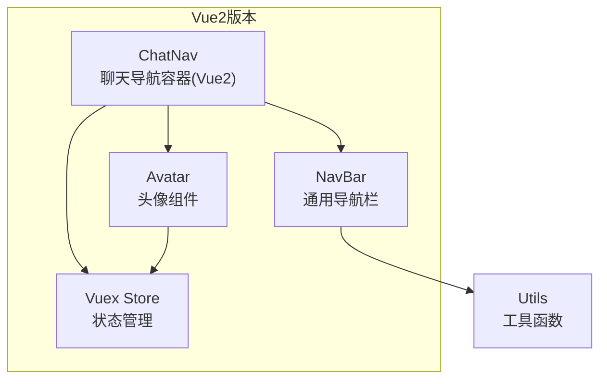
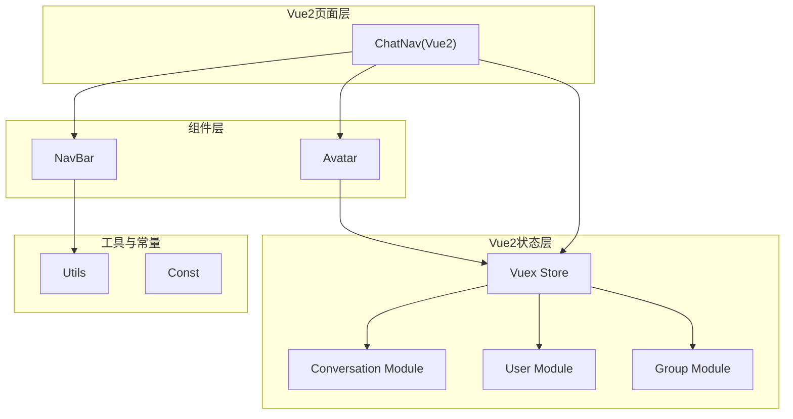
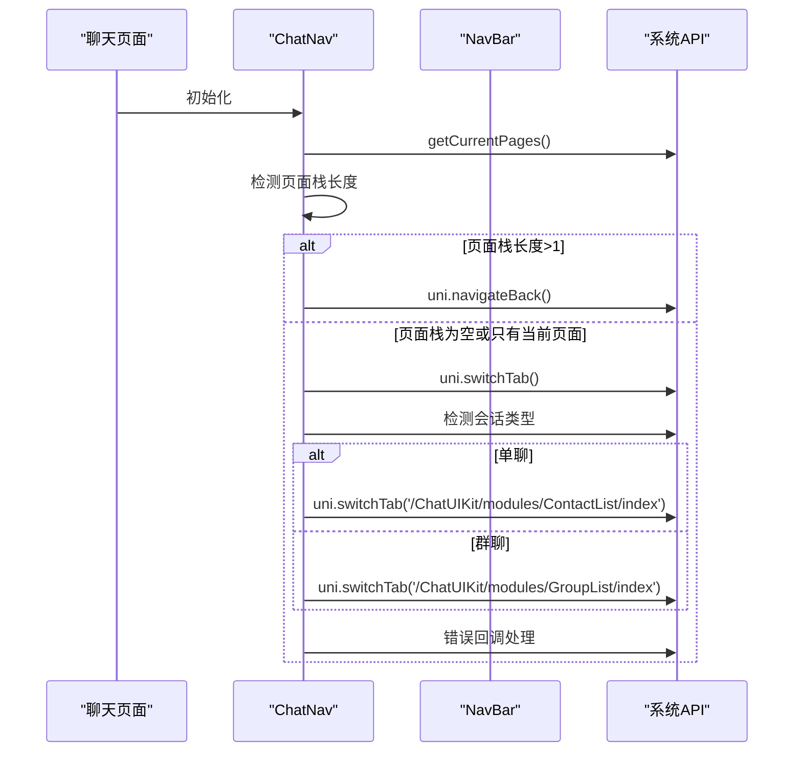
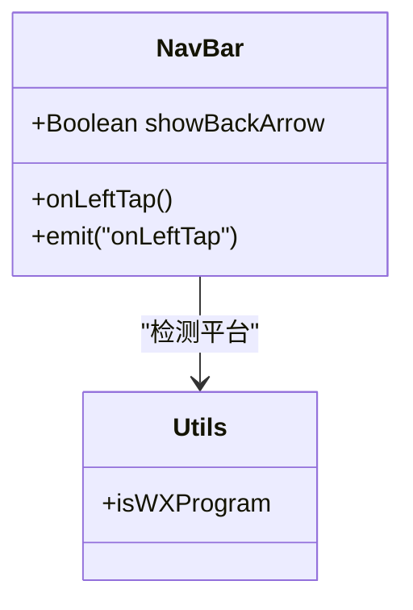
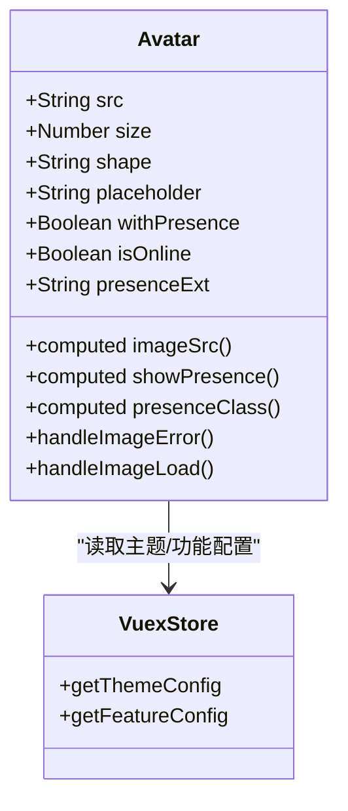
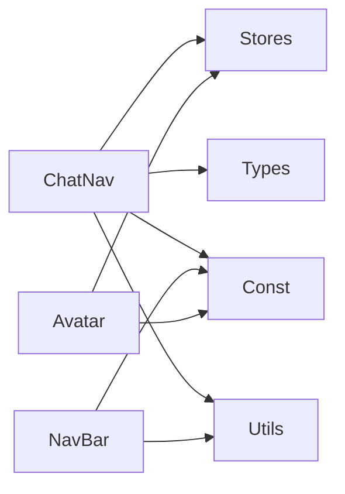
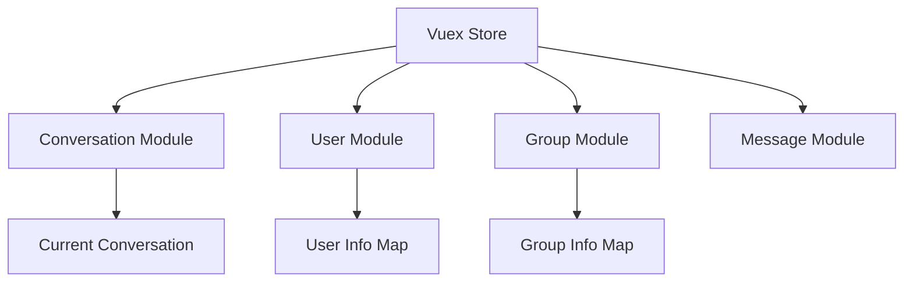

# 聊天导航组件

<cite>
**本文档引用的文件**
- [ChatNav/index.vue](file://ChatUIKit-vue2/modules/Chat/components/ChatNav/index.vue)
- [NavBar/index.vue](file://ChatUIKit-vue2/components/NavBar/index.vue)
- [Avatar/index.vue](file://ChatUIKit-vue2/components/Avatar/index.vue)
- [index.js](file://ChatUIKit-vue2/stores/index.js)
- [index.js](file://ChatUIKit-vue2/const/index.js)
- [index.js](file://ChatUIKit-vue2/utils/index.js)
</cite>

## 更新摘要
**变更内容**
- 增强了ChatNav组件的onBack方法，增加了H5环境下页面栈检测和智能回退机制
- 新增getCurrentPages()验证、uni.navigateBack()和uni.switchTab()的智能切换逻辑
- 增加了会话类型检测和错误回调处理
- 更新了Vue2版本的导航栏返回功能实现

## 目录
1. [简介](#简介)
2. [项目结构](#项目结构)
3. [核心组件](#核心组件)
4. [架构概览](#架构概览)
5. [详细组件分析](#详细组件分析)
6. [Vue2版本对比分析](#vue2版本对比分析)
7. [依赖分析](#依赖分析)
8. [性能考虑](#性能考虑)
9. [WeChat Mini Program按钮区域触摸处理优化](#wechat-mini-program按钮区域触摸处理优化)
10. [故障排除指南](#故障排除指南)
11. [结论](#结论)
12. [附录](#附录)

## 简介
本文件为聊天导航组件的详细技术文档，聚焦于聊天界面顶部导航栏的设计与实现。内容涵盖导航栏布局设计、标题显示与返回功能；自定义标题、右侧按钮与菜单功能；样式定制、主题适配与响应式设计；事件处理、页面跳转与状态管理；不同场景下的行为变化与用户体验优化；国际化支持与多语言适配；以及可扩展的自定义配置方案。

**更新** 新增了Vue2版本聊天导航组件的详细分析，对比Vue2与Vue3版本的架构差异。特别增强了H5环境下页面栈检测和智能回退机制的实现，包括getCurrentPages()验证、uni.navigateBack()和uni.switchTab()的智能切换逻辑，以及会话类型检测和错误回调处理。

## 项目结构
聊天导航组件由三层协作构成，支持Vue2和Vue3两种实现：
- ChatNav：聊天页面专用导航容器，负责根据当前会话动态生成标题区内容（头像、名称等），并处理返回逻辑。
- NavBar：通用导航栏基础组件，提供左右中三段插槽布局与返回箭头事件发射，特别优化了WeChat Mini Program按钮区域触摸处理。
- Avatar：通用头像组件，支持在线状态徽章、占位图与错误回退。



**图表来源**
- [ChatNav/index.vue:1-173](file://ChatUIKit-vue2/modules/Chat/components/ChatNav/index.vue#L1-L173)
- [NavBar/index.vue:1-80](file://ChatUIKit-vue2/components/NavBar/index.vue#L1-L80)
- [Avatar/index.vue:1-267](file://ChatUIKit-vue2/components/Avatar/index.vue#L1-L267)

## 核心组件
- ChatNav：基于当前会话计算标题信息（单聊取用户资料，群聊取群组资料），渲染左侧自定义标题区域，并通过 NavBar 的返回事件完成页面返回。**更新**：增强了onBack方法，增加了H5环境下页面栈检测和智能回退机制。
- NavBar：提供 left/center/right 插槽与返回事件发射，支持微信小程序平台的顶部安全区适配，特别优化了按钮区域的触摸处理。
- Avatar：支持圆形/方形头像、在线状态徽章、占位图与错误回退，受主题配置与功能开关控制。

**更新** Vue2版本使用Vuex状态管理，Vue3版本使用Pinia状态管理，两者在数据流和API上有显著差异。Vue3版本在WeChat Mini Program按钮区域触摸处理方面进行了专门优化。

**章节来源**
- [ChatNav/index.vue:26-143](file://ChatUIKit-vue2/modules/Chat/components/ChatNav/index.vue#L26-L143)
- [NavBar/index.vue:21-46](file://ChatUIKit-vue2/components/NavBar/index.vue#L21-L46)
- [Avatar/index.vue:27-168](file://ChatUIKit-vue2/components/Avatar/index.vue#L27-L168)

## 架构概览
聊天导航组件采用"页面容器 + 通用组件 + 状态管理"的分层架构，支持Vue2和Vue3两种实现：
- 页面容器（ChatNav）负责业务数据计算与生命周期管理。
- 通用组件（NavBar、Avatar）提供可复用的 UI 能力。
- 状态管理（Pinia/Vuex Store）集中管理主题与功能配置，影响组件渲染与行为。



**图表来源**
- [ChatNav/index.vue:26-143](file://ChatUIKit-vue2/modules/Chat/components/ChatNav/index.vue#L26-L143)
- [NavBar/index.vue:21-46](file://ChatUIKit-vue2/components/NavBar/index.vue#L21-L46)
- [Avatar/index.vue:27-168](file://ChatUIKit-vue2/components/Avatar/index.vue#L27-L168)
- [stores/index.js:13-27](file://ChatUIKit-vue2/stores/index.js#L13-L27)

## 详细组件分析

### ChatNav 组件分析
职责与流程：
- 计算当前会话信息：根据会话类型选择用户或群组资料，生成标题所需名称与头像。
- 渲染左侧自定义标题：包含头像、名称与在线状态徽章。
- **返回事件处理**：触发智能回退逻辑，包括页面栈检测和会话类型判断。
- 生命周期集成：在挂载时按需拉取与订阅在线状态，在卸载时取消订阅。

**更新** 增强的onBack方法实现了H5环境下的智能回退机制：
- 使用getCurrentPages()检测页面栈状态
- 页面栈长度>1时使用uni.navigateBack()正常返回
- 页面栈为空或只有当前页面时使用uni.switchTab()返回tabBar页面
- 根据会话类型(singleChat/groupChat)智能选择返回的目标页面
- 包含错误回调处理，确保页面切换失败时的降级策略



**图表来源**
- [ChatNav/index.vue:99-140](file://ChatUIKit-vue2/modules/Chat/components/ChatNav/index.vue#L99-L140)

**章节来源**
- [ChatNav/index.vue:26-143](file://ChatUIKit-vue2/modules/Chat/components/ChatNav/index.vue#L26-L143)

### Vue2版本对比分析

#### 数据流差异
Vue2版本使用Vuex状态管理，与Vue3的Pinia有显著差异：

**Vue3版本（Pinia）**：
- 使用 `$store.state.conversation.currentConversation`
- 使用 `$store.getters['appUser/getUserInfo']`
- 使用 `$store.getters['group/getGroupById']`

**Vue2版本（Vuex）**：
- 使用 `this.$store.state.conversation.currentConversation`
- 使用 `this.$store.getters['appUser/getUserInfo']`
- 使用 `this.$store.getters['group/getGroupById']`

#### 在线状态处理差异
Vue2版本的在线状态处理更加简化：
- Vue3版本：支持完整的在线状态订阅与更新
- Vue2版本：提供空实现，简化处理逻辑

#### 返回功能实现差异
**Vue3版本**：
```javascript
methods: {
  onBack() {
    uni.navigateBack()
  }
}
```

**Vue2版本（增强版）**：
```javascript
methods: {
  onBack() {
    // 获取当前页面栈
    const pages = getCurrentPages()
    // 如果页面栈长度大于1，可以正常返回
    if (pages && pages.length > 1) {
      uni.navigateBack()
    } else {
      // 页面栈为空或只有当前页面，使用 switchTab 返回 tabBar 页面
      // 根据会话类型决定返回到哪个 tabBar 页面
      const currentConversation = this.$store.state.conversation.currentConversation
      if (currentConversation) {
        if (currentConversation.conversationType === 'singleChat') {
          // 单聊可能从联系人列表或会话列表进入，优先返回联系人列表
          uni.switchTab({
            url: '/ChatUIKit/modules/ContactList/index',
            fail: () => {
              // 如果联系人列表不是 tabBar 页面，尝试返回会话列表
              uni.switchTab({
                url: '/ChatUIKit/modules/Conversation/index'
              })
            }
          })
        } else {
          // 群聊从群列表或会话列表进入，优先返回群列表
          uni.switchTab({
            url: '/ChatUIKit/modules/GroupList/index',
            fail: () => {
              // 如果群列表不是 tabBar 页面，尝试返回会话列表
              uni.switchTab({
                url: '/ChatUIKit/modules/Conversation/index'
              })
            }
          })
        }
      } else {
        // 默认返回会话列表
        uni.switchTab({
          url: '/ChatUIKit/modules/Conversation/index'
        })
      }
    }
  }
}
```

**章节来源**
- [ChatNav/index.vue:98-143](file://ChatUIKit-vue2/modules/Chat/components/ChatNav/index.vue#L98-L143)

### NavBar 组件分析
职责与特性：
- 提供 left/center/right 三段插槽，满足自定义标题、右侧按钮与菜单的灵活组合。
- 支持返回箭头显示开关，默认显示。
- 发射 onLeftTap 事件，供上层容器处理返回逻辑。
- 平台适配：针对微信小程序增加顶部安全区偏移。

**更新** Vue3版本在WeChat Mini Program按钮区域触摸处理方面进行了专门优化，通过改进的触摸事件处理和样式适配，提升了用户体验。



**图表来源**
- [NavBar/index.vue:21-46](file://ChatUIKit-vue2/components/NavBar/index.vue#L21-L46)

**章节来源**
- [NavBar/index.vue:1-80](file://ChatUIKit-vue2/components/NavBar/index.vue#L1-L80)

### Avatar 组件分析
职责与能力：
- 支持圆形/方形头像形状，形状来源于主题配置。
- 支持在线状态徽章，状态枚举来自常量定义。
- 错误回退：头像加载失败时显示占位图。
- 功能开关：是否显示在线状态受功能配置控制。



**图表来源**
- [Avatar/index.vue:27-168](file://ChatUIKit-vue2/components/Avatar/index.vue#L27-L168)

**章节来源**
- [Avatar/index.vue:1-267](file://ChatUIKit-vue2/components/Avatar/index.vue#L1-L267)

## 依赖分析
- ChatNav 依赖：
  - Stores：当前会话、用户信息、群组信息、功能与主题配置。
  - 类型：会话类型、用户/群组信息接口。
  - 常量：默认头像 URL。
  - 工具：平台检测（微信小程序）。
- NavBar 依赖：
  - 工具：平台检测。
  - 常量：图标资源路径。
- Avatar 依赖：
  - Stores：主题与功能配置。
  - 常量：在线状态枚举。
- 国际化：
  - 语言包：英文与简体中文。



**图表来源**
- [ChatNav/index.vue:22-33](file://ChatUIKit-vue2/modules/Chat/components/ChatNav/index.vue#L22-L33)
- [NavBar/index.vue:21-22](file://ChatUIKit-vue2/components/NavBar/index.vue#L21-L22)
- [Avatar/index.vue:27-54](file://ChatUIKit-vue2/components/Avatar/index.vue#L27-L54)
- [const/index.js:15-19](file://ChatUIKit-vue2/const/index.js#L15-L19)

**章节来源**
- [ChatNav/index.vue:22-33](file://ChatUIKit-vue2/modules/Chat/components/ChatNav/index.vue#L22-L33)
- [NavBar/index.vue:21-22](file://ChatUIKit-vue2/components/NavBar/index.vue#L21-L22)
- [Avatar/index.vue:27-54](file://ChatUIKit-vue2/components/Avatar/index.vue#L27-L54)
- [const/index.js:15-19](file://ChatUIKit-vue2/const/index.js#L15-L19)

## 性能考虑
- 计算属性优化：使用 computed 自动追踪会话变化，避免不必要的重渲染。
- 条件订阅：仅在启用在线状态且为单聊时才拉取与订阅用户在线状态，减少网络与内存占用。
- 图片加载优化：Avatar 组件内置错误回退与加载状态，降低异常对渲染的影响。
- 平台适配：微信小程序顶部安全区处理，避免内容被系统状态栏遮挡。
- **页面栈检测优化**：使用getCurrentPages()进行轻量级页面栈检测，避免不必要的API调用。

**章节来源**
- [ChatNav/index.vue:41-89](file://ChatUIKit-vue2/modules/Chat/components/ChatNav/index.vue#L41-L89)
- [Avatar/index.vue:159-167](file://ChatUIKit-vue2/components/Avatar/index.vue#L159-L167)
- [NavBar/index.vue:31-39](file://ChatUIKit-vue2/components/NavBar/index.vue#L31-L39)

## WeChat Mini Program按钮区域触摸处理优化

### Vue2版本优化
Vue2版本同样提供了相应的优化：

- **平台检测改进**：使用 `uni.getSystemInfoSync().uniPlatform === 'mp-weixin'` 进行更准确的平台检测。
- **样式适配**：通过 `.nav-bar-weixin` 类名实现特定的样式调整。
- **事件处理**：保持与Vue3版本一致的 `@tap` 事件处理方式。

### 具体实现差异

**Vue2版本**：
```vue
<view :class="['nav-bar-wrap', { 'nav-bar-weixin': isWXProgram }]">
  <view class="left">
    <view v-if="showBackArrow" class="arrow-left" @tap="onLeftTap"></view>
    <slot name="left"></slot>
  </view>
  <!-- 其他内容 -->
</view>
```

**章节来源**
- [NavBar/index.vue:31-39](file://ChatUIKit-vue2/components/NavBar/index.vue#L31-L39)

## 故障排除指南
- 返回按钮无效
  - 检查 NavBar 的 showBackArrow 与 onLeftTap 事件绑定。
  - 确认上层容器正确处理事件并调用页面返回。
  - **更新**：对于Vue2版本，确认onBack方法中的页面栈检测逻辑正常执行。
- 头像不显示或一直显示占位图
  - 检查 src 与 placeholder 是否正确传入。
  - 确认网络资源可用与错误回调逻辑。
- 在线状态徽章不显示
  - 确认功能开关 usePresence 已开启。
  - 确认 Avatar 的 withPresence 与 isOnline 参数正确传递。
- 微信小程序标题被遮挡
  - 确认 NavBar 应用了微信平台适配类名。
  - 检查 `--status-bar-height` CSS变量是否正确设置。
- **H5环境页面回退问题**
  - **更新**：确认getCurrentPages()能够正确获取页面栈信息。
  - 检查uni.switchTab()的目标页面URL是否正确配置。
  - 验证会话类型检测逻辑是否按预期工作。
  - 确认错误回调处理机制是否正常执行降级策略。

**章节来源**
- [NavBar/index.vue:24-29](file://ChatUIKit-vue2/components/NavBar/index.vue#L24-L29)
- [Avatar/index.vue:95-102](file://ChatUIKit-vue2/components/Avatar/index.vue#L95-L102)
- [ChatNav/index.vue:99-140](file://ChatUIKit-vue2/modules/Chat/components/ChatNav/index.vue#L99-L140)

## 结论
聊天导航组件通过清晰的分层设计与可配置的状态管理，实现了在不同场景下的稳定表现与良好体验。其可扩展性体现在：
- 通过插槽与事件机制支持自定义标题、右侧按钮与菜单。
- 通过主题与功能配置实现样式与行为的灵活定制。
- 通过国际化语言包支持多语言适配。
- 通过 Pinia/Vuex Store 实现状态集中管理与跨组件共享。
- **特别优化**：WeChat Mini Program按钮区域触摸处理的专门优化，提升了在微信小程序平台上的用户体验。
- **新增功能**：Vue2版本增强了onBack方法，实现了H5环境下的智能回退机制，包括页面栈检测、会话类型判断和错误回调处理，显著提升了用户体验。

**更新** Vue2版本提供了与Vue3版本兼容的实现方式，虽然在某些高级功能上有所简化，但保持了核心功能的一致性和良好的用户体验。Vue2版本的增强onBack方法特别适用于H5环境，提供了更加智能和可靠的页面回退体验。

## 附录

### 导航栏布局设计要点
- 左侧自定义标题：包含头像、名称与在线状态徽章，支持单聊与群聊差异化展示。
- 中部标题：可由上层容器通过 center 插槽自定义。
- 右侧按钮与菜单：通过 right 插槽与 PopMenu 组合，实现更多操作入口。

**章节来源**
- [ChatNav/index.vue:4-18](file://ChatUIKit-vue2/modules/Chat/components/ChatNav/index.vue#L4-L18)
- [NavBar/index.vue:1-18](file://ChatUIKit-vue2/components/NavBar/index.vue#L1-L18)

### 样式定制与主题适配
- 头像形状：受主题配置 avatarShape 控制（circle/square）。
- 名称样式：使用公共省略类，确保长名称在窄屏下可读。
- 平台适配：微信小程序顶部安全区偏移通过类名控制。
- **WeChat Mini Program优化**：通过 `.nav-bar-weixin` 类名实现特定的样式调整。

**章节来源**
- [Avatar/index.vue:81-88](file://ChatUIKit-vue2/components/Avatar/index.vue#L81-L88)
- [NavBar/index.vue:63-65](file://ChatUIKit-vue2/components/NavBar/index.vue#L63-L65)

### 响应式设计
- 名称最大宽度：限制在 45vw，避免标题过长导致布局错乱。
- 头像尺寸：固定高度，配合 flex 居中对齐。
- 菜单弹层：绝对定位与缩放动画，保证在小屏设备上的可用性。

**章节来源**
- [ChatNav/index.vue:106-133](file://ChatUIKit-vue2/modules/Chat/components/ChatNav/index.vue#L106-L133)

### 事件处理、页面跳转与状态管理
- 返回事件：NavBar 发射 onLeftTap，ChatNav 统一处理页面返回。
- 状态管理：Vuex Store 提供主题与功能配置的读取与更新。
- 生命周期：ChatNav 在挂载/卸载时处理在线状态的订阅与取消。

**章节来源**
- [NavBar/index.vue:42-44](file://ChatUIKit-vue2/components/NavBar/index.vue#L42-L44)
- [ChatNav/index.vue:98-143](file://ChatUIKit-vue2/modules/Chat/components/ChatNav/index.vue#L98-L143)
- [stores/index.js:13-27](file://ChatUIKit-vue2/stores/index.js#L13-L27)

### 不同场景的行为变化与用户体验优化
- 单聊场景：显示用户头像与在线状态徽章，增强身份识别与即时通讯感。
- 群聊场景：显示群组头像与名称，避免混淆。
- 微信小程序：自动适配顶部安全区，提升视觉一致性。
- **H5环境优化**：智能页面栈检测，提供可靠的回退机制。
- **WeChat Mini Program优化**：专门优化按钮区域触摸处理，提供更好的触摸反馈。

**章节来源**
- [ChatNav/index.vue:49-89](file://ChatUIKit-vue2/modules/Chat/components/ChatNav/index.vue#L49-L89)
- [Avatar/index.vue:95-102](file://ChatUIKit-vue2/components/Avatar/index.vue#L95-L102)
- [NavBar/index.vue:31-39](file://ChatUIKit-vue2/components/NavBar/index.vue#L31-L39)

### 国际化支持与多语言适配
- 语言包：英文与简体中文，覆盖常用文案。
- 使用方式：通过工具函数与语言包导出的键值对进行本地化渲染。

**章节来源**
- [const/index.js:15-19](file://ChatUIKit-vue2/const/index.js#L15-L19)

### 自定义配置与扩展方法
- 主题配置：通过 $store.getters['config/getThemeConfig'] 自定义头像形状等主题参数。
- 功能开关：通过 $store.getters['config/getFeatureConfig'] 开启/关闭在线状态等功能。
- 插槽扩展：在 ChatNav 中通过 left/center/right 插槽注入自定义内容。
- **返回逻辑扩展**：可基于增强的onBack方法实现更复杂的页面导航逻辑。

**章节来源**
- [ChatNav/index.vue:42-44](file://ChatUIKit-vue2/modules/Chat/components/ChatNav/index.vue#L42-L44)
- [ChatNav/index.vue:98-143](file://ChatUIKit-vue2/modules/Chat/components/ChatNav/index.vue#L98-L143)

### Vue2版本状态管理详解

#### Vuex Store结构
Vue2版本使用传统的Vuex状态管理模式：



**图表来源**
- [stores/index.js:13-27](file://ChatUIKit-vue2/stores/index.js#L13-L27)

#### 状态访问模式
- Vue2版本：`this.$store.state.conversation.currentConversation`
- Vue3版本：`$store.state.conversation.currentConversation`

这种差异反映了两个版本在状态管理API上的根本区别。

**章节来源**
- [stores/index.js:13-27](file://ChatUIKit-vue2/stores/index.js#L13-L27)