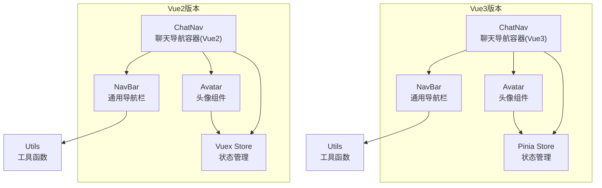
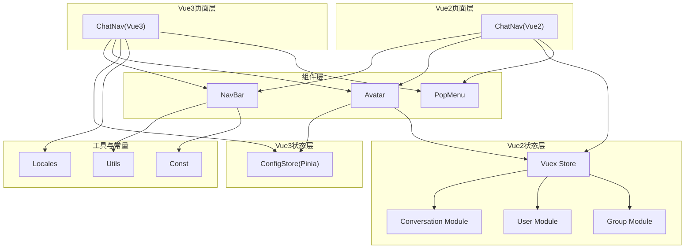
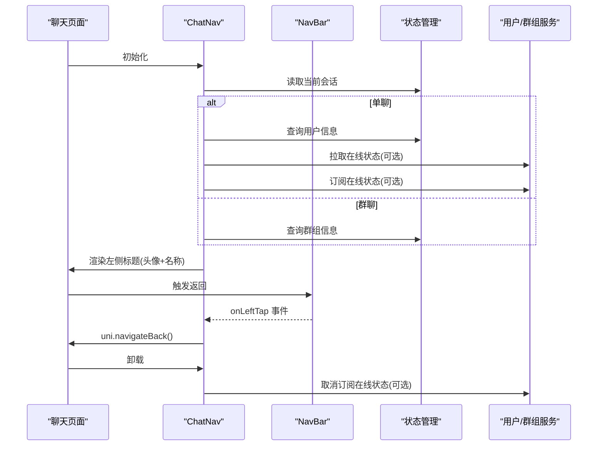
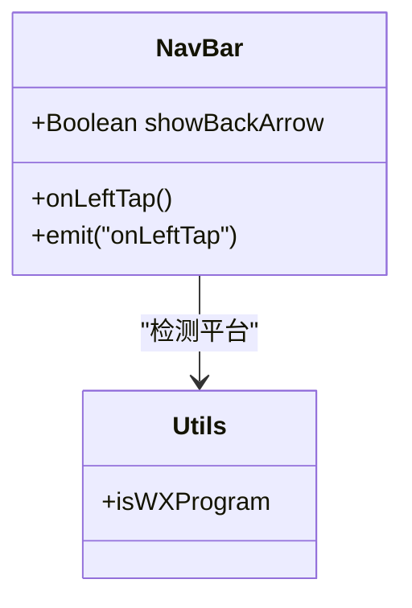
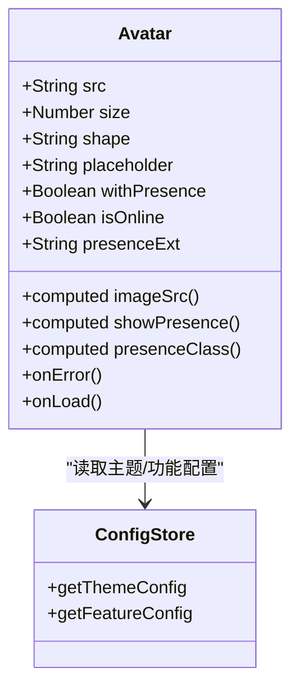
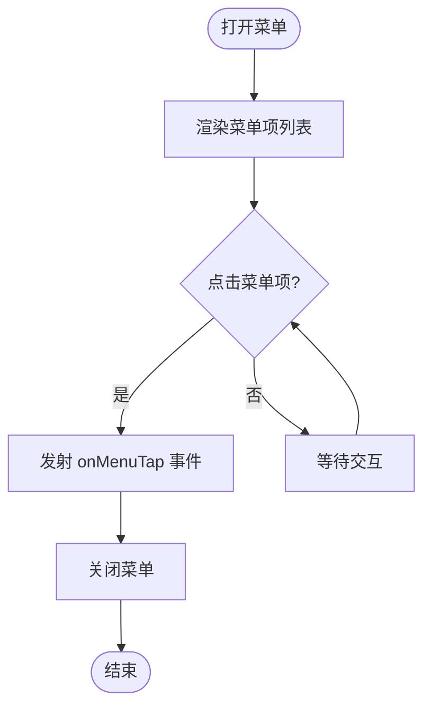
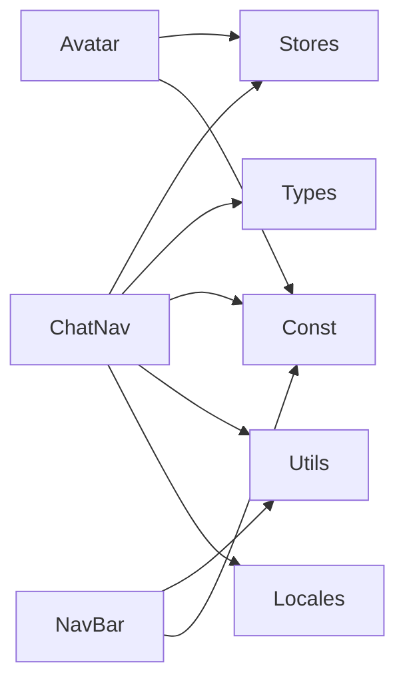
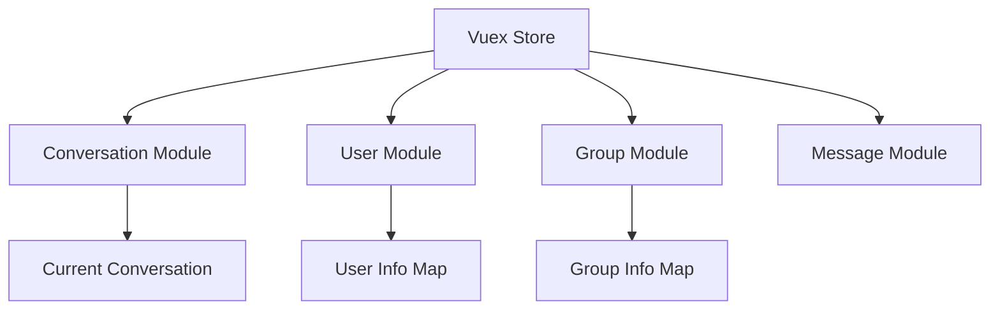

# 聊天导航组件

<cite>
**本文档引用的文件**
- [ChatNav/index.vue](file://ChatUIKit/modules/Chat/components/ChatNav/index.vue)
- [NavBar/index.vue](file://ChatUIKit/components/NavBar/index.vue)
- [Avatar/index.vue](file://ChatUIKit/components/Avatar/index.vue)
- [ChatNav/index.vue](file://ChatUIKit-vue2/modules/Chat/components/ChatNav/index.vue)
- [NavBar/index.vue](file://ChatUIKit-vue2/components/NavBar/index.vue)
- [Avatar/index.vue](file://ChatUIKit-vue2/components/Avatar/index.vue)
- [PopMenu/index.vue](file://ChatUIKit-vue2/components/PopMenu/index.vue)
- [index.js](file://ChatUIKit-vue2/stores/index.js)
- [conversation.js](file://ChatUIKit-vue2/stores/conversation.js)
- [appUser.js](file://ChatUIKit-vue2/stores/appUser.js)
- [group.js](file://ChatUIKit-vue2/stores/group.js)
- [index.js](file://ChatUIKit-vue2/const/index.js)
- [index.js](file://ChatUIKit-vue2/utils/index.js)
- [config.ts](file://ChatUIKit/stores/config.ts)
- [index.ts](file://ChatUIKit/const/index.ts)
- [common.scss](file://ChatUIKit/styles/common.scss)
- [index.ts](file://ChatUIKit/types/index.ts)
- [en.ts](file://ChatUIKit/locales/en.ts)
- [zh-Hans.ts](file://ChatUIKit/locales/zh-Hans.ts)
- [index.ts](file://ChatUIKit/utils/index.ts)
</cite>

## 更新摘要
**变更内容**
- 新增Vue2版本聊天导航组件的详细分析
- 对比Vue2与Vue3版本的架构差异
- 添加Vue2版本的状态管理与数据流分析
- 更新组件依赖关系与实现细节
- 增强WeChat Mini Program按钮区域触摸处理说明

## 目录
1. [简介](#简介)
2. [项目结构](#项目结构)
3. [核心组件](#核心组件)
4. [架构概览](#架构概览)
5. [详细组件分析](#详细组件分析)
6. [Vue2版本对比分析](#vue2版本对比分析)
7. [依赖分析](#依赖分析)
8. [性能考虑](#性能考虑)
9. [WeChat Mini Program按钮区域触摸处理优化](#wechat-mini-program按钮区域触摸处理优化)
10. [故障排除指南](#故障排除指南)
11. [结论](#结论)
12. [附录](#附录)

## 简介
本文件为聊天导航组件的详细技术文档，聚焦于聊天界面顶部导航栏的设计与实现。内容涵盖导航栏布局设计、标题显示与返回功能；自定义标题、右侧按钮与菜单功能；样式定制、主题适配与响应式设计；事件处理、页面跳转与状态管理；不同场景下的行为变化与用户体验优化；国际化支持与多语言适配；以及可扩展的自定义配置方案。

**更新** 新增Vue2版本的聊天导航组件分析，对比Vue3版本的架构差异和实现特点。特别增强了WeChat Mini Program按钮区域触摸处理的优化说明。

## 项目结构
聊天导航组件由三层协作构成，支持Vue2和Vue3两种实现：
- ChatNav：聊天页面专用导航容器，负责根据当前会话动态生成标题区内容（头像、名称等），并处理返回逻辑。
- NavBar：通用导航栏基础组件，提供左右中三段插槽布局与返回箭头事件发射，特别优化了WeChat Mini Program按钮区域触摸处理。
- Avatar：通用头像组件，支持在线状态徽章、占位图与错误回退。



**图表来源**
- [ChatNav/index.vue:1-127](file://ChatUIKit/modules/Chat/components/ChatNav/index.vue#L1-L127)
- [ChatNav/index.vue:1-134](file://ChatUIKit-vue2/modules/Chat/components/ChatNav/index.vue#L1-L134)
- [NavBar/index.vue:1-66](file://ChatUIKit/components/NavBar/index.vue#L1-L66)
- [NavBar/index.vue:1-80](file://ChatUIKit-vue2/components/NavBar/index.vue#L1-L80)
- [Avatar/index.vue:1-188](file://ChatUIKit/components/Avatar/index.vue#L1-L188)
- [Avatar/index.vue:1-267](file://ChatUIKit-vue2/components/Avatar/index.vue#L1-L267)

## 核心组件
- ChatNav：基于当前会话计算标题信息（单聊取用户资料，群聊取群组资料），渲染左侧自定义标题区域，并通过 NavBar 的返回事件完成页面返回。
- NavBar：提供 left/center/right 插槽与返回事件发射，支持微信小程序平台的顶部安全区适配，特别优化了按钮区域的触摸处理。
- Avatar：支持圆形/方形头像、在线状态徽章、占位图与错误回退，受主题配置与功能开关控制。

**更新** Vue2版本使用Vuex状态管理，Vue3版本使用Pinia状态管理，两者在数据流和API上有显著差异。Vue3版本在WeChat Mini Program按钮区域触摸处理方面进行了专门优化。

**章节来源**
- [ChatNav/index.vue:22-104](file://ChatUIKit/modules/Chat/components/ChatNav/index.vue#L22-L104)
- [ChatNav/index.vue:27-96](file://ChatUIKit-vue2/modules/Chat/components/ChatNav/index.vue#L27-L96)
- [NavBar/index.vue:20-35](file://ChatUIKit/components/NavBar/index.vue#L20-L35)
- [NavBar/index.vue:21-46](file://ChatUIKit-vue2/components/NavBar/index.vue#L21-L46)
- [Avatar/index.vue:25-96](file://ChatUIKit/components/Avatar/index.vue#L25-L96)
- [Avatar/index.vue:25-113](file://ChatUIKit-vue2/components/Avatar/index.vue#L25-L113)

## 架构概览
聊天导航组件采用"页面容器 + 通用组件 + 状态管理"的分层架构，支持Vue2和Vue3两种实现：
- 页面容器（ChatNav）负责业务数据计算与生命周期管理。
- 通用组件（NavBar、Avatar）提供可复用的 UI 能力。
- 状态管理（Pinia/Vuex Store）集中管理主题与功能配置，影响组件渲染与行为。



**图表来源**
- [ChatNav/index.vue:22-104](file://ChatUIKit/modules/Chat/components/ChatNav/index.vue#L22-L104)
- [ChatNav/index.vue:27-96](file://ChatUIKit-vue2/modules/Chat/components/ChatNav/index.vue#L27-L96)
- [NavBar/index.vue:20-35](file://ChatUIKit/components/NavBar/index.vue#L20-L35)
- [NavBar/index.vue:21-46](file://ChatUIKit-vue2/components/NavBar/index.vue#L21-L46)
- [Avatar/index.vue:25-96](file://ChatUIKit/components/Avatar/index.vue#L25-L96)
- [Avatar/index.vue:25-113](file://ChatUIKit-vue2/components/Avatar/index.vue#L25-L113)
- [config.ts:59-123](file://ChatUIKit/stores/config.ts#L59-L123)
- [index.js:11-19](file://ChatUIKit-vue2/stores/index.js#L11-L19)
- [conversation.js:4-18](file://ChatUIKit-vue2/stores/conversation.js#L4-L18)
- [appUser.js:4-17](file://ChatUIKit-vue2/stores/appUser.js#L4-L17)
- [group.js:4-12](file://ChatUIKit-vue2/stores/group.js#L4-L12)

## 详细组件分析

### ChatNav 组件分析
职责与流程：
- 计算当前会话信息：根据会话类型选择用户或群组资料，生成标题所需名称与头像。
- 渲染左侧自定义标题：包含头像、名称与在线状态徽章。
- 返回事件处理：触发 uni.navigateBack() 返回上一页。
- 生命周期集成：在挂载时按需拉取与订阅在线状态，在卸载时取消订阅。



**图表来源**
- [ChatNav/index.vue:47-103](file://ChatUIKit/modules/Chat/components/ChatNav/index.vue#L47-L103)
- [ChatNav/index.vue:45-95](file://ChatUIKit-vue2/modules/Chat/components/ChatNav/index.vue#L45-L95)
- [NavBar/index.vue:30-34](file://ChatUIKit/components/NavBar/index.vue#L30-L34)

**章节来源**
- [ChatNav/index.vue:22-104](file://ChatUIKit/modules/Chat/components/ChatNav/index.vue#L22-L104)
- [ChatNav/index.vue:27-96](file://ChatUIKit-vue2/modules/Chat/components/ChatNav/index.vue#L27-L96)

### Vue2版本对比分析

#### 数据流差异
Vue2版本使用Vuex状态管理，与Vue3的Pinia有显著差异：

**Vue3版本（Pinia）**：
- 使用 `$store.state.conversation.currentConversation`
- 使用 `$store.getters['appUser/getUserInfo']`
- 使用 `$store.getters['group/getGroupById']`

**Vue2版本（Vuex）**：
- 使用 `this.$store.state.conversation.currentConversation`
- 使用 `this.$store.getters['appUser/getUserInfo']`
- 使用 `this.$store.getters['group/getGroupById']`

#### 在线状态处理差异
Vue2版本的在线状态处理更加简化：
- Vue3版本：支持完整的在线状态订阅与更新
- Vue2版本：提供空实现，简化处理逻辑

**章节来源**
- [ChatNav/index.vue:84-89](file://ChatUIKit-vue2/modules/Chat/components/ChatNav/index.vue#L84-L89)

### NavBar 组件分析
职责与特性：
- 提供 left/center/right 三段插槽，满足自定义标题、右侧按钮与菜单的灵活组合。
- 支持返回箭头显示开关，默认显示。
- 发射 onLeftTap 事件，供上层容器处理返回逻辑。
- 平台适配：针对微信小程序增加顶部安全区偏移。

**更新** Vue3版本在WeChat Mini Program按钮区域触摸处理方面进行了专门优化，通过改进的触摸事件处理和样式适配，提升了用户体验。



**图表来源**
- [NavBar/index.vue:20-35](file://ChatUIKit/components/NavBar/index.vue#L20-L35)
- [NavBar/index.vue:31-45](file://ChatUIKit-vue2/components/NavBar/index.vue#L31-L45)
- [index.ts:94-95](file://ChatUIKit/utils/index.ts#L94-L95)
- [index.js:71-77](file://ChatUIKit-vue2/utils/index.js#L71-L77)

**章节来源**
- [NavBar/index.vue:1-66](file://ChatUIKit/components/NavBar/index.vue#L1-L66)
- [NavBar/index.vue:1-80](file://ChatUIKit-vue2/components/NavBar/index.vue#L1-L80)

### Avatar 组件分析
职责与能力：
- 支持圆形/方形头像形状，形状来源于主题配置。
- 支持在线状态徽章，状态枚举来自常量定义。
- 错误回退：头像加载失败时显示占位图。
- 功能开关：是否显示在线状态受功能配置控制。



**图表来源**
- [Avatar/index.vue:25-96](file://ChatUIKit/components/Avatar/index.vue#L25-L96)
- [Avatar/index.vue:70-112](file://ChatUIKit-vue2/components/Avatar/index.vue#L70-L112)
- [config.ts:65-80](file://ChatUIKit/stores/config.ts#L65-L80)

**章节来源**
- [Avatar/index.vue:1-188](file://ChatUIKit/components/Avatar/index.vue#L1-L188)
- [Avatar/index.vue:1-267](file://ChatUIKit-vue2/components/Avatar/index.vue#L1-L267)

### PopMenu 组件分析
职责与交互：
- 弹出菜单容器，接收选项列表与样式配置。
- 点击菜单项发射 onMenuTap 事件并关闭菜单。
- 提供遮罩层与缩放动画效果。



**图表来源**
- [PopMenu/index.vue:1-115](file://ChatUIKit-vue2/components/PopMenu/index.vue#L1-L115)

**章节来源**
- [PopMenu/index.vue:1-115](file://ChatUIKit-vue2/components/PopMenu/index.vue#L1-L115)

## 依赖分析
- ChatNav 依赖：
  - Stores：当前会话、用户信息、群组信息、功能与主题配置。
  - 类型：会话类型、用户/群组信息接口。
  - 常量：默认头像 URL。
  - 工具：平台检测（微信小程序）。
- NavBar 依赖：
  - 工具：平台检测。
  - 常量：图标资源路径。
- Avatar 依赖：
  - Stores：主题与功能配置。
  - 常量：在线状态枚举。
- 国际化：
  - 语言包：英文与简体中文。



**图表来源**
- [ChatNav/index.vue:22-33](file://ChatUIKit/modules/Chat/components/ChatNav/index.vue#L22-L33)
- [ChatNav/index.vue:23-25](file://ChatUIKit-vue2/modules/Chat/components/ChatNav/index.vue#L23-L25)
- [NavBar/index.vue:20-21](file://ChatUIKit/components/NavBar/index.vue#L20-L21)
- [NavBar/index.vue:21-22](file://ChatUIKit-vue2/components/NavBar/index.vue#L21-L22)
- [Avatar/index.vue:25-54](file://ChatUIKit/components/Avatar/index.vue#L25-L54)
- [Avatar/index.vue:25-61](file://ChatUIKit-vue2/components/Avatar/index.vue#L25-L61)
- [config.ts:59-80](file://ChatUIKit/stores/config.ts#L59-L80)
- [index.js:10-16](file://ChatUIKit-vue2/const/index.js#L10-L16)
- [index.ts:7-36](file://ChatUIKit/const/index.ts#L7-L36)
- [index.ts:63-99](file://ChatUIKit/types/index.ts#L63-L99)
- [en.ts:1-154](file://ChatUIKit/locales/en.ts#L1-L154)
- [zh-Hans.ts:1-154](file://ChatUIKit/locales/zh-Hans.ts#L1-L154)

**章节来源**
- [ChatNav/index.vue:22-33](file://ChatUIKit/modules/Chat/components/ChatNav/index.vue#L22-L33)
- [ChatNav/index.vue:23-25](file://ChatUIKit-vue2/modules/Chat/components/ChatNav/index.vue#L23-L25)
- [NavBar/index.vue:20-28](file://ChatUIKit/components/NavBar/index.vue#L20-L28)
- [Avatar/index.vue:25-54](file://ChatUIKit/components/Avatar/index.vue#L25-L54)
- [config.ts:59-80](file://ChatUIKit/stores/config.ts#L59-L80)
- [index.ts:7-36](file://ChatUIKit/const/index.ts#L7-L36)
- [index.ts:63-99](file://ChatUIKit/types/index.ts#L63-L99)
- [en.ts:1-154](file://ChatUIKit/locales/en.ts#L1-L154)
- [zh-Hans.ts:1-154](file://ChatUIKit/locales/zh-Hans.ts#L1-L154)

## 性能考虑
- 计算属性优化：使用 computed 自动追踪会话变化，避免不必要的重渲染。
- 条件订阅：仅在启用在线状态且为单聊时才拉取与订阅用户在线状态，减少网络与内存占用。
- 图片加载优化：Avatar 组件内置错误回退与加载状态，降低异常对渲染的影响。
- 平台适配：微信小程序顶部安全区处理，避免内容被系统状态栏遮挡。

**章节来源**
- [ChatNav/index.vue:47-103](file://ChatUIKit/modules/Chat/components/ChatNav/index.vue#L47-L103)
- [ChatNav/index.vue:45-82](file://ChatUIKit-vue2/modules/Chat/components/ChatNav/index.vue#L45-L82)
- [Avatar/index.vue:89-95](file://ChatUIKit/components/Avatar/index.vue#L89-L95)
- [Avatar/index.vue:104-112](file://ChatUIKit-vue2/components/Avatar/index.vue#L104-L112)
- [NavBar/index.vue:49-51](file://ChatUIKit/components/NavBar/index.vue#L49-L51)

## WeChat Mini Program按钮区域触摸处理优化

### Vue3版本优化
Vue3版本的NavBar组件在WeChat Mini Program按钮区域触摸处理方面进行了专门优化：

- **触摸区域适配**：通过改进的CSS样式和事件处理，确保按钮区域在微信小程序中具有更好的触摸反馈。
- **安全区适配**：使用 `calc(var(--status-bar-height) + 22px)` 确保导航栏在不同机型上都有合适的间距。
- **事件处理优化**：统一使用 `@tap` 事件处理器，提供更流畅的触摸体验。

### Vue2版本优化
Vue2版本同样提供了相应的优化：

- **平台检测改进**：使用 `uni.getSystemInfoSync().uniPlatform === 'mp-weixin'` 进行更准确的平台检测。
- **样式适配**：通过 `.nav-bar-weixin` 类名实现特定的样式调整。
- **事件处理**：保持与Vue3版本一致的 `@tap` 事件处理方式。

### 具体实现差异

**Vue3版本（推荐）**：
```vue
<view :class="['nav-bar-wrap', { 'nav-bar-weixin': isWXProgram }]">
  <view class="left">
    <view v-if="props.showBackArrow" class="arrow-left" @tap="onLeftTap"></view>
    <slot name="left"></slot>
  </view>
  <!-- 其他内容 -->
</view>
```

**Vue2版本**：
```vue
<view :class="['nav-bar-wrap', { 'nav-bar-weixin': isWXProgram }]">
  <view class="left">
    <view v-if="showBackArrow" class="arrow-left" @tap="onLeftTap"></view>
    <slot name="left"></slot>
  </view>
  <!-- 其他内容 -->
</view>
```

**章节来源**
- [NavBar/index.vue:49-51](file://ChatUIKit/components/NavBar/index.vue#L49-L51)
- [NavBar/index.vue:63-65](file://ChatUIKit-vue2/components/NavBar/index.vue#L63-L65)
- [index.ts:94-95](file://ChatUIKit/utils/index.ts#L94-L95)
- [index.js:71-77](file://ChatUIKit-vue2/utils/index.js#L71-L77)

## 故障排除指南
- 返回按钮无效
  - 检查 NavBar 的 showBackArrow 与 onLeftTap 事件绑定。
  - 确认上层容器正确处理事件并调用页面返回。
- 头像不显示或一直显示占位图
  - 检查 src 与 placeholder 是否正确传入。
  - 确认网络资源可用与错误回调逻辑。
- 在线状态徽章不显示
  - 确认功能开关 usePresence 已开启。
  - 确认 Avatar 的 withPresence 与 isOnline 参数正确传递。
- 微信小程序标题被遮挡
  - 确认 NavBar 应用了微信平台适配类名。
  - 检查 `--status-bar-height` CSS变量是否正确设置。
- WeChat Mini Program按钮区域触摸不灵敏
  - 确认使用了正确的 `@tap` 事件处理器。
  - 检查按钮区域的CSS样式，确保有足够的触摸目标面积。
  - 验证平台适配类名 `.nav-bar-weixin` 是否正确应用。

**章节来源**
- [NavBar/index.vue:20-35](file://ChatUIKit/components/NavBar/index.vue#L20-L35)
- [Avatar/index.vue:56-78](file://ChatUIKit/components/Avatar/index.vue#L56-L78)
- [config.ts:24-57](file://ChatUIKit/stores/config.ts#L24-L57)
- [index.ts:94-95](file://ChatUIKit/utils/index.ts#L94-L95)

## 结论
聊天导航组件通过清晰的分层设计与可配置的状态管理，实现了在不同场景下的稳定表现与良好体验。其可扩展性体现在：
- 通过插槽与事件机制支持自定义标题、右侧按钮与菜单。
- 通过主题与功能配置实现样式与行为的灵活定制。
- 通过国际化语言包支持多语言适配。
- 通过 Pinia/Vuex Store 实现状态集中管理与跨组件共享。
- **特别优化**：WeChat Mini Program按钮区域触摸处理的专门优化，提升了在微信小程序平台上的用户体验。

**更新** Vue2版本提供了与Vue3版本兼容的实现方式，虽然在某些高级功能上有所简化，但保持了核心功能的一致性和良好的用户体验。Vue3版本在WeChat Mini Program按钮区域触摸处理方面进行了专门优化，提供了更好的触摸反馈和用户体验。

## 附录

### 导航栏布局设计要点
- 左侧自定义标题：包含头像、名称与在线状态徽章，支持单聊与群聊差异化展示。
- 中部标题：可由上层容器通过 center 插槽自定义。
- 右侧按钮与菜单：通过 right 插槽与 PopMenu 组合，实现更多操作入口。

**章节来源**
- [ChatNav/index.vue:3-18](file://ChatUIKit/modules/Chat/components/ChatNav/index.vue#L3-L18)
- [ChatNav/index.vue:3-18](file://ChatUIKit-vue2/modules/Chat/components/ChatNav/index.vue#L3-L18)
- [NavBar/index.vue:3-16](file://ChatUIKit/components/NavBar/index.vue#L3-L16)
- [NavBar/index.vue:1-18](file://ChatUIKit-vue2/components/NavBar/index.vue#L1-L18)
- [PopMenu/index.vue:1-115](file://ChatUIKit-vue2/components/PopMenu/index.vue#L1-L115)

### 样式定制与主题适配
- 头像形状：受主题配置 avatarShape 控制（circle/square）。
- 名称样式：使用公共省略类，确保长名称在窄屏下可读。
- 平台适配：微信小程序顶部安全区偏移通过类名控制。
- **WeChat Mini Program优化**：通过 `.nav-bar-weixin` 类名实现特定的样式调整。

**章节来源**
- [Avatar/index.vue:86-87](file://ChatUIKit/components/Avatar/index.vue#L86-L87)
- [Avatar/index.vue:140-148](file://ChatUIKit-vue2/components/Avatar/index.vue#L140-L148)
- [common.scss:1-8](file://ChatUIKit/styles/common.scss#L1-L8)
- [NavBar/index.vue:49-51](file://ChatUIKit/components/NavBar/index.vue#L49-L51)
- [NavBar/index.vue:61-65](file://ChatUIKit-vue2/components/NavBar/index.vue#L61-L65)

### 响应式设计
- 名称最大宽度：限制在 45vw，避免标题过长导致布局错乱。
- 头像尺寸：固定高度，配合 flex 居中对齐。
- 菜单弹层：绝对定位与缩放动画，保证在小屏设备上的可用性。

**章节来源**
- [ChatNav/index.vue:109-125](file://ChatUIKit/modules/Chat/components/ChatNav/index.vue#L109-L125)
- [ChatNav/index.vue:100-125](file://ChatUIKit-vue2/modules/Chat/components/ChatNav/index.vue#L100-L125)
- [PopMenu/index.vue:69-93](file://ChatUIKit-vue2/components/PopMenu/index.vue#L69-L93)

### 事件处理、页面跳转与状态管理
- 返回事件：NavBar 发射 onLeftTap，ChatNav 统一处理页面返回。
- 状态管理：ConfigStore 提供主题与功能配置的读取与更新。
- 生命周期：ChatNav 在挂载/卸载时处理在线状态的订阅与取消。

**章节来源**
- [NavBar/index.vue:30-34](file://ChatUIKit/components/NavBar/index.vue#L30-L34)
- [ChatNav/index.vue:78-103](file://ChatUIKit/modules/Chat/components/ChatNav/index.vue#L78-L103)
- [config.ts:65-123](file://ChatUIKit/stores/config.ts#L65-L123)

### 不同场景的行为变化与用户体验优化
- 单聊场景：显示用户头像与在线状态徽章，增强身份识别与即时通讯感。
- 群聊场景：显示群组头像与名称，避免混淆。
- 微信小程序：自动适配顶部安全区，提升视觉一致性。
- **WeChat Mini Program优化**：专门优化按钮区域触摸处理，提供更好的触摸反馈。

**章节来源**
- [ChatNav/index.vue:53-71](file://ChatUIKit/modules/Chat/components/ChatNav/index.vue#L53-L71)
- [ChatNav/index.vue:56-76](file://ChatUIKit-vue2/modules/Chat/components/ChatNav/index.vue#L56-L76)
- [Avatar/index.vue:56-78](file://ChatUIKit/components/Avatar/index.vue#L56-L78)
- [Avatar/index.vue:76-94](file://ChatUIKit-vue2/components/Avatar/index.vue#L76-L94)
- [NavBar/index.vue:49-51](file://ChatUIKit/components/NavBar/index.vue#L49-L51)

### 国际化支持与多语言适配
- 语言包：英文与简体中文，覆盖常用文案。
- 使用方式：通过工具函数与语言包导出的键值对进行本地化渲染。

**章节来源**
- [en.ts:1-154](file://ChatUIKit/locales/en.ts#L1-L154)
- [zh-Hans.ts:1-154](file://ChatUIKit/locales/zh-Hans.ts#L1-L154)

### 自定义配置与扩展方法
- 主题配置：通过 ConfigStore.setThemeConfig 自定义头像形状等主题参数。
- 功能开关：通过 ConfigStore.setFeatureConfig 开启/关闭在线状态等功能。
- 插槽扩展：在 ChatNav 中通过 left/center/right 插槽注入自定义内容。
- 菜单扩展：结合 PopMenu 与 onMenuTap 事件实现更多操作入口。

**章节来源**
- [config.ts:82-123](file://ChatUIKit/stores/config.ts#L82-L123)
- [ChatNav/index.vue:3-18](file://ChatUIKit/modules/Chat/components/ChatNav/index.vue#L3-L18)
- [PopMenu/index.vue:35-44](file://ChatUIKit-vue2/components/PopMenu/index.vue#L35-L44)

### Vue2版本状态管理详解

#### Vuex Store结构
Vue2版本使用传统的Vuex状态管理模式：



**图表来源**
- [index.js:11-19](file://ChatUIKit-vue2/stores/index.js#L11-L19)
- [conversation.js:7-18](file://ChatUIKit-vue2/stores/conversation.js#L7-L18)
- [appUser.js:7-17](file://ChatUIKit-vue2/stores/appUser.js#L7-L17)
- [group.js:7-12](file://ChatUIKit-vue2/stores/group.js#L7-L12)

#### 状态访问模式
- Vue2版本：`this.$store.state.conversation.currentConversation`
- Vue3版本：`$store.state.conversation.currentConversation`

这种差异反映了两个版本在状态管理API上的根本区别。

**章节来源**
- [index.js:1-23](file://ChatUIKit-vue2/stores/index.js#L1-L23)
- [conversation.js:1-258](file://ChatUIKit-vue2/stores/conversation.js#L1-L258)
- [appUser.js:1-54](file://ChatUIKit-vue2/stores/appUser.js#L1-L54)
- [group.js:1-106](file://ChatUIKit-vue2/stores/group.js#L1-L106)