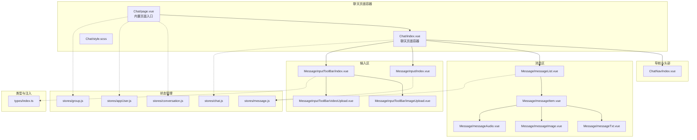
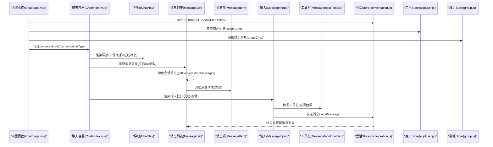

# 聊天模块

<cite>
**本文档引用的文件**
- [Chat/index.vue](file://ChatUIKit-vue2/modules/Chat/index.vue)
- [Chat/page.vue](file://ChatUIKit-vue2/modules/Chat/page.vue)
- [Chat/style.scss](file://ChatUIKit-vue2/modules/Chat/style.scss)
- [ChatNav/index.vue](file://ChatUIKit-vue2/modules/Chat/components/ChatNav/index.vue)
- [Message/messageList.vue](file://ChatUIKit-vue2/modules/Chat/components/Message/messageList.vue)
- [Message/messageItem.vue](file://ChatUIKit-vue2/modules/Chat/components/Message/messageItem.vue)
- [Message/messageTxt.vue](file://ChatUIKit-vue2/modules/Chat/components/Message/messageTxt.vue)
- [Message/messageImage.vue](file://ChatUIKit-vue2/modules/Chat/components/Message/messageImage.vue)
- [Message/messageAudio.vue](file://ChatUIKit-vue2/modules/Chat/components/Message/messageAudio.vue)
- [MessageInput/index.vue](file://ChatUIKit-vue2/modules/Chat/components/MessageInput/index.vue)
- [MessageInputToolBar/index.vue](file://ChatUIKit-vue2/modules/Chat/components/MessageInputToolBar/index.vue)
- [MessageInputToolBar/imageUpload.vue](file://ChatUIKit-vue2/modules/Chat/components/MessageInputToolBar/imageUpload.vue)
- [MessageInputToolBar/videoUpload.vue](file://ChatUIKit-vue2/modules/Chat/components/MessageInputToolBar/videoUpload.vue)
- [stores/message.js](file://ChatUIKit-vue2/stores/message.js)
- [stores/chat.js](file://ChatUIKit-vue2/stores/chat.js)
- [stores/conversation.js](file://ChatUIKit-vue2/stores/conversation.js)
- [stores/appUser.js](file://ChatUIKit-vue2/stores/appUser.js)
- [stores/group.js](file://ChatUIKit-vue2/stores/group.js)
- [types/index.ts](file://ChatUIKit-vue2/types/index.ts)
</cite>

## 更新摘要
**变更内容**
- 新增内置聊天页面系统，提供零配置集成选项
- 新增 Chat/page.vue 文件作为统一的聊天页面入口
- 支持智能参数解析和生命周期管理
- 提供双模式集成方案：内置页面和自定义页面
- 更新路由机制和跳转逻辑

## 目录
1. [简介](#简介)
2. [项目结构](#项目结构)
3. [核心组件](#核心组件)
4. [架构总览](#架构总览)
5. [组件详细分析](#组件详细分析)
6. [内置聊天页面系统](#内置聊天页面系统)
7. [双模式集成方案](#双模式集成方案)
8. [依赖关系分析](#依赖关系分析)
9. [性能考量](#性能考量)
10. [故障排查指南](#故障排查指南)
11. [结论](#结论)
12. [附录](#附录)

## 简介
本文件面向"聊天模块"的使用者与维护者，系统性梳理聊天界面的组件实现、调用关系、接口规范与使用模式。重点覆盖以下方面：
- 消息列表组件：消息渲染、分页加载、闪烁定位与长按交互
- 消息输入组件：文本输入、提及处理、引用回复、发送流程
- 工具栏组件：图片/视频/文件/用户卡片等扩展能力
- 聊天导航组件：标题栏、在线状态与返回行为
- 状态管理与事件处理：Vuex Store、SDK 事件、消息生命周期
- 组件间通信与数据流：父子组件、Provide/Inject、事件冒泡与 Store 共享
- **新增**：内置聊天页面系统，提供零配置集成选项
- **新增**：双模式集成方案，支持内置页面和自定义页面
- 常见问题与解决方案：权限、播放冲突、键盘遮挡、历史消息加载

## 项目结构
聊天模块位于 ChatUIKit-vue2/modules/Chat 下，采用"页面容器 + 子组件 + Store + 类型定义"的分层组织方式：
- 页面容器负责布局与全局状态协调（如键盘高度、遮罩层、编辑态）
- **新增**：内置页面 Chat/page.vue 作为统一入口，支持智能参数解析
- 子组件按职责拆分：导航、消息列表、消息项、输入框、工具栏、表情选择器等
- Store 负责消息、会话、连接、配置等状态管理
- 类型定义统一暴露给组件与 Store 使用



**图表来源**
- [Chat/page.vue:1-69](file://ChatUIKit-vue2/modules/Chat/page.vue#L1-L69)
- [Chat/index.vue:1-310](file://ChatUIKit-vue2/modules/Chat/index.vue#L1-L310)
- [Chat/style.scss:1-33](file://ChatUIKit-vue2/modules/Chat/style.scss#L1-L33)
- [ChatNav/index.vue:1-134](file://ChatUIKit-vue2/modules/Chat/components/ChatNav/index.vue#L1-L134)
- [Message/messageList.vue:1-312](file://ChatUIKit-vue2/modules/Chat/components/Message/messageList.vue#L1-L312)
- [Message/messageItem.vue:1-332](file://ChatUIKit-vue2/modules/Chat/components/Message/messageItem.vue#L1-L332)
- [Message/messageTxt.vue:1-94](file://ChatUIKit-vue2/modules/Chat/components/Message/messageTxt.vue#L1-L94)
- [Message/messageImage.vue:1-104](file://ChatUIKit-vue2/modules/Chat/components/Message/messageImage.vue#L1-L104)
- [Message/messageAudio.vue:1-120](file://ChatUIKit-vue2/modules/Chat/components/Message/messageAudio.vue#L1-L120)
- [MessageInput/index.vue:1-298](file://ChatUIKit-vue2/modules/Chat/components/MessageInput/index.vue#L1-L298)
- [MessageInputToolBar/index.vue:1-79](file://ChatUIKit-vue2/modules/Chat/components/MessageInputToolBar/index.vue#L1-L79)
- [MessageInputToolBar/imageUpload.vue:1-85](file://ChatUIKit-vue2/modules/Chat/components/MessageInputToolBar/imageUpload.vue#L1-L85)
- [MessageInputToolBar/videoUpload.vue:1-87](file://ChatUIKit-vue2/modules/Chat/components/MessageInputToolBar/videoUpload.vue#L1-L87)
- [stores/message.js:1-880](file://ChatUIKit-vue2/stores/message.js#L1-L880)
- [stores/chat.js:1-407](file://ChatUIKit-vue2/stores/chat.js#L1-L407)
- [stores/conversation.js:1-340](file://ChatUIKit-vue2/stores/conversation.js#L1-L340)
- [stores/appUser.js:1-235](file://ChatUIKit-vue2/stores/appUser.js#L1-L235)
- [stores/group.js:1-212](file://ChatUIKit-vue2/stores/group.js#L1-L212)
- [types/index.ts:1-100](file://ChatUIKit-vue2/types/index.ts#L1-L100)

**章节来源**
- [Chat/page.vue:1-69](file://ChatUIKit-vue2/modules/Chat/page.vue#L1-L69)
- [Chat/index.vue:1-310](file://ChatUIKit-vue2/modules/Chat/index.vue#L1-L310)
- [Chat/style.scss:1-33](file://ChatUIKit-vue2/modules/Chat/style.scss#L1-L33)

## 核心组件
- **新增**：内置聊天页面（Chat/page.vue）：统一的聊天页面入口，支持智能参数解析和生命周期管理
- 聊天页面容器：负责布局、键盘高度适配、遮罩层控制、编辑态与引用态切换、工具栏与表情面板的显示/隐藏
- 导航组件：根据会话类型（单聊/群聊）动态展示头像、名称、在线状态；提供返回行为
- 消息列表：分页加载历史消息、自动滚动到底部、闪烁高亮跳转、长按选择与动作菜单
- 消息项：按消息类型渲染文本、图片、视频、音频、自定义名片等；支持引用气泡、时间戳、状态图标
- 输入组件：文本输入、提及解析、引用预览、发送按钮、录音入口；支持工具栏与表情面板
- 工具栏：图片/视频/文件/用户卡片等扩展入口；通过 Provide/Inject 与父容器通信
- Store：消息、聊天、会话、连接、配置等状态管理；SDK 事件接入与消息生命周期处理

**章节来源**
- [Chat/page.vue:17-58](file://ChatUIKit-vue2/modules/Chat/page.vue#L17-L58)
- [Chat/index.vue:74-250](file://ChatUIKit-vue2/modules/Chat/index.vue#L74-L250)
- [ChatNav/index.vue:22-104](file://ChatUIKit-vue2/modules/Chat/components/ChatNav/index.vue#L22-L104)
- [Message/messageList.vue:52-197](file://ChatUIKit-vue2/modules/Chat/components/Message/messageList.vue#L52-L197)
- [Message/messageItem.vue:74-181](file://ChatUIKit-vue2/modules/Chat/components/Message/messageItem.vue#L74-L181)
- [MessageInput/index.vue:43-212](file://ChatUIKit-vue2/modules/Chat/components/MessageInput/index.vue#L43-L212)
- [MessageInputToolBar/index.vue:26-44](file://ChatUIKit-vue2/modules/Chat/components/MessageInputToolBar/index.vue#L26-L44)
- [stores/message.js:41-621](file://ChatUIKit-vue2/stores/message.js#L41-L621)
- [stores/chat.js:29-398](file://ChatUIKit-vue2/stores/chat.js#L29-L398)

## 架构总览
聊天模块采用"内置页面入口 + 页面容器 + 多子组件 + Vuex Store + SDK 事件"的架构：
- **新增**：内置页面 Chat/page.vue 作为统一入口，自动处理参数解析和状态初始化
- 页面容器通过 Vuex Store 获取当前会话信息，协调消息列表与输入区
- 消息列表与消息项解耦，消息项按类型渲染，避免重复逻辑
- 输入组件与工具栏通过事件与 Provide/Inject 解耦，便于扩展
- Store 负责消息生命周期、历史分页、状态变更与 SDK 事件转发



**图表来源**
- [Chat/page.vue:24-58](file://ChatUIKit-vue2/modules/Chat/page.vue#L24-L58)
- [Chat/index.vue:74-250](file://ChatUIKit-vue2/modules/Chat/index.vue#L74-L250)
- [Message/messageList.vue:52-197](file://ChatUIKit-vue2/modules/Chat/components/Message/messageList.vue#L52-L197)
- [Message/messageItem.vue:74-181](file://ChatUIKit-vue2/modules/Chat/components/Message/messageItem.vue#L74-L181)
- [MessageInput/index.vue:43-212](file://ChatUIKit-vue2/modules/Chat/components/MessageInput/index.vue#L43-L212)
- [MessageInputToolBar/index.vue:26-44](file://ChatUIKit-vue2/modules/Chat/components/MessageInputToolBar/index.vue#L26-L44)
- [stores/conversation.js:132-134](file://ChatUIKit-vue2/stores/conversation.js#L132-L134)
- [stores/appUser.js:105-138](file://ChatUIKit-vue2/stores/appUser.js#L105-L138)
- [stores/group.js:128-148](file://ChatUIKit-vue2/stores/group.js#L128-L148)

## 组件详细分析

### 聊天页面容器（Chat/index.vue）
- 布局与样式：顶部导航、消息列表、输入区、工具栏、表情面板、遮罩层；键盘高度变化时动态调整布局
- 状态与行为：
  - 控制工具栏与表情面板的显示/隐藏，并在点击输入区或遮罩层时关闭
  - 监听引用态变化，自动聚焦输入框
  - 加载时标记会话已读
  - 提供 InputToolbarEvent 注入，供工具栏调用关闭方法
- 事件处理：
  - 输入框事件：点击输入区、提及解析、录音开始、显示工具栏/表情面板
  - 用户卡片选择：创建自定义名片消息并发送
  - 键盘高度变化：滚动消息列表到底部

**章节来源**
- [Chat/index.vue:74-250](file://ChatUIKit-vue2/modules/Chat/index.vue#L74-L250)
- [Chat/style.scss:1-33](file://ChatUIKit-vue2/modules/Chat/style.scss#L1-L33)

### 聊天导航组件（ChatNav/index.vue）
- 功能要点：
  - 根据当前会话类型决定头像来源（单聊用户头像/群头像）
  - 单聊场景下可显示在线状态与存在信息
  - 生命周期内订阅/取消订阅用户在线状态
- 数据来源：Vuex Store 中的当前会话、用户信息、群组信息与特性开关

**章节来源**
- [ChatNav/index.vue:22-104](file://ChatUIKit-vue2/modules/Chat/components/ChatNav/index.vue#L22-L104)

### 消息列表组件（Message/messageList.vue）
- 渲染策略：
  - 使用 scroll-view 实现纵向滚动，支持锚点滚动到指定消息
  - 支持"加载更多历史"与"无更多消息"提示
  - 首次进入时自动拉取历史并滚动到底部，随后新增消息自动滚动
- 交互与状态：
  - 长按消息进行选择，点击空白处重置选择
  - 支持闪烁动画高亮跳转到目标消息
  - 分页加载时记录当前可视第一条消息 ID，避免滚动错位
- 数据来源：Vuex Store 的会话消息映射与游标

**章节来源**
- [Message/messageList.vue:52-197](file://ChatUIKit-vue2/modules/Chat/components/Message/messageList.vue#L52-L197)

### 消息项组件（Message/messageItem.vue）
- 渲染机制：
  - 根据消息类型渲染文本、图片、视频、音频、文件、自定义名片等
  - 引用消息气泡支持点击跳转至被引用消息
  - 自己发送的消息与他人消息采用不同气泡样式与方向
- 交互逻辑：
  - 支持长按触发上下文菜单；提供 touchstart/touchend/touchmove 长按检测
  - 显示消息状态图标（仅自己发送且开启状态显示时）
- 数据来源：Vuex Store 的用户信息、连接信息与特性配置

**章节来源**
- [Message/messageItem.vue:74-181](file://ChatUIKit-vue2/modules/Chat/components/Message/messageItem.vue#L74-L181)

### 文本消息渲染（Message/messageTxt.vue）
- 渲染规则：
  - 将富文本内容解析为文本片段与表情片段混合渲染
  - 支持"已编辑"标签显示
- 数据来源：连接信息判断是否为本人发送

**章节来源**
- [Message/messageTxt.vue:22-44](file://ChatUIKit-vue2/modules/Chat/components/Message/messageTxt.vue#L22-L44)

### 图片消息渲染（Message/messageImage.vue）
- 渲染规则：
  - 支持缩略图与原图预览；错误时显示占位图
  - 自适应宽高，最大尺寸限制
- 交互逻辑：
  - 点击图片进行预览；支持禁用预览

**章节来源**
- [Message/messageImage.vue:15-77](file://ChatUIKit-vue2/modules/Chat/components/Message/messageImage.vue#L15-L77)

### 语音消息渲染（Message/messageAudio.vue）
- 渲染规则：
  - 根据发送方显示不同播放图标；长度用于宽度计算
- 播放逻辑：
  - 内部音频上下文管理，支持播放/暂停/停止
  - 多语音互斥播放，其他语音停止
  - 下载并转换为 mp3 后播放，支持平台静音开关处理
- 生命周期：
  - 组件销毁时释放音频资源

**章节来源**
- [Message/messageAudio.vue:32-176](file://ChatUIKit-vue2/modules/Chat/components/Message/messageAudio.vue#L32-L176)

### 消息输入组件（MessageInput/index.vue）
- 输入与发送：
  - 文本输入、确认发送、焦点管理、占位符国际化
  - 发送时构建文本消息体，附加提及列表、引用信息与用户信息扩展
- 提及与引用：
  - 监测输入末尾"@"触发提及列表
  - 引用消息发送后清空引用态
- 工具栏与表情：
  - 条件显示工具栏/表情入口
  - 录音入口触发权限检查与弹窗
- 事件与暴露：
  - 暴露插入文本、设置焦点、添加提及用户 ID 等方法
  - 触发发送完成事件

**章节来源**
- [MessageInput/index.vue:43-212](file://ChatUIKit-vue2/modules/Chat/components/MessageInput/index.vue#L43-L212)

### 工具栏组件（MessageInputToolBar/index.vue）
- 功能概览：
  - 图片、视频、文件、用户卡片等入口
  - 通过特性开关控制显示
- 与容器通信：
  - 通过 Provide/Inject 注入 InputToolbarEvent，供子项调用关闭工具栏

**章节来源**
- [MessageInputToolBar/index.vue:26-44](file://ChatUIKit-vue2/modules/Chat/components/MessageInputToolBar/index.vue#L26-L44)

### 图片上传（MessageInputToolBar/imageUpload.vue）
- 流程：
  - 选择相册图片 -> 构造图片消息 -> 上传文件 -> 发送消息
  - 上传成功后自动关闭工具栏
- 数据来源：当前会话、连接信息、自身用户信息

**章节来源**
- [MessageInputToolBar/imageUpload.vue:31-77](file://ChatUIKit-vue2/modules/Chat/components/MessageInputToolBar/imageUpload.vue#L31-L77)

### 视频上传（MessageInputToolBar/videoUpload.vue）
- 流程：
  - 选择相机/相册视频 -> 构造视频消息 -> 上传文件 -> 发送消息
  - 上传成功后自动关闭工具栏
- 数据来源：当前会话、连接信息、自身用户信息

**章节来源**
- [MessageInputToolBar/videoUpload.vue:31-78](file://ChatUIKit-vue2/modules/Chat/components/MessageInputToolBar/videoUpload.vue#L31-L78)

### 状态管理与事件处理
- 消息 Store（message.js）
  - 按会话分块存储消息，支持历史分页、插入/删除、状态更新、撤回处理、清理超量消息
  - 提供 getter：消息查询、会话消息列表、是否有更多历史、是否播放中、是否来自本人
  - 提供 action：发送消息（含附件上传回调）、接收消息处理、撤回/删除/修改消息、设置播放/引用/编辑态
- 聊天 Store（chat.js）
  - 初始化 SDK 事件监听，统一分发文本/图片/语音/视频/文件/自定义/撤回/已读等事件
  - 协调消息 Store 与会话 Store 的数据一致性
  - 提供登录/登出、加载初始数据、连接状态管理
- 会话 Store（conversation.js）
  - 管理会话列表、当前会话、未读消息计数等状态
  - 提供会话操作：添加、移除、更新、置顶等
- 用户 Store（appUser.js）
  - 管理用户信息、在线状态、当前用户信息等
  - 提供用户信息获取、在线状态查询、用户信息更新等操作
- 群组 Store（group.js）
  - 管理群组列表、群组详情、群组信息等
  - 提供群组操作：获取列表、获取详情、创建群组等

**章节来源**
- [stores/message.js:41-621](file://ChatUIKit-vue2/stores/message.js#L41-L621)
- [stores/chat.js:29-398](file://ChatUIKit-vue2/stores/chat.js#L29-L398)
- [stores/conversation.js:46-200](file://ChatUIKit-vue2/stores/conversation.js#L46-L200)
- [stores/appUser.js:1-200](file://ChatUIKit-vue2/stores/appUser.js#L1-L200)
- [stores/group.js:1-200](file://ChatUIKit-vue2/stores/group.js#L1-L200)

### 接口规范与类型
- InputToolbarEvent：工具栏注入事件接口，包含关闭工具栏方法
- MixedMessageBody：消息体扩展，支持通知信息、状态、服务端消息 ID
- MessageStatus：消息状态枚举（发送中/已发送/已接收/已读/未读/失败）
- MessageQuoteExt：引用消息扩展字段
- ConnState：连接状态枚举

**章节来源**
- [types/index.ts:3-99](file://ChatUIKit-vue2/types/index.ts#L3-L99)

## 内置聊天页面系统

### Chat/page.vue - 统一入口
内置聊天页面系统的核心是 Chat/page.vue，它提供了零配置的集成方案：

- **智能参数解析**：支持两种参数格式：
  - `?type=singleChat&id=xxx`（从联系人/群组列表进入）
  - `?conversationType=singleChat&conversationId=xxx`（从会话列表进入）
- **自动状态初始化**：在 `onLoad` 生命周期中自动设置当前会话状态
- **用户信息获取**：根据会话类型自动获取用户或群组信息
- **生命周期管理**：在 `onUnload` 中自动清理状态，避免内存泄漏

### 参数处理逻辑
```javascript
// 支持两种参数格式：type/id 或 conversationType/conversationId
this.conversationType = options.type || options.conversationType
this.conversationId = options.id || options.conversationId
```

### 状态管理
- 设置当前会话：`SET_CURRENT_CONVERSATION`
- 获取用户信息：单聊场景获取用户详情，群聊场景获取群组详情
- 清理状态：离开页面时自动清理引用态、编辑态和当前会话

**章节来源**
- [Chat/page.vue:17-58](file://ChatUIKit-vue2/modules/Chat/page.vue#L17-L58)

## 双模式集成方案

### 方式一：内置页面（推荐，零配置）
**适用场景**：快速集成，无需手动创建页面文件
- 在 `pages.json` 中配置内置页面路径
- 会话列表和联系人列表点击后自动跳转到内置页面
- 完全自动化的参数解析和状态管理

### 方式二：自定义页面
**适用场景**：需要自定义页面逻辑或样式
- 手动创建聊天页面文件
- 需要在 `onLoad` 中手动设置当前会话状态
- 需要手动处理用户信息获取和状态清理

### 路由跳转机制
内置页面系统已经处理了完整的路由逻辑：

| 入口 | 跳转方式 | 跳转目标 | 返回行为 |
|------|----------|----------|----------|
| **会话列表** | `navigateTo` | `ChatUIKit/modules/Chat/page?conversationType=xxx&conversationId=xxx` | `navigateBack` 返回会话列表 |
| **会话搜索列表** | `navigateTo` | `ChatUIKit/modules/Chat/page?id=xxx&type=xxx` | `navigateBack` 返回搜索列表 |
| **联系人列表** | `navigateTo` | `ChatUIKit/modules/Chat/page?type=singleChat&id=xxx` | `navigateBack` 返回联系人列表 |
| **联系人搜索列表** | `redirectTo` | `ChatUIKit/modules/Chat/page?id=xxx&type=singleChat` | 返回联系人列表（关闭搜索页） |
| **群列表** | `navigateTo` | `ChatUIKit/modules/Chat/page?type=groupChat&id=xxx` | `navigateBack` 返回群列表 |
| **创建群组** | `redirectTo` | `ChatUIKit/modules/Chat/page?type=groupChat&id=xxx` | 返回群列表（关闭创建页） |
| **新建会话** | `redirectTo` | `ChatUIKit/modules/Chat/page?type=singleChat&id=xxx` | 返回上一级 |

**关键说明**：
- 大部分跳转使用 `uni.navigateTo`，返回时使用 `uni.navigateBack` 可以正确返回上一级页面
- 搜索、创建群组等临时页面使用 `redirectTo`（关闭当前页跳转），返回时直接回到列表页
- 聊天页面顶部的返回按钮已内置 `navigateBack` 逻辑

**章节来源**
- [VUE2_QUICK_START.md:340-407](file://VUE2_QUICK_START.md#L340-L407)

## 依赖关系分析
- 组件依赖：
  - Chat/page.vue 依赖 Chat/index.vue、stores/conversation.js、stores/appUser.js、stores/group.js
  - Chat/index.vue 依赖 ChatNav、MessageList、MessageInput、MessageInputToolBar、EmojiPicker、MessageQuotePanel、MessageEdit、MessageMentionList、MessageContactList
  - Message/messageList.vue 依赖 Message/messageItem.vue、NoticeMessageItem
  - Message/messageItem.vue 依赖 Text/Image/Video/Audio/File/UserCard 等消息子组件
  - MessageInput/index.vue 依赖 AudioMessageSender、工具栏与表情组件
  - 工具栏子组件依赖 InputToolbarEvent 注入
- Store 依赖：
  - message.js 依赖 conn、conversation、appUser、chatSDK
  - chat.js 依赖 conn、config、appUser、contact、group、message
  - conversation.js 依赖 conn、message、appUser、group
  - appUser.js 依赖 conn
  - group.js 依赖 conn
- 类型依赖：
  - types/index.ts 为组件与 Store 提供统一类型定义

```mermaid
classDiagram
class BuiltInPage {
+智能参数解析
+自动状态初始化
+生命周期管理
}
class ChatIndex {
+布局与事件
+键盘高度适配
+遮罩层控制
}
class ChatNav {
+头像/名称/在线状态
+订阅/取消订阅
}
class MessageList {
+分页加载
+自动滚动
+闪烁高亮
}
class MessageItem {
+按类型渲染
+长按交互
+引用跳转
}
class MessageInput {
+文本输入
+提及/引用
+发送流程
}
class MessageInputToolBar {
+工具栏入口
+注入关闭
}
class MessageStore {
+历史分页
+发送/接收
+撤回/删除/修改
}
class ChatStore {
+SDK事件
+登录/登出
+初始数据
}
class ConversationStore {
+会话列表管理
+当前会话状态
+未读消息计数
}
class UserStore {
+用户信息管理
+在线状态
+当前用户信息
}
class GroupStore {
+群组列表管理
+群组详情
+群组操作
}
BuiltInPage --> ChatIndex
BuiltInPage --> ConversationStore
BuiltInPage --> UserStore
BuiltInPage --> GroupStore
ChatIndex --> ChatNav
ChatIndex --> MessageList
ChatIndex --> MessageInput
ChatIndex --> MessageInputToolBar
MessageList --> MessageItem
MessageInput --> MessageStore
MessageList --> MessageStore
ChatIndex --> ChatStore
```



**图表来源**
- [Chat/page.vue:1-69](file://ChatUIKit-vue2/modules/Chat/page.vue#L1-L69)
- [Chat/index.vue:1-310](file://ChatUIKit-vue2/modules/Chat/index.vue#L1-L310)
- [ChatNav/index.vue:1-134](file://ChatUIKit-vue2/modules/Chat/components/ChatNav/index.vue#L1-L134)
- [Message/messageList.vue:1-312](file://ChatUIKit-vue2/modules/Chat/components/Message/messageList.vue#L1-L312)
- [Message/messageItem.vue:1-332](file://ChatUIKit-vue2/modules/Chat/components/Message/messageItem.vue#L1-L332)
- [MessageInput/index.vue:1-298](file://ChatUIKit-vue2/modules/Chat/components/MessageInput/index.vue#L1-L298)
- [MessageInputToolBar/index.vue:1-79](file://ChatUIKit-vue2/modules/Chat/components/MessageInputToolBar/index.vue#L1-L79)
- [stores/message.js:1-880](file://ChatUIKit-vue2/stores/message.js#L1-L880)
- [stores/chat.js:1-407](file://ChatUIKit-vue2/stores/chat.js#L1-L407)
- [stores/conversation.js:1-340](file://ChatUIKit-vue2/stores/conversation.js#L1-L340)
- [stores/appUser.js:1-235](file://ChatUIKit-vue2/stores/appUser.js#L1-L235)
- [stores/group.js:1-212](file://ChatUIKit-vue2/stores/group.js#L1-L212)

## 性能考量
- 列表渲染优化：
  - 使用 computed 读取消息列表，避免重复计算
  - 首次进入时一次性拉取历史并滚动到底部，减少多次滚动
  - 新增消息时仅在必要时滚动，避免频繁 DOM 操作
- 媒体资源：
  - 图片自适应尺寸，避免过大元素导致重排
  - 语音消息使用 InnerAudioContext 并在组件销毁时释放
- 状态更新：
  - Store 使用 Map 结构按会话分块存储，提升查找与更新效率
  - 清理超量消息，防止内存膨胀
- **新增**：内置页面优化：
  - 智能参数解析避免重复解析逻辑
  - 自动状态清理防止内存泄漏
  - 按需加载用户信息和群组信息

## 故障排查指南
- 无法发送消息
  - 检查连接状态与登录状态；确认消息 Store 的发送流程与错误提示
  - 若为附件消息，确认上传回调是否正确执行
  - **新增**：检查是否正确设置了当前会话状态
- 语音无法播放
  - 检查下载与转换流程、权限与平台静音开关设置
  - 确认多语音互斥播放逻辑是否生效
- 历史消息加载异常
  - 检查 cursor 与 isLast 标志位；确认分页参数与 onSuccess 回调
- 键盘遮挡输入框
  - 确认键盘高度监听与样式适配逻辑；输入聚焦后滚动到底部
- 工具栏/表情面板不关闭
  - 确认遮罩层点击事件与 InputToolbarEvent 注入是否正常
- **新增**：内置页面问题
  - 检查参数格式是否正确（type/id 或 conversationType/conversationId）
  - 确认 pages.json 中是否正确配置了内置页面路径
  - 检查会话状态是否正确设置

**章节来源**
- [stores/message.js:266-368](file://ChatUIKit-vue2/stores/message.js#L266-L368)
- [Message/messageAudio.vue:76-176](file://ChatUIKit-vue2/modules/Chat/components/Message/messageAudio.vue#L76-L176)
- [Message/messageList.vue:135-171](file://ChatUIKit-vue2/modules/Chat/components/Message/messageList.vue#L135-L171)
- [Chat/index.vue:136-153](file://ChatUIKit-vue2/modules/Chat/index.vue#L136-L153)
- [Chat/page.vue:24-58](file://ChatUIKit-vue2/modules/Chat/page.vue#L24-L58)

## 结论
聊天模块通过清晰的组件边界、完善的 Store 管理与 SDK 事件集成，实现了稳定的消息渲染、输入与工具栏扩展能力。**新增的内置聊天页面系统进一步简化了集成流程，提供了零配置的开发体验。** 建议在实际使用中：
- 优先考虑使用内置页面系统，享受零配置集成的优势
- 严格遵循 Provide/Inject 与事件冒泡约定
- 注意媒体资源的生命周期管理与内存清理
- 在多端环境下关注权限与平台差异（如录音权限、静音开关）
- **新增**：正确处理参数格式和状态管理，确保内置页面系统正常工作

## 附录
- 组件间通信模式
  - 父子组件：props/event
  - Provide/Inject：工具栏注入关闭方法
  - Store 共享：跨组件状态与数据一致性
  - **新增**：内置页面与容器组件：通过 props 传递会话信息
- 数据流
  - 输入 -> Store sendMessage -> SDK -> Store onMessage -> 列表渲染
  - SDK 事件 -> Store 事件分发 -> Store 更新 -> 列表响应式刷新
  - **新增**：内置页面 -> Store 状态设置 -> 容器组件渲染
- **新增**：路由机制
  - 内置页面自动处理路由跳转和返回逻辑
  - 支持多种入口的统一跳转协议
  - 完整的生命周期管理