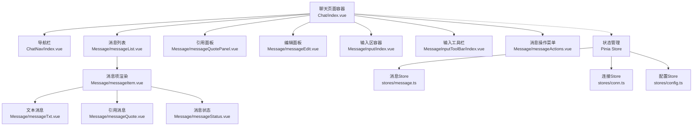
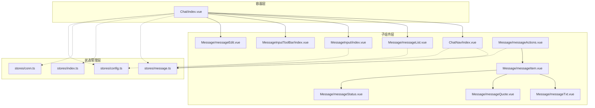
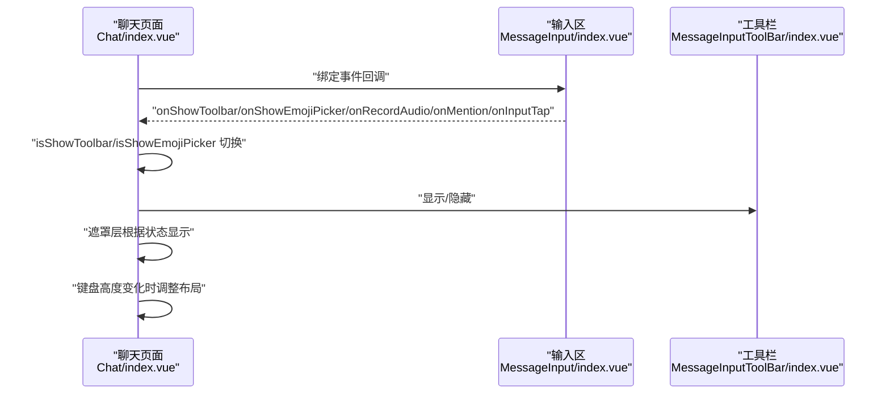
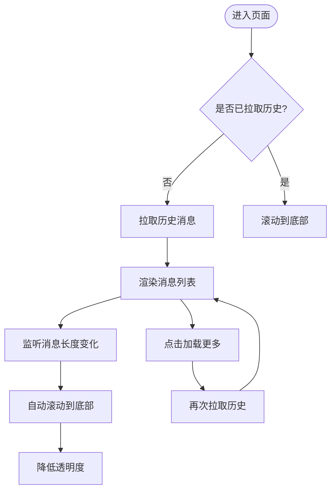
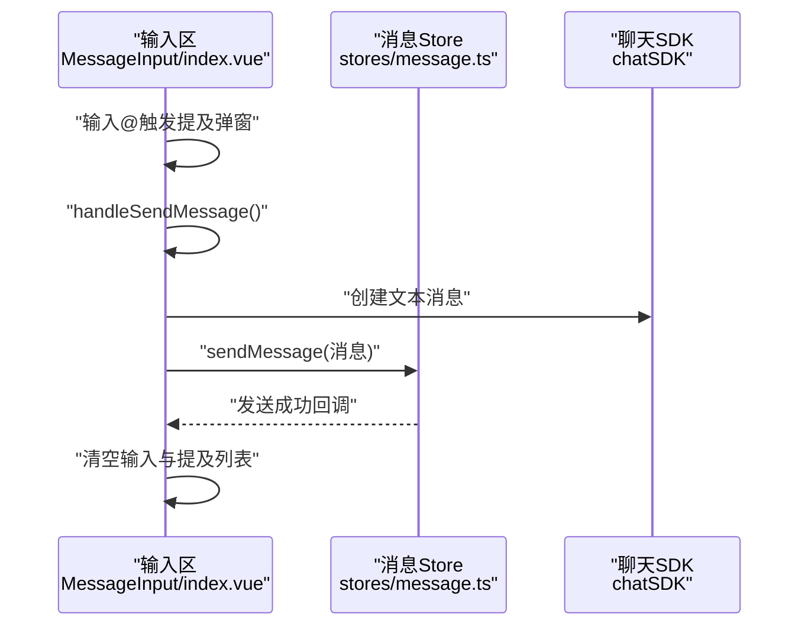
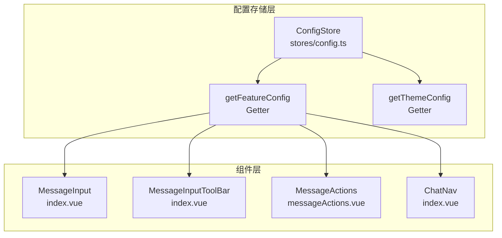
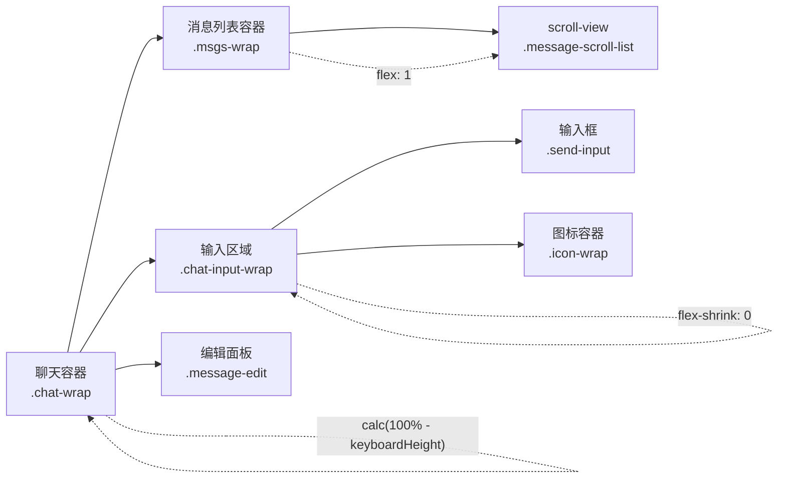
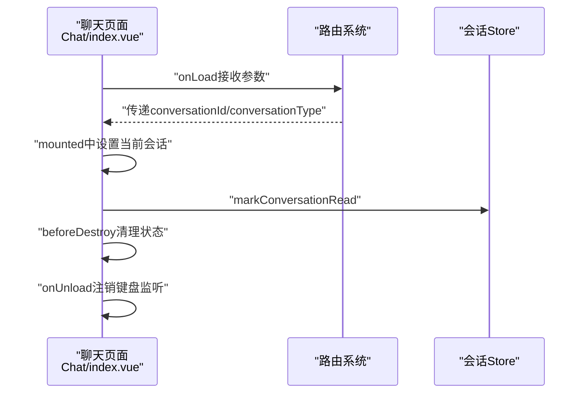
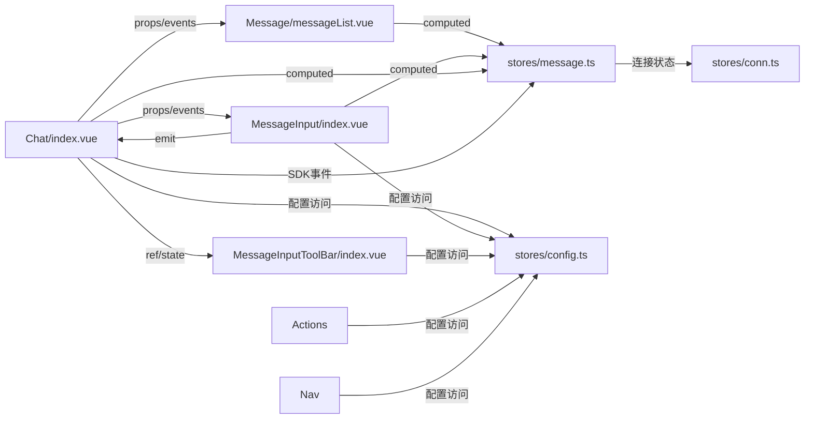

# 聊天界面组件

<cite>
**本文档引用的文件**
- [Chat/index.vue](file://ChatUIKit/modules/Chat/index.vue)
- [Chat/style.scss](file://ChatUIKit/modules/Chat/style.scss)
- [ChatNav/index.vue](file://ChatUIKit/modules/Chat/components/ChatNav/index.vue)
- [Message/messageList.vue](file://ChatUIKit/modules/Chat/components/Message/messageList.vue)
- [MessageInput/index.vue](file://ChatUIKit/modules/Chat/components/MessageInput/index.vue)
- [MessageInputToolBar/index.vue](file://ChatUIKit/modules/Chat/components/MessageInputToolBar/index.vue)
- [Message/messageEdit.vue](file://ChatUIKit/modules/Chat/components/Message/messageEdit.vue)
- [Message/messageQuotePanel.vue](file://ChatUIKit/modules/Chat/components/Message/messageQuotePanel.vue)
- [Message/messageItem.vue](file://ChatUIKit/modules/Chat/components/Message/messageItem.vue)
- [Message/messageActions.vue](file://ChatUIKit/modules/Chat/components/Message/messageActions.vue)
- [Message/messageTxt.vue](file://ChatUIKit/modules/Chat/components/Message/messageTxt.vue)
- [Message/messageQuote.vue](file://ChatUIKit/modules/Chat/components/Message/messageQuote.vue)
- [Message/messageStatus.vue](file://ChatUIKit/modules/Chat/components/Message/messageStatus.vue)
- [stores/index.ts](file://ChatUIKit/stores/index.ts)
- [stores/message.ts](file://ChatUIKit/stores/message.ts)
- [stores/conn.ts](file://ChatUIKit/stores/conn.ts)
- [stores/config.ts](file://ChatUIKit/stores/config.ts)
- [ChatUIKit-vue2/modules/Chat/index.vue](file://ChatUIKit-vue2/modules/Chat/index.vue)
- [ChatUIKit-vue2/modules/Chat/components/Message/messageList.vue](file://ChatUIKit-vue2/modules/Chat/components/Message/messageList.vue)
</cite>

## 更新摘要
**变更内容**
- 更新了集中式配置存储章节，反映组件从本地 featureConfig 迁移到使用 getFeatureConfig getter 的改进
- 新增了配置存储的架构分析和使用模式说明
- 改进了消息插入逻辑中聊天连接状态处理的说明
- 更新了键盘高度监听和会话已读标记逻辑的描述
- 增强了Vue3与Vue2版本的对比分析

## 目录
1. [简介](#简介)
2. [项目结构](#项目结构)
3. [核心组件](#核心组件)
4. [架构总览](#架构总览)
5. [组件详细分析](#组件详细分析)
6. [布局优化与响应式设计](#布局优化与响应式设计)
7. [生命周期管理](#生命周期管理)
8. [依赖关系分析](#依赖关系分析)
9. [性能考量](#性能考量)
10. [故障排查指南](#故障排查指南)
11. [结论](#结论)
12. [附录](#附录)

## 简介
本文件面向"聊天界面组件"的使用者与维护者，系统性阐述基于 Vue3 和 Vue2 的聊天主界面整体架构、布局结构与组件组织方式；深入解析聊天容器的实现原理、样式配置与响应式设计；覆盖组件生命周期管理、状态初始化与事件处理机制；提供可定制的配置项与主题适配方案；说明与各模块的集成方式与数据交互模式，并给出实际使用示例与最佳实践建议。

## 项目结构
聊天模块采用"页面级容器 + 组件化子模块"的分层组织方式，基于 Vue3 和 Pinia 实现：
- 页面容器负责路由参数接收、键盘高度监听、遮罩控制、工具栏与表情面板联动、提及与名片功能入口
- 子组件按职责拆分：导航栏、消息列表、输入区、输入工具栏、表情选择器、消息项渲染、文本/图片/音频/视频/文件/自定义消息等
- 状态管理通过 Pinia Store 实现，包括聊天连接、消息、会话、用户、群组等

**图表来源**
- [Chat/index.vue](file://ChatUIKit/modules/Chat/index.vue#L1-L255)
- [ChatNav/index.vue](file://ChatUIKit/modules/Chat/components/ChatNav/index.vue#L1-L127)
- [Message/messageList.vue](file://ChatUIKit/modules/Chat/components/Message/messageList.vue#L1-L284)
- [MessageInput/index.vue](file://ChatUIKit/modules/Chat/components/MessageInput/index.vue#L1-L217)
- [MessageInputToolBar/index.vue](file://ChatUIKit/modules/Chat/components/MessageInputToolBar/index.vue#L1-L69)
- [Message/messageEdit.vue](file://ChatUIKit/modules/Chat/components/Message/messageEdit.vue#L1-L160)
- [Message/messageActions.vue](file://ChatUIKit/modules/Chat/components/Message/messageActions.vue#L1-L335)
- [Message/messageItem.vue](file://ChatUIKit/modules/Chat/components/Message/messageItem.vue#L1-L301)
- [Message/messageTxt.vue](file://ChatUIKit/modules/Chat/components/Message/messageTxt.vue#L1-L81)
- [Message/messageQuote.vue](file://ChatUIKit/modules/Chat/components/Message/messageQuote.vue#L1-L74)
- [Message/messageStatus.vue](file://ChatUIKit/modules/Chat/components/Message/messageStatus.vue#L1-L73)
- [stores/index.ts](file://ChatUIKit/stores/index.ts#L1-L31)
- [stores/message.ts](file://ChatUIKit/stores/message.ts#L1-L604)
- [stores/conn.ts](file://ChatUIKit/stores/conn.ts#L1-L83)
- [stores/config.ts](file://ChatUIKit/stores/config.ts#L1-L124)

**章节来源**
- [Chat/index.vue](file://ChatUIKit/modules/Chat/index.vue#L1-L255)
- [ChatNav/index.vue](file://ChatUIKit/modules/Chat/components/ChatNav/index.vue#L1-L127)
- [Message/messageList.vue](file://ChatUIKit/modules/Chat/components/Message/messageList.vue#L1-L284)
- [MessageInput/index.vue](file://ChatUIKit/modules/Chat/components/MessageInput/index.vue#L1-L217)
- [MessageInputToolBar/index.vue](file://ChatUIKit/modules/Chat/components/MessageInputToolBar/index.vue#L1-L69)
- [Message/messageEdit.vue](file://ChatUIKit/modules/Chat/components/Message/messageEdit.vue#L1-L160)
- [Message/messageQuotePanel.vue](file://ChatUIKit/modules/Chat/components/Message/messageQuotePanel.vue#L1-L101)
- [Message/messageActions.vue](file://ChatUIKit/modules/Chat/components/Message/messageActions.vue#L1-L335)
- [Message/messageItem.vue](file://ChatUIKit/modules/Chat/components/Message/messageItem.vue#L1-L301)
- [Message/messageTxt.vue](file://ChatUIKit/modules/Chat/components/Message/messageTxt.vue#L1-L81)
- [Message/messageQuote.vue](file://ChatUIKit/modules/Chat/components/Message/messageQuote.vue#L1-L74)
- [Message/messageStatus.vue](file://ChatUIKit/modules/Chat/components/Message/messageStatus.vue#L1-L73)
- [stores/index.ts](file://ChatUIKit/stores/index.ts#L1-L31)
- [stores/message.ts](file://ChatUIKit/stores/message.ts#L1-L604)
- [stores/conn.ts](file://ChatUIKit/stores/conn.ts#L1-L83)
- [stores/config.ts](file://ChatUIKit/stores/config.ts#L1-L124)

## 核心组件
- **聊天页面容器**：承载导航、消息列表、输入区、工具栏、表情面板、提及与名片入口，统一处理键盘高度、遮罩、焦点与事件分发
- **导航栏**：根据单聊/群聊动态显示头像、名称、在线状态与返回逻辑
- **消息列表**：基于滚动视图的虚拟化渲染，支持历史消息分页加载、消息闪烁高亮、长按选择与跳转
- **输入区**：文本输入、表情、工具栏、提及识别、引用消息、发送流程与权限检查
- **输入工具栏**：图片/视频/文件/名片等扩展能力的入口
- **消息项渲染**：按消息类型渲染文本、图片、音频、视频、文件、自定义名片等，并支持状态徽标与时间戳
- **消息操作菜单**：支持复制、编辑、回复、删除、撤回等操作
- **状态管理**：聊天连接、消息收发、会话与用户信息等跨组件共享状态

**章节来源**
- [Chat/index.vue](file://ChatUIKit/modules/Chat/index.vue#L74-L255)
- [ChatNav/index.vue](file://ChatUIKit/modules/Chat/components/ChatNav/index.vue#L22-L127)
- [Message/messageList.vue](file://ChatUIKit/modules/Chat/components/Message/messageList.vue#L52-L284)
- [MessageInput/index.vue](file://ChatUIKit/modules/Chat/components/MessageInput/index.vue#L43-L217)
- [MessageInputToolBar/index.vue](file://ChatUIKit/modules/Chat/components/MessageInputToolBar/index.vue#L26-L69)
- [Message/messageActions.vue](file://ChatUIKit/modules/Chat/components/Message/messageActions.vue#L30-L335)
- [stores/message.ts](file://ChatUIKit/stores/message.ts#L7-L604)

## 架构总览
聊天界面采用"容器-子组件-状态管理"三层架构，基于 Vue3 生态系统：
- **容器层**：页面级 Vue 组件，负责路由参数注入、键盘监听、全局遮罩、工具栏与表情面板联动、提及与名片交互
- **子组件层**：按功能拆分的 UI 组件，通过 props 与 events 与容器通信，内部使用 computed/watch 管理局部状态
- **状态管理层**：Pinia Store 提供聊天连接、消息、会话、用户、群组等跨组件共享状态

**图表来源**
- [Chat/index.vue](file://ChatUIKit/modules/Chat/index.vue#L74-L255)
- [ChatNav/index.vue](file://ChatUIKit/modules/Chat/components/ChatNav/index.vue#L22-L127)
- [Message/messageList.vue](file://ChatUIKit/modules/Chat/components/Message/messageList.vue#L52-L284)
- [MessageInput/index.vue](file://ChatUIKit/modules/Chat/components/MessageInput/index.vue#L43-L217)
- [MessageInputToolBar/index.vue](file://ChatUIKit/modules/Chat/components/MessageInputToolBar/index.vue#L26-L69)
- [Message/messageEdit.vue](file://ChatUIKit/modules/Chat/components/Message/messageEdit.vue#L24-L160)
- [Message/messageActions.vue](file://ChatUIKit/modules/Chat/components/Message/messageActions.vue#L30-L335)
- [Message/messageItem.vue](file://ChatUIKit/modules/Chat/components/Message/messageItem.vue#L72-L301)
- [Message/messageTxt.vue](file://ChatUIKit/modules/Chat/components/Message/messageTxt.vue#L22-L81)
- [Message/messageQuote.vue](file://ChatUIKit/modules/Chat/components/Message/messageQuote.vue#L10-L74)
- [Message/messageStatus.vue](file://ChatUIKit/modules/Chat/components/Message/messageStatus.vue#L10-L73)
- [stores/message.ts](file://ChatUIKit/stores/message.ts#L7-L604)
- [stores/index.ts](file://ChatUIKit/stores/index.ts#L1-L31)
- [stores/conn.ts](file://ChatUIKit/stores/conn.ts#L1-L83)
- [stores/config.ts](file://ChatUIKit/stores/config.ts#L1-L124)

## 组件详细分析

### 聊天容器（Chat/index.vue）
- **职责**
  - 接收路由参数并设置当前会话
  - 监听键盘高度变化，动态调整布局与滚动
  - 控制工具栏与表情面板的显示/隐藏与遮罩层
  - 处理输入区事件：表情选择、工具栏开关、提及弹窗、录音开始
  - 处理引用消息与编辑消息的状态切换
  - 与消息/会话/用户 Store 协作
- **关键实现要点**
  - 使用 ref() 初始化状态，包括会话ID、会话类型、工具栏显示状态、键盘高度等
  - 通过 computed 监控引用消息状态，动态控制输入框焦点
  - 生命周期钩子中完成会话标记已读、清理引用与编辑态、注册/注销键盘监听
- **样式与响应式**
  - 根据键盘高度动态计算容器高度，支持安全区域适配
  - 输入区固定高度，消息列表自适应填充剩余空间
  - 遮罩层覆盖全屏，点击关闭工具栏与表情面板

**图表来源**
- [Chat/index.vue](file://ChatUIKit/modules/Chat/index.vue#L136-L245)

**章节来源**
- [Chat/index.vue](file://ChatUIKit/modules/Chat/index.vue#L74-L255)

### 导航栏（ChatNav/index.vue）
- **职责**
  - 动态显示单聊/群聊场景下的头像、名称、在线状态
  - 返回上一页
- **关键实现要点**
  - 使用 computed 依赖当前会话，自动派生头像、名称、在线状态等信息
  - 在单聊场景下，进入页面时请求并订阅在线状态，离开时取消订阅
- **样式与响应式**
  - 左侧头像与名称水平排列，名称支持省略与最大宽度限制

**章节来源**
- [ChatNav/index.vue](file://ChatUIKit/modules/Chat/components/ChatNav/index.vue#L22-L127)

### 消息列表（Message/messageList.vue）
- **职责**
  - 渲染消息列表，支持滚动到底部、历史消息加载、消息闪烁高亮、长按选择与跳转
- **关键实现要点**
  - 基于 Store 中的会话消息数组进行响应式渲染
  - 首次进入时若未拉取历史则主动拉取；消息长度变化时自动滚动到底部
  - 支持"加载更多"按钮与 loading 状态
  - 通过 computed 监听消息状态，配合 blink 动画高亮
- **性能与体验**
  - 使用 scroll-into-view 定位到目标消息，配合 blink 动画高亮
  - 不同平台（APP/H5/微信小程序）对滚动锚点做差异化处理

**图表来源**
- [Message/messageList.vue](file://ChatUIKit/modules/Chat/components/Message/messageList.vue#L117-L134)
- [Message/messageList.vue](file://ChatUIKit/modules/Chat/components/Message/messageList.vue#L136-L172)

**章节来源**
- [Message/messageList.vue](file://ChatUIKit/modules/Chat/components/Message/messageList.vue#L52-L284)

### 输入区（MessageInput/index.vue）
- **职责**
  - 文本输入、表情、工具栏、提及识别、引用消息、发送流程与权限检查
- **关键实现要点**
  - 根据集中式配置存储的 featureConfig 决定显示哪些控件（语音、表情、工具栏、发送）
  - 监听输入内容末尾字符判断是否触发提及弹窗
  - 发送文本消息时构建消息体，写入提及列表、引用信息与用户信息扩展
  - 暴露方法供父组件插入文本、设置焦点、追加提及用户
- **事件与状态**
  - emit 事件：消息发送、显示工具栏、显示表情面板、录音开始、输入框点击、聚焦/失焦、提及
  - 通过 Store 写入引用消息与编辑消息状态

**图表来源**
- [MessageInput/index.vue](file://ChatUIKit/modules/Chat/components/MessageInput/index.vue#L137-L189)
- [stores/message.ts](file://ChatUIKit/stores/message.ts#L257-L383)

**章节来源**
- [MessageInput/index.vue](file://ChatUIKit/modules/Chat/components/MessageInput/index.vue#L43-L217)

### 输入工具栏（MessageInputToolBar/index.vue）
- **职责**
  - 提供图片/视频/文件/名片等扩展入口
- **关键实现要点**
  - 依据集中式配置存储的 featureConfig 动态显示各入口
  - 通过 emit 将"名片按钮点击"事件向上抛出，由容器处理

**章节来源**
- [MessageInputToolBar/index.vue](file://ChatUIKit/modules/Chat/components/MessageInputToolBar/index.vue#L26-L69)

### 消息编辑面板（Message/messageEdit.vue）
- **职责**
  - 提供消息编辑功能，支持文本编辑与发送
- **关键实现要点**
  - 监听 editingMessage 状态变化，自动填充编辑内容
  - 发送编辑后消息时构建新的文本消息体
  - 支持关闭编辑面板与错误提示

**章节来源**
- [Message/messageEdit.vue](file://ChatUIKit/modules/Chat/components/Message/messageEdit.vue#L24-L94)

### 引用面板（Message/messageQuotePanel.vue）
- **职责**
  - 显示当前引用的消息摘要，支持关闭引用
- **关键实现要点**
  - 从 Store 获取 quoteMessage 状态，动态显示引用内容
  - 格式化消息预览内容，支持多种消息类型的预览

**章节来源**
- [Message/messageQuotePanel.vue](file://ChatUIKit/modules/Chat/components/Message/messageQuotePanel.vue#L16-L44)

### 消息项渲染（Message/messageItem.vue）
- **职责**
  - 根据消息类型渲染不同组件，并支持长按菜单、时间戳、状态徽标、引用气泡等
- **关键实现要点**
  - 通过 computed 判断是否为本人消息，从而切换气泡样式与方向
  - 长按检测：原生 longpress 与触摸计时器双通道，避免误触
  - 引用消息容器与被引用消息跳转
  - 用户信息优先从用户 Store 获取，其次从消息扩展字段读取

**章节来源**
- [Message/messageItem.vue](file://ChatUIKit/modules/Chat/components/Message/messageItem.vue#L72-L217)

### 消息操作菜单（Message/messageActions.vue）
- **职责**
  - 提供消息长按操作菜单，支持复制、编辑、回复、删除、撤回等操作
- **关键实现要点**
  - 根据集中式配置存储的 featureConfig 动态生成菜单项
  - 支持不同位置的菜单定位，避免超出屏幕边界
  - 实现各种操作的具体逻辑，包括复制文本、设置引用、删除消息、撤回消息等

**章节来源**
- [Message/messageActions.vue](file://ChatUIKit/modules/Chat/components/Message/messageActions.vue#L30-L335)

### 文本消息（Message/messageTxt.vue）
- **职责**
  - 渲染文本消息，支持表情片段与"已编辑"标签
- **关键实现要点**
  - 将富文本片段渲染为 span/image 混合结构
  - 根据是否为本人消息切换样式

**章节来源**
- [Message/messageTxt.vue](file://ChatUIKit/modules/Chat/components/Message/messageTxt.vue#L22-L46)

### 引用消息（Message/messageQuote.vue）
- **职责**
  - 渲染引用消息的预览内容，支持点击跳转到原始消息
- **关键实现要点**
  - 显示引用消息的发送者和预览内容
  - 支持点击跳转到原始消息位置

**章节来源**
- [Message/messageQuote.vue](file://ChatUIKit/modules/Chat/components/Message/messageQuote.vue#L10-L42)

### 消息状态（Message/messageStatus.vue）
- **职责**
  - 显示消息发送状态图标，支持重新发送失败消息
- **关键实现要点**
  - 根据消息状态显示不同的状态图标和文本
  - 支持失败状态下的重新发送功能

**章节来源**
- [Message/messageStatus.vue](file://ChatUIKit/modules/Chat/components/Message/messageStatus.vue#L10-L27)

## 集中式配置存储架构

**更新** 聊天界面组件已从本地 featureConfig 迁移到使用集中式配置存储的 getFeatureConfig getter，显著减少了代码重复并提高了维护性

### 配置存储架构设计
- **统一配置管理**：所有功能开关和主题配置统一存储在集中式配置 Store 中
- **响应式配置访问**：通过 computed getter 提供响应式的配置访问
- **类型安全**：完整的 TypeScript 类型定义确保配置使用的安全性
- **动态配置更新**：支持运行时动态修改配置而不影响现有组件

**图表来源**
- [stores/config.ts](file://ChatUIKit/stores/config.ts#L65-L80)
- [MessageInput/index.vue](file://ChatUIKit/modules/Chat/components/MessageInput/index.vue#L68)
- [MessageInputToolBar/index.vue](file://ChatUIKit/modules/Chat/components/MessageInputToolBar/index.vue#L37)
- [Message/messageActions.vue](file://ChatUIKit/modules/Chat/components/Message/messageActions.vue#L94)
- [ChatNav/index.vue](file://ChatUIKit/modules/Chat/components/ChatNav/index.vue#L41)

### 配置使用模式
- **组件内访问**：每个组件通过 `useConfigStore()` 获取配置 Store 实例
- **响应式监听**：通过 `computed(() => configStore.featureConfig)` 创建响应式配置引用
- **条件渲染**：基于配置值进行条件渲染，确保功能开关的一致性
- **动态更新**：支持运行时修改配置，组件自动响应变化

**章节来源**
- [stores/config.ts](file://ChatUIKit/stores/config.ts#L1-L124)
- [MessageInput/index.vue](file://ChatUIKit/modules/Chat/components/MessageInput/index.vue#L68)
- [MessageInputToolBar/index.vue](file://ChatUIKit/modules/Chat/components/MessageInputToolBar/index.vue#L37)
- [Message/messageActions.vue](file://ChatUIKit/modules/Chat/components/Message/messageActions.vue#L94)
- [ChatNav/index.vue](file://ChatUIKit/modules/Chat/components/ChatNav/index.vue#L41)

## 布局优化与响应式设计

### 100%高度规范与安全区域适配
**更新** 聊天界面布局经过优化，实现了更规范的高度管理与安全区域适配

- **高度管理规范化**
  - 聊天容器使用 `height: calc(100% - ${keyboardHeight})` 动态计算高度
  - 消息列表采用 `height: 100%` 和 `flex: 1` 实现自适应填充
  - 编辑面板使用 `height: calc(100% - ${keyboardHeight})` 确保全屏覆盖

- **安全区域适配**
  - 通过 `padding-bottom: constant(safe-area-inset-bottom)` 和 `env(safe-area-inset-bottom)` 支持刘海屏和底部安全区域
  - 键盘关闭时应用 `chat-wrap-keyboard-close` 类，自动适配安全区域

- **input区域防压缩优化**
  - 输入容器添加 `flex-shrink: 0` 属性，防止在flex布局中被压缩
  - 固定高度设置为 `height: 52px`，确保输入区域稳定性
  - 图标容器和输入框都设置了 `flex-shrink: 0`，保持布局一致性

**图表来源**
- [Chat/style.scss](file://ChatUIKit/modules/Chat/style.scss#L1-L33)

**章节来源**
- [Chat/index.vue](file://ChatUIKit/modules/Chat/index.vue#L1-L72)
- [Chat/style.scss](file://ChatUIKit/modules/Chat/style.scss#L1-L33)

### 消息插入逻辑中的聊天连接状态处理
**更新** 修正了消息插入逻辑中聊天连接状态处理的问题

- **连接状态检查**
  - 在消息发送前检查 `connStore.getChatConn.user` 确保连接已建立
  - 通过 `useConnStore()` 获取当前连接实例，避免空引用错误
  - 在消息对象中自动填充 `from` 字段，确保消息来源正确

- **消息状态管理**
  - 发送前设置消息状态为 `'sending'`
  - 成功发送后更新为 `'sent'`，并保存服务器消息ID
  - 失败时更新为 `'failed'`，便于用户重试

- **会话状态同步**
  - 发送成功后更新会话最后一条消息
  - 移动会话到顶部，确保最新会话优先显示
  - 清理非当前会话的消息缓存，优化内存使用

**章节来源**
- [stores/message.ts](file://ChatUIKit/stores/message.ts#L223-L336)
- [stores/conn.ts](file://ChatUIKit/stores/conn.ts#L25-L40)

## 生命周期管理

### Vue3 版本生命周期变更
**更新** 聊天组件生命周期管理进行了重要调整，将参数提取从onLoad移动到mounted，清理从onUnload移动到beforeDestroy

- **参数提取位置调整**
  - **变更前**：在onLoad中提取路由参数并设置当前会话
  - **变更后**：在mounted中提取路由参数并设置当前会话
  - **原因**：确保DOM元素可用后再进行会话设置

- **清理机制调整**
  - **变更前**：在onUnload中清理引用与编辑态
  - **变更后**：在beforeDestroy中清理引用与编辑态
  - **原因**：beforeDestroy在组件销毁前调用，确保资源正确释放

- **键盘监听改进**
  - 在mounted中注册键盘高度监听
  - 在beforeDestroy中注销键盘监听
  - 确保生命周期内监听器的正确管理

- **会话已读标记逻辑**
  - 在mounted中执行会话已读标记
  - 确保用户进入聊天页面时会话状态正确更新

**图表来源**
- [Chat/index.vue](file://ChatUIKit/modules/Chat/index.vue#L211-L245)

**章节来源**
- [Chat/index.vue](file://ChatUIKit/modules/Chat/index.vue#L211-L245)

### Vue2 版本生命周期管理
**更新** Vue2版本同样遵循相同的生命周期管理原则

- **参数提取**：在mounted中处理路由参数
- **键盘监听**：在mounted中注册，在beforeDestroy中注销
- **会话已读**：在mounted中标记
- **清理机制**：在beforeDestroy中清理引用与编辑态

**章节来源**
- [ChatUIKit-vue2/modules/Chat/index.vue](file://ChatUIKit-vue2/modules/Chat/index.vue#L132-L155)

## 依赖关系分析
- **组件耦合**
  - 容器与子组件通过 props/events 解耦，容器仅持有引用与事件回调
  - 子组件内部通过 Store 访问全局状态，避免跨层级传递
- **状态依赖**
  - 聊天连接状态、消息列表、会话信息、用户信息、群组信息等
  - **新增**：配置状态通过集中式配置存储统一管理
- **外部依赖**
  - SDK 事件监听与消息发送/接收
  - 平台能力：键盘高度监听、预览图片、录音权限

**图表来源**
- [Chat/index.vue](file://ChatUIKit/modules/Chat/index.vue#L74-L255)
- [Message/messageList.vue](file://ChatUIKit/modules/Chat/components/Message/messageList.vue#L52-L284)
- [MessageInput/index.vue](file://ChatUIKit/modules/Chat/components/MessageInput/index.vue#L43-L217)
- [stores/message.ts](file://ChatUIKit/stores/message.ts#L23-L60)
- [stores/index.ts](file://ChatUIKit/stores/index.ts#L1-L31)
- [stores/conn.ts](file://ChatUIKit/stores/conn.ts#L1-L83)
- [stores/config.ts](file://ChatUIKit/stores/config.ts#L1-L124)

**章节来源**
- [stores/message.ts](file://ChatUIKit/stores/message.ts#L1-L604)
- [stores/index.ts](file://ChatUIKit/stores/index.ts#L1-L31)
- [stores/conn.ts](file://ChatUIKit/stores/conn.ts#L1-L83)
- [stores/config.ts](file://ChatUIKit/stores/config.ts#L1-L124)

## 性能考量
- **渲染性能**
  - 消息列表使用响应式数组直接渲染，避免不必要的组件重建
  - 首次进入时仅拉取必要历史，后续滚动加载减少一次性渲染压力
- **交互性能**
  - 自动滚动到底部使用 nextTick 与延时，避免频繁重排
  - 长按检测采用计时器与 touchmove 抑制，降低误触成本
- **网络与内存**
  - 发送文件类消息先本地插入，再异步上传并回填 URL，避免阻塞 UI
  - 超量消息自动清理，维持固定窗口大小
- **布局性能**
  - 100%高度规范减少重排重绘
  - flex-shrink: 0防止输入区域压缩，提升布局稳定性
- **配置访问性能**
  - **新增**：集中式配置存储通过响应式 getter 提供高效访问
  - 避免重复的本地配置状态，减少内存占用

## 故障排查指南
- **键盘遮挡输入框**
  - 确认容器已监听键盘高度变化并动态调整样式
  - 检查是否正确传递 keyboardHeight 至输入区与消息列表
- **表情/工具栏不显示**
  - 检查集中式配置存储中的对应功能开关
  - 确认容器中 isShowToolbar/isShowEmojiPicker 状态切换逻辑
- **提及功能无效**
  - 确认当前会话类型为群聊且输入末尾包含"@"
  - 检查 mention 列表是否正确显示与选择
- **录音权限失败**
  - Android 平台需确认权限申请流程与提示文案
- **消息未显示或未滚动**
  - 检查消息 Store 是否正确写入与更新
  - 确认首次进入时已触发历史消息拉取
- **在线状态不更新**
  - 单聊场景需确认订阅与取消订阅逻辑在生命周期钩子中执行
- **生命周期问题**
  - 确认参数提取在mounted中执行，而非onLoad
  - 确认清理在beforeDestroy中执行，而非onUnload
  - 检查键盘监听器的正确注册与注销
- **布局异常**
  - 检查 input区域是否正确设置 `flex-shrink: 0`
  - 确认安全区域适配样式是否正确应用
  - 验证高度计算公式 `calc(100% - keyboardHeight)` 是否生效
- **配置相关问题**
  - **新增**：检查集中式配置存储是否正确初始化
  - **新增**：确认组件通过正确的 getter 访问配置
  - **新增**：验证配置更新后组件是否正确响应

**章节来源**
- [Chat/index.vue](file://ChatUIKit/modules/Chat/index.vue#L136-L245)
- [MessageInput/index.vue](file://ChatUIKit/modules/Chat/components/MessageInput/index.vue#L123-L135)
- [Message/messageList.vue](file://ChatUIKit/modules/Chat/components/Message/messageList.vue#L117-L134)
- [Chat/style.scss](file://ChatUIKit/modules/Chat/style.scss#L1-L33)
- [stores/config.ts](file://ChatUIKit/stores/config.ts#L1-L124)

## 结论
聊天界面组件通过清晰的分层架构与完善的事件/状态管理，实现了高内聚、低耦合的模块化设计。容器层统一协调输入、工具栏、表情、提及与名片等交互，子组件专注于各自职责，Store 提供稳定的数据流与跨组件共享能力。配合灵活的功能与主题配置，可在多端环境下快速落地并满足多样化的业务需求。

**更新** 最新的布局优化确保了更好的响应式体验，安全区域适配提升了在现代设备上的兼容性，而改进的消息插入逻辑则提供了更可靠的连接状态处理。**新增** 集中式配置存储的引入进一步提升了系统的可维护性和扩展性，通过统一的配置管理减少了代码重复，提高了开发效率。

## 附录

### 自定义配置与主题适配
- **功能配置（FeatureConfig）**
  - 输入区域：语音、表情、提及、引用、编辑、图片、音频、视频、文件、名片
  - 消息功能：用户信息、在线状态、消息状态
  - 消息操作：复制、删除、撤回、编辑、回复
  - 会话功能：置顶、免打扰、删除会话
  - 其他：在线状态、调试模式
- **主题配置（ThemeConfig）**
  - 头像形状：circle/square
- **使用方式**
  - 通过配置 Store 的 setFeatureConfig/setThemeConfig 动态修改
  - 通过 hideFeature/showFeature 隐藏/显示指定功能
  - 通过 reset 恢复默认配置

**章节来源**
- [stores/message.ts](file://ChatUIKit/stores/message.ts#L7-L604)
- [stores/config.ts](file://ChatUIKit/stores/config.ts#L82-L122)

### 与模块的集成与数据交互
- **SDK 事件集成**
  - 在 ChatStore 中集中注册 SDK 事件处理器，统一分发到各 Store
  - 包括连接状态、消息类型、联系人/群组事件、会话事件等
- **Store 间协作**
  - MessageStore 负责消息的增删改查与状态更新
  - ChatStore 负责 SDK 事件与连接状态
  - ConfigStore 提供功能与主题配置
  - AppUser/Conversation/Group Store 提供用户、会话、群组数据
  - ConnStore 提供聊天连接状态管理

**章节来源**
- [stores/message.ts](file://ChatUIKit/stores/message.ts#L160-L437)
- [stores/index.ts](file://ChatUIKit/stores/index.ts#L1-L31)
- [stores/conn.ts](file://ChatUIKit/stores/conn.ts#L1-L83)
- [stores/config.ts](file://ChatUIKit/stores/config.ts#L1-L124)

### 实际使用示例与最佳实践
- **示例**
  - 在页面 mounted 中接收路由参数并设置当前会话
  - 在 mounted 中标记会话已读
  - 在 beforeDestroy 中清理引用与编辑态
- **最佳实践**
  - 使用 computed 代替 autorun，避免重复订阅
  - 使用 watch 监听引用消息变化，及时聚焦输入框
  - 发送消息前校验输入内容与权限
  - 长按菜单与手势结合，提升移动端交互体验
  - 严格区分"本人消息"与"他人消息"，统一气泡样式与方向
  - 确保生命周期钩子的正确使用，避免内存泄漏
  - 利用 flex-shrink: 0 保证输入区域布局稳定性
  - 应用安全区域适配，提升刘海屏兼容性
  - **新增**：使用集中式配置存储替代本地配置，提高代码复用性
  - **新增**：通过响应式 getter 访问配置，确保配置变更的实时响应

**章节来源**
- [Chat/index.vue](file://ChatUIKit/modules/Chat/index.vue#L211-L245)
- [MessageInput/index.vue](file://ChatUIKit/modules/Chat/components/MessageInput/index.vue#L137-L189)
- [Message/messageActions.vue](file://ChatUIKit/modules/Chat/components/Message/messageActions.vue#L180-L208)
- [Chat/style.scss](file://ChatUIKit/modules/Chat/style.scss#L1-L33)
- [stores/config.ts](file://ChatUIKit/stores/config.ts#L65-L80)