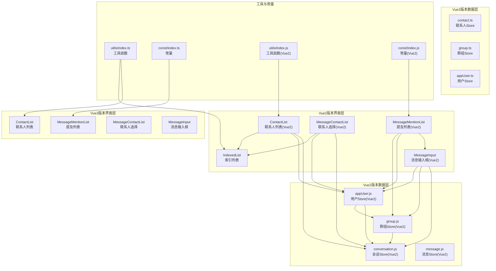
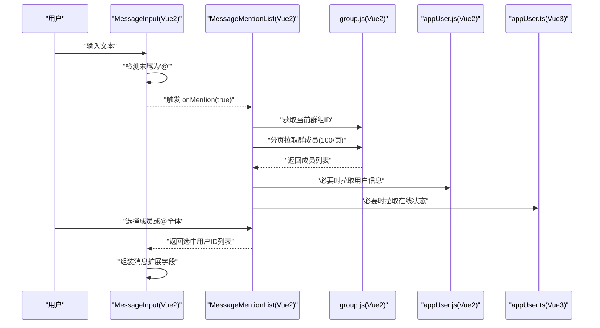
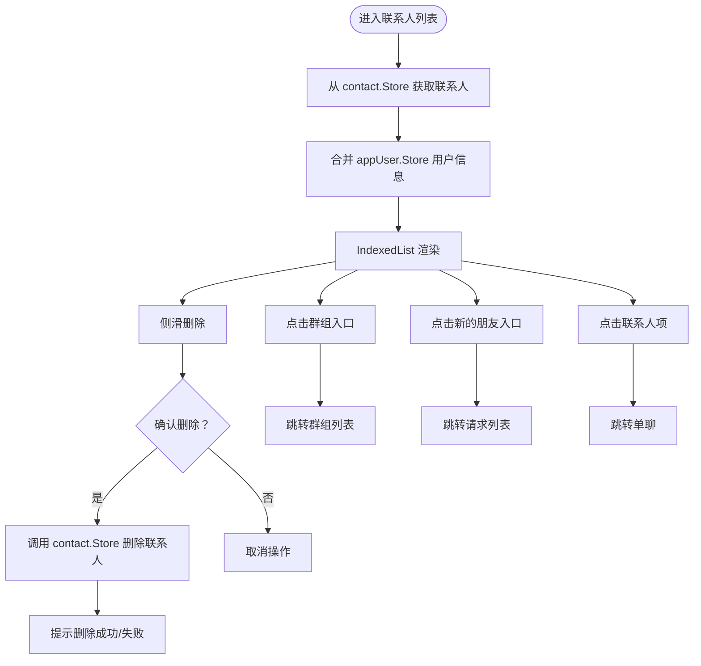
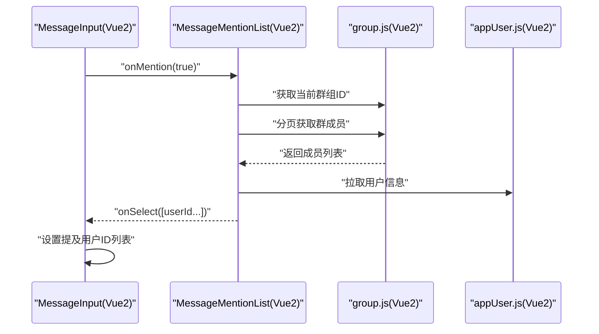
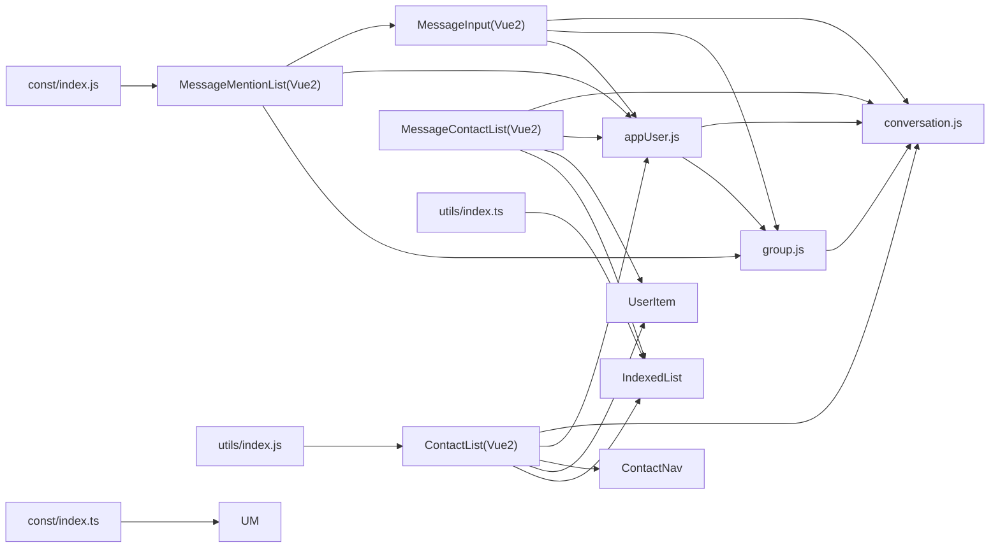

# 联系人和提及组件

<cite>
**本文档引用的文件**
- [ChatUIKit/modules/ContactList/index.vue](file://ChatUIKit/modules/ContactList/index.vue)
- [ChatUIKit/modules/ContactList/components/UserItem/index.vue](file://ChatUIKit/modules/ContactList/components/UserItem/index.vue)
- [ChatUIKit/modules/ContactList/components/ContactNav/index.vue](file://ChatUIKit/modules/ContactList/components/ContactNav/index.vue)
- [ChatUIKit/modules/Chat/components/MessageMentionList/index.vue](file://ChatUIKit/modules/Chat/components/MessageMentionList/index.vue)
- [ChatUIKit/modules/Chat/components/MessageContactList/index.vue](file://ChatUIKit/modules/Chat/components/MessageContactList/index.vue)
- [ChatUIKit/modules/ContactSearchList/index.vue](file://ChatUIKit/modules/ContactSearchList/index.vue)
- [ChatUIKit/modules/Chat/components/MessageInput/index.vue](file://ChatUIKit/modules/Chat/components/MessageInput/index.vue)
- [ChatUIKit/components/IndexedList/index.vue](file://ChatUIKit/components/IndexedList/index.vue)
- [ChatUIKit/stores/contact.ts](file://ChatUIKit/stores/contact.ts)
- [ChatUIKit/stores/group.ts](file://ChatUIKit/stores/group.ts)
- [ChatUIKit/stores/appUser.ts](file://ChatUIKit/stores/appUser.ts)
- [ChatUIKit/utils/index.ts](file://ChatUIKit/utils/index.ts)
- [ChatUIKit/const/index.ts](file://ChatUIKit/const/index.ts)
- [ChatUIKit-vue2/modules/Chat/components/MessageMentionList/index.vue](file://ChatUIKit-vue2/modules/Chat/components/MessageMentionList/index.vue)
- [ChatUIKit-vue2/modules/Chat/components/MessageContactList/index.vue](file://ChatUIKit-vue2/modules/Chat/components/MessageContactList/index.vue)
- [ChatUIKit-vue2/modules/Chat/components/MessageInput/index.vue](file://ChatUIKit-vue2/modules/Chat/components/MessageInput/index.vue)
- [ChatUIKit-vue2/stores/appUser.js](file://ChatUIKit-vue2/stores/appUser.js)
- [ChatUIKit-vue2/stores/group.js](file://ChatUIKit-vue2/stores/group.js)
- [ChatUIKit-vue2/stores/conversation.js](file://ChatUIKit-vue2/stores/conversation.js)
- [ChatUIKit-vue2/stores/message.js](file://ChatUIKit-vue2/stores/message.js)
- [ChatUIKit-vue2/stores/index.js](file://ChatUIKit-vue2/stores/index.js)
- [ChatUIKit-vue2/const/index.js](file://ChatUIKit-vue2/const/index.js)
- [ChatUIKit-vue2/utils/index.js](file://ChatUIKit-vue2/utils/index.js)
- [ChatUIKit-vue2/index.js](file://ChatUIKit-vue2/index.js)
</cite>

## 更新摘要
**变更内容**
- 新增Vue2版本的联系人列表和提及列表组件支持
- 添加Vue2版本的MessageMentionList和MessageContactList组件实现
- 更新数据层架构，从Pinia迁移到Vuex（Vue2）
- 新增Vue2版本的Store层实现（appUser.js、group.js、conversation.js、message.js）
- 添加Vue2版本的常量和工具函数支持
- 更新组件间的依赖关系和数据流

## 目录
1. [简介](#简介)
2. [项目结构](#项目结构)
3. [核心组件](#核心组件)
4. [架构总览](#架构总览)
5. [详细组件分析](#详细组件分析)
6. [Vue2版本新增功能](#vue2版本新增功能)
7. [依赖关系分析](#依赖关系分析)
8. [性能考虑](#性能考虑)
9. [故障排查指南](#故障排查指南)
10. [结论](#结论)
11. [附录](#附录)

## 简介
本文件面向"联系人和提及组件"，系统性阐述以下内容：
- 联系人列表的实现机制、用户搜索与选择流程
- 提及功能的触发机制、群成员列表展示与选择处理
- 联系人数据获取、缓存与更新策略
- 提及列表的自动完成、模糊匹配与搜索过滤能力
- 联系人的状态显示（在线/离线）、权限控制
- 性能优化（分页加载、批量获取、响应式计算）与用户体验提升（滑动菜单、索引列表、快捷跳转）
- 组件的可定制配置与集成方法
- **新增** Vue2版本的完整实现，包括组件、Store层和数据流

## 项目结构
围绕联系人与提及功能的关键模块与文件如下：
- 联系人列表模块：ContactList（Vue2版本）
- 提及列表模块：MessageMentionList（Vue2版本）
- 联系人选择模块：MessageContactList（Vue2版本）
- 联系人搜索模块：ContactSearchList
- 输入框与提及触发：MessageInput（Vue2版本）
- 通用索引列表：IndexedList
- 数据层：Vuex Store（Vue2版本）与Pinia Store（Vue3版本）
- 工具与常量：utils、const（Vue2版本）

**图表来源**
- [ChatUIKit-vue2/modules/Chat/components/MessageMentionList/index.vue](file://ChatUIKit-vue2/modules/Chat/components/MessageMentionList/index.vue#L1-L162)
- [ChatUIKit-vue2/modules/Chat/components/MessageContactList/index.vue](file://ChatUIKit-vue2/modules/Chat/components/MessageContactList/index.vue#L1-L209)
- [ChatUIKit-vue2/modules/Chat/components/MessageInput/index.vue](file://ChatUIKit-vue2/modules/Chat/components/MessageInput/index.vue#L1-L289)
- [ChatUIKit-vue2/stores/appUser.js](file://ChatUIKit-vue2/stores/appUser.js#L1-L54)
- [ChatUIKit-vue2/stores/group.js](file://ChatUIKit-vue2/stores/group.js#L1-L83)
- [ChatUIKit-vue2/stores/conversation.js](file://ChatUIKit-vue2/stores/conversation.js#L1-L258)
- [ChatUIKit-vue2/stores/message.js](file://ChatUIKit-vue2/stores/message.js#L1-L604)
- [ChatUIKit/modules/Chat/components/MessageMentionList/index.vue](file://ChatUIKit/modules/Chat/components/MessageMentionList/index.vue#L1-L158)
- [ChatUIKit/modules/Chat/components/MessageContactList/index.vue](file://ChatUIKit/modules/Chat/components/MessageContactList/index.vue#L1-L123)
- [ChatUIKit/modules/Chat/components/MessageInput/index.vue](file://ChatUIKit/modules/Chat/components/MessageInput/index.vue#L1-L217)
- [ChatUIKit/stores/appUser.ts](file://ChatUIKit/stores/appUser.ts#L1-L242)
- [ChatUIKit/stores/group.ts](file://ChatUIKit/stores/group.ts#L1-L317)
- [ChatUIKit/stores/contact.ts](file://ChatUIKit/stores/contact.ts#L1-L282)
- [ChatUIKit/utils/index.ts](file://ChatUIKit/utils/index.ts#L1-L344)
- [ChatUIKit/const/index.ts](file://ChatUIKit/const/index.ts#L1-L37)
- [ChatUIKit-vue2/utils/index.js](file://ChatUIKit-vue2/utils/index.js#L1-L412)
- [ChatUIKit-vue2/const/index.js](file://ChatUIKit-vue2/const/index.js#L1-L33)

**章节来源**
- [ChatUIKit-vue2/modules/Chat/components/MessageMentionList/index.vue](file://ChatUIKit-vue2/modules/Chat/components/MessageMentionList/index.vue#L1-L162)
- [ChatUIKit-vue2/modules/Chat/components/MessageContactList/index.vue](file://ChatUIKit-vue2/modules/Chat/components/MessageContactList/index.vue#L1-L209)
- [ChatUIKit-vue2/modules/Chat/components/MessageInput/index.vue](file://ChatUIKit-vue2/modules/Chat/components/MessageInput/index.vue#L1-L289)
- [ChatUIKit-vue2/stores/appUser.js](file://ChatUIKit-vue2/stores/appUser.js#L1-L54)
- [ChatUIKit-vue2/stores/group.js](file://ChatUIKit-vue2/stores/group.js#L1-L83)
- [ChatUIKit-vue2/stores/conversation.js](file://ChatUIKit-vue2/stores/conversation.js#L1-L258)
- [ChatUIKit-vue2/stores/message.js](file://ChatUIKit-vue2/stores/message.js#L1-L604)
- [ChatUIKit-vue2/stores/index.js](file://ChatUIKit-vue2/stores/index.js#L1-L23)
- [ChatUIKit-vue2/const/index.js](file://ChatUIKit-vue2/const/index.js#L1-L33)
- [ChatUIKit-vue2/utils/index.js](file://ChatUIKit-vue2/utils/index.js#L1-L412)
- [ChatUIKit-vue2/index.js](file://ChatUIKit-vue2/index.js#L1-L276)

## 核心组件
- 联系人列表 ContactList：聚合联系人与用户信息，渲染索引列表，支持滑动删除、跳转聊天等交互。
- 用户项 UserItem：单条联系人/群成员项，支持侧滑菜单、头像、昵称、在线状态展示。
- 联系人导航 ContactNav：顶部导航，展示当前用户头像与在线状态，提供添加联系人入口。
- 提及列表 MessageMentionList：群成员分页拉取，支持"@全体"与逐个成员选择（**Vue2版本已实现**）。
- 联系人选择 MessageContactList：联系人索引列表选择，用于分享名片等场景（**Vue2版本已实现**）。
- 联系人搜索 ContactSearchList：基于联系人昵称的实时过滤。
- 索引列表 IndexedList：字母索引、分组展示、快捷跳转、特殊入口（群组、新的朋友）。
- Store 层：contact、group、appUser（**Vue3版本**）与appUser.js、group.js、conversation.js、message.js（**Vue2版本**）。
- 工具与常量：拼音首字母分组、平台检测、分页大小等。

**章节来源**
- [ChatUIKit/modules/ContactList/index.vue](file://ChatUIKit/modules/ContactList/index.vue#L1-L115)
- [ChatUIKit/modules/ContactList/components/UserItem/index.vue](file://ChatUIKit/modules/ContactList/components/UserItem/index.vue#L1-L165)
- [ChatUIKit/modules/ContactList/components/ContactNav/index.vue](file://ChatUIKit/modules/ContactList/components/ContactNav/index.vue#L1-L99)
- [ChatUIKit/modules/Chat/components/MessageMentionList/index.vue](file://ChatUIKit/modules/Chat/components/MessageMentionList/index.vue#L1-L158)
- [ChatUIKit/modules/Chat/components/MessageContactList/index.vue](file://ChatUIKit/modules/Chat/components/MessageContactList/index.vue#L1-L123)
- [ChatUIKit/modules/ContactSearchList/index.vue](file://ChatUIKit/modules/ContactSearchList/index.vue#L1-L117)
- [ChatUIKit/components/IndexedList/index.vue](file://ChatUIKit/components/IndexedList/index.vue#L1-L341)
- [ChatUIKit-vue2/modules/Chat/components/MessageMentionList/index.vue](file://ChatUIKit-vue2/modules/Chat/components/MessageMentionList/index.vue#L1-L162)
- [ChatUIKit-vue2/modules/Chat/components/MessageContactList/index.vue](file://ChatUIKit-vue2/modules/Chat/components/MessageContactList/index.vue#L1-L209)
- [ChatUIKit-vue2/stores/appUser.js](file://ChatUIKit-vue2/stores/appUser.js#L1-L54)
- [ChatUIKit-vue2/stores/group.js](file://ChatUIKit-vue2/stores/group.js#L1-L83)
- [ChatUIKit-vue2/stores/conversation.js](file://ChatUIKit-vue2/stores/conversation.js#L1-L258)
- [ChatUIKit-vue2/stores/message.js](file://ChatUIKit-vue2/stores/message.js#L1-L604)

## 架构总览
整体采用"界面层 + 数据层 + 工具层"的分层设计：
- 界面层通过 Store 获取数据，使用 IndexedList 实现高效展示与索引跳转。
- 提及功能在消息输入框监听"@"触发，弹出 MessageMentionList，按群组分页拉取成员。
- 联系人搜索在 ContactSearchList 中基于昵称过滤，点击后进入聊天页。
- 用户信息与在线状态由 appUser Store 缓存，contact Store 异步补充用户信息，避免阻塞。
- **Vue2版本**采用Vuex替代Pinia，保持相同的组件架构和数据流。

**图表来源**
- [ChatUIKit-vue2/modules/Chat/components/MessageInput/index.vue](file://ChatUIKit-vue2/modules/Chat/components/MessageInput/index.vue#L107-L118)
- [ChatUIKit-vue2/modules/Chat/components/MessageMentionList/index.vue](file://ChatUIKit-vue2/modules/Chat/components/MessageMentionList/index.vue#L64-L82)
- [ChatUIKit-vue2/stores/group.js](file://ChatUIKit-vue2/stores/group.js#L68-L81)
- [ChatUIKit-vue2/stores/appUser.js](file://ChatUIKit-vue2/stores/appUser.js#L42-L51)
- [ChatUIKit/modules/Chat/components/MessageInput/index.vue](file://ChatUIKit/modules/Chat/components/MessageInput/index.vue#L123-L135)
- [ChatUIKit/modules/Chat/components/MessageMentionList/index.vue](file://ChatUIKit/modules/Chat/components/MessageMentionList/index.vue#L67-L92)
- [ChatUIKit/stores/appUser.ts](file://ChatUIKit/stores/appUser.ts#L86-L125)

## 详细组件分析

### 联系人列表 ContactList
- 数据来源与合并
  - 从 contact Store 获取联系人列表，同时通过 appUser Store 合并用户昵称、头像、在线状态等信息。
  - 使用 computed 合并，避免 autorun，减少不必要的重渲染。
- 交互行为
  - 点击群组入口跳转群组列表；点击"新的朋友"入口跳转请求列表。
  - 点击联系人项跳转单聊；支持侧滑删除，删除前弹确认框。
- 状态管理
  - 通过 contact Store 的 deepGetUserInfo 分页异步拉取用户信息，避免阻塞 UI。
  - 删除联系人后同步更新本地列表，并提示成功/失败。

**图表来源**
- [ChatUIKit/modules/ContactList/index.vue](file://ChatUIKit/modules/ContactList/index.vue#L44-L93)
- [ChatUIKit/stores/contact.ts](file://ChatUIKit/stores/contact.ts#L112-L130)
- [ChatUIKit/stores/appUser.ts](file://ChatUIKit/stores/appUser.ts#L35-L46)

**章节来源**
- [ChatUIKit/modules/ContactList/index.vue](file://ChatUIKit/modules/ContactList/index.vue#L1-L115)
- [ChatUIKit/stores/contact.ts](file://ChatUIKit/stores/contact.ts#L83-L130)
- [ChatUIKit/stores/appUser.ts](file://ChatUIKit/stores/appUser.ts#L35-L46)

### 用户项 UserItem
- 展示内容
  - 头像、昵称、在线状态文案（受配置开关控制）。
- 交互细节
  - 支持侧滑显示删除菜单；点击非滑动时触发点击事件。
  - 暴露 setShowMenu 方法供父组件控制菜单显隐。
- 配置开关
  - 通过 config Store 的 usePresence 控制是否展示在线状态。

**章节来源**
- [ChatUIKit/modules/ContactList/components/UserItem/index.vue](file://ChatUIKit/modules/ContactList/components/UserItem/index.vue#L1-L165)
- [ChatUIKit/stores/appUser.ts](file://ChatUIKit/stores/appUser.ts#L35-L46)

### 联系人导航 ContactNav
- 展示当前用户头像与在线状态，提供添加联系人入口（非微信小程序平台）。
- 顶部标题背景图与右侧按钮样式通过资源路径配置。

**章节来源**
- [ChatUIKit/modules/ContactList/components/ContactNav/index.vue](file://ChatUIKit/modules/ContactList/components/ContactNav/index.vue#L1-L99)

### 提及列表 MessageMentionList（Vue2版本）
- 触发机制
  - 在 MessageInput 中监听输入末尾为"@"时触发 onMention。
- 数据拉取
  - 通过 group Store 分页拉取当前群组成员（每页 100），支持滚动到底部加载更多。
  - 通过 contact Store 与 appUser Store 补充用户信息与在线状态。
- 选择处理
  - 支持选择"@全体"或具体成员；返回选中用户 ID 列表给 MessageInput。
- UI 行为
  - 弹窗高度固定，支持蒙层点击关闭；顶部"返回"按钮。
- **Vue2版本特色**
  - 使用Vuex状态管理，组件内部维护visible状态和用户头像URL常量。
  - 支持@全体功能，显示群组头像而非用户头像。

**图表来源**
- [ChatUIKit-vue2/modules/Chat/components/MessageInput/index.vue](file://ChatUIKit-vue2/modules/Chat/components/MessageInput/index.vue#L107-L118)
- [ChatUIKit-vue2/modules/Chat/components/MessageMentionList/index.vue](file://ChatUIKit-vue2/modules/Chat/components/MessageMentionList/index.vue#L64-L82)
- [ChatUIKit-vue2/stores/group.js](file://ChatUIKit-vue2/stores/group.js#L68-L81)
- [ChatUIKit-vue2/stores/appUser.js](file://ChatUIKit-vue2/stores/appUser.js#L42-L51)

**章节来源**
- [ChatUIKit/modules/Chat/components/MessageMentionList/index.vue](file://ChatUIKit/modules/Chat/components/MessageMentionList/index.vue#L1-L158)
- [ChatUIKit-vue2/modules/Chat/components/MessageMentionList/index.vue](file://ChatUIKit-vue2/modules/Chat/components/MessageMentionList/index.vue#L1-L162)
- [ChatUIKit/const/index.ts](file://ChatUIKit/const/index.ts#L1-L37)
- [ChatUIKit-vue2/const/index.js](file://ChatUIKit-vue2/const/index.js#L1-L33)

### 联系人选择 MessageContactList（Vue2版本）
- 功能定位
  - 在消息输入工具栏中提供"分享名片"入口，打开弹窗展示联系人索引列表。
- 数据与交互
  - 数据来源同 ContactList，computed 合并用户信息；点击联系人项回调 onSelect 并关闭弹窗。
- **Vue2版本特色**
  - 使用Vuex状态管理，组件内部维护visible状态、selectedIds数组和用户头像URL常量。
  - 支持多选功能，底部显示确认按钮和已选人数统计。
  - 支持复选框样式，选中状态有视觉反馈。

**章节来源**
- [ChatUIKit/modules/Chat/components/MessageContactList/index.vue](file://ChatUIKit/modules/Chat/components/MessageContactList/index.vue#L1-L123)
- [ChatUIKit-vue2/modules/Chat/components/MessageContactList/index.vue](file://ChatUIKit-vue2/modules/Chat/components/MessageContactList/index.vue#L1-L209)
- [ChatUIKit/components/IndexedList/index.vue](file://ChatUIKit/components/IndexedList/index.vue#L1-L341)

### 联系人搜索 ContactSearchList
- 搜索逻辑
  - 监听 SearchInput 输入，基于 appUser Store 的用户昵称进行包含匹配。
- 页面行为
  - 无结果时展示 Empty；点击联系人项跳转单聊。

**章节来源**
- [ChatUIKit/modules/ContactSearchList/index.vue](file://ChatUIKit/modules/ContactSearchList/index.vue#L1-L117)
- [ChatUIKit/stores/appUser.ts](file://ChatUIKit/stores/appUser.ts#L35-L46)

### 索引列表 IndexedList
- 功能特性
  - 将用户按首字母分组（支持中文拼音首字母），提供右侧字母索引快速跳转。
  - 支持特殊入口：群组、新的朋友（带未读角标）。
  - 支持复选框模式（多选）。
- 性能优化
  - computed 缓存分组结果，避免重复计算；字母索引激活态短暂高亮。

**章节来源**
- [ChatUIKit/components/IndexedList/index.vue](file://ChatUIKit/components/IndexedList/index.vue#L1-L341)
- [ChatUIKit/utils/index.ts](file://ChatUIKit/utils/index.ts#L328-L343)

## Vue2版本新增功能

### Vue2版本组件架构
- **组件实现**：MessageMentionList、MessageContactList、MessageInput均采用Vue2语法实现
- **状态管理**：从Pinia迁移到Vuex，使用Vue.use(Vuex)初始化
- **数据流**：保持与Vue3版本一致的组件间通信和数据传递机制
- **样式系统**：继续使用SCSS预处理器，保持组件样式的一致性

### Vue2版本Store层实现

#### 应用用户Store（appUser.js）
- 主要职责
  - 缓存用户信息与在线状态，提供 getters 返回带默认值的对象。
  - 按需从服务器拉取用户信息与在线状态，支持订阅/发布自定义状态。
- 关键点
  - 使用Vue.set确保响应式更新用户信息映射。
  - 简化的getUsersInfoFromServer实现，实际项目中应调用SDK接口。

**章节来源**
- [ChatUIKit-vue2/stores/appUser.js](file://ChatUIKit-vue2/stores/appUser.js#L1-L54)

#### 群组Store（group.js）
- 主要职责
  - 获取加入群组列表、群组详情映射，提供群组名称和头像查询。
  - 管理群组的增删改查操作。
- 关键点
  - 使用Vue.set确保群组映射的响应式更新。
  - 提供getJoinedGroupList异步方法获取群组列表。

**章节来源**
- [ChatUIKit-vue2/stores/group.js](file://ChatUIKit-vue2/stores/group.js#L1-L83)

#### 会话Store（conversation.js）
- 主要职责
  - 管理会话列表、当前会话、未读消息总数等。
  - 提供会话排序、静音状态管理等功能。
- 关键点
  - 实现完整的会话生命周期管理。
  - 提供getServerConversations异步方法获取服务器会话列表。

**章节来源**
- [ChatUIKit-vue2/stores/conversation.js](file://ChatUIKit-vue2/stores/conversation.js#L1-L258)

#### 消息Store（message.js）
- 主要职责
  - 管理消息内容映射、会话消息ID列表映射。
  - 提供消息发送、接收、撤回、删除等完整功能。
- 关键点
  - 实现消息历史记录分页加载。
  - 提供消息状态管理和播放控制。

**章节来源**
- [ChatUIKit-vue2/stores/message.js](file://ChatUIKit-vue2/stores/message.js#L1-L604)

### Vue2版本工具与常量

#### 常量定义（const/index.js）
- 定义了Vue2版本专用的常量，包括：
  - GET_GROUP_MEMBERS_PAGESIZE：群组成员分页大小
  - AT_ALL：@全体标识符
  - USER_AVATAR_URL/GROUP_AVATAR_URL：默认头像URL
  - PRESENCE_STATUS_LIST：用户状态列表

**章节来源**
- [ChatUIKit-vue2/const/index.js](file://ChatUIKit-vue2/const/index.js#L1-L33)

#### 工具函数（utils/index.js）
- 提供与Vue3版本相同的工具函数集合：
  - 平台检测函数（isWeb、isWXProgram、isAndroid、isIOS）
  - 时间格式化和自动缩短函数
  - 深拷贝函数
  - 数组分块和消息格式化函数
  - 按名称分组函数

**章节来源**
- [ChatUIKit-vue2/utils/index.js](file://ChatUIKit-vue2/utils/index.js#L1-L412)

### Vue2版本主入口（index.js）
- **ChatUIKit类**：提供完整的Vue2版本SDK封装
- **初始化流程**：设置SDK连接、注册事件监听器、加载初始数据
- **事件处理**：统一处理各种SDK事件，如消息接收、连接状态变化等
- **Store集成**：与Vuex Store深度集成，提供完整的状态管理

**章节来源**
- [ChatUIKit-vue2/index.js](file://ChatUIKit-vue2/index.js#L1-L276)

## 依赖关系分析
- 组件间依赖
  - ContactList 依赖 IndexedList、UserItem、ContactNav、contact Store、appUser Store。
  - MessageMentionList 依赖 group Store、contact Store、appUser Store、MessageInput。
  - MessageContactList 依赖 IndexedList、UserItem、contact Store、appUser Store。
  - ContactSearchList 依赖 contact Store、appUser Store。
- **Vue2版本新增依赖**
  - MessageMentionList(Vue2) 依赖 group.js、appUser.js、MessageInput(Vue2)。
  - MessageContactList(Vue2) 依赖 conversation.js、message.js、appUser.js。
  - MessageInput(Vue2) 依赖 conversation.js、message.js、appUser.js。
- 工具与常量
  - utils 提供拼音首字母分组、平台检测、分页工具等。
  - const 定义分页大小、@全体标识、资源路径等。

**图表来源**
- [ChatUIKit-vue2/modules/Chat/components/MessageMentionList/index.vue](file://ChatUIKit-vue2/modules/Chat/components/MessageMentionList/index.vue#L35-L43)
- [ChatUIKit-vue2/modules/Chat/components/MessageContactList/index.vue](file://ChatUIKit-vue2/modules/Chat/components/MessageContactList/index.vue#L39-L47)
- [ChatUIKit-vue2/modules/Chat/components/MessageInput/index.vue](file://ChatUIKit-vue2/modules/Chat/components/MessageInput/index.vue#L44-L53)
- [ChatUIKit-vue2/stores/index.js](file://ChatUIKit-vue2/stores/index.js#L11-L19)
- [ChatUIKit/modules/Chat/components/MessageMentionList/index.vue](file://ChatUIKit/modules/Chat/components/MessageMentionList/index.vue#L47-L62)
- [ChatUIKit/modules/Chat/components/MessageContactList/index.vue](file://ChatUIKit/modules/Chat/components/MessageContactList/index.vue#L36-L45)
- [ChatUIKit/modules/ContactSearchList/index.vue](file://ChatUIKit/modules/ContactSearchList/index.vue#L35-L45)
- [ChatUIKit-vue2/utils/index.js](file://ChatUIKit-vue2/utils/index.js#L62-L93)
- [ChatUIKit-vue2/const/index.js](file://ChatUIKit-vue2/const/index.js#L3-L8)

## 性能考虑
- 分页与批量拉取
  - 联系人信息：每页 100，顺序分页拉取，避免一次性请求过多。
  - 群组详情：每批 20，并发 Promise.all，减少等待时间。
- 响应式与缓存
  - computed 合并联系人与用户信息，避免 autorun，降低重渲染成本。
  - appUser Store 缓存用户信息与在线状态，仅对未缓存用户发起请求。
- UI 渲染优化
  - IndexedList 仅对可见字母索引高亮，减少 DOM 操作。
  - 提及列表滚动到底部再加载，避免一次性渲染大量节点。
- 平台差异
  - 通过平台检测（isWXProgram、isIOS、isAndroid）控制 UI 与权限请求时机。
- **Vue2版本优化**
  - Vuex状态管理相比Pinia在Vue2环境下更稳定。
  - 组件内部状态管理简化，减少不必要的响应式开销。

**章节来源**
- [ChatUIKit/stores/contact.ts](file://ChatUIKit/stores/contact.ts#L83-L107)
- [ChatUIKit/stores/group.ts](file://ChatUIKit/stores/group.ts#L136-L167)
- [ChatUIKit/stores/appUser.ts](file://ChatUIKit/stores/appUser.ts#L86-L125)
- [ChatUIKit-vue2/stores/appUser.js](file://ChatUIKit-vue2/stores/appUser.js#L42-L51)
- [ChatUIKit-vue2/stores/group.js](file://ChatUIKit-vue2/stores/group.js#L68-L81)
- [ChatUIKit-vue2/utils/index.js](file://ChatUIKit-vue2/utils/index.js#L62-L93)

## 故障排查指南
- 提及列表无法加载群成员
  - 检查当前会话是否为群组会话；确认 group Store 已获取当前群组 ID。
  - 查看分页加载逻辑，确认每页数量与"是否还有更多"判断。
- 删除联系人后 UI 未更新
  - 确认 contact Store 的 deleteStoreContact 已执行；检查 computed 合并是否生效。
- 在线状态不显示
  - 检查 config Store 的 usePresence 开关；确认 appUser Store 的订阅/拉取是否成功。
- 搜索无结果
  - 确认 appUser Store 的用户信息已缓存；检查昵称匹配逻辑。
- 权限问题（录音/麦克风）
  - Android 平台需动态申请录音权限；检查权限请求与提示逻辑。
- **Vue2版本特定问题**
  - Vuex状态更新：确保使用commit和dispatch正确更新状态。
  - 组件通信：检查$emit和事件监听器的正确绑定。
  - Store初始化：确认ChatUIKit.init正确初始化了Vuex Store。

**章节来源**
- [ChatUIKit/modules/Chat/components/MessageMentionList/index.vue](file://ChatUIKit/modules/Chat/components/MessageMentionList/index.vue#L67-L92)
- [ChatUIKit/stores/contact.ts](file://ChatUIKit/stores/contact.ts#L152-L175)
- [ChatUIKit/stores/appUser.ts](file://ChatUIKit/stores/appUser.ts#L130-L159)
- [ChatUIKit/modules/ContactSearchList/index.vue](file://ChatUIKit/modules/ContactSearchList/index.vue#L51-L60)
- [ChatUIKit/modules/Chat/components/MessageInput/index.vue](file://ChatUIKit/modules/Chat/components/MessageInput/index.vue#L92-L109)
- [ChatUIKit-vue2/modules/Chat/components/MessageMentionList/index.vue](file://ChatUIKit-vue2/modules/Chat/components/MessageMentionList/index.vue#L58-L61)
- [ChatUIKit-vue2/modules/Chat/components/MessageContactList/index.vue](file://ChatUIKit-vue2/modules/Chat/components/MessageContactList/index.vue#L58-L61)
- [ChatUIKit-vue2/modules/Chat/components/MessageInput/index.vue](file://ChatUIKit-vue2/modules/Chat/components/MessageInput/index.vue#L81-L84)

## 结论
该联系人与提及组件体系通过清晰的分层设计与 Store 的响应式数据管理，实现了：
- 高效的联系人列表渲染与索引跳转
- 稳健的提及触发与群成员分页加载
- 完整的用户信息与在线状态缓存
- 可扩展的搜索与选择能力
- **新增** Vue2版本的完整实现，提供与Vue3版本相同的功能特性和API接口

建议在集成时关注：
- 正确配置 featureConfig 与 usePresence
- 合理使用分页与缓存策略
- 在 Android 平台处理好权限请求
- 通过 computed 合并数据，避免 autorun
- **Vue2版本**注意Vuex状态管理的正确使用和组件通信

## 附录

### 自定义配置与集成要点
- 功能开关
  - 在 config Store 中开启/关闭 mentions、images、videos、files、userCard、presence 等。
- 提及与@全体
  - 通过 const 中 AT_ALL 标识"@全体"；在 MessageInput 中根据会话类型与输入触发。
- 索引与搜索
  - IndexedList 支持复选框与特殊入口；ContactSearchList 基于昵称过滤。
- 状态显示
  - 通过 appUser Store 的 presenceExt 与 isOnline 控制展示；受 usePresence 开关影响。
- **Vue2版本集成**
  - 使用ChatUIKit.init初始化SDK和Store
  - 通过Vuex访问应用状态，使用commit和dispatch更新状态
  - 组件间通信使用$emit和事件监听器

**章节来源**
- [ChatUIKit/modules/Chat/components/MessageInput/index.vue](file://ChatUIKit/modules/Chat/components/MessageInput/index.vue#L68-L85)
- [ChatUIKit/const/index.ts](file://ChatUIKit/const/index.ts#L5-L36)
- [ChatUIKit/components/IndexedList/index.vue](file://ChatUIKit/components/IndexedList/index.vue#L115-L126)
- [ChatUIKit/stores/appUser.ts](file://ChatUIKit/stores/appUser.ts#L35-L46)
- [ChatUIKit-vue2/modules/Chat/components/MessageInput/index.vue](file://ChatUIKit-vue2/modules/Chat/components/MessageInput/index.vue#L67-L73)
- [ChatUIKit-vue2/const/index.js](file://ChatUIKit-vue2/const/index.js#L6-L7)
- [ChatUIKit-vue2/index.js](file://ChatUIKit-vue2/index.js#L18-L38)