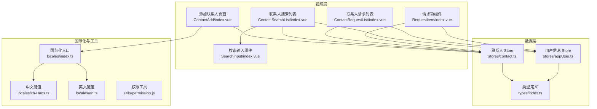
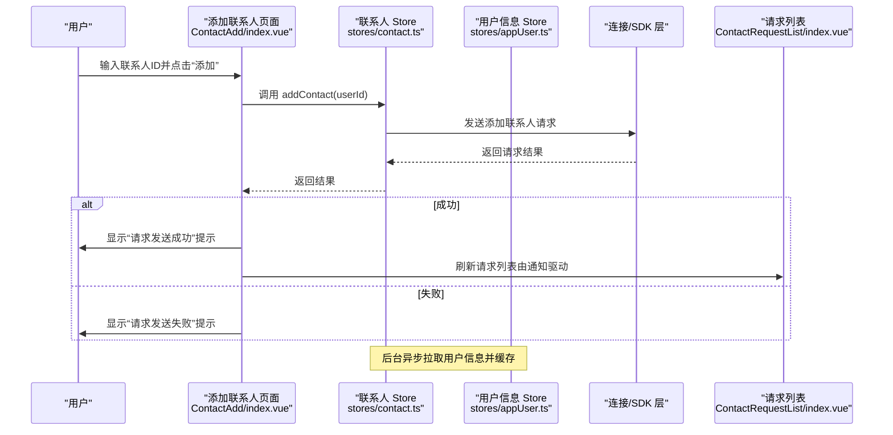
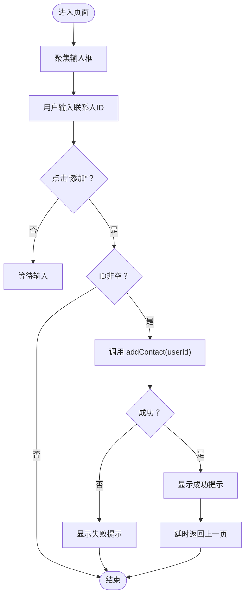
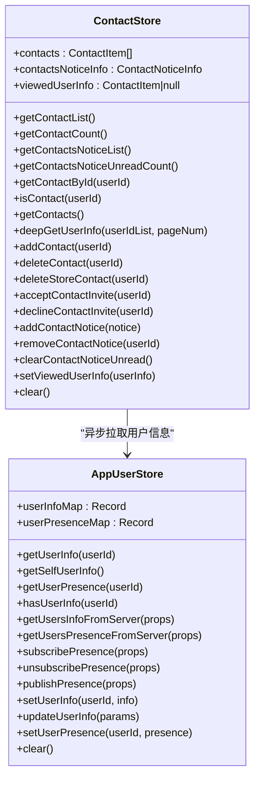
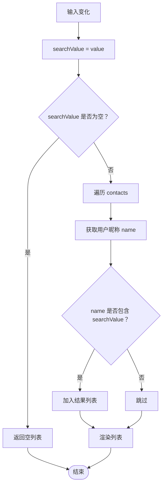
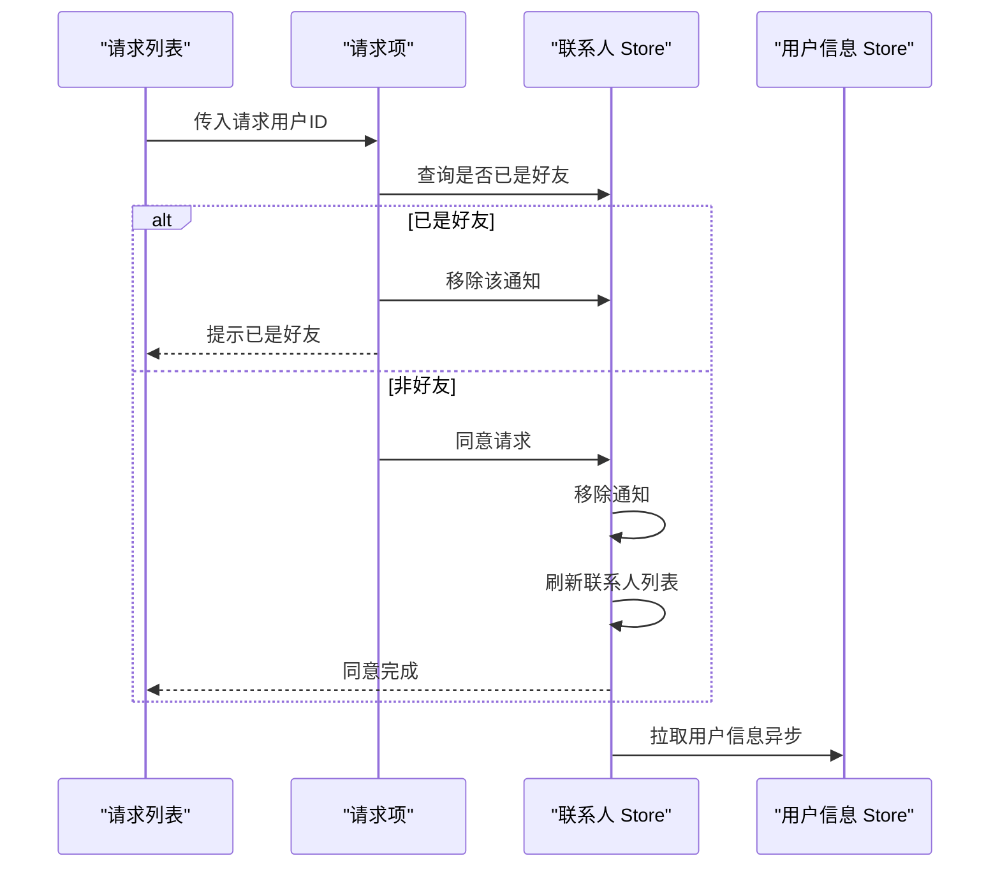
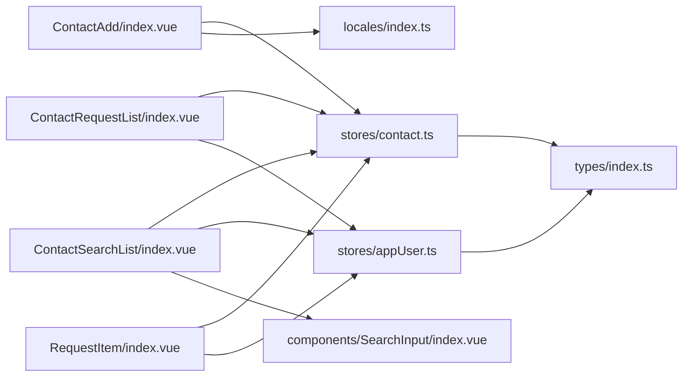

# 添加联系人

<cite>
**本文引用的文件**
- [ChatUIKit/modules/ContactAdd/index.vue](file://ChatUIKit/modules/ContactAdd/index.vue)
- [ChatUIKit/stores/contact.ts](file://ChatUIKit/stores/contact.ts)
- [ChatUIKit/stores/appUser.ts](file://ChatUIKit/stores/appUser.ts)
- [ChatUIKit/modules/ContactSearchList/index.vue](file://ChatUIKit/modules/ContactSearchList/index.vue)
- [ChatUIKit/modules/ContactRequestList/index.vue](file://ChatUIKit/modules/ContactRequestList/index.vue)
- [ChatUIKit/modules/ContactRequestList/components/RequestItem/index.vue](file://ChatUIKit/modules/ContactRequestList/components/RequestItem/index.vue)
- [ChatUIKit/components/SearchInput/index.vue](file://ChatUIKit/components/SearchInput/index.vue)
- [ChatUIKit/locales/index.ts](file://ChatUIKit/locales/index.ts)
- [ChatUIKit/locales/zh-Hans.ts](file://ChatUIKit/locales/zh-Hans.ts)
- [ChatUIKit/locales/en.ts](file://ChatUIKit/locales/en.ts)
- [ChatUIKit/types/index.ts](file://ChatUIKit/types/index.ts)
- [ChatUIKit/utils/permission.js](file://ChatUIKit/utils/permission.js)
</cite>

## 目录
1. [简介](#简介)
2. [项目结构](#项目结构)
3. [核心组件](#核心组件)
4. [架构总览](#架构总览)
5. [详细组件分析](#详细组件分析)
6. [依赖关系分析](#依赖关系分析)
7. [性能考虑](#性能考虑)
8. [故障排查指南](#故障排查指南)
9. [结论](#结论)
10. [附录](#附录)

## 简介
本文件围绕“添加联系人”功能进行系统化文档说明，覆盖从用户输入、请求发送、权限与安全校验、到与联系人请求系统的集成与状态同步等全流程。同时补充联系人搜索、模糊匹配与结果过滤、搜索历史与常用联系人推荐、批量添加等扩展能力的实现思路与落地建议，并给出错误处理、网络异常与用户体验优化策略。

## 项目结构
“添加联系人”涉及的主要模块与文件如下：
- 视图层：添加联系人页面、联系人搜索列表、联系人请求列表及其子项
- 数据层：联系人 Store、用户信息 Store
- 工具与国际化：搜索输入组件、国际化键值、类型定义、权限工具

图表来源
- [ChatUIKit/modules/ContactAdd/index.vue](file://ChatUIKit/modules/ContactAdd/index.vue#L1-L85)
- [ChatUIKit/modules/ContactSearchList/index.vue](file://ChatUIKit/modules/ContactSearchList/index.vue#L1-L117)
- [ChatUIKit/modules/ContactRequestList/index.vue](file://ChatUIKit/modules/ContactRequestList/index.vue#L1-L74)
- [ChatUIKit/modules/ContactRequestList/components/RequestItem/index.vue](file://ChatUIKit/modules/ContactRequestList/components/RequestItem/index.vue#L1-L148)
- [ChatUIKit/components/SearchInput/index.vue](file://ChatUIKit/components/SearchInput/index.vue#L1-L126)
- [ChatUIKit/stores/contact.ts](file://ChatUIKit/stores/contact.ts#L1-L282)
- [ChatUIKit/stores/appUser.ts](file://ChatUIKit/stores/appUser.ts#L1-L242)
- [ChatUIKit/locales/index.ts](file://ChatUIKit/locales/index.ts#L1-L17)
- [ChatUIKit/locales/zh-Hans.ts](file://ChatUIKit/locales/zh-Hans.ts#L1-L154)
- [ChatUIKit/locales/en.ts](file://ChatUIKit/locales/en.ts#L1-L154)
- [ChatUIKit/types/index.ts](file://ChatUIKit/types/index.ts#L1-L100)
- [ChatUIKit/utils/permission.js](file://ChatUIKit/utils/permission.js#L1-L272)

章节来源
- [ChatUIKit/modules/ContactAdd/index.vue](file://ChatUIKit/modules/ContactAdd/index.vue#L1-L85)
- [ChatUIKit/stores/contact.ts](file://ChatUIKit/stores/contact.ts#L1-L282)
- [ChatUIKit/stores/appUser.ts](file://ChatUIKit/stores/appUser.ts#L1-L242)
- [ChatUIKit/modules/ContactSearchList/index.vue](file://ChatUIKit/modules/ContactSearchList/index.vue#L1-L117)
- [ChatUIKit/modules/ContactRequestList/index.vue](file://ChatUIKit/modules/ContactRequestList/index.vue#L1-L74)
- [ChatUIKit/modules/ContactRequestList/components/RequestItem/index.vue](file://ChatUIKit/modules/ContactRequestList/components/RequestItem/index.vue#L1-L148)
- [ChatUIKit/components/SearchInput/index.vue](file://ChatUIKit/components/SearchInput/index.vue#L1-L126)
- [ChatUIKit/locales/index.ts](file://ChatUIKit/locales/index.ts#L1-L17)
- [ChatUIKit/locales/zh-Hans.ts](file://ChatUIKit/locales/zh-Hans.ts#L1-L154)
- [ChatUIKit/locales/en.ts](file://ChatUIKit/locales/en.ts#L1-L154)
- [ChatUIKit/types/index.ts](file://ChatUIKit/types/index.ts#L1-L100)
- [ChatUIKit/utils/permission.js](file://ChatUIKit/utils/permission.js#L1-L272)

## 核心组件
- 添加联系人页面：负责接收用户输入的联系人ID，触发添加请求，并在成功后提示与返回
- 联系人 Store：封装联系人增删改查、请求发送、通知管理与本地状态维护
- 用户信息 Store：封装用户信息与在线状态的获取、缓存与订阅
- 联系人搜索列表：提供本地联系人列表的搜索与跳转
- 联系人请求列表：展示好友申请通知，支持同意/拒绝
- 请求项组件：单个请求项的交互与状态处理
- 搜索输入组件：统一的搜索输入控件，支持清空与取消
- 国际化：提供多语言文案键值
- 类型定义：统一的数据结构与通知类型
- 权限工具：平台级权限判断与系统服务检查（如定位、推送等）

章节来源
- [ChatUIKit/modules/ContactAdd/index.vue](file://ChatUIKit/modules/ContactAdd/index.vue#L1-L85)
- [ChatUIKit/stores/contact.ts](file://ChatUIKit/stores/contact.ts#L1-L282)
- [ChatUIKit/stores/appUser.ts](file://ChatUIKit/stores/appUser.ts#L1-L242)
- [ChatUIKit/modules/ContactSearchList/index.vue](file://ChatUIKit/modules/ContactSearchList/index.vue#L1-L117)
- [ChatUIKit/modules/ContactRequestList/index.vue](file://ChatUIKit/modules/ContactRequestList/index.vue#L1-L74)
- [ChatUIKit/modules/ContactRequestList/components/RequestItem/index.vue](file://ChatUIKit/modules/ContactRequestList/components/RequestItem/index.vue#L1-L148)
- [ChatUIKit/components/SearchInput/index.vue](file://ChatUIKit/components/SearchInput/index.vue#L1-L126)
- [ChatUIKit/locales/index.ts](file://ChatUIKit/locales/index.ts#L1-L17)
- [ChatUIKit/locales/zh-Hans.ts](file://ChatUIKit/locales/zh-Hans.ts#L1-L154)
- [ChatUIKit/locales/en.ts](file://ChatUIKit/locales/en.ts#L1-L154)
- [ChatUIKit/types/index.ts](file://ChatUIKit/types/index.ts#L1-L100)
- [ChatUIKit/utils/permission.js](file://ChatUIKit/utils/permission.js#L1-L272)

## 架构总览
添加联系人的端到端流程如下：

图表来源
- [ChatUIKit/modules/ContactAdd/index.vue](file://ChatUIKit/modules/ContactAdd/index.vue#L42-L61)
- [ChatUIKit/stores/contact.ts](file://ChatUIKit/stores/contact.ts#L135-L147)
- [ChatUIKit/modules/ContactRequestList/index.vue](file://ChatUIKit/modules/ContactRequestList/index.vue#L33-L52)

章节来源
- [ChatUIKit/modules/ContactAdd/index.vue](file://ChatUIKit/modules/ContactAdd/index.vue#L42-L61)
- [ChatUIKit/stores/contact.ts](file://ChatUIKit/stores/contact.ts#L135-L147)
- [ChatUIKit/modules/ContactRequestList/index.vue](file://ChatUIKit/modules/ContactRequestList/index.vue#L33-L52)

## 详细组件分析

### 添加联系人页面（ContactAdd/index.vue）
- 功能要点
  - 单行输入框绑定联系人ID
  - 点击按钮触发添加流程
  - 成功/失败分别提示并延时返回
- 关键行为
  - 防止空输入
  - 调用联系人 Store 的 addContact 方法
  - 使用国际化文案进行提示

图表来源
- [ChatUIKit/modules/ContactAdd/index.vue](file://ChatUIKit/modules/ContactAdd/index.vue#L36-L61)

章节来源
- [ChatUIKit/modules/ContactAdd/index.vue](file://ChatUIKit/modules/ContactAdd/index.vue#L1-L85)

### 联系人 Store（stores/contact.ts）
- 职责
  - 维护联系人列表与通知
  - 提供添加/删除/接受/拒绝联系人等动作
  - 异步拉取用户信息并缓存
- 关键方法
  - addContact(userId)：向远端发送添加请求
  - getContacts()：拉取本地联系人并异步补全用户信息
  - deepGetUserInfo(userIdList, pageNum)：分页拉取用户信息
  - acceptContactInvite(userId)/declineContactInvite(userId)：处理请求
  - addContactNotice/removeContactNotice/clearContactNoticeUnread：通知管理
- 性能与健壮性
  - 分页拉取避免一次性请求过多用户
  - 异常捕获与日志记录

图表来源
- [ChatUIKit/stores/contact.ts](file://ChatUIKit/stores/contact.ts#L16-L282)
- [ChatUIKit/stores/appUser.ts](file://ChatUIKit/stores/appUser.ts#L17-L242)

章节来源
- [ChatUIKit/stores/contact.ts](file://ChatUIKit/stores/contact.ts#L1-L282)
- [ChatUIKit/stores/appUser.ts](file://ChatUIKit/stores/appUser.ts#L1-L242)

### 联系人搜索列表（ContactSearchList/index.vue）
- 功能要点
  - 通过 SearchInput 组件输入关键词
  - 在本地联系人列表中过滤匹配
  - 支持取消搜索并返回来源页面
- 搜索算法与过滤逻辑
  - 基于本地 contacts 列表
  - 使用 appUserStore.getUserInfo(userId).name 包含匹配
  - 为空时返回空列表，避免无效计算

图表来源
- [ChatUIKit/modules/ContactSearchList/index.vue](file://ChatUIKit/modules/ContactSearchList/index.vue#L47-L60)
- [ChatUIKit/stores/appUser.ts](file://ChatUIKit/stores/appUser.ts#L35-L46)

章节来源
- [ChatUIKit/modules/ContactSearchList/index.vue](file://ChatUIKit/modules/ContactSearchList/index.vue#L1-L117)
- [ChatUIKit/stores/appUser.ts](file://ChatUIKit/stores/appUser.ts#L35-L46)

### 联系人请求列表与请求项（ContactRequestList/index.vue、RequestItem/index.vue）
- 功能要点
  - 展示“受邀”类型的联系人通知
  - 支持同意/拒绝操作
  - 同意后移除通知并刷新联系人列表
- 安全与权限
  - 同意前检查是否已是好友，避免重复添加
  - 拒绝时同样移除通知

图表来源
- [ChatUIKit/modules/ContactRequestList/index.vue](file://ChatUIKit/modules/ContactRequestList/index.vue#L33-L52)
- [ChatUIKit/modules/ContactRequestList/components/RequestItem/index.vue](file://ChatUIKit/modules/ContactRequestList/components/RequestItem/index.vue#L47-L68)
- [ChatUIKit/stores/contact.ts](file://ChatUIKit/stores/contact.ts#L180-L196)

章节来源
- [ChatUIKit/modules/ContactRequestList/index.vue](file://ChatUIKit/modules/ContactRequestList/index.vue#L1-L74)
- [ChatUIKit/modules/ContactRequestList/components/RequestItem/index.vue](file://ChatUIKit/modules/ContactRequestList/components/RequestItem/index.vue#L1-L148)
- [ChatUIKit/stores/contact.ts](file://ChatUIKit/stores/contact.ts#L180-L196)

### 搜索输入组件（SearchInput/index.vue）
- 功能要点
  - 输入框、清空、取消事件
  - 支持暴露焦点控制方法
- 与搜索列表联动
  - 作为通用输入控件被搜索列表复用

章节来源
- [ChatUIKit/components/SearchInput/index.vue](file://ChatUIKit/components/SearchInput/index.vue#L1-L126)

### 国际化与文案（locales/index.ts、zh-Hans.ts、en.ts）
- 提供“添加联系人”、“请求发送成功/失败”等键值
- 页面通过 t(key) 获取对应文案

章节来源
- [ChatUIKit/locales/index.ts](file://ChatUIKit/locales/index.ts#L1-L17)
- [ChatUIKit/locales/zh-Hans.ts](file://ChatUIKit/locales/zh-Hans.ts#L142-L146)
- [ChatUIKit/locales/en.ts](file://ChatUIKit/locales/en.ts#L142-L146)

### 类型定义（types/index.ts）
- 定义联系人通知结构、通知信息容器、用户信息携带在线状态等
- 为 Store 与组件提供类型约束

章节来源
- [ChatUIKit/types/index.ts](file://ChatUIKit/types/index.ts#L14-L31)

### 权限工具（utils/permission.js）
- 平台级权限判断与系统服务检查（如定位、推送等）
- 与“添加联系人”功能无直接耦合，但可用于增强平台兼容性与体验

章节来源
- [ChatUIKit/utils/permission.js](file://ChatUIKit/utils/permission.js#L1-L272)

## 依赖关系分析
- 视图层依赖 Store 与国际化
- Store 之间存在协作：ContactStore 调用 AppUserStore 拉取用户信息
- 类型定义贯穿 Store 与组件，保证数据一致性
- 搜索列表与请求列表共享相同的用户信息获取路径

图表来源
- [ChatUIKit/modules/ContactAdd/index.vue](file://ChatUIKit/modules/ContactAdd/index.vue#L26-L31)
- [ChatUIKit/modules/ContactSearchList/index.vue](file://ChatUIKit/modules/ContactSearchList/index.vue#L29-L45)
- [ChatUIKit/modules/ContactRequestList/index.vue](file://ChatUIKit/modules/ContactRequestList/index.vue#L21-L32)
- [ChatUIKit/modules/ContactRequestList/components/RequestItem/index.vue](file://ChatUIKit/modules/ContactRequestList/components/RequestItem/index.vue#L23-L41)
- [ChatUIKit/stores/contact.ts](file://ChatUIKit/stores/contact.ts#L10-L14)
- [ChatUIKit/stores/appUser.ts](file://ChatUIKit/stores/appUser.ts#L11-L15)
- [ChatUIKit/types/index.ts](file://ChatUIKit/types/index.ts#L14-L31)

章节来源
- [ChatUIKit/modules/ContactAdd/index.vue](file://ChatUIKit/modules/ContactAdd/index.vue#L26-L31)
- [ChatUIKit/modules/ContactSearchList/index.vue](file://ChatUIKit/modules/ContactSearchList/index.vue#L29-L45)
- [ChatUIKit/modules/ContactRequestList/index.vue](file://ChatUIKit/modules/ContactRequestList/index.vue#L21-L32)
- [ChatUIKit/modules/ContactRequestList/components/RequestItem/index.vue](file://ChatUIKit/modules/ContactRequestList/components/RequestItem/index.vue#L23-L41)
- [ChatUIKit/stores/contact.ts](file://ChatUIKit/stores/contact.ts#L10-L14)
- [ChatUIKit/stores/appUser.ts](file://ChatUIKit/stores/appUser.ts#L11-L15)
- [ChatUIKit/types/index.ts](file://ChatUIKit/types/index.ts#L14-L31)

## 性能考虑
- 分页拉取用户信息：ContactStore 的 deepGetUserInfo 采用分页（每页固定大小）避免一次性请求过多用户
- 异步补全：获取联系人后异步拉取用户信息，不阻塞 UI
- 缓存命中：AppUserStore 仅对未缓存用户发起请求
- 过滤计算：搜索列表在本地过滤，避免频繁网络请求

章节来源
- [ChatUIKit/stores/contact.ts](file://ChatUIKit/stores/contact.ts#L83-L107)
- [ChatUIKit/stores/appUser.ts](file://ChatUIKit/stores/appUser.ts#L86-L125)
- [ChatUIKit/modules/ContactSearchList/index.vue](file://ChatUIKit/modules/ContactSearchList/index.vue#L51-L60)

## 故障排查指南
- 添加失败
  - 检查网络与登录状态
  - 查看 Store 日志输出
  - 确认目标用户是否存在
- 无法看到请求通知
  - 确认通知类型为“invited”
  - 检查通知计数与列表刷新
- 搜索不到用户
  - 确认本地联系人列表已拉取
  - 检查用户昵称缓存是否完整
- 权限问题
  - 平台权限与系统服务检查可参考权限工具模块

章节来源
- [ChatUIKit/stores/contact.ts](file://ChatUIKit/stores/contact.ts#L135-L147)
- [ChatUIKit/modules/ContactRequestList/index.vue](file://ChatUIKit/modules/ContactRequestList/index.vue#L33-L52)
- [ChatUIKit/modules/ContactSearchList/index.vue](file://ChatUIKit/modules/ContactSearchList/index.vue#L51-L60)
- [ChatUIKit/utils/permission.js](file://ChatUIKit/utils/permission.js#L1-L272)

## 结论
“添加联系人”功能在当前实现中具备清晰的职责划分：页面负责输入与提示，Store 负责业务与状态，用户信息 Store 负责数据补全与缓存。搜索与请求列表提供了完善的周边能力。后续可在现有基础上扩展搜索历史、常用联系人推荐、批量添加等能力，同时强化权限与安全校验、频率限制与网络异常处理，持续提升稳定性与用户体验。

## 附录

### 扩展能力建议（概念性说明）
- 搜索历史管理
  - 在本地持久化最近搜索词，提供快速选择与历史列表
- 常用联系人推荐
  - 基于最近联系人、群聊互动、消息频次等维度生成推荐列表
- 批量添加
  - 在联系人搜索列表中支持多选，提交批量添加请求
- 权限检查与安全验证
  - 平台权限与系统服务检查
  - 频率限制：对短时间内重复请求进行节流
  - 安全校验：禁止添加自己、重复添加等非法场景
- 错误处理与网络异常
  - 统一错误码与提示
  - 断网重试与离线队列
- 用户体验优化
  - 输入防抖、搜索联想、加载骨架屏
  - 成功后的过渡动画与返回时机

[本节为概念性内容，不直接分析具体文件，故无“章节来源”与“图表来源”]