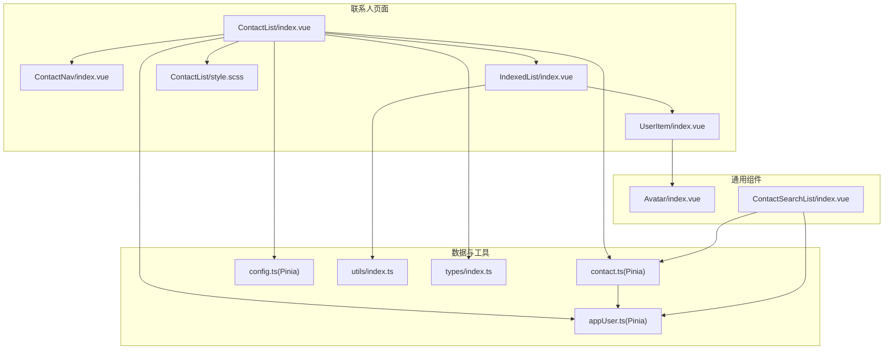
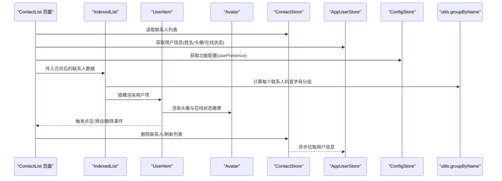
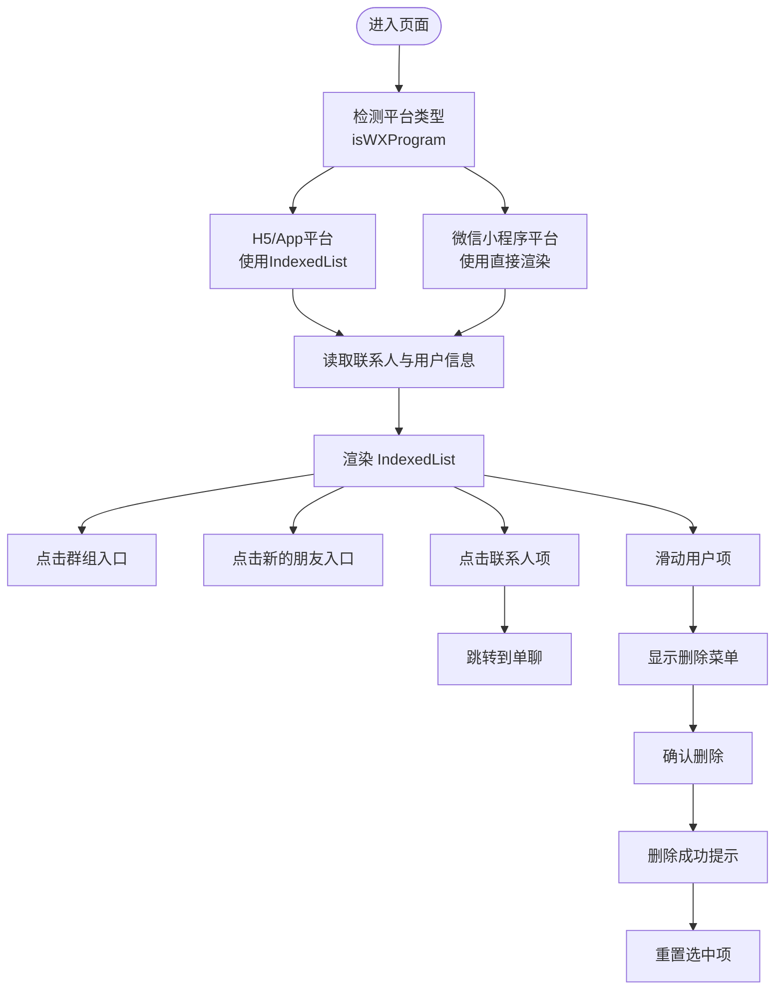
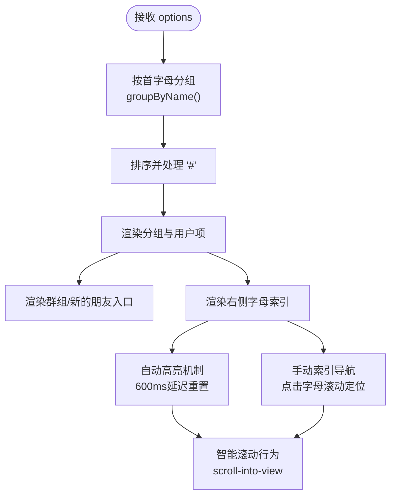
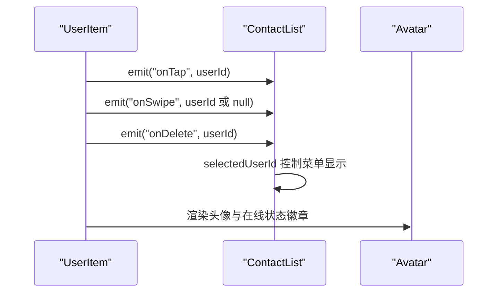
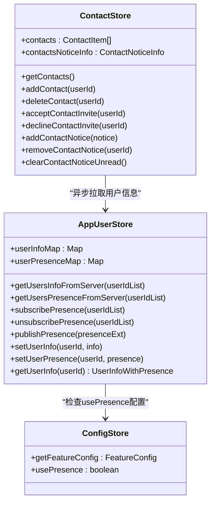
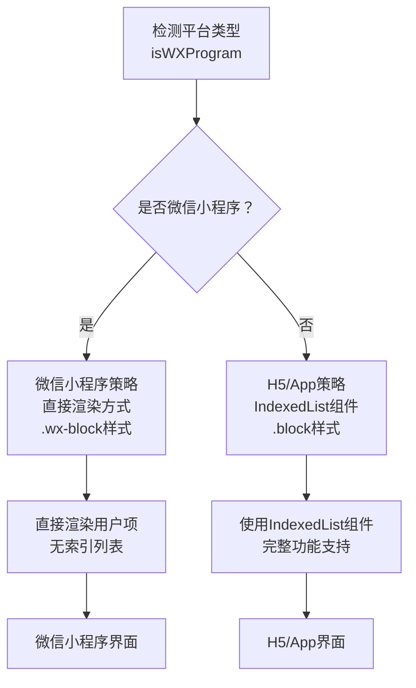
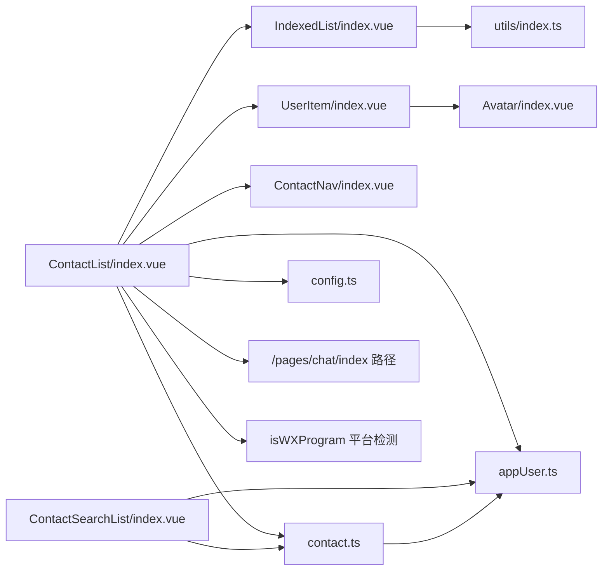

# 联系人列表

<cite>
**本文引用的文件**
- [ChatUIKit/modules/ContactList/index.vue](file://ChatUIKit/modules/ContactList/index.vue)
- [ChatUIKit/modules/ContactList/components/UserItem/index.vue](file://ChatUIKit/modules/ContactList/components/UserItem/index.vue)
- [ChatUIKit/components/IndexedList/index.vue](file://ChatUIKit/components/IndexedList/index.vue)
- [ChatUIKit/stores/contact.ts](file://ChatUIKit/stores/contact.ts)
- [ChatUIKit/stores/appUser.ts](file://ChatUIKit/stores/appUser.ts)
- [ChatUIKit/stores/config.ts](file://ChatUIKit/stores/config.ts)
- [ChatUIKit/utils/index.ts](file://ChatUIKit/utils/index.ts)
- [ChatUIKit/modules/ContactList/style.scss](file://ChatUIKit/modules/ContactList/style.scss)
- [ChatUIKit/modules/ContactList/components/ContactNav/index.vue](file://ChatUIKit/modules/ContactList/components/ContactNav/index.vue)
- [ChatUIKit/components/Avatar/index.vue](file://ChatUIKit/components/Avatar/index.vue)
- [ChatUIKit/modules/ContactSearchList/index.vue](file://ChatUIKit/modules/ContactSearchList/index.vue)
- [ChatUIKit/types/index.ts](file://ChatUIKit/types/index.ts)
- [ChatUIKit-vue2/modules/ContactList/index.vue](file://ChatUIKit-vue2/modules/ContactList/index.vue)
- [ChatUIKit-vue2/modules/Conversation/components/ConversationItem/index.vue](file://ChatUIKit-vue2/modules/Conversation/components/ConversationItem/index.vue)
- [ChatUIKit-vue2/modules/ContactSearchList/index.vue](file://ChatUIKit-vue2/modules/ContactSearchList/index.vue)
- [ChatUIKit-vue2/modules/GroupList/index.vue](file://ChatUIKit-vue2/modules/GroupList/index.vue)
- [ChatUIKit-vue2/modules/ChatNew/index.vue](file://ChatUIKit-vue2/modules/ChatNew/index.vue)
- [demo/pages.json](file://demo/pages.json)
- [vue2-demo/pages.json](file://vue2-demo/pages.json)
- [vue2-demo/pages/chat/index.vue](file://vue2-demo/pages/chat/index.vue)
</cite>

## 更新摘要
**变更内容**
- 新增平台特定实现策略：H5/App平台使用IndexedList组件，微信小程序平台采用直接渲染方式
- 新增侧边索引导航和active letter highlighting系统
- 增强在线状态指示器功能，支持多种状态枚举
- 优化用户项组件的交互行为和菜单控制
- 改进导航路径配置，支持多平台兼容
- 新增自动高亮机制和触摸交互优化
- 增强presenceExt在线状态扩展文案显示功能

## 目录
1. [简介](#简介)
2. [项目结构](#项目结构)
3. [核心组件](#核心组件)
4. [架构总览](#架构总览)
5. [组件详细分析](#组件详细分析)
6. [平台特定实现策略](#平台特定实现策略)
7. [导航路径配置](#导航路径配置)
8. [依赖关系分析](#依赖关系分析)
9. [性能考量](#性能考量)
10. [故障排查指南](#故障排查指南)
11. [结论](#结论)
12. [附录](#附录)

## 简介
本文件面向联系人列表组件的实现与使用，围绕以下目标展开：
- 解释联系人列表的实现架构，重点说明 IndexedList 组件的使用方式、用户项渲染机制与数据绑定。
- 详述联系人数据结构、分组显示逻辑与字母索引系统。
- 记录用户项组件的交互行为（点击跳转、滑动操作、菜单显示）。
- 解释联系人状态同步机制、头像加载策略与在线状态显示。
- 提供联系人列表的性能优化建议（虚拟滚动与懒加载思路），以及联系人搜索集成与实时更新机制。

**更新** 本版本特别关注平台特定实现策略，H5/App平台使用增强的IndexedList组件提供智能滚动和分组功能，而微信小程序平台采用直接渲染方式以解决scoped slot兼容性问题。新增的自动高亮机制和侧边索引导航系统显著提升了用户体验。

## 项目结构
联系人列表模块位于 ChatUIKit/modules/ContactList，主要由以下部分组成：
- 页面容器：ContactList/index.vue，负责聚合导航、索引列表与用户项。
- 用户项组件：UserItem/index.vue，负责单个联系人的渲染与交互，支持在线状态扩展文案显示。
- 索引列表组件：IndexedList/index.vue，负责分组、字母索引与滚动定位，支持自动高亮和侧边导航。
- 数据层：Pinia Store（contact.ts、appUser.ts、config.ts），负责联系人、用户信息与配置的获取、缓存与状态同步。
- 工具函数：utils/index.ts，提供拼音分组、字符检测等能力。
- 样式：ContactList/style.scss，统一布局与样式。
- 搜索：ContactSearchList/index.vue，提供联系人搜索功能并与联系人列表联动。
- 导航：ContactNav/index.vue，顶部导航栏与头像、在线状态展示。
- 头像组件：Avatar/index.vue，负责头像加载、占位与在线状态徽章显示。



**图表来源**
- [ChatUIKit/modules/ContactList/index.vue:1-115](file://ChatUIKit/modules/ContactList/index.vue#L1-L115)
- [ChatUIKit/components/IndexedList/index.vue:1-341](file://ChatUIKit/components/IndexedList/index.vue#L1-L341)
- [ChatUIKit/modules/ContactList/components/UserItem/index.vue:1-165](file://ChatUIKit/modules/ContactList/components/UserItem/index.vue#L1-L165)
- [ChatUIKit/stores/contact.ts:1-282](file://ChatUIKit/stores/contact.ts#L1-L282)
- [ChatUIKit/stores/appUser.ts:1-242](file://ChatUIKit/stores/appUser.ts#L1-L242)
- [ChatUIKit/stores/config.ts:1-124](file://ChatUIKit/stores/config.ts#L1-L124)
- [ChatUIKit/utils/index.ts:328-343](file://ChatUIKit/utils/index.ts#L328-L343)
- [ChatUIKit/modules/ContactList/style.scss:1-53](file://ChatUIKit/modules/ContactList/style.scss#L1-L53)
- [ChatUIKit/modules/ContactList/components/ContactNav/index.vue:1-99](file://ChatUIKit/modules/ContactList/components/ContactNav/index.vue#L1-L99)
- [ChatUIKit/components/Avatar/index.vue:1-188](file://ChatUIKit/components/Avatar/index.vue#L1-L188)
- [ChatUIKit/modules/ContactSearchList/index.vue:1-117](file://ChatUIKit/modules/ContactSearchList/index.vue#L1-L117)
- [ChatUIKit/types/index.ts:1-100](file://ChatUIKit/types/index.ts#L1-L100)

**章节来源**
- [ChatUIKit/modules/ContactList/index.vue:1-115](file://ChatUIKit/modules/ContactList/index.vue#L1-L115)
- [ChatUIKit/modules/ContactList/style.scss:1-53](file://ChatUIKit/modules/ContactList/style.scss#L1-L53)

## 核心组件
- 联系人页面容器：负责导航、索引列表与交互事件转发；将联系人数据与用户信息合并后传入 IndexedList。
- 索引列表组件：对联系人按首字母分组，渲染特殊入口（群组、新的朋友），提供右侧字母索引快速定位和自动高亮功能。
- 用户项组件：渲染头像、名称、在线状态扩展文案，支持左滑呼出删除菜单与点击跳转。
- 数据 Store：联系人 Store 负责联系人列表、通知计数与增删改操作；应用用户 Store 负责用户信息与在线状态的缓存与拉取；配置 Store 负责功能开关管理。
- 工具函数：groupByName 实现中英文首字母分组；checkCharacter 判断字符类型；pinyin-pro 用于中文拼音首字母提取。
- 搜索页面：ContactSearchList 集成搜索输入，过滤联系人并跳转到聊天页。

**章节来源**
- [ChatUIKit/modules/ContactList/index.vue:30-94](file://ChatUIKit/modules/ContactList/index.vue#L30-L94)
- [ChatUIKit/components/IndexedList/index.vue:101-186](file://ChatUIKit/components/IndexedList/index.vue#L101-L186)
- [ChatUIKit/modules/ContactList/components/UserItem/index.vue:23-108](file://ChatUIKit/modules/ContactList/components/UserItem/index.vue#L23-L108)
- [ChatUIKit/stores/contact.ts:25-282](file://ChatUIKit/stores/contact.ts#L25-L282)
- [ChatUIKit/stores/appUser.ts:24-242](file://ChatUIKit/stores/appUser.ts#L24-L242)
- [ChatUIKit/stores/config.ts:24-57](file://ChatUIKit/stores/config.ts#L24-L57)
- [ChatUIKit/utils/index.ts:328-343](file://ChatUIKit/utils/index.ts#L328-L343)
- [ChatUIKit/modules/ContactSearchList/index.vue:29-86](file://ChatUIKit/modules/ContactSearchList/index.vue#L29-L86)

## 架构总览
联系人列表采用"页面容器 + 索引列表 + 用户项 + Store + 工具函数"的分层设计。页面容器通过 computed 将联系人与用户信息合并，传递给索引列表；索引列表根据首字母分组并渲染用户项；用户项通过 Avatar 展示头像与在线状态；Store 负责数据获取、缓存与状态同步；工具函数提供分组与拼音能力；搜索页面与联系人列表解耦但共享数据源。



**图表来源**
- [ChatUIKit/modules/ContactList/index.vue:44-51](file://ChatUIKit/modules/ContactList/index.vue#L44-L51)
- [ChatUIKit/components/IndexedList/index.vue:130-159](file://ChatUIKit/components/IndexedList/index.vue#L130-L159)
- [ChatUIKit/modules/ContactList/components/UserItem/index.vue:8-16](file://ChatUIKit/modules/ContactList/components/UserItem/index.vue#L8-L16)
- [ChatUIKit/components/Avatar/index.vue:1-188](file://ChatUIKit/components/Avatar/index.vue#L1-L188)
- [ChatUIKit/stores/contact.ts:112-130](file://ChatUIKit/stores/contact.ts#L112-L130)
- [ChatUIKit/stores/appUser.ts:86-125](file://ChatUIKit/stores/appUser.ts#L86-L125)
- [ChatUIKit/stores/config.ts:65-74](file://ChatUIKit/stores/config.ts#L65-L74)
- [ChatUIKit/utils/index.ts:328-343](file://ChatUIKit/utils/index.ts#L328-L343)

## 组件详细分析

### 页面容器：ContactList/index.vue
**更新** 页面容器现在支持平台特定的实现策略，通过 isWXProgram 检测微信小程序平台并采用不同的样式处理。

- 数据绑定：通过 computed 将联系人列表与用户信息合并，形成包含 id、name、avatar、presenceExt 等字段的渲染数据。
- 事件处理：监听索引列表的分组/请求/联系人点击事件，分别跳转至群组列表、请求列表或单聊页面。
- 交互控制：维护 selectedUserId，用于控制用户项的滑动菜单显示；滑动时触发 onSwipe，点击时根据状态决定是否关闭菜单。
- 删除流程：调用 ContactStore.deleteContact，成功后提示并清空选中项。
- **平台适配**：使用 isWXProgram 检测微信小程序平台，为不同平台应用不同的样式类名。



**图表来源**
- [ChatUIKit/modules/ContactList/index.vue:4-36](file://ChatUIKit/modules/ContactList/index.vue#L4-L36)
- [ChatUIKit/modules/ContactList/index.vue:44-93](file://ChatUIKit/modules/ContactList/index.vue#L44-L93)

**章节来源**
- [ChatUIKit/modules/ContactList/index.vue:30-94](file://ChatUIKit/modules/ContactList/index.vue#L30-L94)

### 索引列表：IndexedList/index.vue
**更新** 索引列表组件经过重大增强，包括自动高亮、特殊入口项、手动索引导航和智能滚动行为。

- **自动高亮机制**：组件内部使用 `scrollIndexItem` ref 和 `timerId` 实现智能高亮，点击字母索引后自动高亮显示，并在600ms后自动重置，提供良好的视觉反馈。
- **特殊入口项**：可选渲染"群组"和"新的朋友"入口，支持计数徽章与点击事件，为用户提供快捷入口。
- **手动索引导航**：右侧字母索引列支持点击导航，通过 `scrollInToView` 方法实现精确滚动定位，激活态高亮显示当前字母。
- **智能滚动行为**：使用 `scroll-into-view` 属性实现平滑滚动到指定分组，结合延迟重置机制确保多次点击同一字母时仍能触发滚动。
- **分组逻辑**：遍历 options，使用 groupByName 计算首字母，生成分组对象；排序后将"#"置于末尾。
- **插槽机制**：通过 named slot 传入用户项组件，实现灵活的渲染与交互。
- **复选框模式**：可开启复选框选择，用于批量操作场景。



**图表来源**
- [ChatUIKit/components/IndexedList/index.vue:130-177](file://ChatUIKit/components/IndexedList/index.vue#L130-L177)
- [ChatUIKit/utils/index.ts:328-343](file://ChatUIKit/utils/index.ts#L328-L343)

**章节来源**
- [ChatUIKit/components/IndexedList/index.vue:1-341](file://ChatUIKit/components/IndexedList/index.vue#L1-L341)

### 用户项：UserItem/index.vue
**更新** 用户项组件现已支持在线状态扩展文案显示功能。

- 渲染内容：头像、名称、在线状态扩展文案；支持 presence 开关。
- **在线状态显示**：当 showPresence 为真且 userInfo.presenceExt 存在时，显示在线状态扩展文案（如"在线"、"忙碌"等）。
- 交互行为：
  - 点击：若菜单关闭则触发 onContactTap；若菜单打开则关闭菜单并发出 onSwipe(null)。
  - 左滑：超过阈值触发 onSwipe 并显示删除菜单；右滑关闭菜单。
  - 删除：弹出确认框，确认后触发 onDelete 并关闭菜单。
- 暴露方法：defineExpose 暴露 setShowMenu，供父组件控制菜单状态。



**图表来源**
- [ChatUIKit/modules/ContactList/components/UserItem/index.vue:58-108](file://ChatUIKit/modules/ContactList/components/UserItem/index.vue#L58-L108)
- [ChatUIKit/modules/ContactList/index.vue:75-93](file://ChatUIKit/modules/ContactList/index.vue#L75-L93)
- [ChatUIKit/components/Avatar/index.vue:1-188](file://ChatUIKit/components/Avatar/index.vue#L1-L188)

**章节来源**
- [ChatUIKit/modules/ContactList/components/UserItem/index.vue:1-165](file://ChatUIKit/modules/ContactList/components/UserItem/index.vue#L1-L165)

### 数据模型与状态同步
- 联系人数据结构：ContactStore.contacts 为数组，每项包含 userId 等字段；AppUserStore.getUserInfo 返回包含 name、avatar、presenceExt、isOnline 的对象。
- 合并策略：ContactList 页面通过 computed 将联系人与用户信息合并，形成最终渲染数据。
- 状态同步：
  - 联系人列表：ContactStore.getContacts 拉取联系人并异步拉取用户信息。
  - 在线状态：AppUserStore.getUsersPresenceFromServer 拉取在线状态，subscribePresence 订阅状态变化。
  - 通知计数：ContactStore.addContactNotice/removeContactNotice/clearContactNoticeUnread 管理好友申请未读数。



**图表来源**
- [ChatUIKit/stores/contact.ts:25-282](file://ChatUIKit/stores/contact.ts#L25-L282)
- [ChatUIKit/stores/appUser.ts:24-242](file://ChatUIKit/stores/appUser.ts#L24-L242)
- [ChatUIKit/stores/config.ts:65-74](file://ChatUIKit/stores/config.ts#L65-L74)

**章节来源**
- [ChatUIKit/stores/contact.ts:1-282](file://ChatUIKit/stores/contact.ts#L1-L282)
- [ChatUIKit/stores/appUser.ts:1-242](file://ChatUIKit/stores/appUser.ts#L1-L242)
- [ChatUIKit/stores/config.ts:1-124](file://ChatUIKit/stores/config.ts#L1-L124)
- [ChatUIKit/types/index.ts:67-80](file://ChatUIKit/types/index.ts#L67-L80)

### 头像加载策略与在线状态显示
**更新** 头像组件现已支持在线状态指示器功能。

- 头像加载：Avatar 组件在图片加载失败时回退到占位图；加载完成后隐藏占位图。
- **在线状态徽章**：当 withPresence 且全局 usePresence 开启时，显示在线状态徽章；支持多种状态枚举（Online、Offline、Away、Busy、Do Not Disturb）。
- **状态分类**：根据 isOnline 和 presenceExt 属性动态确定徽章样式，离线状态显示灰色圆点，在线状态根据具体状态显示相应图标。
- 用户信息来源：AppUserStore.getUserInfo 返回 name、avatar、presenceExt、isOnline，供 UserItem 渲染。

**章节来源**
- [ChatUIKit/components/Avatar/index.vue:1-188](file://ChatUIKit/components/Avatar/index.vue#L1-L188)
- [ChatUIKit/modules/ContactList/components/UserItem/index.vue:46-51](file://ChatUIKit/modules/ContactList/components/UserItem/index.vue#L46-L51)
- [ChatUIKit/stores/appUser.ts:35-64](file://ChatUIKit/stores/appUser.ts#L35-L64)

### 字母索引系统与分组显示
- 首字母分组：groupByName 优先使用 name/remark/userId，中文使用 pinyin-pro 提取首字母，非英文字母归类到"#"。
- 分组排序：按字母序排序，保证"#"在末尾。
- 索引定位：右侧字母索引点击后通过 scrollIntoView 定位到对应分组，激活态高亮。

**章节来源**
- [ChatUIKit/utils/index.ts:328-343](file://ChatUIKit/utils/index.ts#L328-L343)
- [ChatUIKit/components/IndexedList/index.vue:130-177](file://ChatUIKit/components/IndexedList/index.vue#L130-L177)

### 搜索集成与实时更新
- 搜索页面：ContactSearchList 通过 SearchInput 输入，过滤联系人列表，匹配用户名称，点击跳转到单聊。
- 实时更新：ContactList 页面通过 computed 监听联系人与用户信息变化，自动重新渲染；ContactStore.getContacts 会异步拉取用户信息，提升体验。

**章节来源**
- [ChatUIKit/modules/ContactSearchList/index.vue:29-86](file://ChatUIKit/modules/ContactSearchList/index.vue#L29-L86)
- [ChatUIKit/modules/ContactList/index.vue:44-51](file://ChatUIKit/modules/ContactList/index.vue#L44-L51)
- [ChatUIKit/stores/contact.ts:112-130](file://ChatUIKit/stores/contact.ts#L112-L130)

## 平台特定实现策略

**更新** 联系人列表组件现在支持平台特定的实现策略，以适应不同平台的需求和限制。

### H5/App平台实现策略
- **使用IndexedList组件**：H5/App平台完全依赖IndexedList组件提供的增强功能，包括智能滚动、分组显示和侧边索引导航。
- **完整功能支持**：包括自动高亮、特殊入口项、手动索引导航、智能滚动行为等所有增强功能。
- **样式适配**：使用 `.block` 类名，高度为 `calc(52px + var(--status-bar-height))`，适配H5/App平台的状态栏。

### 微信小程序平台实现策略
- **直接渲染方式**：微信小程序平台由于scoped slot兼容性问题，采用直接渲染方式，不使用IndexedList组件。
- **简化实现**：直接遍历联系人数据，渲染用户项组件，省略索引列表的复杂功能。
- **样式适配**：使用 `.wx-block` 类名，高度为 `calc(76px + var(--status-bar-height))`，适配微信小程序平台的状态栏和底部导航。

### 平台检测机制
- **isWXProgram检测**：通过 `uni.getSystemInfoSync().uniPlatform == "mp-weixin"` 检测微信小程序平台。
- **条件渲染**：根据平台类型动态应用不同的样式类名和渲染策略。
- **兼容性保障**：确保不同平台都能正常显示联系人列表，同时最大化利用各平台的优势。



**图表来源**
- [ChatUIKit/modules/ContactList/index.vue:4-36](file://ChatUIKit/modules/ContactList/index.vue#L4-L36)
- [ChatUIKit/utils/index.ts:93-94](file://ChatUIKit/utils/index.ts#L93-L94)

**章节来源**
- [ChatUIKit/modules/ContactList/index.vue:4-36](file://ChatUIKit/modules/ContactList/index.vue#L4-L36)
- [ChatUIKit/utils/index.ts:93-94](file://ChatUIKit/utils/index.ts#L93-L94)

## 导航路径配置

**更新** 联系人列表组件的导航路径配置已发生重要变更，从模块路径迁移到常规页面路径。

### 聊天页面导航路径变更
- **变更前**：使用模块路径 `/ChatUIKit/modules/Chat/index` 进行导航
- **变更后**：使用常规页面路径 `/pages/chat/index` 进行导航

### 具体变更影响

#### 联系人列表中的导航
在 ContactList 组件中，点击联系人项时的导航路径已更新：
```javascript
// 变更前
url: `/ChatUIKit/modules/Chat/index?type=singleChat&id=${userId}`

// 变更后  
url: `/pages/chat/index?type=singleChat&id=${userId}`
```

#### Vue2 版本中的导航
在 Vue2 版本中，多个组件的导航路径都已更新：
- ConversationItem 组件：`/pages/chat/index?conversationType=${conversation.conversationType}&conversationId=${conversation.conversationId}`
- ContactSearchList 组件：`/pages/chat/index?id=${item.userId}&type=singleChat`
- GroupList 组件：`/pages/chat/index?type=groupChat&id=${id}`
- ChatNew 组件：`/pages/chat/index?type=singleChat&id=${item.userId}`

### 页面路由配置
相应的页面路由配置也已更新：

#### Demo 版本 (demo/pages.json)
```json
{
  "pages": [
    // ... 其他页面配置
    {
      "path": "ChatUIKit/modules/Chat/index",
      "style": {
        "navigationStyle": "custom",
        "app-plus": {
          "bounce": "none",
          "softinputNavBar": "none"
        }
      }
    }
  ]
}
```

#### Vue2 Demo 版本 (vue2-demo/pages.json)
```json
{
  "pages": [
    // ... 其他页面配置
    {
      "path": "pages/chat/index",
      "style": {
        "navigationStyle": "custom"
      }
    }
  ]
}
```

### 导航路径变更的优势
1. **简化路由配置**：使用常规页面路径减少了模块化路径的复杂性
2. **提高兼容性**：统一的页面路径格式提高了不同平台的兼容性
3. **便于维护**：简化的路径结构降低了维护成本
4. **性能优化**：减少了路径解析的开销

**章节来源**
- [ChatUIKit/modules/ContactList/index.vue:63-67](file://ChatUIKit/modules/ContactList/index.vue#L63-L67)
- [ChatUIKit-vue2/modules/ContactList/index.vue:100-105](file://ChatUIKit-vue2/modules/ContactList/index.vue#L100-L105)
- [ChatUIKit-vue2/modules/Conversation/components/ConversationItem/index.vue:251-253](file://ChatUIKit-vue2/modules/Conversation/components/ConversationItem/index.vue#L251-L253)
- [ChatUIKit-vue2/modules/ContactSearchList/index.vue:86-88](file://ChatUIKit-vue2/modules/ContactSearchList/index.vue#L86-L88)
- [ChatUIKit-vue2/modules/GroupList/index.vue:59-61](file://ChatUIKit-vue2/modules/GroupList/index.vue#L59-L61)
- [ChatUIKit-vue2/modules/ChatNew/index.vue:68-70](file://ChatUIKit-vue2/modules/ChatNew/index.vue#L68-L70)
- [demo/pages.json:73-84](file://demo/pages.json#L73-L84)
- [vue2-demo/pages.json:22-26](file://vue2-demo/pages.json#L22-L26)

## 依赖关系分析
- 页面容器依赖：IndexedList、UserItem、ContactNav、Pinia Store、工具函数与样式。
- 索引列表依赖：utils.groupByName、插槽机制、computed 分组结果。
- 用户项依赖：Avatar、ConfigStore、国际化资源。
- Store 间依赖：ContactStore 依赖 AppUserStore 拉取用户信息；AppUserStore 依赖 ConfigStore 检查功能配置。
- 搜索依赖：ContactSearchList 依赖 ContactStore 与 AppUserStore。
- **更新** 导航依赖：各组件现在依赖统一的 `/pages/chat/index` 路径进行聊天页面导航。
- **更新** 平台依赖：ContactList 依赖 utils/isWXProgram 进行平台检测。



**图表来源**
- [ChatUIKit/modules/ContactList/index.vue:30-36](file://ChatUIKit/modules/ContactList/index.vue#L30-L36)
- [ChatUIKit/components/IndexedList/index.vue](file://ChatUIKit/components/IndexedList/index.vue#L103)
- [ChatUIKit/modules/ContactList/components/UserItem/index.vue:25-28](file://ChatUIKit/modules/ContactList/components/UserItem/index.vue#L25-L28)
- [ChatUIKit/stores/contact.ts:12-13](file://ChatUIKit/stores/contact.ts#L12-L13)
- [ChatUIKit/stores/appUser.ts:12-13](file://ChatUIKit/stores/appUser.ts#L12-L13)
- [ChatUIKit/stores/config.ts:12-13](file://ChatUIKit/stores/config.ts#L12-L13)
- [ChatUIKit/utils/index.ts](file://ChatUIKit/utils/index.ts#L4)
- [ChatUIKit/modules/ContactSearchList/index.vue:35-36](file://ChatUIKit/modules/ContactSearchList/index.vue#L35-L36)

**章节来源**
- [ChatUIKit/modules/ContactList/index.vue:30-36](file://ChatUIKit/modules/ContactList/index.vue#L30-L36)
- [ChatUIKit/components/IndexedList/index.vue:101-103](file://ChatUIKit/components/IndexedList/index.vue#L101-L103)
- [ChatUIKit/modules/ContactList/components/UserItem/index.vue:23-28](file://ChatUIKit/modules/ContactList/components/UserItem/index.vue#L23-L28)
- [ChatUIKit/stores/contact.ts:12-13](file://ChatUIKit/stores/contact.ts#L12-L13)
- [ChatUIKit/stores/appUser.ts:12-13](file://ChatUIKit/stores/appUser.ts#L12-L13)
- [ChatUIKit/stores/config.ts:12-13](file://ChatUIKit/stores/config.ts#L12-L13)
- [ChatUIKit/utils/index.ts](file://ChatUIKit/utils/index.ts#L4)
- [ChatUIKit/modules/ContactSearchList/index.vue:35-36](file://ChatUIKit/modules/ContactSearchList/index.vue#L35-L36)

## 性能考量
- 渲染优化
  - 使用 computed 合并联系人与用户信息，避免重复计算与不必要的重渲染。
  - IndexedList 内部对分组数据进行缓存，减少排序与分组开销。
- 懒加载与分页
  - 联系人列表获取采用分页拉取用户信息（每页固定大小），降低一次性请求压力。
- 虚拟滚动建议
  - 当联系人数量较大时，可在 IndexedList 层面引入虚拟滚动（仅渲染可视区域），减少 DOM 数量与重绘。
- 图片与状态
  - Avatar 组件已具备错误回退与加载完成切换，建议结合懒加载策略进一步优化首屏渲染。
- 状态订阅
  - 对于大量联系人的在线状态，建议按需订阅与取消订阅，避免频繁网络请求。
- **更新** 导航性能优化
  - 统一的页面路径减少了路由解析时间
  - 简化的路径结构降低了内存占用
- **在线状态性能优化建议**
  - 使用 ConfigStore.getFeatureConfig.usePresence 控制在线状态功能开关
  - 对于大量联系人，考虑分批获取在线状态，避免同时发起过多网络请求
  - 合理设置状态订阅的过期时间，平衡实时性与性能
- **平台特定性能优化**
  - 微信小程序平台采用直接渲染方式，减少组件层级和渲染开销
  - H5/App平台充分利用IndexedList的优化功能，提供更好的滚动性能

**章节来源**
- [ChatUIKit/stores/contact.ts:83-107](file://ChatUIKit/stores/contact.ts#L83-L107)
- [ChatUIKit/stores/appUser.ts:130-159](file://ChatUIKit/stores/appUser.ts#L130-L159)
- [ChatUIKit/stores/config.ts:25-57](file://ChatUIKit/stores/config.ts#L25-L57)
- [ChatUIKit/components/Avatar/index.vue:89-95](file://ChatUIKit/components/Avatar/index.vue#L89-L95)

## 故障排查指南
- 联系人为空或未更新
  - 检查 ContactStore.getContacts 是否成功拉取联系人列表。
  - 确认 AppUserStore.getUsersInfoFromServer 是否正确拉取用户信息并写入缓存。
- 在线状态不显示
  - **更新** 确认 ConfigStore.getFeatureConfig.usePresence 是否开启。
  - 检查 AppUserStore.getUsersPresenceFromServer 是否成功拉取状态并写入缓存。
  - 确认 UserItem 组件的 showPresence 计算属性是否正确判断。
  - 检查 Avatar 组件的 withPresence 属性是否正确传递。
- 删除联系人无效
  - 确认 ContactStore.deleteContact 是否调用成功并触发本地删除。
  - 检查页面是否正确重置 selectedUserId。
- 首字母分组异常
  - 检查 groupByName 的输入是否为字符串，中文字符是否正确使用 pinyin-pro 提取首字母。
- 搜索无结果
  - 确认 ContactSearchList 的过滤逻辑是否基于用户名称（getUserInfo().name）。
- **自动高亮失效**
  - 检查 `scrollIndexItem` 是否正确设置，`timerId` 是否正确清除和重置。
  - 确认 `scroll-into-view` 属性是否正确绑定到对应的分组元素。
- **手动索引导航异常**
  - 检查 `scrollInToView` 方法是否正确调用，`formatInitial` 函数是否正确处理特殊字符。
  - 确认字母索引的点击事件是否正确绑定到 `scrollInToView` 方法。
- **导航路径相关问题**
  - **更新** 检查 `/pages/chat/index` 路径是否在 pages.json 中正确定义
  - 确认所有组件中的导航路径是否已从 `/ChatUIKit/modules/Chat/index` 更新为 `/pages/chat/index`
  - 验证聊天页面组件是否正确接收和处理路由参数（type 和 id）
  - 检查页面路由配置中的 style 设置是否正确
- **在线状态显示问题**
  - **更新** 检查 presenceExt 字段是否正确从 AppUserStore.getUserInfo 返回
  - 确认 isOnline 字段是否正确设置
  - 验证状态枚举值是否符合预期（Online、Offline、Away、Busy、Do Not Disturb）
- **平台特定问题**
  - **更新** 检查 isWXProgram 检测逻辑是否正确识别微信小程序平台
  - 确认微信小程序平台使用的是直接渲染方式而非IndexedList组件
  - 验证H5/App平台是否正确应用IndexedList组件的所有功能
  - 检查平台特定的样式类名是否正确应用

**章节来源**
- [ChatUIKit/stores/contact.ts:112-165](file://ChatUIKit/stores/contact.ts#L112-L165)
- [ChatUIKit/stores/appUser.ts:86-159](file://ChatUIKit/stores/appUser.ts#L86-L159)
- [ChatUIKit/stores/config.ts:65-74](file://ChatUIKit/stores/config.ts#L65-L74)
- [ChatUIKit/utils/index.ts:328-343](file://ChatUIKit/utils/index.ts#L328-L343)
- [ChatUIKit/modules/ContactSearchList/index.vue:51-60](file://ChatUIKit/modules/ContactSearchList/index.vue#L51-L60)
- [ChatUIKit/components/IndexedList/index.vue:171-177](file://ChatUIKit/components/IndexedList/index.vue#L171-L177)
- [ChatUIKit/modules/ContactList/index.vue:63-67](file://ChatUIKit/modules/ContactList/index.vue#L63-L67)

## 结论
联系人列表组件通过清晰的分层设计与 Pinia 状态管理，实现了稳定的联系人展示、分组与交互。IndexedList 经过重大增强后，提供了更加智能和友好的用户体验：自动高亮机制让用户清楚知道当前所在分组，特殊入口项为常用功能提供了快捷通道，手动索引导航支持精确的字母定位，智能滚动行为确保了流畅的交互体验。UserItem 支持丰富的交互与菜单控制，**新增的在线状态扩展文案显示功能**增强了用户间的沟通体验。Avatar 与 AppUserStore 提供了完善的头像与在线状态能力，**在线状态徽章支持多种状态枚举**，包括 Online、Offline、Away、Busy、Do Not Disturb 等。配合 ContactSearchList 的搜索集成与 ContactStore 的实时更新机制，整体用户体验良好。

**更新** 最重要的变更在于平台特定实现策略的引入，H5/App平台使用增强的IndexedList组件提供完整的滚动和分组功能，而微信小程序平台采用直接渲染方式以解决scoped slot兼容性问题。同时，新增的侧边索引导航和active letter highlighting系统进一步提升了用户体验。在线状态指示器功能的完整实现，从配置管理到组件渲染形成了完整的在线状态生态系统。**UserItem 组件现在支持 presenceExt 属性显示用户在线状态扩展文案，Avatar 组件新增 withPresence、isOnline 和 presenceExt 属性支持在线状态徽章显示**。这一功能的加入显著提升了联系人列表的实用性，用户可以直观地看到联系人的在线状态，改善了即时通讯体验。导航路径配置的标准化与在线状态功能的完善共同构成了联系人列表组件的现代化实现。

## 附录
- 关键路径参考
  - 页面容器：[ChatUIKit/modules/ContactList/index.vue:30-94](file://ChatUIKit/modules/ContactList/index.vue#L30-L94)
  - 索引列表：[ChatUIKit/components/IndexedList/index.vue:101-186](file://ChatUIKit/components/IndexedList/index.vue#L101-L186)
  - 用户项：[ChatUIKit/modules/ContactList/components/UserItem/index.vue:23-108](file://ChatUIKit/modules/ContactList/components/UserItem/index.vue#L23-L108)
  - 数据 Store：[ChatUIKit/stores/contact.ts:25-282](file://ChatUIKit/stores/contact.ts#L25-L282)、[ChatUIKit/stores/appUser.ts:24-242](file://ChatUIKit/stores/appUser.ts#L24-L242)、[ChatUIKit/stores/config.ts:24-57](file://ChatUIKit/stores/config.ts#L24-L57)
  - 工具函数：[ChatUIKit/utils/index.ts:328-343](file://ChatUIKit/utils/index.ts#L328-L343)
  - 搜索页面：[ChatUIKit/modules/ContactSearchList/index.vue:29-86](file://ChatUIKit/modules/ContactSearchList/index.vue#L29-L86)
  - 头像组件：[ChatUIKit/components/Avatar/index.vue:1-188](file://ChatUIKit/components/Avatar/index.vue#L1-L188)
  - 类型定义：[ChatUIKit/types/index.ts:67-80](file://ChatUIKit/types/index.ts#L67-L80)
  - **更新** 聊天页面：[vue2-demo/pages/chat/index.vue:1-62](file://vue2-demo/pages/chat/index.vue#L1-L62)
  - **更新** 平台检测：[ChatUIKit/utils/index.ts:93-94](file://ChatUIKit/utils/index.ts#L93-L94)