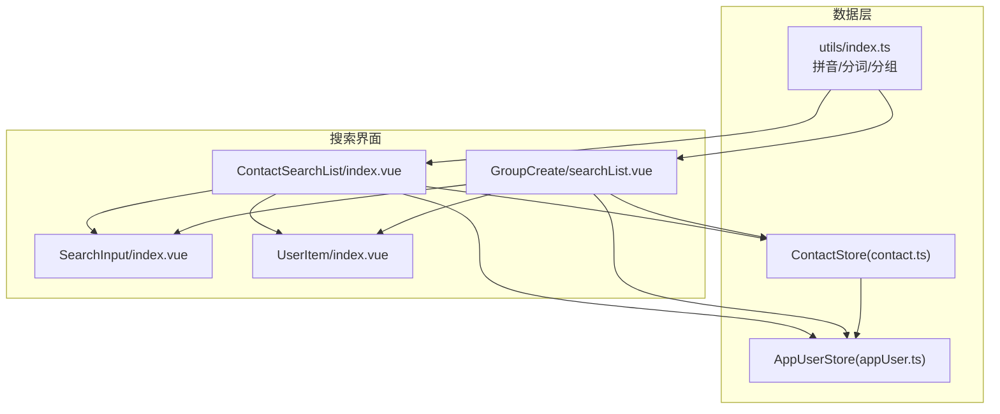
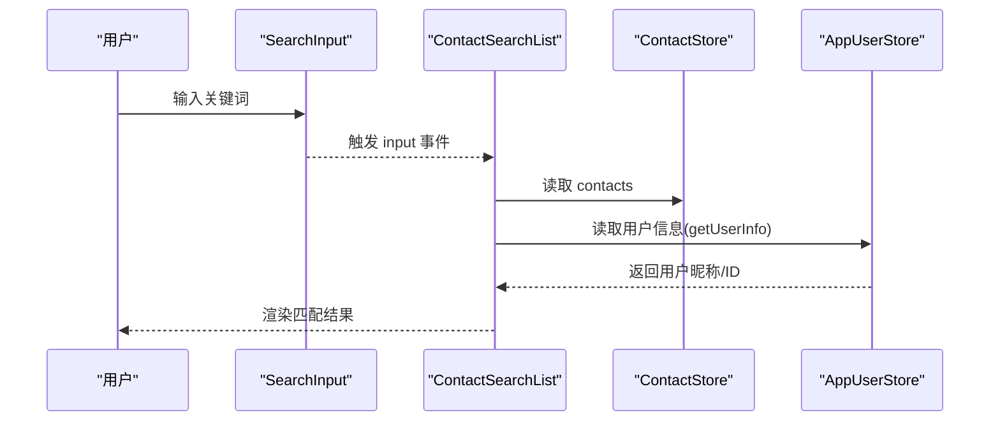
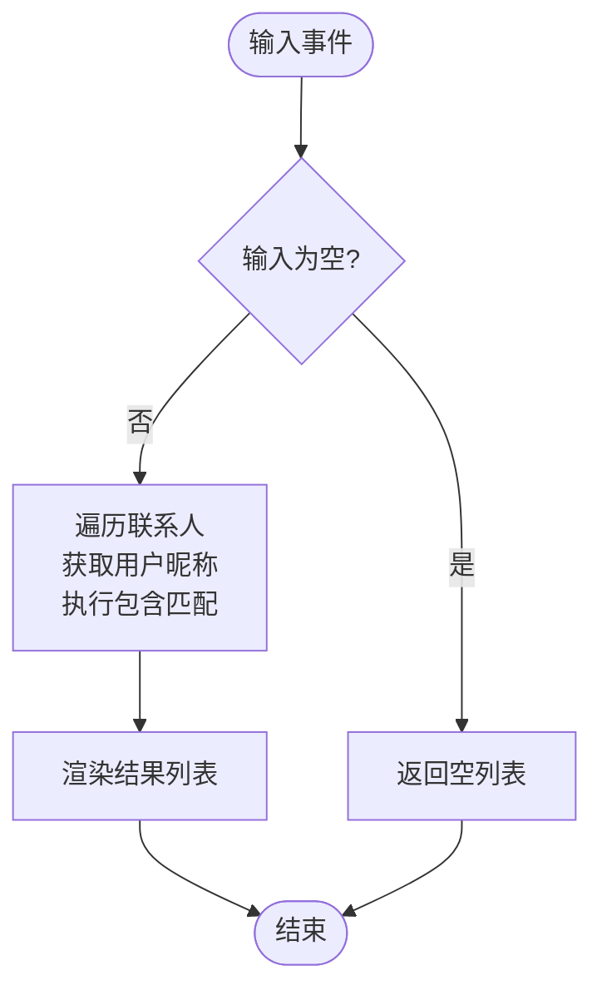
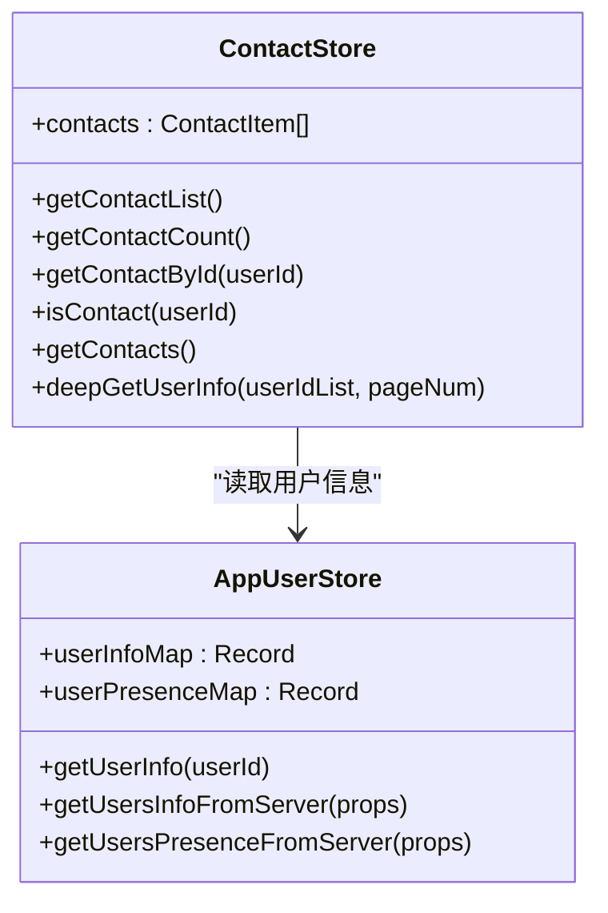
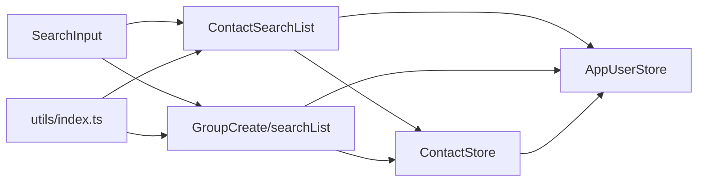

# 联系人搜索

<cite>
**本文引用的文件**
- [ChatUIKit/modules/ContactSearchList/index.vue](file://ChatUIKit/modules/ContactSearchList/index.vue)
- [ChatUIKit/modules/GroupCreate/searchList.vue](file://ChatUIKit/modules/GroupCreate/searchList.vue)
- [ChatUIKit/components/SearchInput/index.vue](file://ChatUIKit/components/SearchInput/index.vue)
- [ChatUIKit/stores/contact.ts](file://ChatUIKit/stores/contact.ts)
- [ChatUIKit/stores/appUser.ts](file://ChatUIKit/stores/appUser.ts)
- [ChatUIKit/utils/index.ts](file://ChatUIKit/utils/index.ts)
- [ChatUIKit/modules/ConversationSearchList/index.vue](file://ChatUIKit/modules/ConversationSearchList/index.vue)
- [ChatUIKit/modules/ContactList/components/UserItem/index.vue](file://ChatUIKit/modules/ContactList/components/UserItem/index.vue)
- [ChatUIKit/utils/permission.js](file://ChatUIKit/utils/permission.js)
- [ChatUIKit/types/index.ts](file://ChatUIKit/types/index.ts)
</cite>

## 目录
1. [简介](#简介)
2. [项目结构](#项目结构)
3. [核心组件](#核心组件)
4. [架构总览](#架构总览)
5. [详细组件分析](#详细组件分析)
6. [依赖关系分析](#依赖关系分析)
7. [性能考量](#性能考量)
8. [故障排查指南](#故障排查指南)
9. [结论](#结论)
10. [附录](#附录)

## 简介
本文件围绕联系人搜索功能进行系统化文档化，覆盖搜索算法实现（拼音搜索、中文分词与模糊匹配）、结果排序与相关性评分、搜索历史与热门搜索、智能提示、性能优化（索引、缓存、查询优化）、高亮显示、分页加载与实时搜索，以及权限控制、隐私保护与安全验证机制。文档以仓库现有实现为基础，结合代码结构与交互流程，提供面向开发与产品团队的参考。

## 项目结构
联系人搜索涉及以下关键模块与文件：
- 搜索入口与结果展示：ContactSearchList、ConversationSearchList
- 搜索输入组件：SearchInput
- 数据源与缓存：ContactStore、AppUserStore
- 工具与拼音支持：utils/index.ts（含拼音、字符分类、分组）
- 用户项渲染：UserItem
- 权限与安全：permission.js（平台权限示例）
- 类型定义：types/index.ts

图表来源
- [ChatUIKit/modules/ContactSearchList/index.vue](file://ChatUIKit/modules/ContactSearchList/index.vue#L1-L117)
- [ChatUIKit/modules/GroupCreate/searchList.vue](file://ChatUIKit/modules/GroupCreate/searchList.vue#L1-L107)
- [ChatUIKit/components/SearchInput/index.vue](file://ChatUIKit/components/SearchInput/index.vue#L1-L126)
- [ChatUIKit/stores/contact.ts](file://ChatUIKit/stores/contact.ts#L1-L282)
- [ChatUIKit/stores/appUser.ts](file://ChatUIKit/stores/appUser.ts#L1-L242)
- [ChatUIKit/utils/index.ts](file://ChatUIKit/utils/index.ts#L1-L344)
- [ChatUIKit/modules/ContactList/components/UserItem/index.vue](file://ChatUIKit/modules/ContactList/components/UserItem/index.vue#L1-L165)

章节来源
- [ChatUIKit/modules/ContactSearchList/index.vue](file://ChatUIKit/modules/ContactSearchList/index.vue#L1-L117)
- [ChatUIKit/modules/GroupCreate/searchList.vue](file://ChatUIKit/modules/GroupCreate/searchList.vue#L1-L107)
- [ChatUIKit/components/SearchInput/index.vue](file://ChatUIKit/components/SearchInput/index.vue#L1-L126)
- [ChatUIKit/stores/contact.ts](file://ChatUIKit/stores/contact.ts#L1-L282)
- [ChatUIKit/stores/appUser.ts](file://ChatUIKit/stores/appUser.ts#L1-L242)
- [ChatUIKit/utils/index.ts](file://ChatUIKit/utils/index.ts#L1-L344)
- [ChatUIKit/modules/ContactList/components/UserItem/index.vue](file://ChatUIKit/modules/ContactList/components/UserItem/index.vue#L1-L165)

## 核心组件
- 搜索输入组件 SearchInput：负责输入监听、清空与取消事件，暴露聚焦控制能力。
- 联系人搜索界面 ContactSearchList：绑定输入值，过滤联系人列表，渲染用户项。
- 群组创建中的搜索界面 GroupCreate/searchList：复用输入与过滤逻辑，支持多选。
- 数据层 ContactStore/AppUserStore：提供联系人列表与用户信息缓存，异步拉取用户详情。
- 工具库 utils/index.ts：提供拼音转换、字符类型判断、按首字母分组等能力。
- 用户项 UserItem：展示用户头像、名称与在线状态等信息。

章节来源
- [ChatUIKit/components/SearchInput/index.vue](file://ChatUIKit/components/SearchInput/index.vue#L1-L126)
- [ChatUIKit/modules/ContactSearchList/index.vue](file://ChatUIKit/modules/ContactSearchList/index.vue#L1-L117)
- [ChatUIKit/modules/GroupCreate/searchList.vue](file://ChatUIKit/modules/GroupCreate/searchList.vue#L1-L107)
- [ChatUIKit/stores/contact.ts](file://ChatUIKit/stores/contact.ts#L1-L282)
- [ChatUIKit/stores/appUser.ts](file://ChatUIKit/stores/appUser.ts#L1-L242)
- [ChatUIKit/utils/index.ts](file://ChatUIKit/utils/index.ts#L1-L344)
- [ChatUIKit/modules/ContactList/components/UserItem/index.vue](file://ChatUIKit/modules/ContactList/components/UserItem/index.vue#L1-L165)

## 架构总览
搜索流程从输入组件触发，通过计算属性将输入值与联系人数据结合，利用用户信息缓存进行过滤，最终渲染用户项。工具库提供拼音与字符分类能力，支撑拼音搜索与分组。

图表来源
- [ChatUIKit/components/SearchInput/index.vue](file://ChatUIKit/components/SearchInput/index.vue#L1-L126)
- [ChatUIKit/modules/ContactSearchList/index.vue](file://ChatUIKit/modules/ContactSearchList/index.vue#L1-L117)
- [ChatUIKit/stores/contact.ts](file://ChatUIKit/stores/contact.ts#L1-L282)
- [ChatUIKit/stores/appUser.ts](file://ChatUIKit/stores/appUser.ts#L1-L242)

## 详细组件分析

### 搜索输入组件 SearchInput
- 功能要点
  - 双向绑定输入值，触发 input 事件
  - 支持清空按钮与取消按钮
  - 暴露 setIsFocus 控制聚焦状态
- 关键行为
  - 输入事件透传给父组件
  - 清空时重置输入并触发空字符串事件
  - 取消事件用于关闭搜索界面

章节来源
- [ChatUIKit/components/SearchInput/index.vue](file://ChatUIKit/components/SearchInput/index.vue#L1-L126)

### 联系人搜索界面 ContactSearchList
- 功能要点
  - 监听输入值变化，计算过滤后的搜索结果
  - 无结果时展示空态
  - 点击用户项跳转聊天页
- 过滤逻辑
  - 当输入为空时返回空列表
  - 非空时对联系人列表执行过滤，使用用户昵称包含匹配
- 导航与来源
  - 支持来源 URL 回退或直接返回

图表来源
- [ChatUIKit/modules/ContactSearchList/index.vue](file://ChatUIKit/modules/ContactSearchList/index.vue#L51-L60)

章节来源
- [ChatUIKit/modules/ContactSearchList/index.vue](file://ChatUIKit/modules/ContactSearchList/index.vue#L1-L117)

### 群组创建中的搜索界面 GroupCreate/searchList
- 功能要点
  - 复用 SearchInput 与过滤逻辑
  - 支持多选勾选，变更事件向上抛出
  - 无结果时展示空态
- 与 ContactSearchList 的差异
  - 增加多选交互与勾选状态同步
  - 结果项为 UserItem，点击进入聊天页

章节来源
- [ChatUIKit/modules/GroupCreate/searchList.vue](file://ChatUIKit/modules/GroupCreate/searchList.vue#L1-L107)

### 数据层：ContactStore 与 AppUserStore
- ContactStore
  - 提供联系人列表、数量、是否存在等 getter
  - 提供异步获取联系人与分页拉取用户信息的能力
  - 内部维护 viewedUserInfo 与好友申请通知
- AppUserStore
  - 提供用户信息与在线状态的缓存与获取
  - 支持按需拉取未缓存用户信息，避免重复请求
  - 提供当前登录用户信息与 Presence 订阅/发布

图表来源
- [ChatUIKit/stores/contact.ts](file://ChatUIKit/stores/contact.ts#L1-L282)
- [ChatUIKit/stores/appUser.ts](file://ChatUIKit/stores/appUser.ts#L1-L242)

章节来源
- [ChatUIKit/stores/contact.ts](file://ChatUIKit/stores/contact.ts#L1-L282)
- [ChatUIKit/stores/appUser.ts](file://ChatUIKit/stores/appUser.ts#L1-L242)

### 工具库：拼音、字符分类与分组
- 拼音与字符分类
  - 使用 pinyin-pro 库进行中文转拼音
  - 字符类型判断：中文、英文字母、其他
- 名称分组
  - 根据首字符类型选择大写首字母或拼音首字母作为分组标识

章节来源
- [ChatUIKit/utils/index.ts](file://ChatUIKit/utils/index.ts#L1-L344)

### 用户项 UserItem
- 展示用户头像、昵称与在线状态
- 支持侧滑菜单（删除）等交互
- 作为搜索结果项的基础渲染组件

章节来源
- [ChatUIKit/modules/ContactList/components/UserItem/index.vue](file://ChatUIKit/modules/ContactList/components/UserItem/index.vue#L1-L165)

### 会话搜索界面 ConversationSearchList
- 功能要点
  - 支持单聊与群聊搜索
  - 根据会话类型渲染 UserItem 或 GroupItem
- 与联系人搜索的差异
  - 数据源来自会话存储，而非联系人存储
  - 适用于全局会话检索场景

章节来源
- [ChatUIKit/modules/ConversationSearchList/index.vue](file://ChatUIKit/modules/ConversationSearchList/index.vue#L1-L46)

## 依赖关系分析
- 组件依赖
  - ContactSearchList 依赖 SearchInput、UserItem、ContactStore、AppUserStore
  - GroupCreate/searchList 依赖 SearchInput、UserItem、ContactStore、AppUserStore
  - ConversationSearchList 依赖 SearchInput、UserItem、GroupItem、Stores
- 数据依赖
  - 搜索结果依赖 ContactStore.contacts 与 AppUserStore.getUserInfo
  - 用户信息缓存避免重复网络请求
- 工具依赖
  - utils/index.ts 提供拼音与字符分类，支撑拼音搜索与分组

图表来源
- [ChatUIKit/components/SearchInput/index.vue](file://ChatUIKit/components/SearchInput/index.vue#L1-L126)
- [ChatUIKit/modules/ContactSearchList/index.vue](file://ChatUIKit/modules/ContactSearchList/index.vue#L1-L117)
- [ChatUIKit/modules/GroupCreate/searchList.vue](file://ChatUIKit/modules/GroupCreate/searchList.vue#L1-L107)
- [ChatUIKit/stores/contact.ts](file://ChatUIKit/stores/contact.ts#L1-L282)
- [ChatUIKit/stores/appUser.ts](file://ChatUIKit/stores/appUser.ts#L1-L242)
- [ChatUIKit/utils/index.ts](file://ChatUIKit/utils/index.ts#L1-L344)

章节来源
- [ChatUIKit/components/SearchInput/index.vue](file://ChatUIKit/components/SearchInput/index.vue#L1-L126)
- [ChatUIKit/modules/ContactSearchList/index.vue](file://ChatUIKit/modules/ContactSearchList/index.vue#L1-L117)
- [ChatUIKit/modules/GroupCreate/searchList.vue](file://ChatUIKit/modules/GroupCreate/searchList.vue#L1-L107)
- [ChatUIKit/stores/contact.ts](file://ChatUIKit/stores/contact.ts#L1-L282)
- [ChatUIKit/stores/appUser.ts](file://ChatUIKit/stores/appUser.ts#L1-L242)
- [ChatUIKit/utils/index.ts](file://ChatUIKit/utils/index.ts#L1-L344)

## 性能考量
- 缓存与去抖
  - AppUserStore 对用户信息进行本地缓存，仅对未缓存用户发起网络请求
  - 可结合节流/防抖策略减少频繁输入导致的过滤开销
- 分页与懒加载
  - ContactStore 支持分页拉取用户信息，避免一次性请求过多用户
  - 搜索结果列表建议采用虚拟滚动或分页加载，降低 DOM 与渲染压力
- 过滤策略
  - 当前实现为包含匹配，复杂度 O(N*M)，其中 N 为联系人数量，M 为平均昵称长度
  - 可引入前缀匹配、正则预编译、拼音首字母索引等优化
- 平台差异
  - 在小程序/APP 平台注意输入事件频率与渲染帧率，必要时启用节流

章节来源
- [ChatUIKit/stores/appUser.ts](file://ChatUIKit/stores/appUser.ts#L86-L125)
- [ChatUIKit/stores/contact.ts](file://ChatUIKit/stores/contact.ts#L83-L107)
- [ChatUIKit/utils/index.ts](file://ChatUIKit/utils/index.ts#L107-L134)

## 故障排查指南
- 搜索无结果
  - 确认输入非空且 ContactStore.contacts 已初始化
  - 检查 AppUserStore.getUserInfo 是否返回昵称（默认回退为 userId）
- 用户信息缺失
  - 确认已调用 deepGetUserInfo 或 getUsersInfoFromServer
  - 检查网络请求与缓存命中情况
- 输入卡顿
  - 检查是否启用节流/防抖
  - 评估结果集大小与渲染复杂度
- 平台权限问题
  - 如涉及系统权限（如 iOS 推送/定位/相机等），可参考 permission.js 的权限判断与跳转逻辑

章节来源
- [ChatUIKit/modules/ContactSearchList/index.vue](file://ChatUIKit/modules/ContactSearchList/index.vue#L51-L60)
- [ChatUIKit/stores/appUser.ts](file://ChatUIKit/stores/appUser.ts#L86-L125)
- [ChatUIKit/utils/permission.js](file://ChatUIKit/utils/permission.js#L1-L272)

## 结论
当前联系人搜索以“输入值 + 包含匹配”为核心，结合用户信息缓存与分页拉取，满足基本搜索需求。为进一步提升体验，建议引入拼音索引、前缀匹配、模糊评分与排序、智能提示与热门搜索、高亮显示与分页加载，并完善权限与隐私保护机制。

## 附录

### 搜索算法与排序规则
- 搜索算法
  - 当前实现：字符串包含匹配（中文/英文均可）
  - 建议增强：拼音首字母索引、前缀匹配、正则匹配、模糊评分（编辑距离/TF-IDF）
- 排序与相关性
  - 当前未实现专门的排序与权重计算
  - 建议：按命中位置、命中完整度、最近联系时间、置顶状态综合排序
- 高亮显示
  - 可在 UserItem 中对命中字符进行高亮渲染（当前未实现）
- 实时搜索
  - 建议结合节流/防抖，避免高频输入造成性能问题

章节来源
- [ChatUIKit/modules/ContactSearchList/index.vue](file://ChatUIKit/modules/ContactSearchList/index.vue#L51-L60)
- [ChatUIKit/utils/index.ts](file://ChatUIKit/utils/index.ts#L314-L343)

### 搜索历史、热门搜索与智能提示
- 现状：仓库未提供搜索历史、热门搜索与智能提示的具体实现
- 建议：本地持久化历史与热门词，结合拼音首字母与常用词生成提示

章节来源
- [ChatUIKit/modules/ContactSearchList/index.vue](file://ChatUIKit/modules/ContactSearchList/index.vue#L1-L117)
- [ChatUIKit/modules/GroupCreate/searchList.vue](file://ChatUIKit/modules/GroupCreate/searchList.vue#L1-L107)

### 权限控制、隐私保护与安全验证
- 权限控制
  - permission.js 提供 iOS/Android 权限判断与跳转设置页示例
  - 搜索功能本身不直接涉及敏感权限，但可借鉴其权限模型
- 隐私保护
  - 用户信息缓存遵循最小化原则，仅缓存必要字段
  - 注意避免在搜索结果中泄露隐私信息
- 安全验证
  - 输入校验与清理，防止注入与异常输入
  - 网络请求失败时的降级与重试策略

章节来源
- [ChatUIKit/utils/permission.js](file://ChatUIKit/utils/permission.js#L1-L272)
- [ChatUIKit/stores/appUser.ts](file://ChatUIKit/stores/appUser.ts#L86-L125)
- [ChatUIKit/types/index.ts](file://ChatUIKit/types/index.ts#L1-L100)