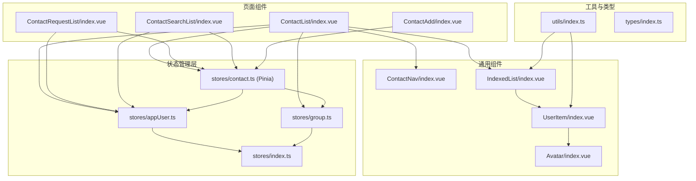
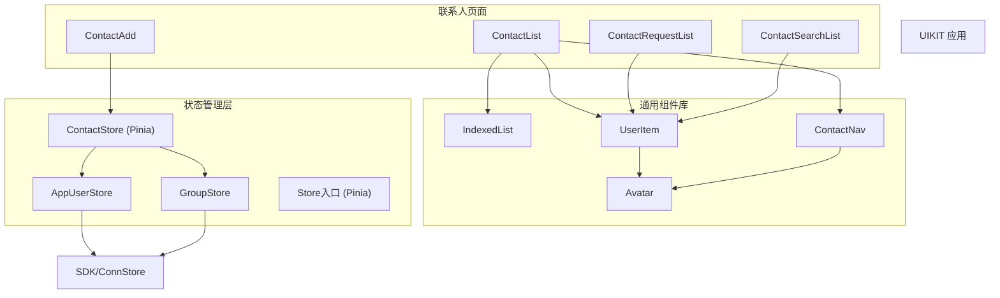
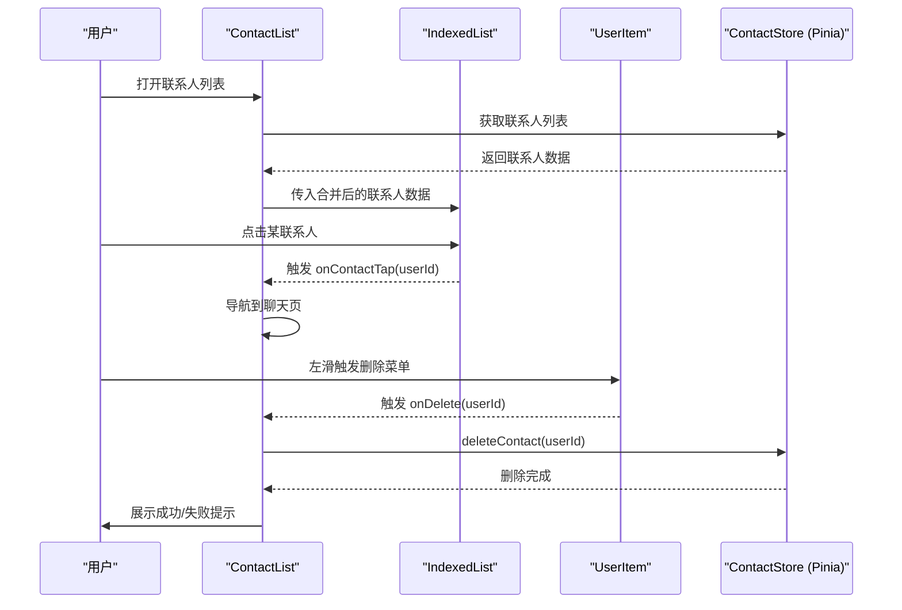
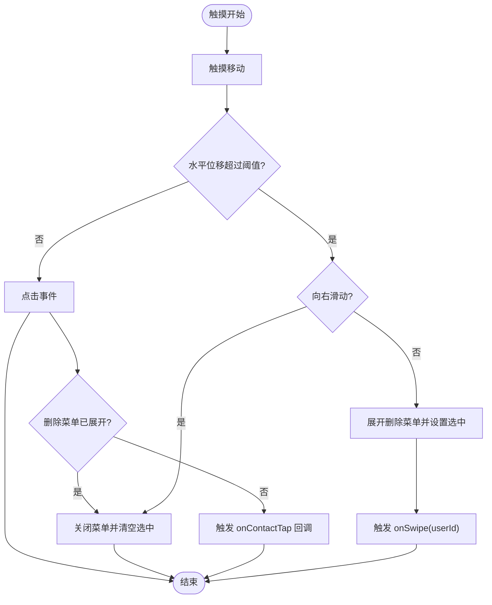
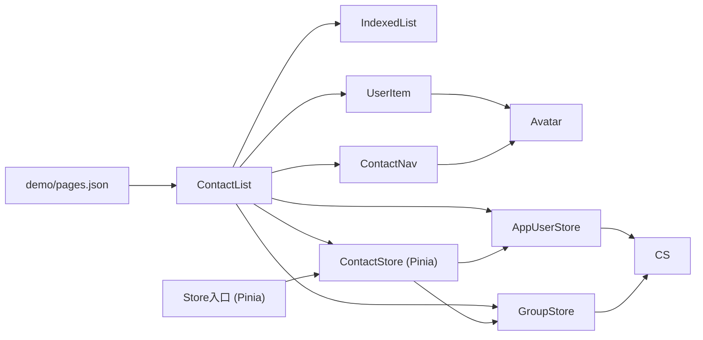

# 联系人模块

<cite>
**本文档引用的文件**
- [ChatUIKit/modules/ContactList/index.vue](file://ChatUIKit/modules/ContactList/index.vue)
- [ChatUIKit/modules/ContactList/components/UserItem/index.vue](file://ChatUIKit/modules/ContactList/components/UserItem/index.vue)
- [ChatUIKit/modules/ContactList/components/ContactNav/index.vue](file://ChatUIKit/modules/ContactList/components/ContactNav/index.vue)
- [ChatUIKit/modules/ContactAdd/index.vue](file://ChatUIKit/modules/ContactAdd/index.vue)
- [ChatUIKit/modules/ContactRequestList/index.vue](file://ChatUIKit/modules/ContactRequestList/index.vue)
- [ChatUIKit/modules/ContactRequestList/components/RequestItem/index.vue](file://ChatUIKit/modules/ContactRequestList/components/RequestItem/index.vue)
- [ChatUIKit/modules/ContactSearchList/index.vue](file://ChatUIKit/modules/ContactSearchList/index.vue)
- [ChatUIKit/components/IndexedList/index.vue](file://ChatUIKit/components/IndexedList/index.vue)
- [ChatUIKit/components/Avatar/index.vue](file://ChatUIKit/components/Avatar/index.vue)
- [ChatUIKit/stores/contact.ts](file://ChatUIKit/stores/contact.ts)
- [ChatUIKit/stores/index.ts](file://ChatUIKit/stores/index.ts)
- [ChatUIKit/stores/appUser.ts](file://ChatUIKit/stores/appUser.ts)
- [ChatUIKit/stores/group.ts](file://ChatUIKit/stores/group.ts)
- [ChatUIKit/types/index.ts](file://ChatUIKit/types/index.ts)
- [ChatUIKit/utils/index.ts](file://ChatUIKit/utils/index.ts)
</cite>

## 更新摘要
**变更内容**
- 新增完整的ContactList模块，包含联系人列表、用户项和导航组件
- 完善Friend Request系统，支持好友申请的接受和拒绝
- 增强UserItem组件，支持左滑删除菜单和确认对话框
- 新增ContactNav组件，提供头部导航和添加联系人入口
- 优化联系人Store，提供完整的增删改查和通知管理功能
- 完善联系人搜索功能，支持实时过滤和跳转

## 目录
1. [简介](#简介)
2. [项目结构](#项目结构)
3. [核心组件](#核心组件)
4. [架构总览](#架构总览)
5. [详细组件分析](#详细组件分析)
6. [依赖关系分析](#依赖关系分析)
7. [性能考虑](#性能考虑)
8. [故障排查指南](#故障排查指南)
9. [结论](#结论)
10. [附录](#附录)

## 简介
本文件为联系人模块的综合技术文档，覆盖新增的完整ContactList模块、Friend Request系统、ContactNav组件和UserItem组件的增强功能。详细说明联系人列表组件、用户项组件和联系人导航组件的实现细节、调用关系、接口规范与使用模式。包含联系人数据模型、分组机制、索引系统与搜索功能。解释添加联系人、处理好友请求与黑名单管理的实现路径。提供联系人状态同步、头像加载与在线状态显示的技术方案。包含联系人权限检查与隐私保护机制。解决大量联系人的性能优化问题。记录与其他模块的集成方式和数据共享机制。

**更新** 联系人模块已完成从MobX到Pinia的架构升级，提供更完善的增删改查功能和状态管理能力，新增完整的ContactList模块和Friend Request系统。

## 项目结构
联系人模块由多个页面级组件与通用组件构成，并通过Pinia Store管理联系人、用户信息与群组等状态。核心目录与文件如下：
- 页面组件
  - 联系人列表页：ChatUIKit/modules/ContactList/index.vue
  - 添加联系人页：ChatUIKit/modules/ContactAdd/index.vue
  - 好友请求列表页：ChatUIKit/modules/ContactRequestList/index.vue
  - 联系人搜索页：ChatUIKit/modules/ContactSearchList/index.vue
- 通用组件
  - 用户项组件：ChatUIKit/modules/ContactList/components/UserItem/index.vue
  - 联系人导航组件：ChatUIKit/modules/ContactList/components/ContactNav/index.vue
  - 索引列表组件：ChatUIKit/components/IndexedList/index.vue
  - 头像组件：ChatUIKit/components/Avatar/index.vue
- 状态管理
  - 联系人 Store（Pinia）：ChatUIKit/stores/contact.ts
  - 用户信息 Store：ChatUIKit/stores/appUser.ts
  - 群组 Store：ChatUIKit/stores/group.ts
  - Store入口：ChatUIKit/stores/index.ts
- 类型定义
  - 类型声明：ChatUIKit/types/index.ts
- 工具函数
  - 名称分组与拼音工具：ChatUIKit/utils/index.ts

**图表来源**
- [ChatUIKit/modules/ContactList/index.vue](file://ChatUIKit/modules/ContactList/index.vue#L30-L94)
- [ChatUIKit/modules/ContactList/components/UserItem/index.vue](file://ChatUIKit/modules/ContactList/components/UserItem/index.vue#L1-L165)
- [ChatUIKit/modules/ContactList/components/ContactNav/index.vue](file://ChatUIKit/modules/ContactList/components/ContactNav/index.vue#L1-L99)
- [ChatUIKit/components/IndexedList/index.vue](file://ChatUIKit/components/IndexedList/index.vue#L1-L341)
- [ChatUIKit/components/Avatar/index.vue](file://ChatUIKit/components/Avatar/index.vue#L1-L188)
- [ChatUIKit/stores/contact.ts](file://ChatUIKit/stores/contact.ts#L1-L282)
- [ChatUIKit/stores/index.ts](file://ChatUIKit/stores/index.ts#L1-L31)
- [ChatUIKit/stores/appUser.ts](file://ChatUIKit/stores/appUser.ts#L1-L242)
- [ChatUIKit/stores/group.ts](file://ChatUIKit/stores/group.ts#L1-L317)
- [ChatUIKit/utils/index.ts](file://ChatUIKit/utils/index.ts#L328-L344)
- [ChatUIKit/types/index.ts](file://ChatUIKit/types/index.ts#L1-L100)

**章节来源**
- [ChatUIKit/modules/ContactList/index.vue](file://ChatUIKit/modules/ContactList/index.vue#L1-L115)
- [ChatUIKit/components/IndexedList/index.vue](file://ChatUIKit/components/IndexedList/index.vue#L1-L341)
- [ChatUIKit/stores/contact.ts](file://ChatUIKit/stores/contact.ts#L1-L282)

## 核心组件
- 联系人列表组件（ContactList/index.vue）
  - 负责渲染联系人列表，整合联系人与用户信息，提供分组入口、新朋友入口与跳转能力。
  - 关键点：使用 computed 合并联系人与用户信息；监听滑动与删除事件；跳转到聊天页或群组页。
- 用户项组件（UserItem/index.vue）
  - 单个联系人条目，支持左滑菜单删除、点击进入聊天、头像与在线状态展示。
  - 关键点：滑动手势处理、删除确认弹窗、头像占位与错误回退、在线状态显示。
- 联系人导航组件（ContactNav/index.vue）
  - 提供标题栏与添加联系人入口，展示当前用户头像与在线状态。
  - 关键点：条件编译适配小程序；头像与在线状态联动。
- 索引列表组件（IndexedList/index.vue）
  - 实现按首字母分组与右侧索引跳转，支持特殊入口（群组、新朋友）。
  - 关键点：分组算法、索引跳转动画、响应式排序。
- 头像组件（Avatar/index.vue）
  - 统一头像加载、占位图与在线状态徽标。
  - 关键点：错误回退、加载状态、presence 显示。
- 联系人 Store（Pinia）（stores/contact.ts）
  - 管理联系人列表、好友申请通知、添加/删除联系人、接受/拒绝邀请等动作。
  - 关键点：分页批量获取用户信息、本地删除联系人、通知计数与去重、递归获取用户信息优化。
- 用户信息 Store（stores/appUser.ts）
  - 管理用户信息与在线状态，提供缓存与订阅能力。
  - 关键点：按需拉取、presence 订阅与发布、用户信息聚合。
- 群组 Store（stores/group.ts）
  - 管理群组列表与详情，提供群组头像与名称查询。
  - 关键点：分批获取详情、兼容字段命名差异、群组操作。
- 类型定义（types/index.ts）
  - 定义联系人通知模型、群组通知模型、用户信息与在线状态模型等。
- 工具函数（utils/index.ts）
  - 提供名称分组与拼音转换、时间格式化、节流等工具函数。

**章节来源**
- [ChatUIKit/modules/ContactList/index.vue](file://ChatUIKit/modules/ContactList/index.vue#L30-L94)
- [ChatUIKit/modules/ContactList/components/UserItem/index.vue](file://ChatUIKit/modules/ContactList/components/UserItem/index.vue#L23-L108)
- [ChatUIKit/modules/ContactList/components/ContactNav/index.vue](file://ChatUIKit/modules/ContactList/components/ContactNav/index.vue#L33-L53)
- [ChatUIKit/components/IndexedList/index.vue](file://ChatUIKit/components/IndexedList/index.vue#L101-L186)
- [ChatUIKit/components/Avatar/index.vue](file://ChatUIKit/components/Avatar/index.vue#L25-L96)
- [ChatUIKit/stores/contact.ts](file://ChatUIKit/stores/contact.ts#L25-L282)
- [ChatUIKit/stores/appUser.ts](file://ChatUIKit/stores/appUser.ts#L24-L242)
- [ChatUIKit/stores/group.ts](file://ChatUIKit/stores/group.ts#L27-L317)
- [ChatUIKit/types/index.ts](file://ChatUIKit/types/index.ts#L14-L99)
- [ChatUIKit/utils/index.ts](file://ChatUIKit/utils/index.ts#L328-L344)

## 架构总览
联系人模块采用"页面组件 + 通用组件 + Pinia Store + 工具函数"的分层架构。页面组件负责业务流程与交互；通用组件复用性强；Pinia Store 提供跨组件状态共享；工具函数提供分组与拼音等通用能力。联系人Store已完成从MobX到Pinia的迁移，提供更完善的增删改查功能和响应式状态管理。

**图表来源**
- [ChatUIKit/modules/ContactList/index.vue](file://ChatUIKit/modules/ContactList/index.vue#L30-L53)
- [ChatUIKit/modules/ContactAdd/index.vue](file://ChatUIKit/modules/ContactAdd/index.vue#L26-L41)
- [ChatUIKit/modules/ContactRequestList/index.vue](file://ChatUIKit/modules/ContactRequestList/index.vue#L21-L58)
- [ChatUIKit/modules/ContactSearchList/index.vue](file://ChatUIKit/modules/ContactSearchList/index.vue#L29-L85)
- [ChatUIKit/components/IndexedList/index.vue](file://ChatUIKit/components/IndexedList/index.vue#L101-L126)
- [ChatUIKit/components/Avatar/index.vue](file://ChatUIKit/components/Avatar/index.vue#L25-L58)
- [ChatUIKit/stores/contact.ts](file://ChatUIKit/stores/contact.ts#L10-L14)
- [ChatUIKit/stores/appUser.ts](file://ChatUIKit/stores/appUser.ts#L11-L15)
- [ChatUIKit/stores/group.ts](file://ChatUIKit/stores/group.ts#L10-L14)

## 详细组件分析

### 联系人列表组件（ContactList/index.vue）
- 数据来源与合并
  - 通过 computed 将联系人列表与用户信息合并，形成渲染所需的数据结构。
  - 读取好友申请未读数与群组数量用于界面提示。
- 交互行为
  - 点击群组入口跳转至群组列表。
  - 点击联系人项跳转至单聊页面。
  - 点击"新朋友"入口跳转至好友请求列表。
  - 左滑触发删除菜单，确认后调用 Store 删除联系人并提示结果。
- 性能与体验
  - 使用 computed 避免 autorun，减少不必要的重渲染。
  - 通过 IndexedList 组件实现分组与索引跳转。

**图表来源**
- [ChatUIKit/modules/ContactList/index.vue](file://ChatUIKit/modules/ContactList/index.vue#L44-L93)
- [ChatUIKit/components/IndexedList/index.vue](file://ChatUIKit/components/IndexedList/index.vue#L179-L185)
- [ChatUIKit/modules/ContactList/components/UserItem/index.vue](file://ChatUIKit/modules/ContactList/components/UserItem/index.vue#L67-L80)
- [ChatUIKit/stores/contact.ts](file://ChatUIKit/stores/contact.ts#L150-L165)

**章节来源**
- [ChatUIKit/modules/ContactList/index.vue](file://ChatUIKit/modules/ContactList/index.vue#L30-L94)

### 用户项组件（UserItem/index.vue）
- 展示内容
  - 头像、昵称、在线状态扩展文案。
- 交互逻辑
  - 点击：若删除菜单展开则收起并取消选中；否则触发父组件回调。
  - 左滑：根据移动方向决定是否展开删除菜单并通知父组件。
  - 删除：弹出确认框，确认后触发父组件回调执行删除。
- 头像与在线状态
  - 通过 Avatar 组件统一处理头像加载、错误回退与在线状态徽标。
  - 在线状态由配置开关与用户信息共同决定。

**图表来源**
- [ChatUIKit/modules/ContactList/components/UserItem/index.vue](file://ChatUIKit/modules/ContactList/components/UserItem/index.vue#L82-L108)
- [ChatUIKit/components/Avatar/index.vue](file://ChatUIKit/components/Avatar/index.vue#L56-L78)

**章节来源**
- [ChatUIKit/modules/ContactList/components/UserItem/index.vue](file://ChatUIKit/modules/ContactList/components/UserItem/index.vue#L23-L108)

### 联系人导航组件（ContactNav/index.vue）
- 功能要点
  - 左侧展示当前用户头像与在线状态。
  - 中部为标题占位。
  - 右侧提供添加联系人入口，小程序平台使用悬浮按钮。
- 条件编译
  - 非小程序平台使用常规按钮，小程序平台使用固定悬浮按钮样式。

**章节来源**
- [ChatUIKit/modules/ContactList/components/ContactNav/index.vue](file://ChatUIKit/modules/ContactList/components/ContactNav/index.vue#L33-L53)

### 索引列表组件（IndexedList/index.vue）
- 分组与排序
  - 基于名称首字母分组，支持中文拼音与英文字母，非字母类归为"#"，最终将"#"置于末尾。
  - 对每个分组内的条目进行排序，保证 UI 一致性。
- 索引跳转
  - 右侧字母索引可点击，滚动到对应分组；激活态高亮并在短暂延迟后恢复。
- 特殊入口
  - 支持显示"群组"与"新的朋友"入口，分别携带数量徽标与点击回调。

**章节来源**
- [ChatUIKit/components/IndexedList/index.vue](file://ChatUIKit/components/IndexedList/index.vue#L101-L186)
- [ChatUIKit/utils/index.ts](file://ChatUIKit/utils/index.ts#L328-L344)

### 头像组件（Avatar/index.vue）
- 加载策略
  - 图片加载失败时回退到占位图；加载完成后隐藏占位。
- 在线状态
  - 根据 isOnline 与 presenceExt 决定状态图标；仅在启用特性且允许显示时呈现。
- 形状与尺寸
  - 支持圆形与方形，尺寸可配置，默认继承主题配置。

**章节来源**
- [ChatUIKit/components/Avatar/index.vue](file://ChatUIKit/components/Avatar/index.vue#L25-L96)

### 添加联系人（ContactAdd/index.vue）
- 输入与提交
  - 用户输入目标用户 ID，点击按钮触发添加联系人流程。
  - 成功后提示并延时返回。
- 错误处理
  - 失败时提示错误信息。

**章节来源**
- [ChatUIKit/modules/ContactAdd/index.vue](file://ChatUIKit/modules/ContactAdd/index.vue#L26-L61)

### 好友请求列表（ContactRequestList/index.vue）
- 数据筛选
  - 仅展示类型为 invited 的申请通知。
- 用户信息拉取
  - 监听申请列表变化，按需从服务器批量获取申请人信息。
- 交互
  - 点击"同意/拒绝"调用相应 Store 方法，完成后移除对应通知。

**章节来源**
- [ChatUIKit/modules/ContactRequestList/index.vue](file://ChatUIKit/modules/ContactRequestList/index.vue#L21-L58)
- [ChatUIKit/modules/ContactRequestList/components/RequestItem/index.vue](file://ChatUIKit/modules/ContactRequestList/components/RequestItem/index.vue#L23-L71)

### 联系人搜索（ContactSearchList/index.vue）
- 搜索逻辑
  - 输入框实时更新搜索关键词，对联系人列表进行过滤，匹配用户昵称。
- 结果展示
  - 使用 UserItem 渲染搜索结果，点击进入聊天页。
- 返回策略
  - 支持从来源 URL 返回或回退至上一页。

**章节来源**
- [ChatUIKit/modules/ContactSearchList/index.vue](file://ChatUIKit/modules/ContactSearchList/index.vue#L29-L85)

### 联系人数据模型与分组机制
- 数据模型
  - 联系人条目包含用户 ID、备注等字段；用户信息包含昵称、头像、签名、在线状态扩展等。
  - 通知模型区分邀请、同意、拒绝、删除、新增等类型。
- 分组机制
  - 名称首字母分组，中文使用拼音首字母，非英文字母归入"#"。
- 状态管理优化
  - Pinia Store 提供响应式状态管理，支持 getter 和 action 的组合使用

**章节来源**
- [ChatUIKit/types/index.ts](file://ChatUIKit/types/index.ts#L14-L99)
- [ChatUIKit/utils/index.ts](file://ChatUIKit/utils/index.ts#L328-L344)
- [ChatUIKit/stores/contact.ts](file://ChatUIKit/stores/contact.ts#L16-L33)

### 搜索功能实现
- 输入监听与过滤
  - 通过 computed 基于输入值过滤联系人列表，匹配用户昵称。
- 跳转与空状态
  - 结果为空时展示空状态组件；有结果时点击进入聊天页。

**章节来源**
- [ChatUIKit/modules/ContactSearchList/index.vue](file://ChatUIKit/modules/ContactSearchList/index.vue#L47-L77)

### 添加联系人、处理好友请求与黑名单管理
- 添加联系人
  - Pinia 版本：调用 contactStore.addContact(userId) 方法，支持异步操作和错误处理
- 处理好友请求
  - Pinia 版本：同意调用 acceptContactInvite，拒绝调用 declineContactInvite，自动更新通知状态
- 黑名单管理
  - 当前代码未见黑名单相关实现；如需扩展，可在 Store 中新增黑名单列表与相关操作方法，并在 UI 中提供入口。

**章节来源**
- [ChatUIKit/stores/contact.ts](file://ChatUIKit/stores/contact.ts#L134-L214)
- [ChatUIKit/modules/ContactRequestList/components/RequestItem/index.vue](file://ChatUIKit/modules/ContactRequestList/components/RequestItem/index.vue#L47-L68)

### 联系人状态同步、头像加载与在线状态显示
- 状态同步
  - 用户信息与在线状态通过 AppUser Store 管理，支持按需从服务器拉取与订阅。
- 头像加载
  - Avatar 组件统一处理加载与错误回退，避免空白头像影响体验。
- 在线状态显示
  - 根据 isOnline 与 presenceExt 渲染不同状态图标；受特性开关控制。

**章节来源**
- [ChatUIKit/stores/appUser.ts](file://ChatUIKit/stores/appUser.ts#L81-L159)
- [ChatUIKit/components/Avatar/index.vue](file://ChatUIKit/components/Avatar/index.vue#L56-L78)

### 联系人权限检查与隐私保护机制
- 权限检查
  - 当前实现未显式进行权限校验；可在 Store 或页面组件中引入权限检查逻辑，例如基于用户角色或会话状态限制操作。
- 隐私保护
  - 用户信息与在线状态的获取与展示均受特性开关控制；建议在 UI 层对敏感字段进行脱敏处理。

**章节来源**
- [ChatUIKit/stores/appUser.ts](file://ChatUIKit/stores/appUser.ts#L92-L100)
- [ChatUIKit/components/Avatar/index.vue](file://ChatUIKit/components/Avatar/index.vue#L56-L58)

## 依赖关系分析
- 组件间依赖
  - ContactList 依赖 IndexedList 与 UserItem；UserItem 依赖 Avatar；ContactNav 依赖 Avatar。
- Store 间依赖
  - ContactStore 依赖 ConnStore、AppUserStore 与 GroupStore；AppUserStore 依赖 ConnStore。
- 工具函数依赖
  - IndexedList 与 UserItem 依赖 utils 的分组与拼音工具。
- Store 依赖关系
  - Pinia 版本使用 defineStore 和组合式 API

**图表来源**
- [ChatUIKit/modules/ContactList/index.vue](file://ChatUIKit/modules/ContactList/index.vue#L32-L35)
- [ChatUIKit/modules/ContactList/components/UserItem/index.vue](file://ChatUIKit/modules/ContactList/components/UserItem/index.vue#L25-L28)
- [ChatUIKit/modules/ContactList/components/ContactNav/index.vue](file://ChatUIKit/modules/ContactList/components/ContactNav/index.vue#L35-L38)
- [ChatUIKit/stores/contact.ts](file://ChatUIKit/stores/contact.ts#L12-L13)
- [ChatUIKit/stores/appUser.ts](file://ChatUIKit/stores/appUser.ts#L13-L14)
- [ChatUIKit/stores/group.ts](file://ChatUIKit/stores/group.ts#L12-L13)

**章节来源**
- [ChatUIKit/components/IndexedList/index.vue](file://ChatUIKit/components/IndexedList/index.vue#L102-L103)
- [ChatUIKit/utils/index.ts](file://ChatUIKit/utils/index.ts#L328-L344)

## 性能考虑
- 列表渲染优化
  - 使用 computed 合并数据，避免重复计算；IndexedList 对分组与索引进行缓存，减少 DOM 重建。
- 批量与分页
  - 联系人与用户信息获取采用分页与批量处理，降低一次性请求压力。
  - Pinia 版本支持递归获取用户信息，避免深度递归调用。
- 按需加载
  - 用户信息与在线状态仅在需要时拉取，避免冗余网络请求。
- 图片与状态
  - 头像加载失败回退占位图，减少布局抖动；在线状态图标按需显示，降低渲染成本。
- Store 性能优化
  - Pinia 提供更好的响应式性能和更小的包体积

**章节来源**
- [ChatUIKit/stores/contact.ts](file://ChatUIKit/stores/contact.ts#L83-L107)
- [ChatUIKit/stores/appUser.ts](file://ChatUIKit/stores/appUser.ts#L86-L125)
- [ChatUIKit/components/Avatar/index.vue](file://ChatUIKit/components/Avatar/index.vue#L89-L95)

## 故障排查指南
- 添加联系人失败
  - 检查网络与登录状态；查看 Store 日志输出；确认用户 ID 有效性。
  - Pinia 版本可通过 logger 输出详细错误信息
- 删除联系人无响应
  - 确认滑动手势是否正确触发；检查 onDelete 回调是否被父组件接收。
- 好友请求未显示
  - 确认通知列表中存在 invited 类型通知；检查 AppUserStore 是否已拉取申请人信息。
- 头像不显示或闪烁
  - 检查图片地址是否有效；确认错误回调是否触发占位图；核对特性开关与主题配置。
- 在线状态不更新
  - 确认 presence 订阅是否成功；检查服务器返回的状态结构；验证 isOnline 与 presenceExt 的映射。

**章节来源**
- [ChatUIKit/stores/contact.ts](file://ChatUIKit/stores/contact.ts#L134-L165)
- [ChatUIKit/stores/appUser.ts](file://ChatUIKit/stores/appUser.ts#L130-L159)
- [ChatUIKit/components/Avatar/index.vue](file://ChatUIKit/components/Avatar/index.vue#L89-L95)

## 结论
联系人模块通过清晰的页面组件与通用组件分层、完善的 Pinia Store 状态管理以及工具函数支持，实现了联系人列表、分组索引、搜索、添加与请求处理等核心功能。联系人Store已完成从MobX到Pinia的重大架构升级，提供更完善的增删改查功能和响应式状态管理能力。在性能方面，采用分页与按需加载策略，结合头像与在线状态的优化设计，提升了用户体验。新增的完整ContactList模块和Friend Request系统为后续的功能扩展和维护奠定了坚实基础。

## 附录
- 类型定义概览
  - 联系人通知模型、群组通知模型、用户信息与在线状态模型、消息体与状态枚举等。
- 工具函数概览
  - 名称分组与拼音转换、时间格式化、节流、深拷贝、消息格式化等。
- 迁移指南
  - 逐步从 MobX 迁移到 Pinia 的最佳实践
  - Vue2 项目保持 Vuex 的维护策略

**章节来源**
- [ChatUIKit/types/index.ts](file://ChatUIKit/types/index.ts#L14-L99)
- [ChatUIKit/utils/index.ts](file://ChatUIKit/utils/index.ts#L6-L344)
- [ChatUIKit/stores/contact.ts](file://ChatUIKit/stores/contact.ts#L1-L282)