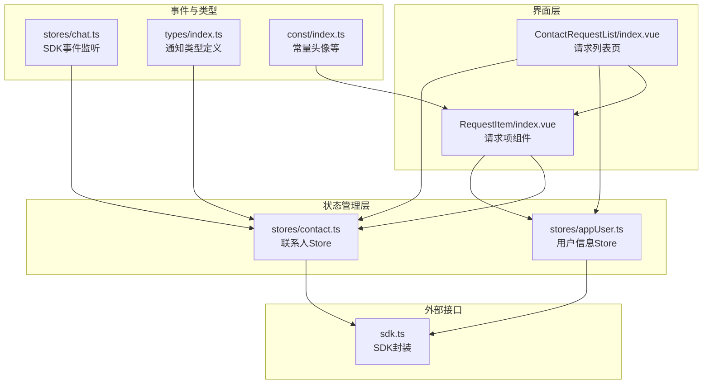
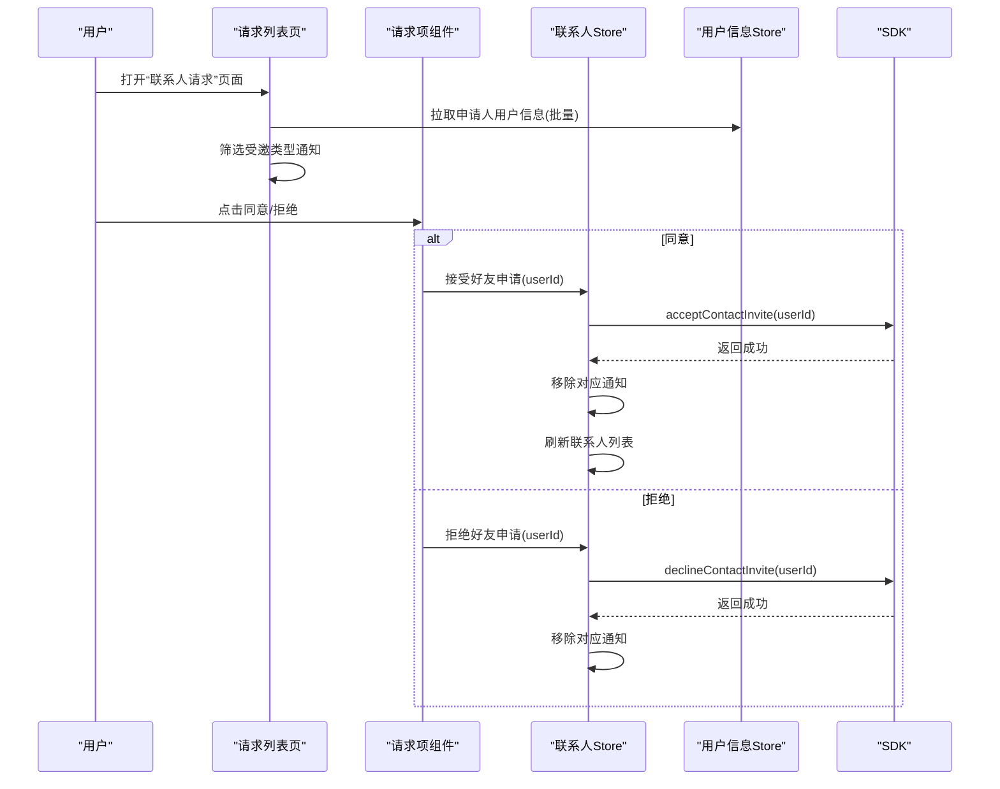
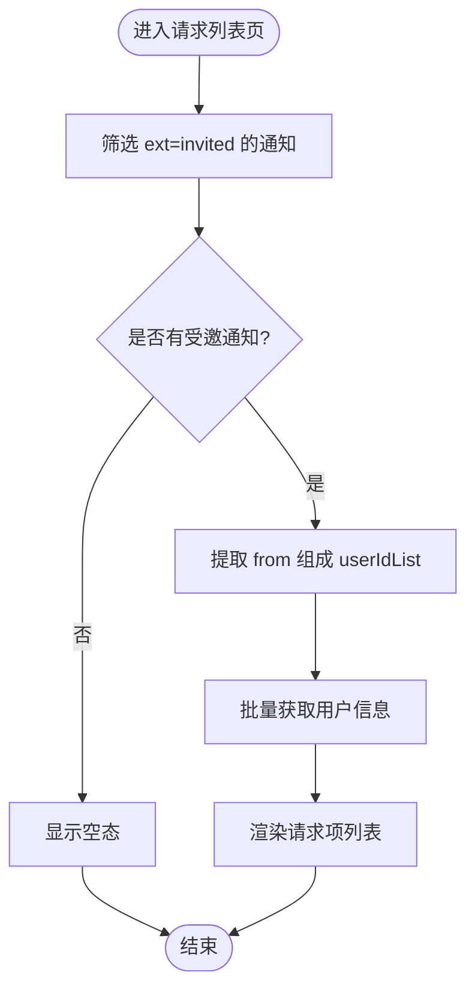
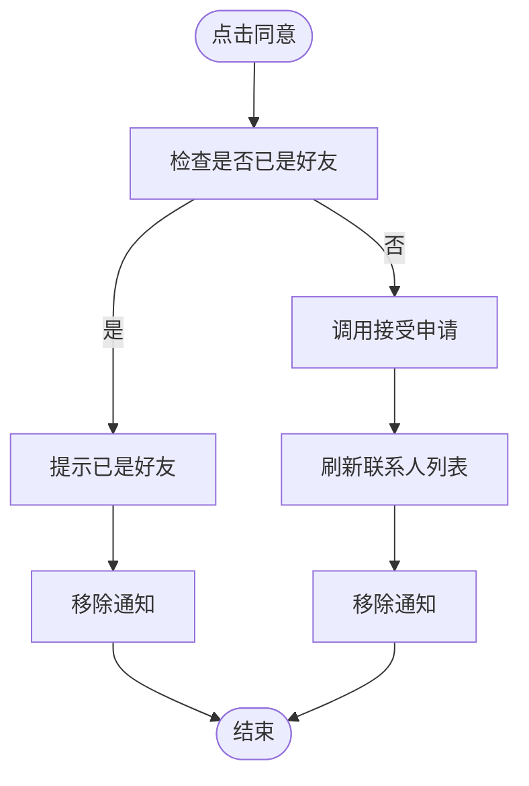
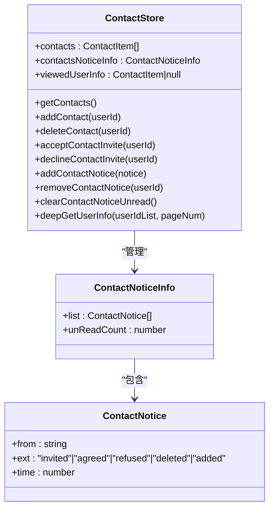
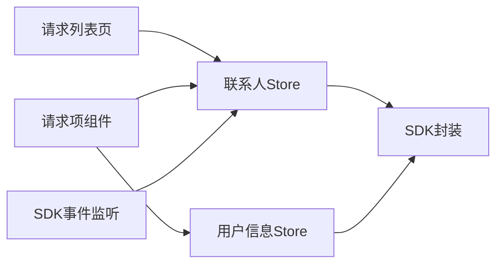

# 联系人请求

<cite>
**本文引用的文件**
- [ChatUIKit/modules/ContactRequestList/index.vue](file://ChatUIKit/modules/ContactRequestList/index.vue)
- [ChatUIKit/modules/ContactRequestList/components/RequestItem/index.vue](file://ChatUIKit/modules/ContactRequestList/components/RequestItem/index.vue)
- [ChatUIKit/stores/contact.ts](file://ChatUIKit/stores/contact.ts)
- [ChatUIKit/stores/appUser.ts](file://ChatUIKit/stores/appUser.ts)
- [ChatUIKit/stores/chat.ts](file://ChatUIKit/stores/chat.ts)
- [ChatUIKit/types/index.ts](file://ChatUIKit/types/index.ts)
- [ChatUIKit/const/index.ts](file://ChatUIKit/const/index.ts)
- [ChatUIKit/modules/ContactAdd/index.vue](file://ChatUIKit/modules/ContactAdd/index.vue)
- [ChatUIKit/locales/index.ts](file://ChatUIKit/locales/index.ts)
- [ChatUIKit/sdk.ts](file://ChatUIKit/sdk.ts)
</cite>

## 目录
1. [简介](#简介)
2. [项目结构](#项目结构)
3. [核心组件](#核心组件)
4. [架构总览](#架构总览)
5. [详细组件分析](#详细组件分析)
6. [依赖关系分析](#依赖关系分析)
7. [性能考量](#性能考量)
8. [故障排查指南](#故障排查指南)
9. [结论](#结论)
10. [附录](#附录)

## 简介
本文件围绕联系人请求（好友申请）的完整生命周期进行系统化说明，覆盖请求发送、接收通知、处理流程、状态管理、时间戳与未读计数、请求项组件交互、批量处理能力、自动过期与清理机制、通知推送与消息提醒、以及数据安全与隐私保护策略。目标是帮助开发者快速理解并扩展联系人请求功能。

## 项目结构
联系人请求相关模块主要由以下部分组成：
- 请求列表页面：负责展示“受邀”类的好友申请，并按受邀类型筛选显示
- 请求项组件：单条申请的卡片，提供同意/拒绝操作入口
- 存储层（Pinia）：联系人与用户信息的状态管理，负责请求通知的增删改查与未读计数
- SDK 事件监听：在收到联系人相关消息时，写入通知队列并触发 UI 更新
- 类型与常量：统一定义通知体结构、默认头像地址等
- 国际化与 SDK 封装：提供文案与底层 SDK 的桥接

图表来源
- [ChatUIKit/modules/ContactRequestList/index.vue](file://ChatUIKit/modules/ContactRequestList/index.vue#L1-L74)
- [ChatUIKit/modules/ContactRequestList/components/RequestItem/index.vue](file://ChatUIKit/modules/ContactRequestList/components/RequestItem/index.vue#L1-L148)
- [ChatUIKit/stores/contact.ts](file://ChatUIKit/stores/contact.ts#L1-L282)
- [ChatUIKit/stores/appUser.ts](file://ChatUIKit/stores/appUser.ts#L1-L242)
- [ChatUIKit/stores/chat.ts](file://ChatUIKit/stores/chat.ts#L130-L166)
- [ChatUIKit/types/index.ts](file://ChatUIKit/types/index.ts#L14-L31)
- [ChatUIKit/const/index.ts](file://ChatUIKit/const/index.ts#L10-L10)
- [ChatUIKit/sdk.ts](file://ChatUIKit/sdk.ts#L1-L13)

章节来源
- [ChatUIKit/modules/ContactRequestList/index.vue](file://ChatUIKit/modules/ContactRequestList/index.vue#L1-L74)
- [ChatUIKit/modules/ContactRequestList/components/RequestItem/index.vue](file://ChatUIKit/modules/ContactRequestList/components/RequestItem/index.vue#L1-L148)
- [ChatUIKit/stores/contact.ts](file://ChatUIKit/stores/contact.ts#L1-L282)
- [ChatUIKit/stores/appUser.ts](file://ChatUIKit/stores/appUser.ts#L1-L242)
- [ChatUIKit/stores/chat.ts](file://ChatUIKit/stores/chat.ts#L130-L166)
- [ChatUIKit/types/index.ts](file://ChatUIKit/types/index.ts#L14-L31)
- [ChatUIKit/const/index.ts](file://ChatUIKit/const/index.ts#L10-L10)
- [ChatUIKit/sdk.ts](file://ChatUIKit/sdk.ts#L1-L13)

## 核心组件
- 请求列表页：筛选并渲染受邀类型的通知，异步拉取申请人用户信息，为空时显示占位
- 请求项组件：展示申请人头像、名称、提示文案；提供同意/拒绝按钮；若已是好友则提示并移除通知
- 联系人 Store：维护联系人列表、通知列表与未读计数；提供接受/拒绝申请、添加/移除通知、清空未读等动作
- 用户信息 Store：按需从服务端批量拉取用户资料，避免重复请求
- SDK 事件监听：监听受邀、同意、拒绝、新增好友等联系人相关事件，写入通知并刷新 UI
- 类型与常量：统一通知体结构（含扩展类型与时间戳），默认头像地址

章节来源
- [ChatUIKit/modules/ContactRequestList/index.vue](file://ChatUIKit/modules/ContactRequestList/index.vue#L33-L52)
- [ChatUIKit/modules/ContactRequestList/components/RequestItem/index.vue](file://ChatUIKit/modules/ContactRequestList/components/RequestItem/index.vue#L43-L68)
- [ChatUIKit/stores/contact.ts](file://ChatUIKit/stores/contact.ts#L216-L263)
- [ChatUIKit/stores/appUser.ts](file://ChatUIKit/stores/appUser.ts#L86-L125)
- [ChatUIKit/stores/chat.ts](file://ChatUIKit/stores/chat.ts#L133-L166)
- [ChatUIKit/types/index.ts](file://ChatUIKit/types/index.ts#L14-L26)
- [ChatUIKit/const/index.ts](file://ChatUIKit/const/index.ts#L10-L10)

## 架构总览
联系人请求的端到端流程如下：
- 发送申请：通过联系人 Store 调用 SDK 发起添加好友请求
- 接收通知：SDK 事件监听捕获受邀消息，写入通知列表并增加未读计数
- 展示与处理：请求列表页筛选受邀通知，请求项组件提供同意/拒绝入口；同意后刷新联系人列表并移除通知
- 同步状态：对端同意/拒绝后，SDK 事件监听移除通知或刷新联系人

图表来源
- [ChatUIKit/modules/ContactRequestList/index.vue](file://ChatUIKit/modules/ContactRequestList/index.vue#L33-L52)
- [ChatUIKit/modules/ContactRequestList/components/RequestItem/index.vue](file://ChatUIKit/modules/ContactRequestList/components/RequestItem/index.vue#L47-L68)
- [ChatUIKit/stores/contact.ts](file://ChatUIKit/stores/contact.ts#L179-L214)
- [ChatUIKit/stores/chat.ts](file://ChatUIKit/stores/chat.ts#L133-L166)
- [ChatUIKit/stores/appUser.ts](file://ChatUIKit/stores/appUser.ts#L86-L125)

## 详细组件分析

### 请求列表页（ContactRequestList/index.vue）
- 功能要点
  - 使用计算属性筛选受邀类型的通知
  - 监听列表变化，按需批量拉取申请人用户信息
  - 无通知时显示空态组件
- 关键行为
  - 通过联系人 Store 的通知列表过滤 ext=invited
  - 提取 from 字段组成用户 ID 列表，调用用户信息 Store 的批量获取方法
- 性能与体验
  - 批量获取避免多次小请求
  - 即时监听确保新增通知立即可见

图表来源
- [ChatUIKit/modules/ContactRequestList/index.vue](file://ChatUIKit/modules/ContactRequestList/index.vue#L33-L52)
- [ChatUIKit/stores/appUser.ts](file://ChatUIKit/stores/appUser.ts#L86-L125)

章节来源
- [ChatUIKit/modules/ContactRequestList/index.vue](file://ChatUIKit/modules/ContactRequestList/index.vue#L33-L52)

### 请求项组件（RequestItem/index.vue）
- 功能要点
  - 展示申请人头像与名称、提示文案
  - 提供同意/拒绝按钮
  - 若已是好友，提示并移除通知
- 处理逻辑
  - 同意：检查是否已是好友，若是则提示并移除通知；否则调用联系人 Store 接受申请
  - 拒绝：调用联系人 Store 拒绝申请
- 交互细节
  - 使用国际化文案
  - 默认头像来自常量配置

图表来源
- [ChatUIKit/modules/ContactRequestList/components/RequestItem/index.vue](file://ChatUIKit/modules/ContactRequestList/components/RequestItem/index.vue#L47-L68)
- [ChatUIKit/stores/contact.ts](file://ChatUIKit/stores/contact.ts#L179-L196)
- [ChatUIKit/const/index.ts](file://ChatUIKit/const/index.ts#L10-L10)

章节来源
- [ChatUIKit/modules/ContactRequestList/components/RequestItem/index.vue](file://ChatUIKit/modules/ContactRequestList/components/RequestItem/index.vue#L43-L68)
- [ChatUIKit/locales/index.ts](file://ChatUIKit/locales/index.ts#L11-L17)

### 联系人 Store（stores/contact.ts）
- 数据结构
  - contacts：联系人列表
  - contactsNoticeInfo：通知列表与未读计数
  - viewedUserInfo：当前查看的用户信息
- 关键动作
  - 接受/拒绝申请：调用 SDK 并移除通知、刷新联系人
  - 添加/移除通知：去重、插入头部、维护未读计数
  - 清空未读计数：重置为 0
  - 递归批量获取用户信息：分页拉取，避免递归栈问题
- 状态一致性
  - 仅 invited 类型通知计入未读
  - 重复受邀会先移除旧通知再插入新通知

图表来源
- [ChatUIKit/stores/contact.ts](file://ChatUIKit/stores/contact.ts#L16-L33)
- [ChatUIKit/types/index.ts](file://ChatUIKit/types/index.ts#L14-L26)

章节来源
- [ChatUIKit/stores/contact.ts](file://ChatUIKit/stores/contact.ts#L179-L263)

### 用户信息 Store（stores/appUser.ts）
- 功能要点
  - 按需批量获取用户信息，避免重复请求
  - 支持订阅/取消订阅在线状态、发布自定义状态
- 性能优化
  - 过滤已缓存用户 ID，减少网络请求
  - 分页批量拉取用户信息

章节来源
- [ChatUIKit/stores/appUser.ts](file://ChatUIKit/stores/appUser.ts#L86-L125)

### SDK 事件监听（stores/chat.ts）
- 监听联系人相关事件
  - onContactInvited：写入受邀通知并设置时间戳
  - onContactAgreed / onContactRefuse：移除对应通知
  - onContactAdded：刷新联系人并写入“已添加”通知
  - onContactDeleted：从本地联系人列表移除
- 作用
  - 将服务端事件转化为前端状态变更，驱动 UI 更新

章节来源
- [ChatUIKit/stores/chat.ts](file://ChatUIKit/stores/chat.ts#L133-L166)

### 类型与常量（types/index.ts、const/index.ts）
- 类型定义
  - ContactNotice：扩展类型（invited/agreed/refused/deleted/added）与时间戳
  - ContactNoticeInfo：通知列表与未读计数
- 常量
  - USER_AVATAR_URL：默认用户头像地址

章节来源
- [ChatUIKit/types/index.ts](file://ChatUIKit/types/index.ts#L14-L26)
- [ChatUIKit/const/index.ts](file://ChatUIKit/const/index.ts#L10-L10)

### 发送申请（ContactAdd/index.vue）
- 功能要点
  - 输入目标用户 ID，调用联系人 Store 发起添加好友请求
  - 成功后提示并返回上一页
- 与请求生命周期的关系
  - 该页面发起“申请发送”阶段，后续受邀通知由 SDK 事件监听捕获

章节来源
- [ChatUIKit/modules/ContactAdd/index.vue](file://ChatUIKit/modules/ContactAdd/index.vue#L42-L61)

## 依赖关系分析
- 组件依赖
  - 请求列表页依赖联系人 Store 的通知列表与未读计数
  - 请求项组件依赖联系人 Store 的接受/拒绝动作与用户信息 Store 的用户资料
- 状态依赖
  - 联系人 Store 依赖 SDK 的连接实例执行网络操作
  - 用户信息 Store 依赖 SDK 的用户资料与在线状态接口
- 事件依赖
  - SDK 事件监听作为外部输入源，写入联系人 Store 的通知队列

图表来源
- [ChatUIKit/modules/ContactRequestList/index.vue](file://ChatUIKit/modules/ContactRequestList/index.vue#L27-L31)
- [ChatUIKit/modules/ContactRequestList/components/RequestItem/index.vue](file://ChatUIKit/modules/ContactRequestList/components/RequestItem/index.vue#L28-L40)
- [ChatUIKit/stores/chat.ts](file://ChatUIKit/stores/chat.ts#L133-L166)
- [ChatUIKit/stores/contact.ts](file://ChatUIKit/stores/contact.ts#L112-L130)
- [ChatUIKit/stores/appUser.ts](file://ChatUIKit/stores/appUser.ts#L110-L125)
- [ChatUIKit/sdk.ts](file://ChatUIKit/sdk.ts#L1-L13)

章节来源
- [ChatUIKit/modules/ContactRequestList/index.vue](file://ChatUIKit/modules/ContactRequestList/index.vue#L27-L31)
- [ChatUIKit/modules/ContactRequestList/components/RequestItem/index.vue](file://ChatUIKit/modules/ContactRequestList/components/RequestItem/index.vue#L28-L40)
- [ChatUIKit/stores/chat.ts](file://ChatUIKit/stores/chat.ts#L133-L166)
- [ChatUIKit/stores/contact.ts](file://ChatUIKit/stores/contact.ts#L112-L130)
- [ChatUIKit/stores/appUser.ts](file://ChatUIKit/stores/appUser.ts#L110-L125)
- [ChatUIKit/sdk.ts](file://ChatUIKit/sdk.ts#L1-L13)

## 性能考量
- 批量请求用户信息：用户信息 Store 会对已缓存用户进行过滤，避免重复请求
- 分页拉取：联系人 Store 的递归批量获取采用分页策略，降低单次请求压力
- 响应式更新：通知列表与未读计数的更新均通过数组替换与数学运算保证响应式
- 列表渲染：请求列表页仅渲染受邀类型通知，减少无关渲染

章节来源
- [ChatUIKit/stores/appUser.ts](file://ChatUIKit/stores/appUser.ts#L86-L125)
- [ChatUIKit/stores/contact.ts](file://ChatUIKit/stores/contact.ts#L83-L107)

## 故障排查指南
- 无法看到受邀通知
  - 检查 SDK 事件监听是否初始化完成
  - 确认 onContactInvited 是否被触发并写入通知
- 同意/拒绝无效
  - 检查联系人 Store 的 acceptContactInvite/declineContactInvite 是否抛错
  - 确认 SDK 返回状态与网络状况
- 已是好友仍显示请求
  - 检查同意后是否正确移除通知并刷新联系人列表
- 用户头像显示默认图
  - 检查用户信息是否已缓存或批量拉取成功
- 未读计数异常
  - 确认仅 invited 类型通知计入未读
  - 检查 removeContactNotice 是否正确扣减未读计数

章节来源
- [ChatUIKit/stores/chat.ts](file://ChatUIKit/stores/chat.ts#L133-L166)
- [ChatUIKit/stores/contact.ts](file://ChatUIKit/stores/contact.ts#L179-L214)
- [ChatUIKit/stores/appUser.ts](file://ChatUIKit/stores/appUser.ts#L86-L125)

## 结论
联系人请求功能以“受邀通知”为核心，通过 SDK 事件监听与 Store 动作实现完整的生命周期闭环：发送申请、接收通知、处理请求、同步状态。界面层以列表与卡片形式直观呈现，配合批量用户信息拉取与未读计数管理，兼顾性能与体验。建议在扩展时遵循现有类型与状态管理模式，确保事件监听与 Store 动作的一致性。

## 附录

### 请求状态管理与时间戳
- 状态字段
  - ext：invited/agreed/refused/deleted/added
  - time：通知写入时间戳
- 未读计数
  - 仅 invited 类型计入未读
  - 移除通知时相应扣减未读计数

章节来源
- [ChatUIKit/types/index.ts](file://ChatUIKit/types/index.ts#L14-L26)
- [ChatUIKit/stores/contact.ts](file://ChatUIKit/stores/contact.ts#L219-L263)

### 请求项组件功能清单
- 同意：检查是否已是好友，若是则提示并移除通知；否则接受申请并刷新联系人
- 拒绝：调用拒绝申请并移除通知
- 查看详情：依赖用户信息 Store 提供的用户资料

章节来源
- [ChatUIKit/modules/ContactRequestList/components/RequestItem/index.vue](file://ChatUIKit/modules/ContactRequestList/components/RequestItem/index.vue#L47-L68)
- [ChatUIKit/stores/appUser.ts](file://ChatUIKit/stores/appUser.ts#L35-L46)

### 批量处理、自动过期与清理机制
- 批量处理
  - 用户信息：按需过滤已缓存用户，批量拉取
  - 通知去重：同一 from 的通知仅保留最新一条
- 自动过期与清理
  - 代码中未发现针对联系人请求的自动过期逻辑
  - 建议在业务侧增加“过期时间”字段与定时清理任务（扩展建议）

章节来源
- [ChatUIKit/stores/appUser.ts](file://ChatUIKit/stores/appUser.ts#L86-L125)
- [ChatUIKit/stores/contact.ts](file://ChatUIKit/stores/contact.ts#L219-L237)

### 通知推送、消息提醒与用户反馈
- 通知推送
  - SDK 事件监听 onContactInvited 写入受邀通知，驱动 UI 展示
- 消息提醒
  - 未读计数用于提示用户有待处理的申请
- 用户反馈
  - 成功/失败 toast 提示
  - 已是好友的友好提示

章节来源
- [ChatUIKit/stores/chat.ts](file://ChatUIKit/stores/chat.ts#L133-L140)
- [ChatUIKit/modules/ContactRequestList/components/RequestItem/index.vue](file://ChatUIKit/modules/ContactRequestList/components/RequestItem/index.vue#L54-L57)
- [ChatUIKit/modules/ContactAdd/index.vue](file://ChatUIKit/modules/ContactAdd/index.vue#L48-L60)

### 数据安全、隐私保护与访问控制
- 安全存储
  - 用户信息与通知存储于前端 Store，建议在应用层面限制敏感信息的持久化
- 隐私保护
  - 仅在必要时批量拉取用户信息，避免泄露过多用户 ID
- 访问控制
  - SDK 调用需在已登录状态下进行，确保用户身份有效

章节来源
- [ChatUIKit/stores/appUser.ts](file://ChatUIKit/stores/appUser.ts#L86-L125)
- [ChatUIKit/stores/contact.ts](file://ChatUIKit/stores/contact.ts#L112-L130)
- [ChatUIKit/sdk.ts](file://ChatUIKit/sdk.ts#L1-L13)