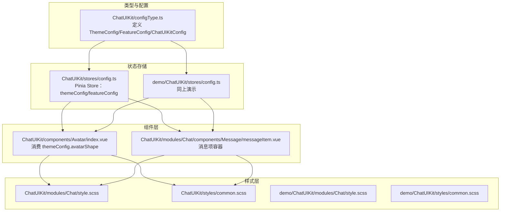
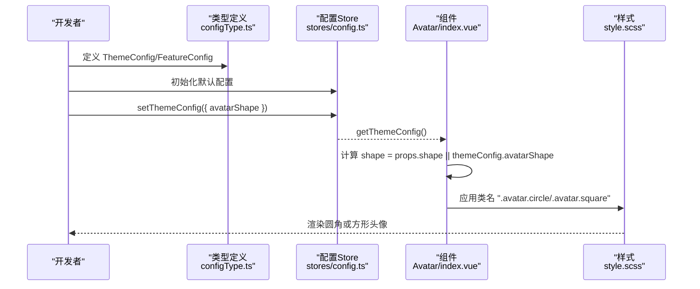
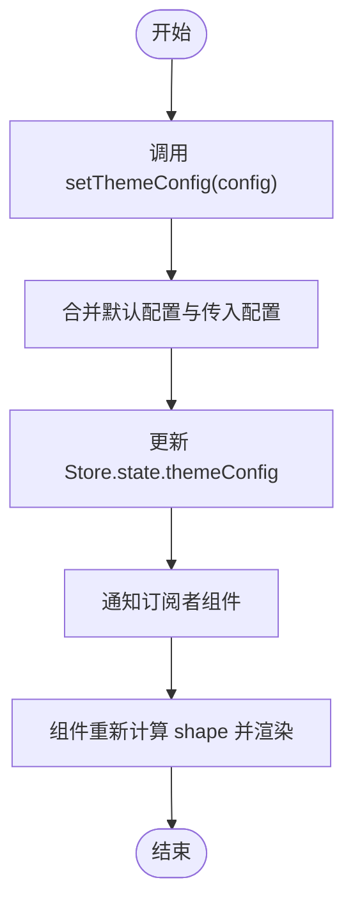
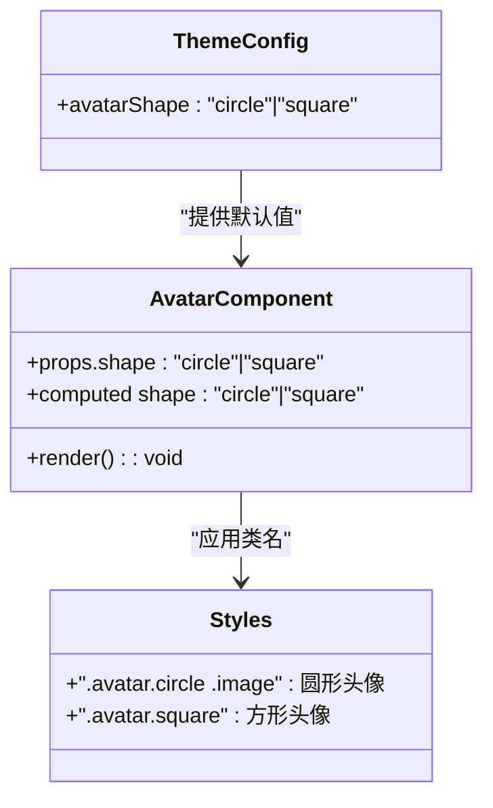
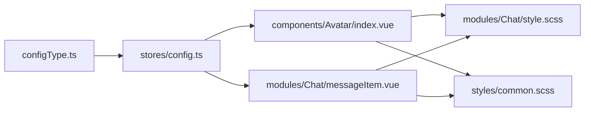

# 主题配置

<cite>
**本文引用的文件**
- [ChatUIKit/stores/config.ts](file://ChatUIKit/stores/config.ts)
- [demo/ChatUIKit/stores/config.ts](file://demo/ChatUIKit/stores/config.ts)
- [ChatUIKit/configType.ts](file://ChatUIKit/configType.ts)
- [demo/ChatUIKit/configType.ts](file://demo/ChatUIKit/configType.ts)
- [ChatUIKit/components/Avatar/index.vue](file://ChatUIKit/components/Avatar/index.vue)
- [demo/ChatUIKit/components/Avatar/index.vue](file://demo/ChatUIKit/components/Avatar/index.vue)
- [ChatUIKit/modules/Chat/components/Message/messageItem.vue](file://ChatUIKit/modules/Chat/components/Message/messageItem.vue)
- [ChatUIKit/modules/Chat/style.scss](file://ChatUIKit/modules/Chat/style.scss)
- [demo/ChatUIKit/modules/Chat/style.scss](file://demo/ChatUIKit/modules/Chat/style.scss)
- [ChatUIKit/styles/common.scss](file://ChatUIKit/styles/common.scss)
- [demo/ChatUIKit/styles/common.scss](file://demo/ChatUIKit/styles/common.scss)
</cite>

## 目录
1. [简介](#简介)
2. [项目结构](#项目结构)
3. [核心组件](#核心组件)
4. [架构总览](#架构总览)
5. [详细组件分析](#详细组件分析)
6. [依赖分析](#依赖分析)
7. [性能考虑](#性能考虑)
8. [故障排查指南](#故障排查指南)
9. [结论](#结论)
10. [附录](#附录)

## 简介
本文件系统性地文档化了主题配置系统，重点覆盖以下内容：
- ThemeConfig 接口的全部配置项与语义
- avatarShape 头像形状配置的实现原理与使用场景
- 主题配置的加载、更新与持久化策略
- 主题定制示例（颜色方案、字体设置、布局调整）
- 主题配置与组件样式的绑定关系及 CSS 变量使用
- 主题切换的实现方法与性能优化建议

## 项目结构
主题配置系统主要由“类型定义 + 状态存储 + 组件消费”三部分组成，并在聊天模块中通过 Avatar 组件与消息气泡等样式进行联动。

图表来源
- [ChatUIKit/configType.ts](file://ChatUIKit/configType.ts#L42-L53)
- [ChatUIKit/stores/config.ts](file://ChatUIKit/stores/config.ts#L14-L122)
- [demo/ChatUIKit/stores/config.ts](file://demo/ChatUIKit/stores/config.ts#L14-L122)
- [ChatUIKit/components/Avatar/index.vue](file://ChatUIKit/components/Avatar/index.vue#L25-L96)
- [ChatUIKit/modules/Chat/components/Message/messageItem.vue](file://ChatUIKit/modules/Chat/components/Message/messageItem.vue#L74-L134)
- [ChatUIKit/modules/Chat/style.scss](file://ChatUIKit/modules/Chat/style.scss#L1-L33)
- [ChatUIKit/styles/common.scss](file://ChatUIKit/styles/common.scss#L1-L18)

章节来源
- [ChatUIKit/configType.ts](file://ChatUIKit/configType.ts#L1-L68)
- [ChatUIKit/stores/config.ts](file://ChatUIKit/stores/config.ts#L1-L123)
- [demo/ChatUIKit/stores/config.ts](file://demo/ChatUIKit/stores/config.ts#L1-L123)

## 核心组件
- 主题配置类型定义：ThemeConfig、FeatureConfig、ChatUIKitConfig
- 主题配置存储：Pinia Store，提供默认值、读取、更新、重置能力
- 组件消费：Avatar 组件根据主题配置动态应用头像形状；消息项组件消费功能开关

章节来源
- [ChatUIKit/configType.ts](file://ChatUIKit/configType.ts#L42-L53)
- [ChatUIKit/stores/config.ts](file://ChatUIKit/stores/config.ts#L19-L122)
- [demo/ChatUIKit/stores/config.ts](file://demo/ChatUIKit/stores/config.ts#L19-L122)

## 架构总览
主题配置从类型定义到状态存储再到组件消费的端到端流程如下：

图表来源
- [ChatUIKit/configType.ts](file://ChatUIKit/configType.ts#L42-L53)
- [ChatUIKit/stores/config.ts](file://ChatUIKit/stores/config.ts#L65-L88)
- [ChatUIKit/components/Avatar/index.vue](file://ChatUIKit/components/Avatar/index.vue#L86-L87)
- [ChatUIKit/modules/Chat/style.scss](file://ChatUIKit/modules/Chat/style.scss#L1-L33)

## 详细组件分析

### ThemeConfig 接口与配置项
- avatarShape：头像形状，可选值为 "circle" 或 "square"。该字段用于控制头像渲染为圆形或方形。
- 其他主题相关字段：当前仓库中仅定义了 avatarShape，其他如颜色、字体、间距等可在业务侧扩展。

章节来源
- [ChatUIKit/configType.ts](file://ChatUIKit/configType.ts#L42-L45)

### 主题配置加载机制
- 默认值：在 Store 初始化时以浅拷贝方式合并默认主题配置，确保首次渲染可用。
- 读取：通过 getter 提供只读访问，避免外部直接修改 Store 内部状态。
- 更新：通过 action setThemeConfig 进行部分更新，支持运行时变更。

章节来源
- [ChatUIKit/stores/config.ts](file://ChatUIKit/stores/config.ts#L19-L22)
- [ChatUIKit/stores/config.ts](file://ChatUIKit/stores/config.ts#L61-L69)
- [ChatUIKit/stores/config.ts](file://ChatUIKit/stores/config.ts#L86-L88)

### 主题配置更新流程
- 开发者调用 setThemeConfig 传入部分配置对象
- Store 合并新旧配置，触发响应式更新
- 订阅该状态的组件（如 Avatar）重新计算 shape 并渲染

图表来源
- [ChatUIKit/stores/config.ts](file://ChatUIKit/stores/config.ts#L82-L88)

### 主题配置持久化策略
- 当前实现未发现持久化逻辑（如本地存储）。若需持久化，建议在 setThemeConfig 后写入本地存储，并在应用启动时读取恢复。
- 本节为通用实践建议，不对应具体源码。

### avatarShape 实现原理与使用场景
- 实现原理
  - 组件接收 props.shape 作为优先级最高的形状参数；若未传入，则回退到主题配置中的 avatarShape。
  - 根据最终 shape 值，组件向根节点添加对应的类名（circle 或 square），从而驱动样式层的圆角或方角渲染。
- 使用场景
  - 圆形头像适合社交、个人资料等偏柔和风格的界面
  - 方形头像适合商务、卡片式布局等偏硬朗风格的界面
- 与消息模块的联动
  - 消息项容器中嵌套 Avatar，Avatar 的尺寸与形状直接影响消息气泡的整体观感与对齐关系

图表来源
- [ChatUIKit/configType.ts](file://ChatUIKit/configType.ts#L42-L45)
- [ChatUIKit/components/Avatar/index.vue](file://ChatUIKit/components/Avatar/index.vue#L29-L87)
- [ChatUIKit/modules/Chat/style.scss](file://ChatUIKit/modules/Chat/style.scss#L1-L33)

章节来源
- [ChatUIKit/components/Avatar/index.vue](file://ChatUIKit/components/Avatar/index.vue#L29-L87)
- [ChatUIKit/modules/Chat/components/Message/messageItem.vue](file://ChatUIKit/modules/Chat/components/Message/messageItem.vue#L6-L12)

### 主题定制示例（概念性指导）
- 颜色方案：可在业务侧扩展 ThemeConfig，新增主色、辅色、边框色等字段；在组件中通过 CSS 变量或内联样式消费这些值。
- 字体设置：扩展字体家族、字号、字重等字段；在全局样式中统一应用。
- 布局调整：扩展头像尺寸、气泡圆角、消息间距等字段；在组件与模块样式中按需使用。
- 注意：以上为扩展建议，当前仓库未包含上述字段的具体实现。

### 主题切换的实现方法
- 运行时切换：调用 setThemeConfig 更新 avatarShape，即可即时生效。
- 多主题方案：在业务侧维护多组主题配置，切换时批量更新 themeConfig。
- 与功能配置联动：若需要在不同主题下启用/禁用某些功能，可同时更新 featureConfig。

章节来源
- [ChatUIKit/stores/config.ts](file://ChatUIKit/stores/config.ts#L82-L95)

### 主题配置与组件样式的绑定关系
- 绑定方式：组件通过计算属性读取 themeConfig，再将结果映射为 DOM 类名，样式层通过类选择器控制视觉表现。
- 样式文件：聊天模块样式与通用样式文件中包含基础布局与占位样式，Avatar 的形状样式位于组件作用域样式中。

章节来源
- [ChatUIKit/components/Avatar/index.vue](file://ChatUIKit/components/Avatar/index.vue#L98-L130)
- [ChatUIKit/modules/Chat/style.scss](file://ChatUIKit/modules/Chat/style.scss#L1-L33)
- [ChatUIKit/styles/common.scss](file://ChatUIKit/styles/common.scss#L1-L18)

## 依赖分析
- 类型依赖：configType.ts 为 stores/config.ts 与各组件提供类型约束
- 存储依赖：Avatar 与消息项组件均依赖 useConfigStore 获取主题配置
- 样式依赖：Avatar 的形状样式与聊天模块样式相互独立但共同影响最终呈现

图表来源
- [ChatUIKit/configType.ts](file://ChatUIKit/configType.ts#L1-L68)
- [ChatUIKit/stores/config.ts](file://ChatUIKit/stores/config.ts#L1-L123)
- [ChatUIKit/components/Avatar/index.vue](file://ChatUIKit/components/Avatar/index.vue#L25-L96)
- [ChatUIKit/modules/Chat/components/Message/messageItem.vue](file://ChatUIKit/modules/Chat/components/Message/messageItem.vue#L74-L134)
- [ChatUIKit/modules/Chat/style.scss](file://ChatUIKit/modules/Chat/style.scss#L1-L33)
- [ChatUIKit/styles/common.scss](file://ChatUIKit/styles/common.scss#L1-L18)

章节来源
- [ChatUIKit/stores/config.ts](file://ChatUIKit/stores/config.ts#L1-L123)
- [ChatUIKit/components/Avatar/index.vue](file://ChatUIKit/components/Avatar/index.vue#L25-L96)
- [ChatUIKit/modules/Chat/components/Message/messageItem.vue](file://ChatUIKit/modules/Chat/components/Message/messageItem.vue#L74-L134)

## 性能考虑
- 响应式更新：setThemeConfig 采用浅合并策略，仅在必要时触发组件重渲染
- 组件计算：shape 为计算属性，基于 props 与 themeConfig 计算，避免重复渲染
- 样式开销：Avatar 的形状切换仅涉及类名切换与少量 CSS 属性，开销极低
- 建议：在高频切换场景下，尽量批量更新配置，减少多次响应式触发

## 故障排查指南
- 头像形状未生效
  - 检查是否正确传入 props.shape；若未传入，确认 themeConfig.avatarShape 是否已设置
  - 确认组件根节点类名是否包含 circle 或 square
- 样式异常
  - 检查组件作用域样式是否被其他全局样式覆盖
  - 确认聊天模块样式与通用样式文件未冲突
- 功能开关与主题配置混用
  - 若存在功能开关与主题配置的联动需求，确保在组件中同时读取 featureConfig 与 themeConfig

章节来源
- [ChatUIKit/components/Avatar/index.vue](file://ChatUIKit/components/Avatar/index.vue#L56-L87)
- [ChatUIKit/modules/Chat/style.scss](file://ChatUIKit/modules/Chat/style.scss#L1-L33)
- [ChatUIKit/styles/common.scss](file://ChatUIKit/styles/common.scss#L1-L18)

## 结论
主题配置系统以简洁的类型定义与 Pinia Store 实现，围绕 avatarShape 提供了即插即用的主题能力。通过组件与样式的解耦设计，实现了低耦合、高可维护的主题扩展空间。建议在实际业务中结合本地持久化与多主题方案，进一步完善用户体验与开发效率。

## 附录
- 术语
  - 主题配置：影响界面外观的配置集合，如头像形状、颜色、字体等
  - 功能配置：影响界面行为的功能开关集合，如消息状态、输入功能等
- 相关文件路径
  - 类型定义：ChatUIKit/configType.ts、demo/ChatUIKit/configType.ts
  - 配置存储：ChatUIKit/stores/config.ts、demo/ChatUIKit/stores/config.ts
  - 组件消费：ChatUIKit/components/Avatar/index.vue、demo/ChatUIKit/components/Avatar/index.vue
  - 模块样式：ChatUIKit/modules/Chat/style.scss、demo/ChatUIKit/modules/Chat/style.scss
  - 通用样式：ChatUIKit/styles/common.scss、demo/ChatUIKit/styles/common.scss