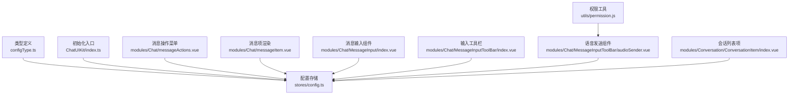
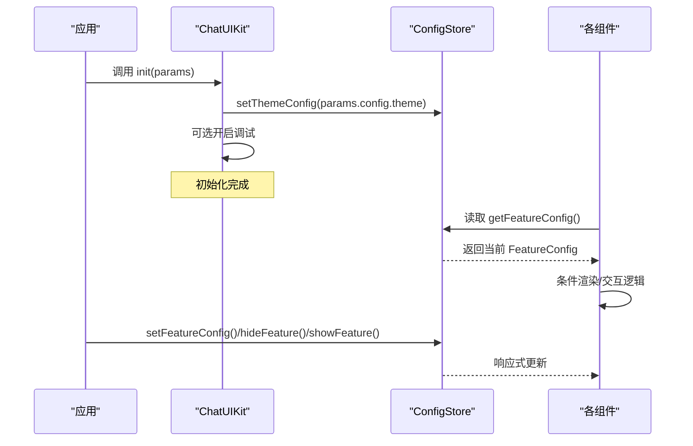
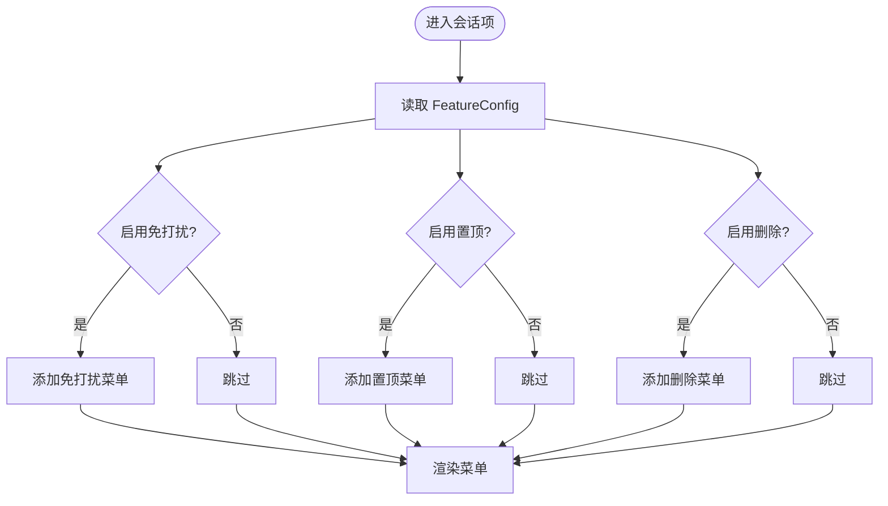
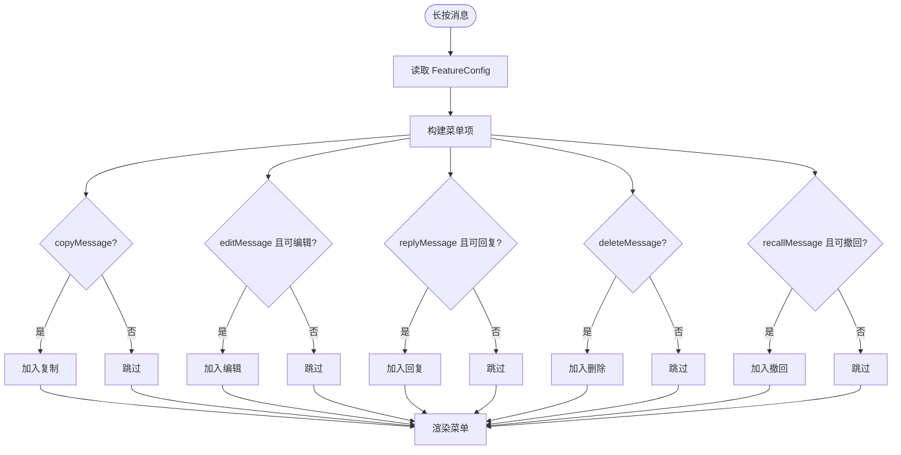
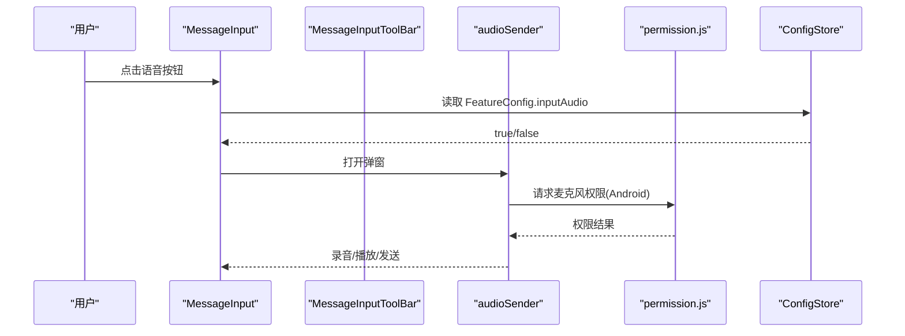
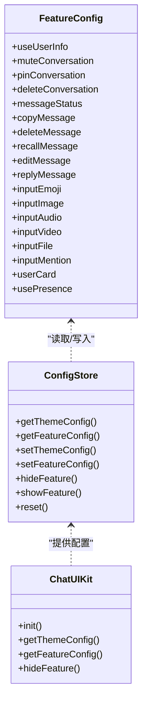

# 功能配置

<cite>
**本文引用的文件**
- [configType.ts](file://ChatUIKit/configType.ts)
- [config.ts](file://ChatUIKit/stores/config.ts)
- [index.ts](file://ChatUIKit/index.ts)
- [messageActions.vue](file://ChatUIKit/modules/Chat/components/Message/messageActions.vue)
- [messageItem.vue](file://ChatUIKit/modules/Chat/components/Message/messageItem.vue)
- [index.vue](file://ChatUIKit/modules/Chat/components/MessageInput/index.vue)
- [index.vue](file://ChatUIKit/modules/Chat/components/MessageInputToolBar/index.vue)
- [audioSender.vue](file://ChatUIKit/modules/Chat/components/MessageInputToolBar/audioSender.vue)
- [permission.js](file://ChatUIKit/utils/permission.js)
- [index.vue](file://ChatUIKit/modules/Conversation/components/ConversationItem/index.vue)
</cite>

## 目录
1. [简介](#简介)
2. [项目结构](#项目结构)
3. [核心组件](#核心组件)
4. [架构总览](#架构总览)
5. [详细组件分析](#详细组件分析)
6. [依赖分析](#依赖分析)
7. [性能考量](#性能考量)
8. [故障排查指南](#故障排查指南)
9. [结论](#结论)
10. [附录](#附录)

## 简介
本文件系统性阐述 ChatUIKit 的“功能配置”体系，围绕 FeatureConfig 接口中的各项功能开关，解释其作用机制、依赖关系与互斥情况；提供动态启用/禁用与运行时更新策略；说明与权限控制的关系及安全注意事项；并给出典型业务场景的最佳实践与完整配置示例路径。

## 项目结构
功能配置由类型定义、全局配置存储、初始化入口与多处 UI 组件消费构成，形成“声明—存储—渲染—交互”的闭环。

图表来源
- [configType.ts](file://ChatUIKit/configType.ts#L3-L40)
- [config.ts](file://ChatUIKit/stores/config.ts#L14-L57)
- [index.ts](file://ChatUIKit/index.ts#L84-L96)
- [messageActions.vue](file://ChatUIKit/modules/Chat/components/Message/messageActions.vue#L78-L144)
- [messageItem.vue](file://ChatUIKit/modules/Chat/components/Message/messageItem.vue#L116-L120)
- [index.vue](file://ChatUIKit/modules/Chat/components/MessageInput/index.vue#L1-L41)
- [index.vue](file://ChatUIKit/modules/Chat/components/MessageInputToolBar/index.vue#L1-L24)
- [audioSender.vue](file://ChatUIKit/modules/Chat/components/MessageInputToolBar/audioSender.vue#L1-L38)
- [permission.js](file://ChatUIKit/utils/permission.js#L159-L195)
- [index.vue](file://ChatUIKit/modules/Conversation/components/ConversationItem/index.vue#L154-L180)

章节来源
- [configType.ts](file://ChatUIKit/configType.ts#L3-L40)
- [config.ts](file://ChatUIKit/stores/config.ts#L14-L57)
- [index.ts](file://ChatUIKit/index.ts#L84-L96)

## 核心组件
- FeatureConfig：定义所有功能开关，覆盖会话管理、消息操作、输入功能、用户信息与 Presence 等。
- ConfigStore：集中管理主题与功能配置，提供默认值、读取、设置、显示/隐藏、重置等能力。
- ChatUIKit.init：初始化阶段写入主题配置，并可开启调试模式。
- 各 UI 组件：在模板与逻辑中读取 FeatureConfig，决定渲染与交互行为。

章节来源
- [configType.ts](file://ChatUIKit/configType.ts#L3-L40)
- [config.ts](file://ChatUIKit/stores/config.ts#L59-L123)
- [index.ts](file://ChatUIKit/index.ts#L84-L96)

## 架构总览
功能配置采用“声明式开关 + 响应式存储 + 组件消费”的架构。初始化时注入主题配置，运行期通过 ConfigStore 的 getter/setter/动作进行读写，组件基于计算属性实时感知变更。

图表来源
- [index.ts](file://ChatUIKit/index.ts#L84-L96)
- [config.ts](file://ChatUIKit/stores/config.ts#L65-L80)
- [config.ts](file://ChatUIKit/stores/config.ts#L90-L113)

## 详细组件分析

### FeatureConfig 功能开关详解
- 会话管理
  - muteConversation：是否启用会话免打扰菜单项
  - pinConversation：是否启用置顶/取消置顶菜单项
  - deleteConversation：是否启用删除会话菜单项
- 消息操作
  - copyMessage：是否显示复制菜单项（文本消息）
  - deleteMessage：是否显示删除菜单项
  - recallMessage：是否显示撤回菜单项（满足条件）
  - editMessage：是否显示编辑菜单项（满足条件）
  - replyMessage：是否显示回复菜单项（满足条件）
- 消息状态
  - messageStatus：是否展示消息发送状态（如已读/未读）
- 用户与 Presence
  - useUserInfo：是否使用 SDK 用户信息扩展
  - usePresence：是否启用 Presence 相关能力
- 输入功能
  - inputEmoji：是否显示表情选择
  - inputImage：是否显示图片发送
  - inputAudio：是否显示语音发送入口
  - inputVideo：是否显示视频发送
  - inputFile：是否显示文件发送（H5/小程序）
  - inputMention：是否显示@提及功能（群聊末尾@触发）
  - userCard：是否显示名片消息发送

章节来源
- [configType.ts](file://ChatUIKit/configType.ts#L3-L40)

### 配置存储与默认值
- 默认主题配置：头像形状 circle/square
- 默认功能配置：全部开启（便于快速上线），后续可通过 setFeatureConfig/hideFeature/showFeature 动态调整
- 提供 getters：getThemeConfig/getFeatureConfig/getAssetsUrl
- 提供 actions：setThemeConfig/setFeatureConfig/hideFeature/showFeature/reset

章节来源
- [config.ts](file://ChatUIKit/stores/config.ts#L19-L57)
- [config.ts](file://ChatUIKit/stores/config.ts#L65-L80)
- [config.ts](file://ChatUIKit/stores/config.ts#L90-L121)

### 初始化与运行时更新
- 初始化：ChatUIKit.init 将主题配置写入 ConfigStore，并可开启调试日志
- 运行时更新：通过 ConfigStore 的动作对单个或多个开关进行显隐切换，组件基于响应式自动刷新

章节来源
- [index.ts](file://ChatUIKit/index.ts#L84-L96)
- [config.ts](file://ChatUIKit/stores/config.ts#L90-L113)

### 会话管理菜单（ConversationItem）
- 依据 muteConversation/pinConversation/deleteConversation 决定菜单项是否出现
- 通过 emit 触发 mute/pin/delete 等业务动作

图表来源
- [index.vue](file://ChatUIKit/modules/Conversation/components/ConversationItem/index.vue#L154-L180)

章节来源
- [index.vue](file://ChatUIKit/modules/Conversation/components/ConversationItem/index.vue#L154-L180)

### 消息操作菜单（MessageActions）
- 复制/删除/回复：受对应开关控制
- 编辑：需满足“本人消息+文本消息+非失败/发送中”
- 撤回：需满足“本人消息+在时限内+状态允许”
- 以上均以 FeatureConfig 与消息状态共同决定菜单项生成

图表来源
- [messageActions.vue](file://ChatUIKit/modules/Chat/components/Message/messageActions.vue#L78-L144)

章节来源
- [messageActions.vue](file://ChatUIKit/modules/Chat/components/Message/messageActions.vue#L78-L144)

### 消息状态展示（MessageItem）
- messageStatus 开关控制是否渲染消息状态组件（如已读/未读）

章节来源
- [messageItem.vue](file://ChatUIKit/modules/Chat/components/Message/messageItem.vue#L116-L120)

### 消息输入与工具栏（MessageInput / MessageInputToolBar）
- inputEmoji/inputImage/inputAudio/inputVideo/inputFile/userCard 控制输入区与工具栏元素的显示
- 工具栏内部根据 FeatureConfig 条件渲染图片/视频/文件/名片等子组件
- 语音发送组件在录音/播放/上传流程中结合权限工具进行平台级权限判断

图表来源
- [index.vue](file://ChatUIKit/modules/Chat/components/MessageInput/index.vue#L1-L41)
- [index.vue](file://ChatUIKit/modules/Chat/components/MessageInputToolBar/index.vue#L1-L24)
- [audioSender.vue](file://ChatUIKit/modules/Chat/components/MessageInputToolBar/audioSender.vue#L218-L247)
- [permission.js](file://ChatUIKit/utils/permission.js#L159-L195)

章节来源
- [index.vue](file://ChatUIKit/modules/Chat/components/MessageInput/index.vue#L1-L41)
- [index.vue](file://ChatUIKit/modules/Chat/components/MessageInputToolBar/index.vue#L1-L24)
- [audioSender.vue](file://ChatUIKit/modules/Chat/components/MessageInputToolBar/audioSender.vue#L218-L247)
- [permission.js](file://ChatUIKit/utils/permission.js#L159-L195)

### 功能开关的作用机制、依赖关系与互斥情况
- 作用机制
  - 声明式：在 configType.ts 中声明开关
  - 存储式：在 config.ts 中提供默认值与动作
  - 渲染式：在各组件模板/逻辑中读取并据此分支
- 依赖关系
  - 会话管理依赖 ConversationItem 的 FeatureConfig
  - 消息操作依赖 MessageActions 的 FeatureConfig 与消息状态
  - 输入功能依赖 MessageInput/ToolBar 的 FeatureConfig
  - 语音发送依赖 permission.js 的平台权限判断
- 互斥情况
  - 编辑/撤回/回复均有前置条件（本人、类型、状态），与 FeatureConfig 共同决定是否显示
  - 文件发送仅在 H5/小程序平台生效，inputFile 作为平台维度开关

章节来源
- [messageActions.vue](file://ChatUIKit/modules/Chat/components/Message/messageActions.vue#L84-L94)
- [index.vue](file://ChatUIKit/modules/Chat/components/MessageInput/index.vue#L1-L41)
- [audioSender.vue](file://ChatUIKit/modules/Chat/components/MessageInputToolBar/audioSender.vue#L218-L247)

### 动态启用/禁用与运行时更新策略
- 单个开关更新：setFeatureConfig({ inputEmoji: false })
- 批量显示/隐藏：hideFeature(['copyMessage','deleteMessage']) / showFeature(['inputAudio','inputVideo'])
- 重置：reset 恢复默认配置
- 建议
  - 在业务入口或设置页调用 hideFeature/showFeature
  - 对于平台差异（如文件发送），结合编译条件与 FeatureConfig 双重控制

章节来源
- [config.ts](file://ChatUIKit/stores/config.ts#L90-L121)

### 与权限控制的关系及安全考虑
- 权限联动
  - 语音发送在 Android 平台请求 RECORD_AUDIO 权限，失败时提示并阻止录音
  - iOS 平台通过 permission.js 判断麦克风授权状态
- 安全建议
  - 仅在必要平台开放文件/语音/视频发送
  - 对外部可配置项进行白名单校验，避免误用导致隐私风险
  - 在生产环境谨慎关闭 messageStatus 等调试相关开关

章节来源
- [audioSender.vue](file://ChatUIKit/modules/Chat/components/MessageInputToolBar/audioSender.vue#L224-L240)
- [permission.js](file://ChatUIKit/utils/permission.js#L159-L195)

## 依赖分析
- 类型与实现解耦：configType.ts 仅定义接口，config.ts 实现默认值与动作
- 组件低耦合：各组件仅依赖 ConfigStore 的只读视图，避免跨组件直接修改
- 平台差异：通过编译条件与 FeatureConfig 双层控制，保证行为一致

图表来源
- [configType.ts](file://ChatUIKit/configType.ts#L3-L40)
- [config.ts](file://ChatUIKit/stores/config.ts#L59-L123)
- [index.ts](file://ChatUIKit/index.ts#L84-L113)

章节来源
- [configType.ts](file://ChatUIKit/configType.ts#L3-L40)
- [config.ts](file://ChatUIKit/stores/config.ts#L59-L123)
- [index.ts](file://ChatUIKit/index.ts#L84-L113)

## 性能考量
- 响应式更新：使用 Pinia getter 与 computed，避免不必要重渲染
- 条件渲染：通过 FeatureConfig 控制 DOM 分支，减少无效节点
- 权限判断：仅在需要时触发平台权限请求，避免频繁 IO

## 故障排查指南
- 功能未生效
  - 检查是否在初始化后调用 setFeatureConfig/hideFeature/showFeature
  - 确认 FeatureConfig 键名拼写正确
- 平台差异问题
  - 文件/语音/视频发送需结合编译条件与 FeatureConfig
  - Android 需确认 RECORD_AUDIO 权限已授予
- 菜单不显示
  - 检查消息状态与类型是否满足编辑/撤回/回复的前置条件

章节来源
- [config.ts](file://ChatUIKit/stores/config.ts#L90-L121)
- [permission.js](file://ChatUIKit/utils/permission.js#L159-L195)
- [messageActions.vue](file://ChatUIKit/modules/Chat/components/Message/messageActions.vue#L84-L94)

## 结论
功能配置系统以 FeatureConfig 为核心，通过 ConfigStore 提供统一的默认值与运行时更新能力，配合各 UI 组件的条件渲染，实现了灵活可控的特性开关体系。结合权限工具与平台差异处理，既保障了用户体验，也兼顾了安全性与可维护性。

## 附录

### 常见业务场景配置方案（示例路径）
- 仅允许文本与图片，关闭语音/视频/文件与@提及
  - 示例路径：[config.ts](file://ChatUIKit/stores/config.ts#L90-L113)
- 企业级私聊场景：关闭消息状态与 Presence，保留复制/删除/撤回
  - 示例路径：[config.ts](file://ChatUIKit/stores/config.ts#L90-L113)
- 教育课堂场景：开启@全体与表情，关闭文件与视频
  - 示例路径：[config.ts](file://ChatUIKit/stores/config.ts#L90-L113)
- 安全审计场景：关闭复制/编辑/回复，仅保留删除与撤回
  - 示例路径：[config.ts](file://ChatUIKit/stores/config.ts#L90-L113)

### 最佳实践
- 在应用启动时统一初始化主题与功能配置
- 将敏感功能开关置于后台或运营平台，前端仅消费
- 对平台差异与权限进行分层控制，避免重复判断
- 使用 hideFeature/showFeature 批量管理，保持配置一致性