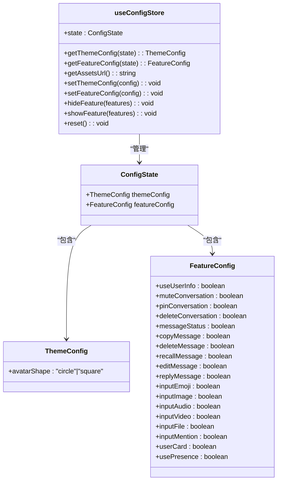
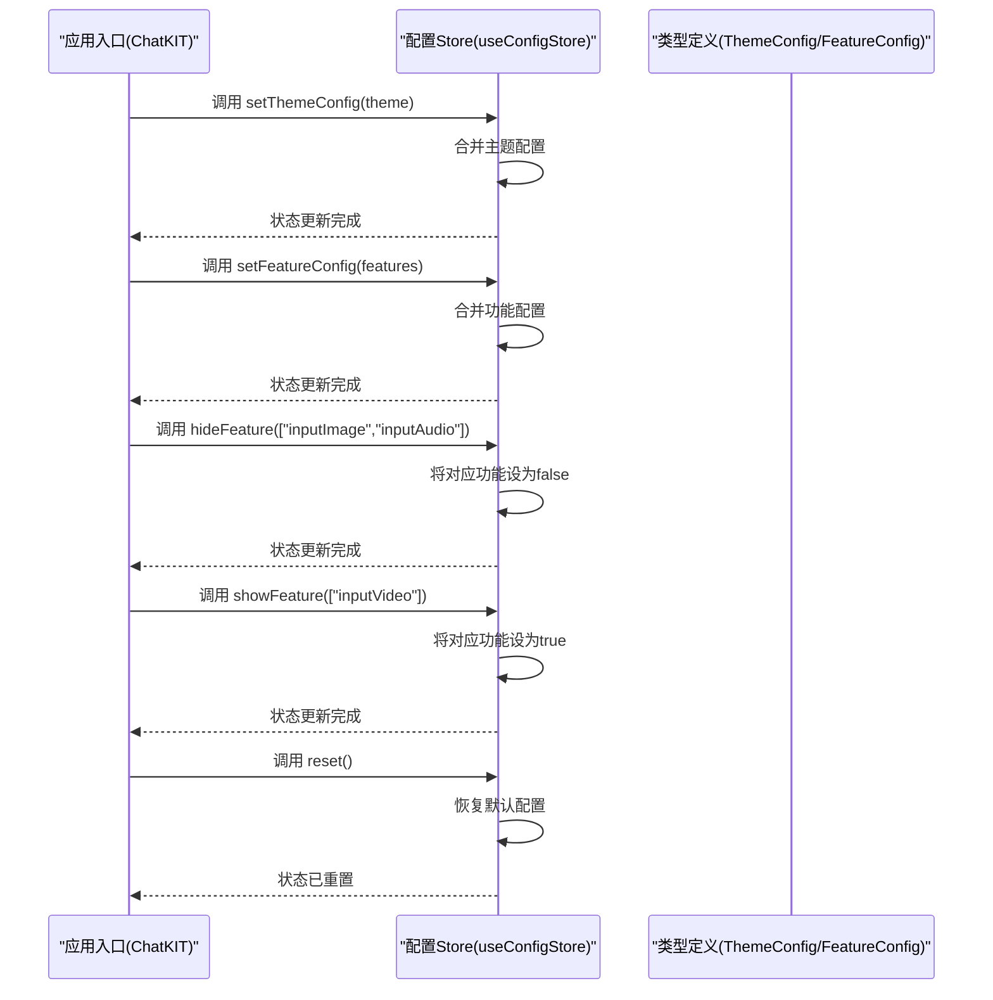
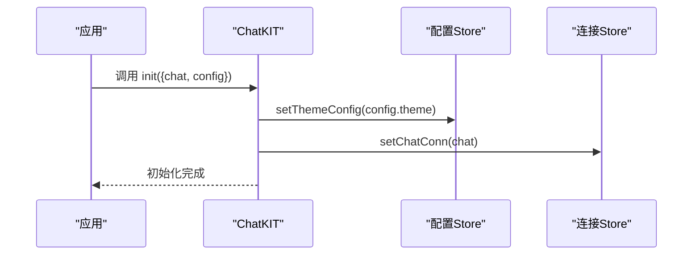
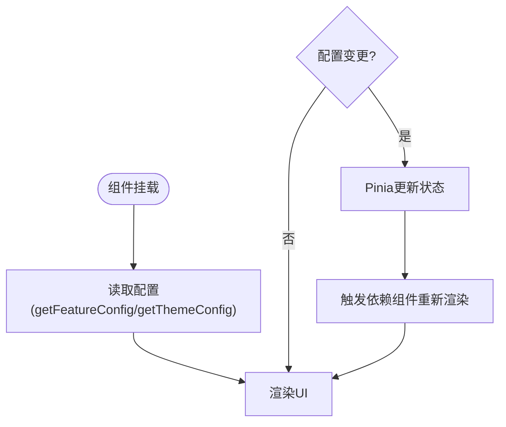
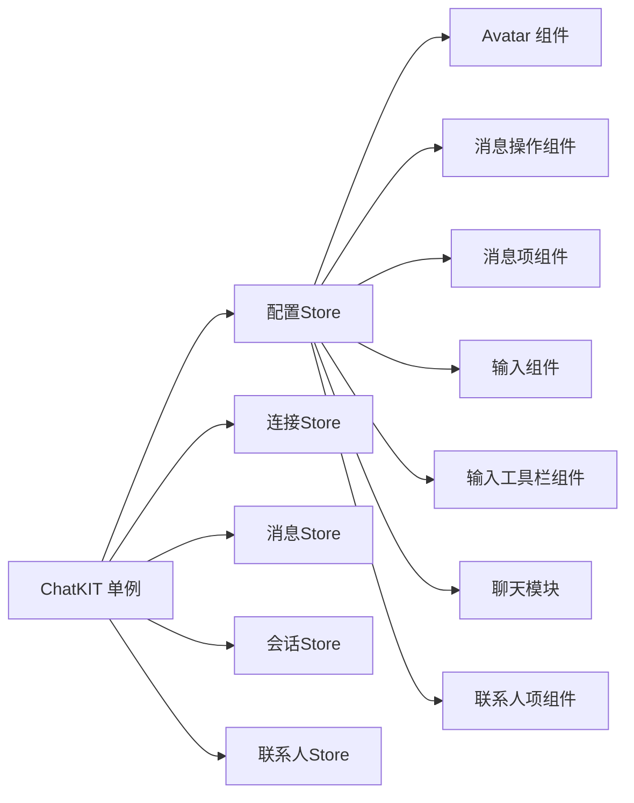
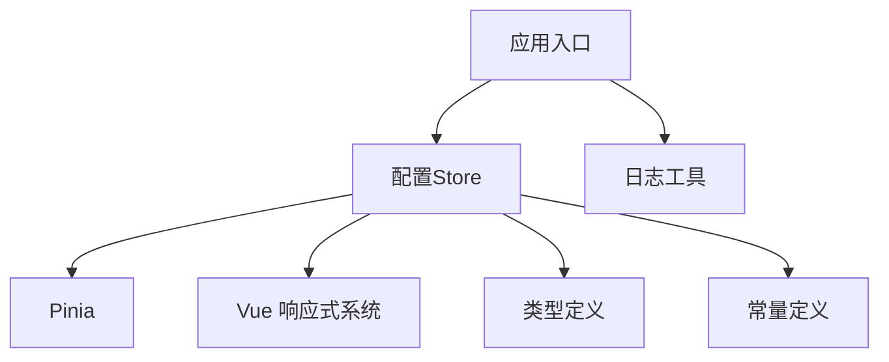

# 配置存储管理

<cite>
**本文档引用的文件**
- [ChatUIKit/stores/config.ts](file://ChatUIKit/stores/config.ts)
- [demo/ChatUIKit/stores/config.ts](file://demo/ChatUIKit/stores/config.ts)
- [ChatUIKit/configType.ts](file://ChatUIKit/configType.ts)
- [demo/ChatUIKit/configType.ts](file://demo/ChatUIKit/configType.ts)
- [ChatUIKit/index.ts](file://ChatUIKit/index.ts)
- [demo/ChatUIKit/index.ts](file://demo/ChatUIKit/index.ts)
- [ChatUIKit/stores/index.ts](file://ChatUIKit/stores/index.ts)
- [demo/ChatUIKit/stores/index.ts](file://demo/ChatUIKit/stores/index.ts)
- [ChatUIKit/const/index.ts](file://ChatUIKit/const/index.ts)
- [ChatUIKit/components/Avatar/index.vue](file://ChatUIKit/components/Avatar/index.vue)
- [ChatUIKit/modules/Chat/components/Message/messageActions.vue](file://ChatUIKit/modules/Chat/components/Message/messageActions.vue)
- [ChatUIKit/modules/Chat/components/Message/messageItem.vue](file://ChatUIKit/modules/Chat/components/Message/messageItem.vue)
- [ChatUIKit/modules/Chat/components/MessageInput/index.vue](file://ChatUIKit/modules/Chat/components/MessageInput/index.vue)
- [ChatUIKit/modules/Chat/components/MessageInputToolBar/index.vue](file://ChatUIKit/modules/Chat/components/MessageInputToolBar/index.vue)
- [ChatUIKit/modules/Chat/index.vue](file://ChatUIKit/modules/Chat/index.vue)
- [ChatUIKit/modules/ContactList/components/UserItem/index.vue](file://ChatUIKit/modules/ContactList/components/UserItem/index.vue)
</cite>

## 更新摘要
**所做更改**
- 新增了完整的配置存储系统架构分析
- 补充了主题配置、功能开关、聊天偏好和持久化设置的详细说明
- 更新了配置Store的实现细节和最佳实践
- 增强了配置持久化策略和版本管理的讨论

## 目录
1. [简介](#简介)
2. [项目结构](#项目结构)
3. [核心组件](#核心组件)
4. [架构总览](#架构总览)
5. [详细组件分析](#详细组件分析)
6. [依赖关系分析](#依赖关系分析)
7. [性能考虑](#性能考虑)
8. [故障排查指南](#故障排查指南)
9. [结论](#结论)
10. [附录](#附录)

## 简介
本文件系统性阐述配置存储管理的设计与实现，重点覆盖以下方面：
- 配置Store的状态结构、初始化、更新与同步机制
- 配置的持久化策略、缓存机制与版本管理
- 配置变更的响应式更新流程与组件重新渲染触发机制
- 配置Store与其他Store的交互关系与数据依赖
- 配置管理的最佳实践，包括配置迁移、回滚与错误处理策略

**更新** 新增了完整的配置存储系统分析，包括主题配置、功能开关、聊天偏好和持久化设置的详细实现。

## 项目结构
配置相关代码主要分布在以下位置：
- 配置Store与类型定义：ChatUIKit/stores/config.ts、ChatUIKit/configType.ts
- Demo环境下的对应文件：demo/ChatUIKit/stores/config.ts、demo/ChatUIKit/configType.ts
- 应用入口与全局单例：ChatUIKit/index.ts、demo/ChatUIKit/index.ts
- Store导出入口：ChatUIKit/stores/index.ts、demo/ChatUIKit/stores/index.ts
- 资源常量与默认值：ChatUIKit/const/index.ts
- 组件使用示例：多个Vue组件通过useConfigStore读取配置并驱动UI行为

```mermaid
graph TB
subgraph "配置层"
CFG["配置Store<br/>useConfigStore"]
TYPES["类型定义<br/>FeatureConfig/ThemeConfig"]
CONST["常量定义<br/>ASSETS_URL等"]
END
subgraph "应用层"
APP["应用入口<br/>ChatKIT 单例"]
STORES["Store导出入口<br/>stores/index.ts"]
END
subgraph "组件层"
AV["Avatar 组件"]
MSGACT["消息操作组件"]
MSGITEM["消息项组件"]
MSGINPUT["输入组件"]
MSGTOOL["输入工具栏组件"]
CHATMOD["聊天模块"]
USERITEM["联系人项组件"]
END
APP --> CFG
STORES --> CFG
TYPES --> CFG
CONST --> CFG
CFG --> AV
CFG --> MSGACT
CFG --> MSGITEM
CFG --> MSGINPUT
CFG --> MSGTOOL
CFG --> CHATMOD
CFG --> USERITEM
```

**图表来源**
- [ChatUIKit/stores/config.ts](file://ChatUIKit/stores/config.ts#L59-L123)
- [ChatUIKit/configType.ts](file://ChatUIKit/configType.ts#L3-L67)
- [ChatUIKit/const/index.ts](file://ChatUIKit/const/index.ts#L7-L8)
- [ChatUIKit/index.ts](file://ChatUIKit/index.ts#L85-L96)
- [ChatUIKit/stores/index.ts](file://ChatUIKit/stores/index.ts#L9-L16)

**章节来源**
- [ChatUIKit/stores/config.ts](file://ChatUIKit/stores/config.ts#L1-L124)
- [ChatUIKit/configType.ts](file://ChatUIKit/configType.ts#L1-L68)
- [ChatUIKit/stores/index.ts](file://ChatUIKit/stores/index.ts#L1-L31)
- [ChatUIKit/index.ts](file://ChatUIKit/index.ts#L1-L139)

## 核心组件
- 配置Store（useConfigStore）
  - 状态结构：包含主题配置themeConfig与功能配置featureConfig
  - 默认值：提供主题与功能的默认配置，确保首次加载时具备可用状态
  - 访问器：getThemeConfig、getFeatureConfig、getAssetsUrl
  - 更新器：setThemeConfig、setFeatureConfig、hideFeature、showFeature、reset
- 类型定义（FeatureConfig、ThemeConfig）
  - 功能开关：输入区、消息、消息操作、会话、其他等维度的功能开关
  - 主题开关：头像形状等外观配置
- 应用入口（ChatKIT）
  - 初始化：在init阶段设置主题配置，并注入IM连接
  - 访问器：对外暴露获取主题与功能配置的方法

**更新** 新增了完整的配置类型定义和默认配置结构说明。

**章节来源**
- [ChatUIKit/stores/config.ts](file://ChatUIKit/stores/config.ts#L14-L123)
- [ChatUIKit/configType.ts](file://ChatUIKit/configType.ts#L3-L67)
- [ChatUIKit/index.ts](file://ChatUIKit/index.ts#L85-L109)

## 架构总览
配置Store采用Pinia进行状态管理，具备如下特性：
- 响应式：基于Pinia的state与computed，自动触发依赖该状态的组件更新
- 统一管理：主题与功能配置集中在一个Store中，便于维护与扩展
- 可扩展：通过FeatureConfig/ThemeConfig的接口设计，支持未来新增配置项



**图表来源**
- [ChatUIKit/stores/config.ts](file://ChatUIKit/stores/config.ts#L14-L123)
- [ChatUIKit/configType.ts](file://ChatUIKit/configType.ts#L3-L67)

## 详细组件分析

### 配置Store实现与状态管理
- 状态初始化
  - 默认主题配置：头像形状默认为圆形
  - 默认功能配置：所有功能默认开启，便于快速上线
- 状态更新
  - setThemeConfig：合并传入的主题配置到当前状态
  - setFeatureConfig：合并传入的功能配置到当前状态
  - hideFeature/showFeature：批量隐藏或显示指定功能
  - reset：恢复默认主题与功能配置
- 访问器
  - getThemeConfig/getFeatureConfig：返回当前配置快照
  - getAssetsUrl：提供静态资源基础URL

**更新** 完善了配置Store的实现细节，包括默认配置的具体内容和更新机制。



**图表来源**
- [ChatUIKit/stores/config.ts](file://ChatUIKit/stores/config.ts#L82-L121)
- [ChatUIKit/index.ts](file://ChatUIKit/index.ts#L92-L95)

**章节来源**
- [ChatUIKit/stores/config.ts](file://ChatUIKit/stores/config.ts#L59-L123)
- [ChatUIKit/configType.ts](file://ChatUIKit/configType.ts#L3-L67)

### 配置初始化与同步机制
- 初始化流程
  - ChatKIT.init接收ChatUIKitInitParams，其中包含IM连接与配置对象
  - 在初始化阶段调用configStore.setThemeConfig设置主题配置
  - 同时设置IM连接并根据isDebug参数决定日志输出
- 同步机制
  - 由于Pinia状态为响应式，任何对state的修改都会自动触发依赖该状态的组件重新渲染
  - ChatKIT作为全局单例，提供统一的配置访问入口，避免重复初始化与状态分散

**更新** 强调了配置初始化过程中的响应式同步机制。



**图表来源**
- [ChatUIKit/index.ts](file://ChatUIKit/index.ts#L85-L96)

**章节来源**
- [ChatUIKit/index.ts](file://ChatUIKit/index.ts#L85-L109)

### 响应式更新与组件渲染
- 组件如何使用配置
  - Avatar组件：读取featureConfig与themeConfig，控制头像形状与功能可见性
  - 消息操作组件：根据featureConfig决定是否显示复制、删除、撤回、编辑、回复等操作
  - 消息项组件：根据featureConfig.messageStatus决定是否展示消息状态
  - 输入组件与工具栏：根据featureConfig决定输入区功能的可用性
  - 聊天模块与联系人项：根据usePresence与userCard等配置控制界面元素
- 渲染触发机制
  - 所有组件通过computed或直接访问store的getter读取配置
  - 当配置发生变更时，Pinia自动触发依赖该状态的组件重新计算与渲染

**更新** 新增了更多组件使用配置的具体示例和渲染机制说明。



**图表来源**
- [ChatUIKit/components/Avatar/index.vue](file://ChatUIKit/components/Avatar/index.vue#L51-L53)
- [ChatUIKit/modules/Chat/components/Message/messageActions.vue](file://ChatUIKit/modules/Chat/components/Message/messageActions.vue#L69-L93)
- [ChatUIKit/modules/Chat/components/Message/messageItem.vue](file://ChatUIKit/modules/Chat/components/Message/messageItem.vue#L100-L115)
- [ChatUIKit/modules/Chat/components/MessageInput/index.vue](file://ChatUIKit/modules/Chat/components/MessageInput/index.vue#L65-L67)
- [ChatUIKit/modules/Chat/components/MessageInputToolBar/index.vue](file://ChatUIKit/modules/Chat/components/MessageInputToolBar/index.vue#L31-L36)
- [ChatUIKit/modules/Chat/index.vue](file://ChatUIKit/modules/Chat/index.vue#L91-L114)
- [ChatUIKit/modules/ContactList/components/UserItem/index.vue](file://ChatUIKit/modules/ContactList/components/UserItem/index.vue#L43-L50)

**章节来源**
- [ChatUIKit/components/Avatar/index.vue](file://ChatUIKit/components/Avatar/index.vue#L51-L53)
- [ChatUIKit/modules/Chat/components/Message/messageActions.vue](file://ChatUIKit/modules/Chat/components/Message/messageActions.vue#L69-L93)
- [ChatUIKit/modules/Chat/components/Message/messageItem.vue](file://ChatUIKit/modules/Chat/components/Message/messageItem.vue#L100-L115)
- [ChatUIKit/modules/Chat/components/MessageInput/index.vue](file://ChatUIKit/modules/Chat/components/MessageInput/index.vue#L65-L67)
- [ChatUIKit/modules/Chat/components/MessageInputToolBar/index.vue](file://ChatUIKit/modules/Chat/components/MessageInputToolBar/index.vue#L31-L36)
- [ChatUIKit/modules/Chat/index.vue](file://ChatUIKit/modules/Chat/index.vue#L91-L114)
- [ChatUIKit/modules/ContactList/components/UserItem/index.vue](file://ChatUIKit/modules/ContactList/components/UserItem/index.vue#L43-L50)

### 配置持久化策略、缓存机制与版本管理
- 持久化策略
  - 当前实现未发现内置持久化逻辑（如本地存储或服务端同步）。若需持久化，建议在应用层通过事件监听配置变更后写入本地存储或服务端
- 缓存机制
  - Pinia内部对state具有响应式缓存；组件通过computed对store状态进行缓存，避免重复计算
- 版本管理
  - 代码未体现显式的版本字段或迁移脚本。建议引入版本号并在初始化时进行迁移校验与回滚准备

**更新** 新增了关于配置持久化、缓存机制和版本管理的详细分析。

**章节来源**
- [ChatUIKit/stores/config.ts](file://ChatUIKit/stores/config.ts#L59-L123)

### 配置Store与其他Store的交互关系
- 依赖关系
  - ChatKIT作为门面，延迟初始化各Store并提供统一访问
  - 配置Store被多个业务模块共享，如聊天、消息、联系人等
- 数据流向
  - ChatKIT.init -> configStore.setThemeConfig -> 触发组件响应式更新
  - 各业务Store通过useXxxStore按需访问，但配置Store不直接依赖其他Store



**图表来源**
- [ChatUIKit/index.ts](file://ChatUIKit/index.ts#L38-L78)
- [ChatUIKit/stores/index.ts](file://ChatUIKit/stores/index.ts#L9-L16)

**章节来源**
- [ChatUIKit/index.ts](file://ChatUIKit/index.ts#L38-L78)
- [ChatUIKit/stores/index.ts](file://ChatUIKit/stores/index.ts#L9-L16)

## 依赖关系分析
- 内部依赖
  - 配置Store依赖类型定义（FeatureConfig/ThemeConfig）与常量（ASSETS_URL）
  - 应用入口依赖Store导出入口与日志工具
- 外部依赖
  - Pinia用于状态管理
  - Vue的响应式系统（computed/ref等）用于触发组件更新

**更新** 强调了配置存储系统与外部框架的集成关系。



**图表来源**
- [ChatUIKit/stores/config.ts](file://ChatUIKit/stores/config.ts#L10-L12)
- [ChatUIKit/const/index.ts](file://ChatUIKit/const/index.ts#L7-L8)
- [ChatUIKit/index.ts](file://ChatUIKit/index.ts#L11-L12)

**章节来源**
- [ChatUIKit/stores/config.ts](file://ChatUIKit/stores/config.ts#L10-L12)
- [ChatUIKit/const/index.ts](file://ChatUIKit/const/index.ts#L7-L8)
- [ChatUIKit/index.ts](file://ChatUIKit/index.ts#L11-L12)

## 性能考虑
- 响应式粒度
  - 将主题与功能配置拆分为独立字段，可减少不必要的组件重渲染
- 计算属性缓存
  - 组件内使用computed读取store状态，避免重复计算
- 批量更新
  - hideFeature/showFeature支持批量更新，减少多次调用带来的开销
- 初始化时机
  - ChatKIT采用延迟初始化，避免在应用启动早期创建大量Store实例

**更新** 新增了配置存储系统的性能优化建议。

## 故障排查指南
- 配置未生效
  - 检查是否在ChatKIT.init之后调用了setThemeConfig/setFeatureConfig
  - 确认组件是否正确读取getFeatureConfig/getThemeConfig
- 功能按钮不可见
  - 检查对应功能开关（如inputImage、messageStatus等）是否被hideFeature关闭
- 头像形状异常
  - 检查themeConfig.avatarShape是否被setThemeConfig正确设置
- 调试模式
  - 通过ChatUIKitInitParams.config.isDebug控制日志输出

**更新** 完善了故障排查指南，增加了配置相关的常见问题。

**章节来源**
- [ChatUIKit/index.ts](file://ChatUIKit/index.ts#L85-L109)
- [ChatUIKit/stores/config.ts](file://ChatUIKit/stores/config.ts#L82-L121)

## 结论
配置存储管理通过Pinia实现了清晰的状态结构与响应式更新机制，配合统一的类型定义与应用入口，为多模块共享配置提供了稳定基础。建议在现有基础上补充持久化、版本管理与迁移回滚能力，以满足生产环境的长期演进需求。

**更新** 强调了配置存储系统在整体架构中的重要性和未来发展方向。

## 附录
- 最佳实践清单
  - 持久化：在应用层监听配置变更事件，将关键配置写入本地存储或服务端
  - 版本管理：引入配置版本号，在初始化时执行迁移与回滚
  - 错误处理：对配置更新进行边界检查，防止非法值导致的渲染异常
  - 测试：为每个功能开关编写单元测试，确保在不同组合下行为一致

**更新** 新增了配置存储系统的最佳实践建议，包括持久化、版本管理和错误处理策略。