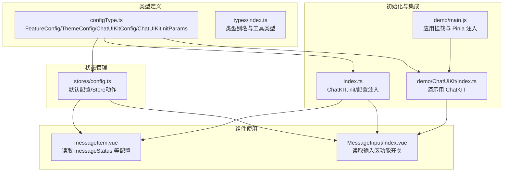
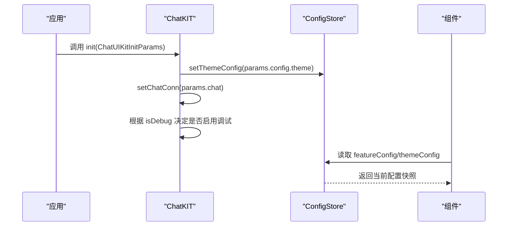
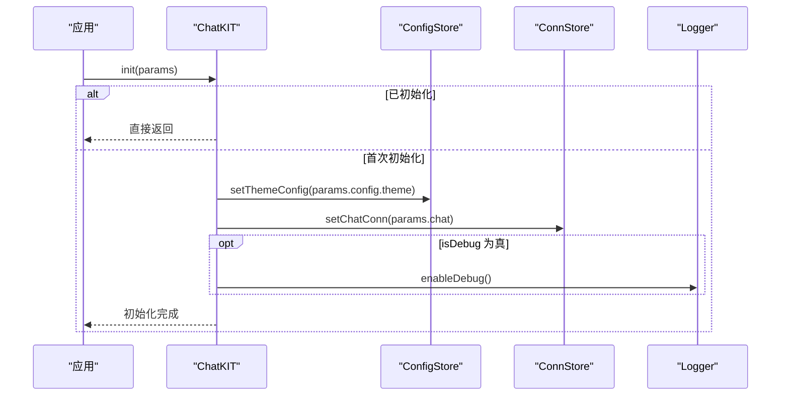
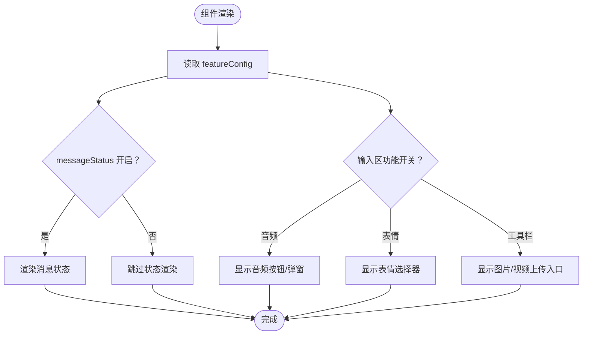
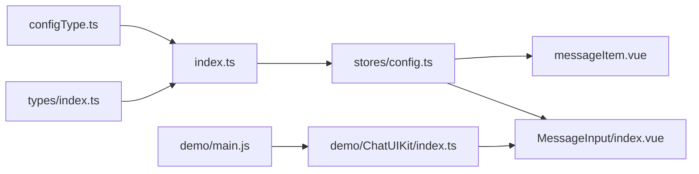

# 配置类型定义

<cite>
**本文档引用的文件**
- [ChatUIKit/configType.ts](file://ChatUIKit/configType.ts)
- [ChatUIKit/stores/config.ts](file://ChatUIKit/stores/config.ts)
- [ChatUIKit/index.ts](file://ChatUIKit/index.ts)
- [ChatUIKit/modules/Chat/components/Message/messageItem.vue](file://ChatUIKit/modules/Chat/components/Message/messageItem.vue)
- [ChatUIKit/modules/Chat/components/MessageInput/index.vue](file://ChatUIKit/modules/Chat/components/MessageInput/index.vue)
- [ChatUIKit/types/index.ts](file://ChatUIKit/types/index.ts)
- [demo/ChatUIKit/configType.ts](file://demo/ChatUIKit/configType.ts)
- [demo/ChatUIKit/index.ts](file://demo/ChatUIKit/index.ts)
- [demo/main.js](file://demo/main.js)
</cite>

## 目录
1. [简介](#简介)
2. [项目结构](#项目结构)
3. [核心组件](#核心组件)
4. [架构总览](#架构总览)
5. [详细组件分析](#详细组件分析)
6. [依赖分析](#依赖分析)
7. [性能考虑](#性能考虑)
8. [故障排除指南](#故障排除指南)
9. [结论](#结论)

## 简介
本文件系统性地解析了 ChatUIKit 的配置类型定义与使用方式，重点覆盖以下接口：
- FeatureConfig：功能开关配置
- ThemeConfig：主题样式配置
- ChatUIKitConfig：整体配置对象（features + theme）
- ChatUIKitInitParams：初始化参数（包含 IM 连接实例与初始化配置）

文档将逐项说明各字段的含义、默认值、取值范围、类型安全与验证规则，并给出扩展点与自定义实现建议。

## 项目结构
配置类型定义主要分布在以下位置：
- 类型定义：ChatUIKit/configType.ts、demo/ChatUIKit/configType.ts
- 默认配置与状态管理：ChatUIKit/stores/config.ts
- 初始化入口与集成：ChatUIKit/index.ts、demo/ChatUIKit/index.ts、demo/main.js
- 组件层使用示例：ChatUIKit/modules/Chat/components/Message/messageItem.vue、ChatUIKit/modules/Chat/components/MessageInput/index.vue
- 类型辅助：ChatUIKit/types/index.ts



图表来源
- [ChatUIKit/configType.ts](file://ChatUIKit/configType.ts#L1-L68)
- [ChatUIKit/stores/config.ts](file://ChatUIKit/stores/config.ts#L1-L124)
- [ChatUIKit/index.ts](file://ChatUIKit/index.ts#L1-L139)
- [demo/ChatUIKit/index.ts](file://demo/ChatUIKit/index.ts#L1-L138)
- [demo/main.js](file://demo/main.js#L1-L28)
- [ChatUIKit/modules/Chat/components/Message/messageItem.vue](file://ChatUIKit/modules/Chat/components/Message/messageItem.vue#L1-L200)
- [ChatUIKit/modules/Chat/components/MessageInput/index.vue](file://ChatUIKit/modules/Chat/components/MessageInput/index.vue#L1-L200)

章节来源
- [ChatUIKit/configType.ts](file://ChatUIKit/configType.ts#L1-L68)
- [ChatUIKit/stores/config.ts](file://ChatUIKit/stores/config.ts#L1-L124)
- [ChatUIKit/index.ts](file://ChatUIKit/index.ts#L1-L139)
- [demo/ChatUIKit/index.ts](file://demo/ChatUIKit/index.ts#L1-L138)
- [demo/main.js](file://demo/main.js#L1-L28)
- [ChatUIKit/modules/Chat/components/Message/messageItem.vue](file://ChatUIKit/modules/Chat/components/Message/messageItem.vue#L1-L200)
- [ChatUIKit/modules/Chat/components/MessageInput/index.vue](file://ChatUIKit/modules/Chat/components/MessageInput/index.vue#L1-L200)

## 核心组件
本节对四个核心配置接口进行逐项解析，包括字段语义、默认值、取值范围与类型安全要点。

- FeatureConfig（功能开关配置）
  - 字段概览与语义
    - useUserInfo：是否使用 SDK 用户信息
    - muteConversation：是否启用会话免打扰
    - pinConversation：是否开启会话置顶
    - deleteConversation：是否允许删除会话
    - messageStatus：是否展示消息状态
    - copyMessage：是否允许复制消息
    - deleteMessage：是否允许删除消息
    - recallMessage：是否允许撤回消息
    - editMessage：是否允许编辑消息
    - replyMessage：是否允许回复消息
    - inputEmoji：是否允许发送表情
    - inputImage：是否允许发送图片
    - inputAudio：是否允许发送语音
    - inputVideo：是否允许发送视频
    - inputFile：是否允许发送文件（当前支持 H5 与小程序）
    - inputMention：是否允许发送 @ 提及
    - userCard：是否允许发送名片消息
    - usePresence：是否启用 Presence 能力
  - 默认值
    - 在状态管理中提供了完整默认集，包含所有布尔开关与调试标志位
  - 取值范围
    - 布尔类型；未显式赋值时为可选
  - 类型安全
    - 通过 Partial<FeatureConfig> 支持部分更新；hideFeature/showFeature 以键名数组进行批量控制
  - 章节来源
    - [ChatUIKit/configType.ts](file://ChatUIKit/configType.ts#L3-L40)
    - [ChatUIKit/stores/config.ts](file://ChatUIKit/stores/config.ts#L24-L57)

- ThemeConfig（主题配置）
  - 字段概览与语义
    - avatarShape：头像形状，取值限定为 "circle" 或 "square"
  - 默认值
    - 默认头像形状为 "circle"
  - 取值范围
    - 严格字面量联合类型："circle" | "square"
  - 类型安全
    - 通过字面量联合类型确保取值正确
  - 章节来源
    - [ChatUIKit/configType.ts](file://ChatUIKit/configType.ts#L42-L45)
    - [ChatUIKit/stores/config.ts](file://ChatUIKit/stores/config.ts#L20-L22)

- ChatUIKitConfig（整体配置）
  - 字段概览与语义
    - features：功能开关集合
    - theme：主题样式集合
  - 默认值
    - 无内置默认值；由上层传入或通过 Store 设置
  - 取值范围
    - features 为 FeatureConfig；theme 为 ThemeConfig
  - 类型安全
    - 作为组合对象，确保 features 与 theme 的类型一致性
  - 章节来源
    - [ChatUIKit/configType.ts](file://ChatUIKit/configType.ts#L47-L53)

- ChatUIKitInitParams（初始化参数）
  - 字段概览与语义
    - chat：IM SDK 连接实例（Chat.Connection）
    - config：初始化配置对象
      - theme：主题配置（ThemeConfig）
      - isDebug：是否开启调试模式（boolean）
  - 默认值
    - 无内置默认值；需由调用方提供
  - 取值范围
    - theme 为 ThemeConfig；isDebug 为布尔
  - 类型安全
    - 通过接口约束确保传入参数结构正确
  - 章节来源
    - [ChatUIKit/configType.ts](file://ChatUIKit/configType.ts#L55-L65)

## 架构总览
配置从类型定义到运行时生效的流程如下：



图表来源
- [ChatUIKit/index.ts](file://ChatUIKit/index.ts#L84-L96)
- [ChatUIKit/stores/config.ts](file://ChatUIKit/stores/config.ts#L82-L95)
- [ChatUIKit/modules/Chat/components/Message/messageItem.vue](file://ChatUIKit/modules/Chat/components/Message/messageItem.vue#L116-L116)
- [ChatUIKit/modules/Chat/components/MessageInput/index.vue](file://ChatUIKit/modules/Chat/components/MessageInput/index.vue#L68-L68)

## 详细组件分析

### FeatureConfig 与 ThemeConfig 的嵌套关系与继承机制
- 嵌套关系
  - ChatUIKitConfig 含 features 与 theme 两个子配置对象
  - ChatUIKitInitParams.config 含 theme 与 isDebug
- 继承机制
  - TypeScript 接口本身不支持类式继承；通过 Partial 与组合实现“可选覆盖”
  - 默认配置来源于 stores/config.ts 中的默认对象，组件通过 computed 读取 Store 状态
- 类图示意

```mermaid
classDiagram
class FeatureConfig {
+useUserInfo? : boolean
+muteConversation? : boolean
+pinConversation? : boolean
+deleteConversation? : boolean
+messageStatus? : boolean
+copyMessage? : boolean
+deleteMessage? : boolean
+recallMessage? : boolean
+editMessage? : boolean
+replyMessage? : boolean
+inputEmoji? : boolean
+inputImage? : boolean
+inputAudio? : boolean
+inputVideo? : boolean
+inputFile? : boolean
+inputMention? : boolean
+userCard? : boolean
+usePresence? : boolean
}
class ThemeConfig {
+avatarShape? : "circle"|"square"
}
class ChatUIKitConfig {
+features : FeatureConfig
+theme : ThemeConfig
}
class ChatUIKitInitParams {
+chat : Chat.Connection
+config : {
+theme : ThemeConfig
+isDebug : boolean
}
}
ChatUIKitConfig --> FeatureConfig : "包含"
ChatUIKitConfig --> ThemeConfig : "包含"
ChatUIKitInitParams --> ThemeConfig : "包含"
```

图表来源
- [ChatUIKit/configType.ts](file://ChatUIKit/configType.ts#L3-L65)

章节来源
- [ChatUIKit/configType.ts](file://ChatUIKit/configType.ts#L3-L65)
- [ChatUIKit/stores/config.ts](file://ChatUIKit/stores/config.ts#L14-L57)

### 初始化流程与配置注入
- 初始化步骤
  - ChatKIT.init 接收 ChatUIKitInitParams
  - 将 params.config.theme 注入到 ConfigStore.themeConfig
  - 将 params.chat 注入到连接 Store
  - 根据 isDebug 决定是否启用调试日志
- 关键行为
  - 防重复初始化：若已存在连接实例则直接返回
  - 全局 Pinia 管理：确保 Store 在首次访问前完成初始化



图表来源
- [ChatUIKit/index.ts](file://ChatUIKit/index.ts#L84-L96)

章节来源
- [ChatUIKit/index.ts](file://ChatUIKit/index.ts#L84-L96)

### 组件层配置读取与条件渲染
- messageItem.vue
  - 通过 computed 读取 messageStatus 开关并决定是否渲染消息状态组件
- MessageInput/index.vue
  - 通过 computed 读取输入区功能开关，控制音频、表情、工具栏等 UI 的显示与交互
- 读取路径
  - 组件通过 useConfigStore 访问 featureConfig/themeConfig
  - Store 提供 getFeatureConfig/getThemeConfig getter



图表来源
- [ChatUIKit/modules/Chat/components/Message/messageItem.vue](file://ChatUIKit/modules/Chat/components/Message/messageItem.vue#L37-L40)
- [ChatUIKit/modules/Chat/components/MessageInput/index.vue](file://ChatUIKit/modules/Chat/components/MessageInput/index.vue#L5-L39)
- [ChatUIKit/stores/config.ts](file://ChatUIKit/stores/config.ts#L65-L80)

章节来源
- [ChatUIKit/modules/Chat/components/Message/messageItem.vue](file://ChatUIKit/modules/Chat/components/Message/messageItem.vue#L116-L116)
- [ChatUIKit/modules/Chat/components/MessageInput/index.vue](file://ChatUIKit/modules/Chat/components/MessageInput/index.vue#L68-L68)
- [ChatUIKit/stores/config.ts](file://ChatUIKit/stores/config.ts#L65-L80)

### 类型安全与验证规则
- 字段类型
  - 所有功能开关均为布尔可选字段，便于按需覆盖
  - avatarShape 为字面量联合类型，编译期强制校验
- 更新策略
  - 部分更新：setFeatureConfig/setThemeConfig 使用 Partial<T>，仅合并提供的字段
  - 批量控制：hideFeature/showFeature 通过键名数组批量设置为 false/true
- 默认值策略
  - stores/config.ts 提供完整默认集，避免运行时缺省导致的分支逻辑
- 验证建议
  - 在业务层对传入的 ChatUIKitInitParams 进行结构校验（如使用 Zod/Swagger 校验）
  - 对外部传入的 ThemeConfig.avatarShape 进行白名单校验

章节来源
- [ChatUIKit/configType.ts](file://ChatUIKit/configType.ts#L3-L65)
- [ChatUIKit/stores/config.ts](file://ChatUIKit/stores/config.ts#L14-L124)

### 扩展点与自定义实现
- 自定义功能开关
  - 在 FeatureConfig 上新增布尔字段后，通过 setFeatureConfig 动态启用/禁用
  - 若涉及 UI 层，需在对应组件中添加条件渲染逻辑
- 自定义主题
  - 在 ThemeConfig 新增样式相关字段（如颜色、尺寸），并在组件层消费
  - 通过 setThemeConfig 应用新主题
- 初始化扩展
  - 在 ChatKIT.init 前后增加业务钩子（如鉴权、埋点）
  - 通过 ChatUIKitInitParams.config.isDebug 控制调试输出
- 与 Pinia 的集成
  - demo/main.js 展示了如何将 ChatKIT 创建的 Pinia 实例注入到应用，确保全局状态一致

章节来源
- [ChatUIKit/stores/config.ts](file://ChatUIKit/stores/config.ts#L82-L121)
- [ChatUIKit/index.ts](file://ChatUIKit/index.ts#L84-L96)
- [demo/main.js](file://demo/main.js#L19-L27)

## 依赖分析
- 类型依赖
  - ChatUIKit/configType.ts 定义 FeatureConfig/ThemeConfig/ChatUIKitConfig/ChatUIKitInitParams
  - ChatUIKit/types/index.ts 提供与 SDK 相关的类型别名（如 Chat.Connection）
- 运行时依赖
  - ChatKIT 依赖 Pinia 状态管理（stores/config.ts）
  - 组件层依赖 ConfigStore 的 getter 与 setter
- 外部依赖
  - demo/main.js 通过 ChatKIT.getPinia 将全局 Pinia 注入应用



图表来源
- [ChatUIKit/configType.ts](file://ChatUIKit/configType.ts#L1-L68)
- [ChatUIKit/types/index.ts](file://ChatUIKit/types/index.ts#L1-L100)
- [ChatUIKit/index.ts](file://ChatUIKit/index.ts#L1-L139)
- [ChatUIKit/stores/config.ts](file://ChatUIKit/stores/config.ts#L1-L124)
- [ChatUIKit/modules/Chat/components/Message/messageItem.vue](file://ChatUIKit/modules/Chat/components/Message/messageItem.vue#L1-L200)
- [ChatUIKit/modules/Chat/components/MessageInput/index.vue](file://ChatUIKit/modules/Chat/components/MessageInput/index.vue#L1-L200)
- [demo/ChatUIKit/index.ts](file://demo/ChatUIKit/index.ts#L1-L138)
- [demo/main.js](file://demo/main.js#L1-L28)

章节来源
- [ChatUIKit/configType.ts](file://ChatUIKit/configType.ts#L1-L68)
- [ChatUIKit/types/index.ts](file://ChatUIKit/types/index.ts#L1-L100)
- [ChatUIKit/index.ts](file://ChatUIKit/index.ts#L1-L139)
- [ChatUIKit/stores/config.ts](file://ChatUIKit/stores/config.ts#L1-L124)
- [demo/ChatUIKit/index.ts](file://demo/ChatUIKit/index.ts#L1-L138)
- [demo/main.js](file://demo/main.js#L1-L28)

## 性能考虑
- 配置读取
  - 通过 computed 读取 Store 状态，避免不必要的重复计算
- 配置更新
  - 使用 Partial 合并减少全量替换开销
- 渲染优化
  - 条件渲染（v-if）仅在功能开启时加载对应 UI，降低 DOM 与事件绑定成本
- 初始化
  - 防重复初始化避免重复注入连接与日志

## 故障排除指南
- 症状：消息状态未显示
  - 检查 ConfigStore.featureConfig.messageStatus 是否为 true
  - 章节来源
    - [ChatUIKit/modules/Chat/components/Message/messageItem.vue](file://ChatUIKit/modules/Chat/components/Message/messageItem.vue#L37-L40)
    - [ChatUIKit/stores/config.ts](file://ChatUIKit/stores/config.ts#L40-L40)

- 症状：输入区缺少音频/表情按钮
  - 检查 FeatureConfig 对应开关（inputAudio/inputEmoji）
  - 章节来源
    - [ChatUIKit/modules/Chat/components/MessageInput/index.vue](file://ChatUIKit/modules/Chat/components/MessageInput/index.vue#L5-L39)
    - [ChatUIKit/stores/config.ts](file://ChatUIKit/stores/config.ts#L27-L34)

- 症状：头像形状不符合预期
  - 检查 ThemeConfig.avatarShape 是否被 setThemeConfig 覆盖
  - 章节来源
    - [ChatUIKit/stores/config.ts](file://ChatUIKit/stores/config.ts#L20-L22)

- 症状：初始化失败或重复初始化
  - 确认 ChatKIT.init 仅调用一次，且传入的 chat 与 config 结构正确
  - 章节来源
    - [ChatUIKit/index.ts](file://ChatUIKit/index.ts#L84-L96)

## 结论
本文档系统梳理了 ChatUIKit 的配置类型定义与运行时使用方式，明确了 FeatureConfig、ThemeConfig、ChatUIKitConfig、ChatUIKitInitParams 的职责边界、默认值与取值范围，并通过 Store 与组件层的交互展示了配置的注入与消费过程。遵循本文档的类型安全与扩展建议，可在不破坏现有结构的前提下灵活定制功能与主题。