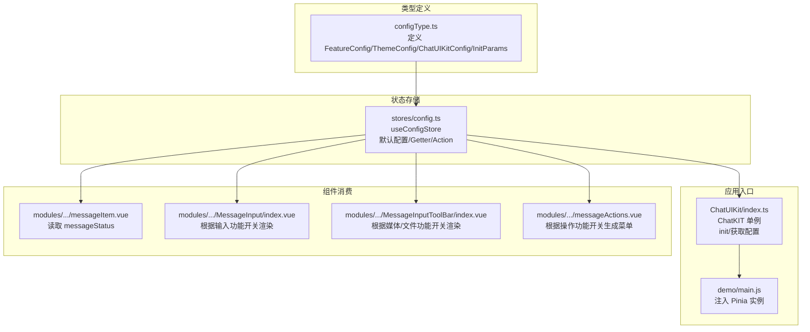
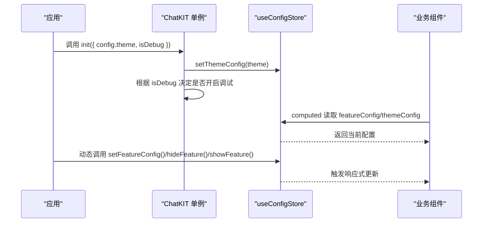
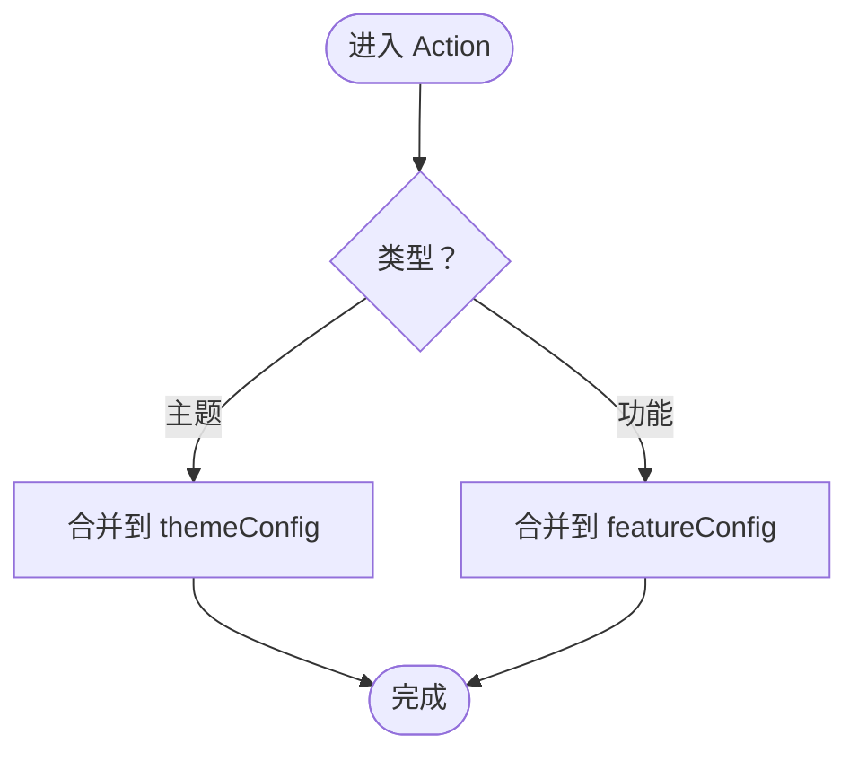
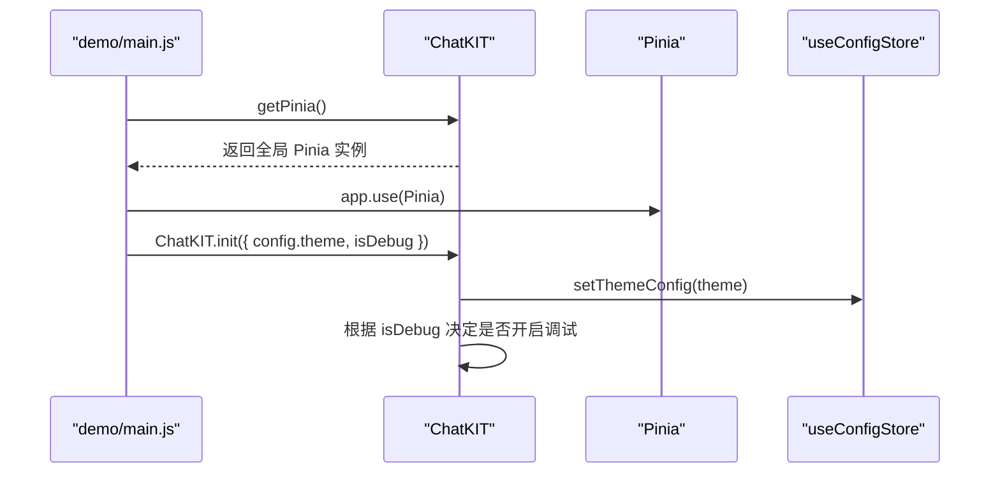
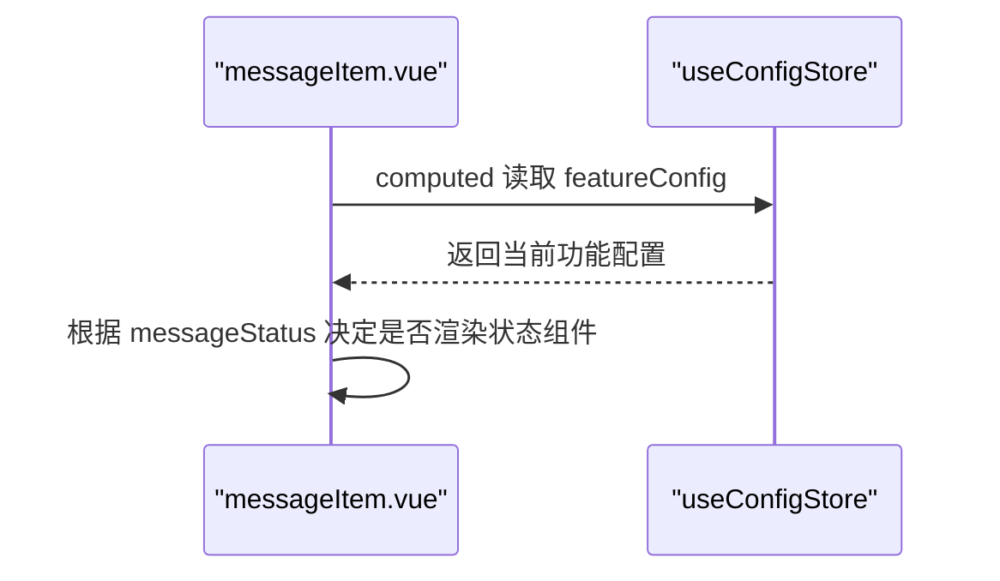
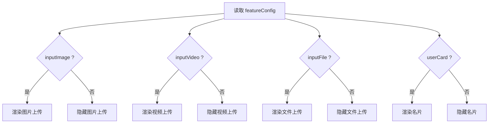
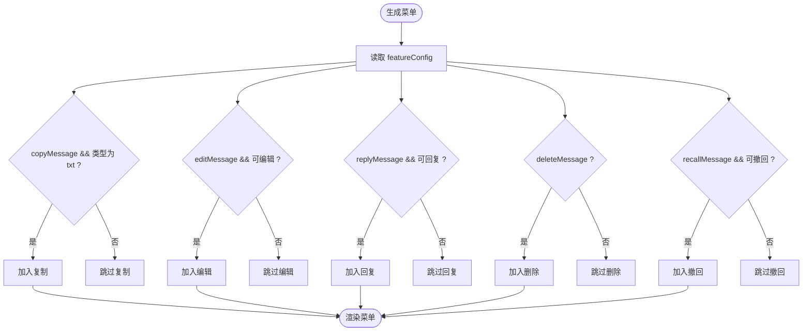
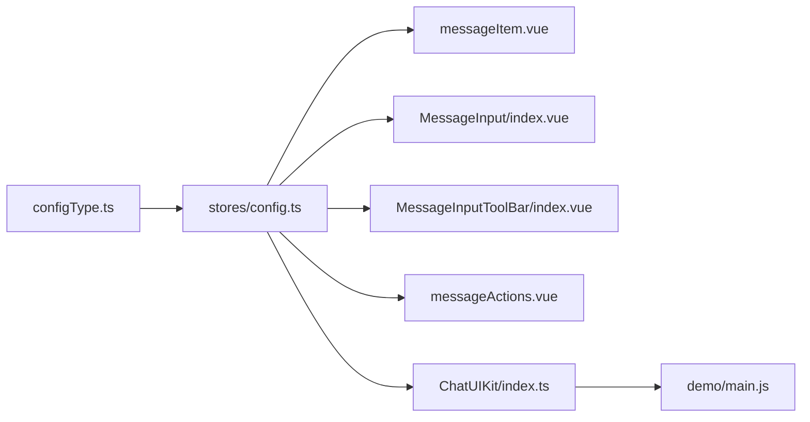

# 配置系统

<cite>
**本文引用的文件**
- [ChatUIKit/configType.ts](file://ChatUIKit/configType.ts)
- [ChatUIKit/stores/config.ts](file://ChatUIKit/stores/config.ts)
- [ChatUIKit/index.ts](file://ChatUIKit/index.ts)
- [ChatUIKit/modules/Chat/components/Message/messageItem.vue](file://ChatUIKit/modules/Chat/components/Message/messageItem.vue)
- [ChatUIKit/modules/Chat/components/MessageInput/index.vue](file://ChatUIKit/modules/Chat/components/MessageInput/index.vue)
- [ChatUIKit/modules/Chat/components/MessageInputToolBar/index.vue](file://ChatUIKit/modules/Chat/components/MessageInputToolBar/index.vue)
- [ChatUIKit/modules/Chat/components/Message/messageActions.vue](file://ChatUIKit/modules/Chat/components/Message/messageActions.vue)
- [demo/main.js](file://demo/main.js)
- [demo/pages/ServerConfig/index.vue](file://demo/pages/ServerConfig/index.vue)
</cite>

## 目录
1. [简介](#简介)
2. [项目结构](#项目结构)
3. [核心组件](#核心组件)
4. [架构总览](#架构总览)
5. [详细组件分析](#详细组件分析)
6. [依赖分析](#依赖分析)
7. [性能考虑](#性能考虑)
8. [故障排查指南](#故障排查指南)
9. [结论](#结论)
10. [附录](#附录)

## 简介
本文件系统性地文档化 EaseMob UIKit 的配置系统，涵盖配置类型定义、主题配置选项、功能配置机制与运行时行为控制。重点解释如何通过配置系统实现主题定制、功能开关与行为调整，并提供配置优先级、继承与覆盖规则说明，以及动态配置更新的最佳实践与注意事项。

## 项目结构
配置系统围绕“类型定义 + 状态存储 + 组件消费”的三层结构组织：
- 类型层：定义 FeatureConfig、ThemeConfig、ChatUIKitConfig 及初始化参数
- 存储层：使用 Pinia 管理主题与功能配置的状态、默认值与变更动作
- 组件层：在各业务组件中读取配置，决定渲染与交互行为



图表来源
- [ChatUIKit/configType.ts](file://ChatUIKit/configType.ts#L3-L67)
- [ChatUIKit/stores/config.ts](file://ChatUIKit/stores/config.ts#L14-L123)
- [ChatUIKit/index.ts](file://ChatUIKit/index.ts#L18-L132)
- [demo/main.js](file://demo/main.js#L14-L27)
- [ChatUIKit/modules/Chat/components/Message/messageItem.vue](file://ChatUIKit/modules/Chat/components/Message/messageItem.vue#L116-L116)
- [ChatUIKit/modules/Chat/components/MessageInput/index.vue](file://ChatUIKit/modules/Chat/components/MessageInput/index.vue#L5-L72)
- [ChatUIKit/modules/Chat/components/MessageInputToolBar/index.vue](file://ChatUIKit/modules/Chat/components/MessageInputToolBar/index.vue#L6-L23)
- [ChatUIKit/modules/Chat/components/Message/messageActions.vue](file://ChatUIKit/modules/Chat/components/Message/messageActions.vue#L94-L139)

章节来源
- [ChatUIKit/configType.ts](file://ChatUIKit/configType.ts#L3-L67)
- [ChatUIKit/stores/config.ts](file://ChatUIKit/stores/config.ts#L14-L123)
- [ChatUIKit/index.ts](file://ChatUIKit/index.ts#L18-L132)
- [demo/main.js](file://demo/main.js#L14-L27)

## 核心组件
- 配置类型定义：集中于 configType.ts，明确主题与功能两大类配置项及其含义
- 配置存储：stores/config.ts 提供默认配置、Getter 与 Action，支持主题与功能配置的动态更新
- 应用初始化：ChatUIKit/index.ts 在初始化阶段写入主题配置，并提供对外查询接口
- 组件消费：多处组件通过 computed 读取配置，决定 UI 渲染与交互能力

章节来源
- [ChatUIKit/configType.ts](file://ChatUIKit/configType.ts#L3-L67)
- [ChatUIKit/stores/config.ts](file://ChatUIKit/stores/config.ts#L14-L123)
- [ChatUIKit/index.ts](file://ChatUIKit/index.ts#L85-L109)

## 架构总览
配置系统采用“单例 + Pinia Store”的组合方式：
- ChatKIT 单例负责生命周期与全局状态接入
- useConfigStore 统一管理主题与功能配置，提供 setThemeConfig、setFeatureConfig、hideFeature、showFeature、reset 等动作
- 组件通过 computed 读取配置，实现响应式更新



图表来源
- [ChatUIKit/index.ts](file://ChatUIKit/index.ts#L85-L96)
- [ChatUIKit/stores/config.ts](file://ChatUIKit/stores/config.ts#L82-L121)
- [ChatUIKit/modules/Chat/components/MessageInput/index.vue](file://ChatUIKit/modules/Chat/components/MessageInput/index.vue#L68-L68)

章节来源
- [ChatUIKit/index.ts](file://ChatUIKit/index.ts#L85-L109)
- [ChatUIKit/stores/config.ts](file://ChatUIKit/stores/config.ts#L59-L123)

## 详细组件分析

### 配置类型定义
- FeatureConfig：定义输入区、消息、消息操作、会话、其他等维度的功能开关
- ThemeConfig：定义主题维度的配置项（如头像形状）
- ChatUIKitConfig：组合 features 与 theme
- ChatUIKitInitParams：初始化参数，包含 IM 连接实例、主题配置与调试开关

```mermaid
classDiagram
class FeatureConfig {
+useUserInfo : boolean
+muteConversation : boolean
+pinConversation : boolean
+deleteConversation : boolean
+messageStatus : boolean
+copyMessage : boolean
+deleteMessage : boolean
+recallMessage : boolean
+editMessage : boolean
+replyMessage : boolean
+inputEmoji : boolean
+inputImage : boolean
+inputAudio : boolean
+inputVideo : boolean
+inputFile : boolean
+inputMention : boolean
+userCard : boolean
+usePresence : boolean
}
class ThemeConfig {
+avatarShape : "circle"|"square"
}
class ChatUIKitConfig {
+features : FeatureConfig
+theme : ThemeConfig
}
class ChatUIKitInitParams {
+chat : Chat.Connection
+config : { theme : ThemeConfig, isDebug : boolean }
}
ChatUIKitConfig --> FeatureConfig : "包含"
ChatUIKitConfig --> ThemeConfig : "包含"
ChatUIKitInitParams --> ThemeConfig : "包含"
```

图表来源
- [ChatUIKit/configType.ts](file://ChatUIKit/configType.ts#L3-L67)

章节来源
- [ChatUIKit/configType.ts](file://ChatUIKit/configType.ts#L3-L67)

### 配置存储与默认值
- 默认主题配置：头像形状默认为圆形
- 默认功能配置：所有功能默认开启
- Getter：提供主题与功能配置的只读访问
- Actions：
  - setThemeConfig：合并传入的主题配置
  - setFeatureConfig：合并传入的功能配置
  - hideFeature/showFeature：批量显隐指定功能
  - reset：恢复默认配置



图表来源
- [ChatUIKit/stores/config.ts](file://ChatUIKit/stores/config.ts#L82-L121)

章节来源
- [ChatUIKit/stores/config.ts](file://ChatUIKit/stores/config.ts#L14-L123)

### 初始化与全局 Pinia 注入
- ChatKIT.init 在初始化时写入主题配置，并根据 isDebug 开启调试日志
- demo/main.js 将 ChatKIT 中的 Pinia 实例注入到应用，保证全局状态一致性



图表来源
- [ChatUIKit/index.ts](file://ChatUIKit/index.ts#L127-L131)
- [demo/main.js](file://demo/main.js#L14-L27)

章节来源
- [ChatUIKit/index.ts](file://ChatUIKit/index.ts#L85-L96)
- [demo/main.js](file://demo/main.js#L14-L27)

### 组件消费配置的典型场景

#### 场景一：消息状态显示
- 组件从配置中读取 messageStatus 开关，决定是否渲染消息状态组件
- 该开关来自全局功能配置，组件通过 computed 响应式读取



图表来源
- [ChatUIKit/modules/Chat/components/Message/messageItem.vue](file://ChatUIKit/modules/Chat/components/Message/messageItem.vue#L116-L116)
- [ChatUIKit/stores/config.ts](file://ChatUIKit/stores/config.ts#L65-L74)

章节来源
- [ChatUIKit/modules/Chat/components/Message/messageItem.vue](file://ChatUIKit/modules/Chat/components/Message/messageItem.vue#L116-L116)

#### 场景二：输入工具栏与媒体上传
- 输入工具栏根据功能配置决定是否渲染图片/视频/文件/名片等按钮
- 文件上传仅在 H5 或微信小程序平台生效



图表来源
- [ChatUIKit/modules/Chat/components/MessageInputToolBar/index.vue](file://ChatUIKit/modules/Chat/components/MessageInputToolBar/index.vue#L6-L23)
- [ChatUIKit/modules/Chat/components/MessageInput/index.vue](file://ChatUIKit/modules/Chat/components/MessageInput/index.vue#L5-L72)

章节来源
- [ChatUIKit/modules/Chat/components/MessageInputToolBar/index.vue](file://ChatUIKit/modules/Chat/components/MessageInputToolBar/index.vue#L6-L23)
- [ChatUIKit/modules/Chat/components/MessageInput/index.vue](file://ChatUIKit/modules/Chat/components/MessageInput/index.vue#L5-L72)

#### 场景三：消息操作菜单
- 根据消息类型、状态与功能配置动态生成复制、编辑、回复、删除、撤回等菜单项
- 菜单项的可用性由配置与业务条件共同决定



图表来源
- [ChatUIKit/modules/Chat/components/Message/messageActions.vue](file://ChatUIKit/modules/Chat/components/Message/messageActions.vue#L78-L144)

章节来源
- [ChatUIKit/modules/Chat/components/Message/messageActions.vue](file://ChatUIKit/modules/Chat/components/Message/messageActions.vue#L78-L144)

### 配置优先级、继承与覆盖规则
- 优先级顺序（从高到低）：
  1) 运行时通过 setFeatureConfig/setThemeConfig 动态覆盖
  2) 初始化时 ChatKIT.init 写入的主题配置
  3) 默认配置（默认主题与默认功能）
- 继承与覆盖：
  - setFeatureConfig/setThemeConfig 采用浅合并策略，仅覆盖传入字段
  - hideFeature/showFeature 以布尔值精确控制单项功能
  - reset 将主题与功能配置恢复到默认值
- 行为调整：
  - 通过切换功能开关即可即时影响 UI 渲染与交互
  - 主题配置（如头像形状）影响组件外观

章节来源
- [ChatUIKit/stores/config.ts](file://ChatUIKit/stores/config.ts#L82-L121)
- [ChatUIKit/index.ts](file://ChatUIKit/index.ts#L85-L96)

### 动态配置更新与最佳实践
- 更新方式：
  - setFeatureConfig：批量更新功能配置
  - hideFeature/showFeature：按需显隐功能
  - setThemeConfig：更新主题配置
  - reset：一键恢复默认
- 最佳实践：
  - 在应用启动后或用户设置页保存配置时，统一通过 Store Action 更新
  - 对于平台差异（如文件上传），在组件层进行条件渲染，避免在 Store 层引入平台判断
  - 对于调试需求，通过初始化参数的 isDebug 控制日志输出
- 注意事项：
  - 动态更新配置不会触发页面刷新，组件通过响应式读取即可即时生效
  - 若需要持久化配置，可在业务层结合本地存储进行读写（示例：服务端配置页面）

章节来源
- [ChatUIKit/stores/config.ts](file://ChatUIKit/stores/config.ts#L82-L121)
- [demo/pages/ServerConfig/index.vue](file://demo/pages/ServerConfig/index.vue#L44-L69)

## 依赖分析
- 类型依赖：configType.ts 为 stores/config.ts 与各组件提供类型约束
- 存储依赖：各组件通过 useConfigStore 读取配置；ChatKIT 提供统一入口
- 入口依赖：demo/main.js 将 ChatKIT 的 Pinia 实例注入应用，确保全局状态一致



图表来源
- [ChatUIKit/configType.ts](file://ChatUIKit/configType.ts#L3-L67)
- [ChatUIKit/stores/config.ts](file://ChatUIKit/stores/config.ts#L10-L123)
- [ChatUIKit/index.ts](file://ChatUIKit/index.ts#L18-L132)
- [demo/main.js](file://demo/main.js#L14-L27)

章节来源
- [ChatUIKit/configType.ts](file://ChatUIKit/configType.ts#L3-L67)
- [ChatUIKit/stores/config.ts](file://ChatUIKit/stores/config.ts#L10-L123)
- [ChatUIKit/index.ts](file://ChatUIKit/index.ts#L18-L132)
- [demo/main.js](file://demo/main.js#L14-L27)

## 性能考虑
- 响应式更新：配置通过 Pinia 管理，组件以 computed 方式读取，避免不必要的重渲染
- 浅合并策略：setFeatureConfig/setThemeConfig 仅合并传入字段，减少深度遍历开销
- 条件渲染：组件层基于配置进行条件渲染，降低无效 DOM 结构的创建与维护成本
- 平台差异：在组件层处理平台差异（如文件上传），避免在 Store 层引入分支逻辑

## 故障排查指南
- 配置未生效
  - 确认是否通过 setFeatureConfig/setThemeConfig 更新，而非直接修改 state
  - 检查组件是否正确读取 computed 的配置
- 功能按钮不显示
  - 检查对应功能开关（如 inputImage、inputFile、userCard）是否开启
  - 确认平台条件（如文件上传仅在 H5/微信小程序生效）
- 调试信息未输出
  - 确认初始化参数中 isDebug 是否为 true
- 服务端配置更新后未生效
  - 示例页面通过本地存储保存配置，需按平台特性重启或刷新页面

章节来源
- [ChatUIKit/stores/config.ts](file://ChatUIKit/stores/config.ts#L82-L121)
- [ChatUIKit/modules/Chat/components/MessageInputToolBar/index.vue](file://ChatUIKit/modules/Chat/components/MessageInputToolBar/index.vue#L12-L16)
- [ChatUIKit/index.ts](file://ChatUIKit/index.ts#L92-L94)
- [demo/pages/ServerConfig/index.vue](file://demo/pages/ServerConfig/index.vue#L44-L69)

## 结论
本配置系统以清晰的类型定义、统一的存储与便捷的组件消费方式，实现了主题与功能的灵活控制。通过合理的优先级与覆盖规则，开发者可以在运行时动态调整 UI 与行为，同时保持良好的性能与可维护性。建议在实际项目中遵循统一的更新入口与平台条件处理规范，确保配置的一致性与稳定性。

## 附录
- 配置示例路径
  - 主题配置示例：[ChatUIKit/index.ts](file://ChatUIKit/index.ts#L92-L92)
  - 功能配置示例：[ChatUIKit/stores/config.ts](file://ChatUIKit/stores/config.ts#L93-L94)
  - 动态显隐功能示例：[ChatUIKit/stores/config.ts](file://ChatUIKit/stores/config.ts#L100-L113)
  - 重置配置示例：[ChatUIKit/stores/config.ts](file://ChatUIKit/stores/config.ts#L118-L121)
- 相关组件路径
  - 消息状态显示：[ChatUIKit/modules/Chat/components/Message/messageItem.vue](file://ChatUIKit/modules/Chat/components/Message/messageItem.vue#L37-L40)
  - 输入工具栏渲染：[ChatUIKit/modules/Chat/components/MessageInput/index.vue](file://ChatUIKit/modules/Chat/components/MessageInput/index.vue#L31-L39)
  - 媒体/文件按钮渲染：[ChatUIKit/modules/Chat/components/MessageInputToolBar/index.vue](file://ChatUIKit/modules/Chat/components/MessageInputToolBar/index.vue#L6-L23)
  - 消息操作菜单生成：[ChatUIKit/modules/Chat/components/Message/messageActions.vue](file://ChatUIKit/modules/Chat/components/Message/messageActions.vue#L78-L144)