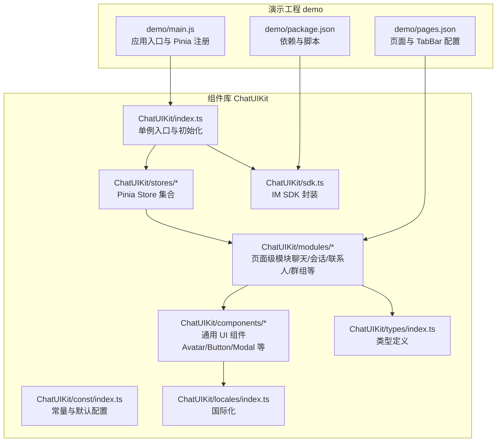
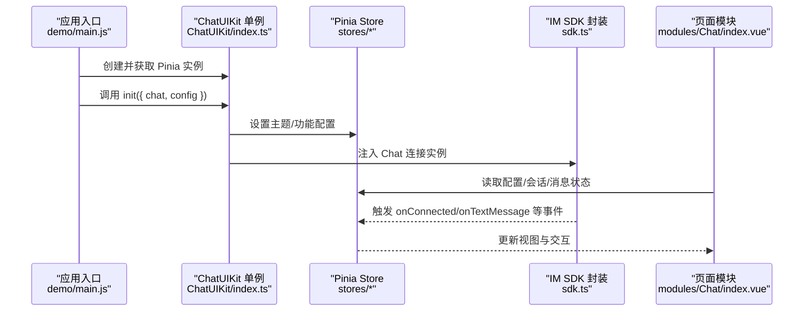
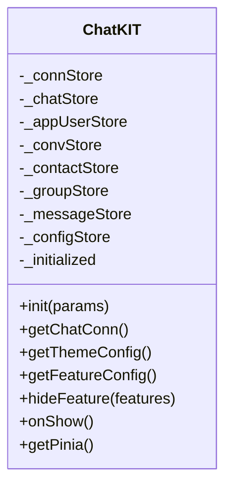
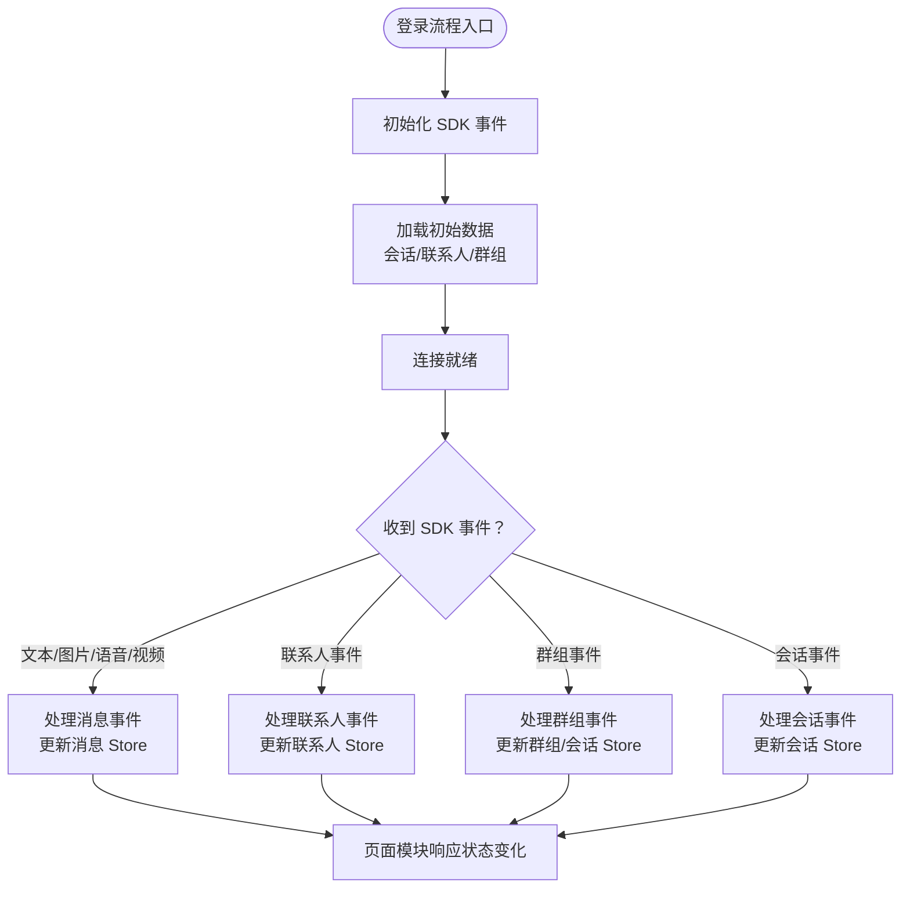
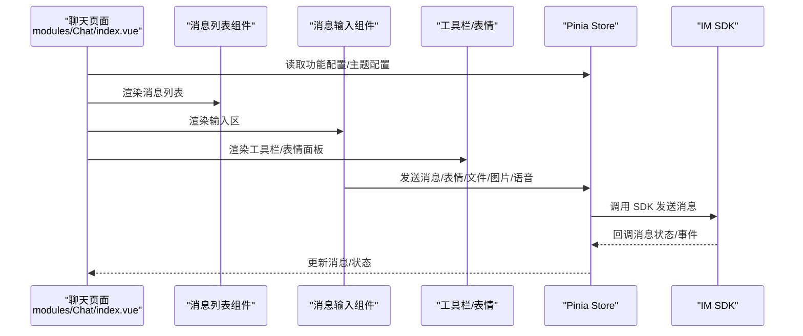
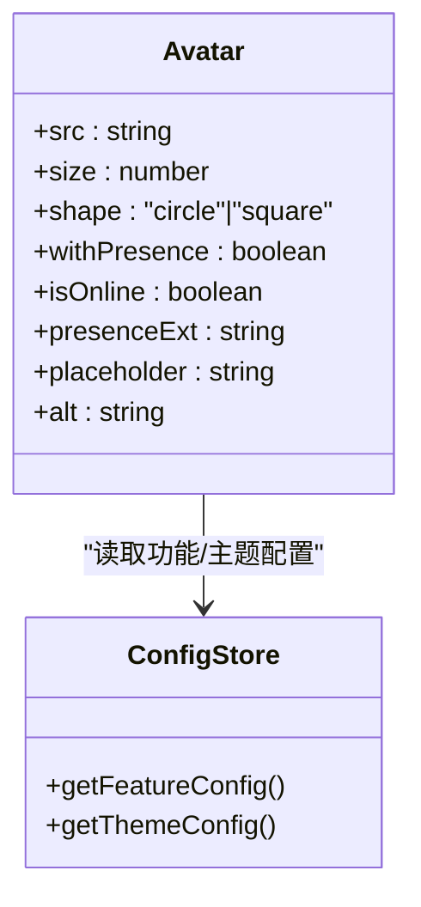
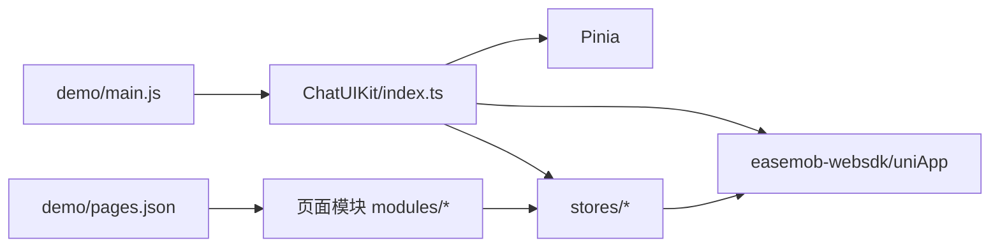

# 项目概述

<cite>
**本文引用的文件**
- [ChatUIKit/README.md](file://ChatUIKit/README.md)
- [demo/README.md](file://demo/README.md)
- [ChatUIKit/index.ts](file://ChatUIKit/index.ts)
- [ChatUIKit/stores/index.ts](file://ChatUIKit/stores/index.ts)
- [ChatUIKit/stores/chat.ts](file://ChatUIKit/stores/chat.ts)
- [ChatUIKit/stores/config.ts](file://ChatUIKit/stores/config.ts)
- [ChatUIKit/configType.ts](file://ChatUIKit/configType.ts)
- [ChatUIKit/types/index.ts](file://ChatUIKit/types/index.ts)
- [ChatUIKit/sdk.ts](file://ChatUIKit/sdk.ts)
- [ChatUIKit/const/index.ts](file://ChatUIKit/const/index.ts)
- [ChatUIKit/modules/Chat/index.vue](file://ChatUIKit/modules/Chat/index.vue)
- [ChatUIKit/modules/Conversation/index.vue](file://ChatUIKit/modules/Conversation/index.vue)
- [ChatUIKit/components/Avatar/index.vue](file://ChatUIKit/components/Avatar/index.vue)
- [ChatUIKit/locales/index.ts](file://ChatUIKit/locales/index.ts)
- [demo/pages.json](file://demo/pages.json)
- [demo/main.js](file://demo/main.js)
- [demo/package.json](file://demo/package.json)
</cite>

## 目录
1. [引言](#引言)
2. [项目结构](#项目结构)
3. [核心组件](#核心组件)
4. [架构总览](#架构总览)
5. [详细组件分析](#详细组件分析)
6. [依赖分析](#依赖分析)
7. [性能考虑](#性能考虑)
8. [故障排查指南](#故障排查指南)
9. [结论](#结论)
10. [附录](#附录)

## 引言
本项目是基于环信即时通讯云 IM SDK 的 UniApp 聊天组件库（Easemob UIKit for UniApp），面向多端（Android、iOS、微信小程序、H5）提供统一的聊天 UI 能力，涵盖会话列表、聊天界面、联系人与群组管理、消息输入与多媒体能力等。项目以 Vue 3 + UniApp 为核心技术栈，采用 Pinia 状态管理，提供可配置的主题与功能开关，帮助开发者快速搭建具备完整 UI 的即时通讯应用。

## 项目结构
项目由“组件库”和“演示工程”两部分组成：
- 组件库（ChatUIKit）：包含资源、通用组件、常量、国际化、页面模块、状态管理、样式、类型、工具与 SDK 封装等。
- 演示工程（demo）：基于 HBuilderX 的示例应用，演示页面导航、TabBar 结构、页面跳转策略与 UIKit 集成方式。

图表来源
- [ChatUIKit/index.ts](file://ChatUIKit/index.ts#L1-L139)
- [ChatUIKit/stores/index.ts](file://ChatUIKit/stores/index.ts#L1-L31)
- [ChatUIKit/modules/Chat/index.vue](file://ChatUIKit/modules/Chat/index.vue#L1-L255)
- [ChatUIKit/sdk.ts](file://ChatUIKit/sdk.ts#L1-L13)
- [ChatUIKit/const/index.ts](file://ChatUIKit/const/index.ts#L1-L37)
- [ChatUIKit/types/index.ts](file://ChatUIKit/types/index.ts#L1-L100)
- [ChatUIKit/locales/index.ts](file://ChatUIKit/locales/index.ts#L1-L17)
- [demo/pages.json](file://demo/pages.json#L1-L200)
- [demo/main.js](file://demo/main.js#L1-L28)
- [demo/package.json](file://demo/package.json#L1-L18)

章节来源
- [ChatUIKit/README.md](file://ChatUIKit/README.md#L1-L63)
- [demo/README.md](file://demo/README.md#L1-L125)

## 核心组件
- 单例入口与初始化：提供 ChatUIKit 单例，负责 Pinia 激活、Store 延迟初始化、IM SDK 初始化、主题与功能配置注入、生命周期 onShow 检测等。
- Store 层：以 Pinia 替代 MobX，提供连接、聊天、配置、联系人、会话、群组、消息等 Store，统一状态管理与事件协调。
- 页面模块：围绕聊天、会话、联系人、群组等业务域构建页面级模块，组件内通过 Store 与 SDK 交互。
- 通用组件：Avatar、Button、Modal、NavBar 等复用组件，配合国际化与主题配置。
- SDK 封装：对 easemob-websdk 的 uniApp 版本进行二次封装，暴露统一的 Chat 类型与 SDK 静态类型。
- 配置与类型：FeatureConfig/ThemeConfig 定义功能开关与主题选项；类型文件集中声明消息体、会话、联系人、群组等接口。
- 国际化：按系统语言自动选择语言包，提供 t 函数进行文案取用。

章节来源
- [ChatUIKit/index.ts](file://ChatUIKit/index.ts#L1-L139)
- [ChatUIKit/stores/index.ts](file://ChatUIKit/stores/index.ts#L1-L31)
- [ChatUIKit/stores/chat.ts](file://ChatUIKit/stores/chat.ts#L1-L407)
- [ChatUIKit/stores/config.ts](file://ChatUIKit/stores/config.ts#L1-L124)
- [ChatUIKit/configType.ts](file://ChatUIKit/configType.ts#L1-L68)
- [ChatUIKit/types/index.ts](file://ChatUIKit/types/index.ts#L1-L100)
- [ChatUIKit/sdk.ts](file://ChatUIKit/sdk.ts#L1-L13)
- [ChatUIKit/locales/index.ts](file://ChatUIKit/locales/index.ts#L1-L17)

## 架构总览
整体架构遵循“入口单例 + Pinia Store + 页面模块 + 通用组件 + SDK 封装”的分层设计，强调：
- 统一初始化：通过 ChatUIKit.init 注入 IM 连接与配置，确保全局 Pinia 与 Store 一致。
- 事件驱动：Store 内部订阅 SDK 事件，协调消息、联系人、群组、会话等状态变更。
- 功能可配：FeatureConfig 控制输入区、消息、会话等能力开关；ThemeConfig 控制外观细节（如头像形状）。
- 多端适配：基于 UniApp 的页面跳转策略（redirectTo/switchTab）与条件编译，适配不同平台行为差异。

图表来源
- [demo/main.js](file://demo/main.js#L1-L28)
- [ChatUIKit/index.ts](file://ChatUIKit/index.ts#L80-L131)
- [ChatUIKit/stores/chat.ts](file://ChatUIKit/stores/chat.ts#L67-L221)
- [ChatUIKit/sdk.ts](file://ChatUIKit/sdk.ts#L1-L13)
- [ChatUIKit/modules/Chat/index.vue](file://ChatUIKit/modules/Chat/index.vue#L74-L250)

## 详细组件分析

### 单例入口与初始化（ChatUIKit）
- 职责：延迟初始化 Pinia 与各 Store；设置主题与功能配置；注入 IM 连接；提供 getPinia/getChatConn/getThemeConfig/getFeatureConfig 等访问器；在 onShow 生命周期检测连接有效性。
- 设计要点：避免在构造函数中访问 Store；确保在应用入口处统一注册 Pinia，保证多模块共享状态一致性。

图表来源
- [ChatUIKit/index.ts](file://ChatUIKit/index.ts#L18-L131)

章节来源
- [ChatUIKit/index.ts](file://ChatUIKit/index.ts#L1-L139)

### Store 层（Pinia）
- 聊天状态（chat.ts）：维护连接状态、初始化 SDK 事件监听、处理消息与联系人/群组/会话事件、登录/登出与数据清理、初始数据加载。
- 配置（config.ts）：统一管理主题与功能配置，提供默认值、隐藏/显示功能、重置等能力。
- 其他 Store：conn/contact/conversation/group/message/appUser 等，分别负责连接、联系人、会话、群组、消息、用户信息等状态。

图表来源
- [ChatUIKit/stores/chat.ts](file://ChatUIKit/stores/chat.ts#L67-L396)

章节来源
- [ChatUIKit/stores/chat.ts](file://ChatUIKit/stores/chat.ts#L1-L407)
- [ChatUIKit/stores/config.ts](file://ChatUIKit/stores/config.ts#L1-L124)
- [ChatUIKit/stores/index.ts](file://ChatUIKit/stores/index.ts#L1-L31)

### 页面模块（以聊天模块为例）
- 聊天页面（modules/Chat/index.vue）：承载消息列表、输入区、工具栏、表情选择器、@ 提及列表、名片卡片等，通过 Pinia Store 与 SDK 交互，处理键盘高度、引用回复、编辑态等交互细节。
- 会话列表（modules/Conversation/index.vue）：作为 TabBar 下的页面，展示会话列表与导航。

图表来源
- [ChatUIKit/modules/Chat/index.vue](file://ChatUIKit/modules/Chat/index.vue#L74-L250)

章节来源
- [ChatUIKit/modules/Chat/index.vue](file://ChatUIKit/modules/Chat/index.vue#L1-L255)
- [ChatUIKit/modules/Conversation/index.vue](file://ChatUIKit/modules/Conversation/index.vue#L1-L12)

### 通用组件（以 Avatar 为例）
- Avatar 组件：支持圆形/方形头像、占位图、加载/错误状态、在线状态角标（Presence），受功能开关与主题配置影响。

图表来源
- [ChatUIKit/components/Avatar/index.vue](file://ChatUIKit/components/Avatar/index.vue#L25-L96)
- [ChatUIKit/stores/config.ts](file://ChatUIKit/stores/config.ts#L65-L80)

章节来源
- [ChatUIKit/components/Avatar/index.vue](file://ChatUIKit/components/Avatar/index.vue#L1-L188)

### 国际化与页面导航
- 国际化：按系统语言选择语言包，提供 t 函数取词。
- 页面导航：demo 使用 pages.json 配置页面与 TabBar；聊天/联系人/群组等作为 TabBar 页面，需使用 uni.switchTab；组件库默认使用 uni.redirectTo 进行页面跳转。

章节来源
- [ChatUIKit/locales/index.ts](file://ChatUIKit/locales/index.ts#L1-L17)
- [demo/pages.json](file://demo/pages.json#L167-L192)
- [demo/README.md](file://demo/README.md#L38-L53)

## 依赖分析
- 技术栈
  - Vue 3 + UniApp：跨端框架与运行时
  - Pinia：状态管理
  - easemob-websdk（uniApp 版本）：IM SDK 封装
  - pinyin-pro：拼音检索（用于联系人/会话列表排序）
- 关键依赖关系
  - demo/main.js 通过 ChatUIKit.getPinia 注册 Pinia，确保全局状态一致性
  - ChatUIKit/index.ts 作为入口，负责初始化 SDK 与配置
  - 各 Store 之间通过 SDK 事件与彼此协作，形成松耦合的状态流

图表来源
- [demo/main.js](file://demo/main.js#L14-L27)
- [ChatUIKit/index.ts](file://ChatUIKit/index.ts#L84-L96)
- [demo/pages.json](file://demo/pages.json#L1-L200)

章节来源
- [demo/package.json](file://demo/package.json#L1-L18)
- [demo/main.js](file://demo/main.js#L1-L28)
- [ChatUIKit/index.ts](file://ChatUIKit/index.ts#L1-L139)

## 性能考虑
- 状态粒度与更新：通过 Pinia 的 getters/actions 精准更新，避免不必要的重渲染；聊天页面对键盘高度变化进行节流式滚动与布局调整。
- 初始数据加载：登录后统一拉取会话列表与置顶会话（若启用），减少重复请求。
- 资源与网络：静态资源建议迁移至自有服务器，降低第三方限流风险；消息列表与媒体资源按需加载。
- 平台差异：针对微信小程序禁用滚动等配置，减少平台特定性能问题。

## 故障排查指南
- 页面跳转异常
  - 若使用 TabBar，请使用 uni.switchTab；非 Tab 页面使用 uni.redirectTo/redirectTo 等。
  - 参考：[demo/README.md](file://demo/README.md#L38-L53)
- 连接失效或断线重连
  - 在应用 onShow 生命周期调用 ChatUIKit.onShow，触发 SDK onShow 检测连接有效性。
  - 参考：[ChatUIKit/index.ts](file://ChatUIKit/index.ts#L114-L125)
- 功能未生效
  - 检查 FeatureConfig 对应开关是否开启；可通过 hideFeature 或 setFeatureConfig 动态调整。
  - 参考：[ChatUIKit/stores/config.ts](file://ChatUIKit/stores/config.ts#L98-L113)
- 资源加载失败
  - 将 ChatUIKit/assets 资源迁移到自有服务器，修改 ASSETS_URL。
  - 参考：[ChatUIKit/const/index.ts](file://ChatUIKit/const/index.ts#L7-L8)，[ChatUIKit/README.md](file://ChatUIKit/README.md#L56-L58)

章节来源
- [demo/README.md](file://demo/README.md#L38-L53)
- [ChatUIKit/index.ts](file://ChatUIKit/index.ts#L114-L125)
- [ChatUIKit/stores/config.ts](file://ChatUIKit/stores/config.ts#L98-L113)
- [ChatUIKit/const/index.ts](file://ChatUIKit/const/index.ts#L7-L8)
- [ChatUIKit/README.md](file://ChatUIKit/README.md#L56-L58)

## 结论
本项目以清晰的分层架构与可配置能力，为多端即时通讯应用提供了高复用、易扩展的 UI 能力。通过 Pinia 统一状态管理、Store 协同 SDK 事件、页面模块聚焦业务逻辑，开发者可快速集成聊天、会话、联系人、群组等核心功能，并依据业务需求灵活裁剪功能与定制主题。

## 附录
- 支持平台：Android、iOS、微信小程序、H5
- 项目入口与初始化：ChatUIKit/index.ts
- 页面与导航：demo/pages.json
- 应用入口与 Pinia 注册：demo/main.js
- SDK 与类型：ChatUIKit/sdk.ts、ChatUIKit/types/index.ts
- 功能与主题配置：ChatUIKit/configType.ts、ChatUIKit/stores/config.ts
- 常量与默认资源：ChatUIKit/const/index.ts
- 国际化：ChatUIKit/locales/index.ts